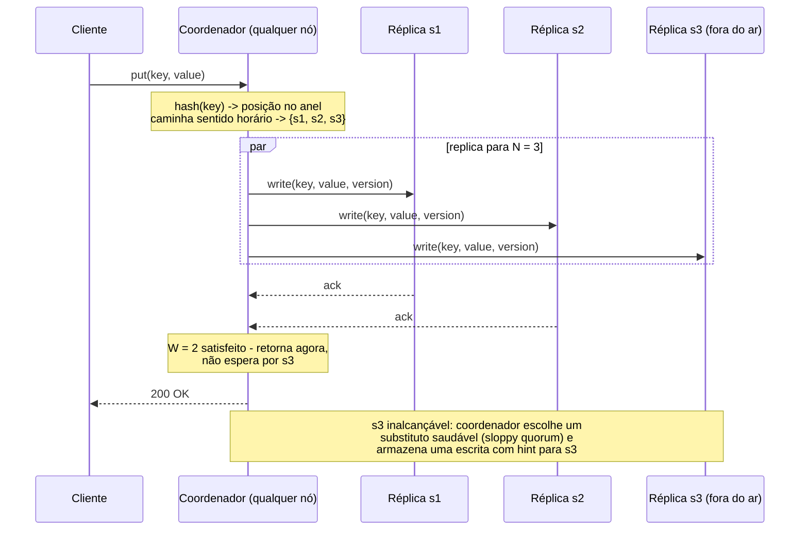

## Visão Geral

"Projete um key-value store" é um prompt clássico de entrevista porque a API é trivialmente pequena — `put(key, value)` e `get(key)` — enquanto tudo interessante vive por baixo dela. Não há esquema para discutir e nenhuma lógica de negócio para se esconder atrás, então a sessão inteira é gasta em fundamentos de sistemas distribuídos: como o keyspace é dividido, quantas cópias de cada chave existem, o que "escrita bem-sucedida" significa quando só algumas réplicas responderam, e o que acontece quando um nó morre no meio de uma escrita. Na prática você está sendo pedido para construir um mini Dynamo/Cassandra, e o entrevistador está verificando se você consegue nomear e justificar cada mecanismo em vez de gesticular para "usaríamos um banco de dados NoSQL."

## Requisitos Funcionais

A superfície é deliberadamente minúscula:

- `put(key, value)` — insere ou sobrescreve o valor associado a uma chave.
- `get(key)` — retorna o valor de uma chave.
- Valores são **blobs opacos** para o store: strings, objetos serializados, binários pequenos. Sem índices secundários, sem varreduras de intervalo, sem joins, sem linguagem de consulta do lado do servidor. Se um chamador precisa de "todos os usuários no Brasil," isso é um sistema diferente.
- **Consistência ajustável** é ela mesma um requisito funcional aqui: o mesmo cluster precisa conseguir servir uma carga de trabalho de leitura rápida e uma carga de trabalho fortemente consistente mudando parâmetros por requisição, não sendo reimplantado.

Explicitamente fora de escopo: transações através de múltiplas chaves, garantias ACID, e qualquer coisa exigindo uma ordem global de operações. Dizer isso cedo previne vinte minutos de scope creep acidental em um design de banco de dados distribuído.

## Requisitos Não Funcionais e Dimensionamento

Todo atributo de qualidade deveria ser fixado a um número que você declara em voz alta:

- **Valores pequenos** — um par chave-valor está abaixo de 10 KB. Essa suposição é estrutural: significa que um valor cabe no payload de um único pacote de rede, valores podem ser replicados por inteiro em vez de fragmentados, e nada precisa ser transmitido em stream. Blobs maiores que isso pertencem a [object storage](object-storage-and-direct-upload) com apenas o ponteiro armazenado aqui.
- **Big data** — assuma 10 bilhões de chaves a ~1 KB de valor médio, então ~10 TB de dados lógicos. A um fator de replicação de 3, isso é ~30 TB de armazenamento físico mais folga de compactação; em nós de 4 TB isso é aproximadamente um cluster de 12 nós antes de você contar crescimento ou folga de hot-spot.
- **Throughput** — 1.000.000 QPS de leitura e 100.000 QPS de escrita é um alvo razoável para um store servindo um grande produto de consumo (uma proporção leitura/escrita de 10:1). Espalhado por 12 nós com RF=3, cada nó lida com da ordem de 250 mil leituras/seg de tráfego de réplica — que é por que o motor de armazenamento local do nó importa tanto quanto a topologia do cluster.
- **Latência** — `get` de chave única no p99 abaixo de 10 ms e `put` no p99 abaixo de 20 ms, medido no coordenador. Esses números são o que mata qualquer design que requer consenso entre nós no caminho de escrita.
- **Alta disponibilidade** — o store continua respondendo durante falha de nó, falha de rack, e perda completa de data center. Alvo de 99,99% de disponibilidade para leituras.
- **Escala automática e heterogeneidade** — adicionar ou remover um nó deveria ser um não-evento operacional, e um nó com o dobro do disco deveria carregar o dobro dos dados.

A tensão entre os dois últimos pontos e o alvo de latência é o design inteiro. p99 abaixo de 10 ms com sobrevivência através de data centers descarta um coordenador que espera por toda réplica, que é precisamente por que quóruns existem.

## Servidor Único, e Por Que Ele Acaba

Um key-value store de nó único é uma hash table: busca O(1), tudo em memória. Compressão compra algum espaço e rebaixar chaves frias para disco compra mais, mas 10 TB não cabe em uma máquina, e uma máquina está a uma fonte de alimentação de distância de indisponibilidade total. Tanto o requisito de capacidade quanto o requisito de disponibilidade independentemente forçam um design distribuído — vale a pena dizer isso em voz alta, porque enquadra toda decisão posterior como "já aceitamos a rede."

## Particionamento de Dados

Dividir 10 TB entre nós tem dois requisitos: distribuir chaves uniformemente, e mover o mínimo possível de dados quando o cluster muda de tamanho. `hash(key) % N` ingênuo falha o segundo requisito catastroficamente — mudar `N` remapeia quase toda chave. A resposta é [Consistent Hashing](consistent-hashing): nós são posicionados em um anel de hash, uma chave hasheia para uma posição no mesmo anel, e pertence ao primeiro nó encontrado caminhando no sentido horário. Adicionar ou remover um nó só realoca as chaves no arco que mudou de mãos.

Duas propriedades de hashing consistente mapeiam diretamente para nossos requisitos não funcionais: **escala automática**, porque um nó se juntando reivindica seus arcos sem uma reorganização global, e **heterogeneidade**, porque a fatia de um nó no anel é definida por quantos nós virtuais ele possui — dê a uma máquina de 8 TB o dobro dos nós virtuais de uma de 4 TB e ela leva o dobro dos dados.

## Replicação

Para uma chave mapeada a uma posição no anel, caminhe no sentido horário e a copie para os primeiros **N** nós distintos, onde N é um fator de replicação configurável (N = 3 é o ponto de partida padrão). "Distintos" é a sutileza: com nós virtuais, as próximas três posições no anel podem pertencer à mesma máquina física, o que te daria três cópias em uma caixa e zero redundância. A caminhada precisa pular nós virtuais cujo dono físico já está no conjunto de réplicas.

Domínios de falha estendem a mesma lógica para fora. Nós em um rack compartilham um switch top-of-rack e uma alimentação de energia; nós em um data center compartilham uma região. Uma estratégia de posicionamento consciente de rack ou DC — caminhe o anel mas pule candidatos cujo rack ou data center já está representado — transforma uma falha correlacionada em uma sobrevivível. Replicar através de data centers é o que torna o requisito "sobreviver a uma indisponibilidade completa de DC" real, ao custo de latência de escrita entre regiões que te empurra em direção a replicação assíncrona para as cópias remotas.

## Consistência Ajustável: N, W, e R

Uma vez que uma chave vive em N nós, "a escrita teve sucesso" precisa de uma definição. **Consenso por quórum** o fornece com três números:

- **N** — o número de réplicas para uma chave.
- **W** — o quórum de escrita: quantas réplicas precisam confirmar antes do coordenador reportar sucesso ao cliente.
- **R** — o quórum de leitura: quantas réplicas precisam responder antes do coordenador retornar um valor.

`W = 1` não significa que os dados vivem em um nó — o coordenador ainda envia a escrita para todas as N réplicas. Significa que o coordenador retorna assim que uma confirmação chega e deixa o resto completar em segundo plano. W e R são ajustes de latência: um quórum maior significa esperar por uma réplica mais lenta, já que o coordenador está sempre limitado pelo W-ésimo respondente mais rápido.

A regra que importa é **W + R > N**. Quando o conjunto de leitura e o conjunto de escrita precisam se sobrepor por pelo menos um nó, toda leitura tem garantia de tocar uma réplica que viu a escrita confirmada mais recente, então o coordenador pode escolher a versão mais nova e retorná-la. Configurações comuns:

| Config (N = 3) | W + R | Propriedade |
|---|---|---|
| W = 3, R = 1 | 4 | Leituras rápidas, escritas caras e frágeis (qualquer réplica fora do ar bloqueia escritas) |
| W = 1, R = 3 | 4 | Escritas rápidas, leituras caras |
| W = 2, R = 2 | 4 | Equilibrado; o padrão "meio-forte" habitual |
| W = 1, R = 1 | 2 | Menor latência, apenas consistência eventual |

Este é o trade-off do [Teorema CAP](cap-theorem) tornado ajustável por requisição em vez de decidido uma vez para o sistema inteiro. Com `W + R > N` e um quórum estrito, uma partição que deixa menos de W réplicas alcançáveis faz escritas falharem — você escolheu CP para aquela operação. Com `W = R = 1`, a mesma partição ainda aceita escritas e ainda serve leituras, possivelmente desatualizadas — AP. Dynamo e Cassandra usam o extremo AP por padrão e deixam o chamador pagar por consistência onde importa, o que serve um store cujo alvo de disponibilidade é 99,99%.

Note também o que quóruns *não são*: `W + R > N` te dá sobreposição, não linearizabilidade. Escritas concorrentes, um crash de coordenador entre confirmações de réplica, ou quórum sloppy (abaixo) podem todos deixar a garantia mais fraca do que parece. Se você precisa de consenso genuíno — eleição de líder, locks, decisões de membership de cluster — isso pertence a um [serviço de coordenação](consensus-and-coordination-services), não ao caminho de dados de um key-value store.

## Modelos de Consistência e Resolução de Conflitos

O espectro vai de **consistência forte** (toda leitura retorna a escrita mais recente) através de **fraca** até **consistência eventual** (dado que não há novas escritas, réplicas convergem). Consistência forte é geralmente implementada recusando leituras e escritas até que todas as réplicas concordem, o que contradiz diretamente o requisito de disponibilidade — então consistência eventual é o modelo de trabalho, com quóruns em camada por cima para chamadores que precisam de mais.

Consistência eventual admite versões conflitantes, então o store precisa de uma forma de distinguir "mais nova" de "concorrente". Duas abordagens:

**Last-write-wins (LWW)** anexa um timestamp a cada escrita e mantém o mais alto. É trivial e é o que o Cassandra faz por padrão — e silenciosamente descarta uma de duas escritas concorrentes, e confia em relógios. Desvio de relógio entre nós significa que a escrita "mais recente" pode ser a que aconteceu primeiro (veja [The Trouble with Distributed Systems](distributed-systems-partial-failures) para por que timestamps de relógio de parede são uma primitiva de ordenação ruim).

**Vector clocks** rastreiam causalidade em vez de tempo. Cada versão carrega um conjunto de pares `[server, counter]`; uma escrita tratada pelo servidor `Sx` incrementa o contador de `Sx` ou adiciona `[Sx, 1]`. A versão X é uma ancestral da versão Y (sem conflito — Y vence) se todo contador em X é menor ou igual ao seu correspondente em Y. Se X tem um contador maior que o de Y para um servidor enquanto Y tem um contador maior para outro, os dois são **siblings**: um conflito genuinamente concorrente que o sistema não pode resolver sozinho.

```
D1([Sx, 1])                  cliente escreve, tratado por Sx
D2([Sx, 2])                  lê D1, atualiza, escreve de volta via Sx -> descende de D1
D3([Sx, 2], [Sy, 1])         lê D2, atualiza, escreve via Sy
D4([Sx, 2], [Sz, 1])         lê D2, atualiza, escreve via Sz  -> sibling de D3
D5([Sx, 3], [Sy, 1], [Sz,1]) cliente reconcilia D3 e D4, escreve resultado
```

O custo é real: o cliente (ou uma função de merge em nível de aplicação) precisa implementar reconciliação, e o vetor cresce com o número de servidores que já coordenaram uma escrita para aquela chave. Truncar os pares mais antigos além de um limiar limita o tamanho mas pode tornar a relação de descendência indecidível — uma troca que a Amazon reportou nunca realmente encontrar em produção.

## O Caminho de Escrita

Um **coordenador** — qualquer nó no anel, tipicamente o que a requisição do cliente atingiu — age como proxy para a operação. Ele hasheia a chave, computa as N réplicas, despacha a escrita, e retorna assim que W confirmações chegam.



Em cada réplica, a escrita local é append-first: o registro é persistido em um **commit log** em disco, depois aplicado a uma tabela em memória (memtable). Quando a memtable excede um limiar, é descarregada para uma **SSTable** imutável e ordenada em disco. Nada é jamais atualizado no lugar, que é o que torna escritas baratas — um append sequencial de log mais uma escrita de memória — e por que essa família de motores é chamada log-structured. Compactação em segundo plano mescla SSTables e descarta versões substituídas.

O caminho de leitura o espelha: verifica a memtable; em um miss, consulta um **Bloom filter** por SSTable para pular os arquivos que definitivamente não contêm a chave, lê os candidatos, e mescla os resultados por versão. Os falsos positivos do Bloom filter custam uma leitura de disco desperdiçada; sua garantida ausência de falsos negativos é o que torna seguro pular arquivos completamente.

## Detecção de Falha: Gossip

A opinião de um nó de que outro está morto não é evidência — um timeout significa "sem resposta," que é indistinguível de uma rede lenta ou uma pausa de GC. Heartbeating todos-para-todos te dá confirmação independente mas custa O(n²) mensagens.

**Protocolo de gossip** o descentraliza. Cada nó mantém uma lista de membership de `[id do membro, contador de heartbeat]`, periodicamente incrementa seu próprio contador, e periodicamente envia sua lista para alguns pares escolhidos aleatoriamente, que a mesclam na deles e a passam adiante. Informação sobre qualquer nó alcança o cluster inteiro em O(log n) rodadas com custo constante de mensagem por nó. Se o contador de um nó não avançou por mais tempo que um limiar, e outros nós independentemente corroboram isso, o nó é marcado como fora do ar e esse fato se espalha da mesma forma.

## Lidando com Falhas Temporárias: Sloppy Quorum e Hinted Handoff

Um quórum estrito bloqueia escritas assim que menos de W das N réplicas de uma chave são alcançáveis — correto, mas abre mão da disponibilidade em torno da qual o design é construído. **Sloppy quorum** o relaxa: em vez de requerer as réplicas *designadas*, o coordenador pega os primeiros W nós saudáveis que encontra caminhando o anel, pulando os que estão fora do ar. A escrita tem sucesso contra um nó substituto.

O substituto armazena os dados com um **hint** registrando a qual nó realmente pertencem. Quando a réplica pretendida volta, o substituto reproduz as escritas com hint para ela e exclui sua cópia local — **hinted handoff**. Isso torna uma breve indisponibilidade de nó ou reinício em rolling invisível para clientes, ao custo de uma janela na qual uma leitura contra as réplicas designadas pode perder dados que uma escrita já confirmou. Sloppy quorum é exatamente o mecanismo que quebra a garantia limpa `W + R > N`, e saber isso é o ponto da pergunta.

## Lidando com Falhas Permanentes: Merkle Trees

Hinted handoff assume que o nó retorna. Um nó cujo disco se foi, ou que ficou fora do ar por mais tempo que hints são retidos, precisa de uma reconciliação completa contra seus pares — um reparo de **anti-entropy**. Comparar toda chave é proibitivo, então réplicas comparam **Merkle trees** em vez disso.

Cada réplica particiona seu keyspace em buckets, hasheia as chaves em cada bucket, e constrói uma árvore para cima onde todo nó não-folha é o hash de seus filhos. Duas réplicas comparam hashes raiz primeiro: se coincidem, os dados são idênticos e nada é transferido. Se diferem, elas descem apenas nas subárvores cujos hashes discordam, até identificar os buckets específicos que divergem — e sincronizam apenas esses. O volume de dados trocado é proporcional à *diferença* entre réplicas, não à quantidade de dados que possuem. O tamanho do bucket controla a granularidade; uma configuração comum é um milhão de buckets por bilhão de chaves, então uma incompatibilidade se localiza a cerca de 1.000 chaves.

## Lidando com Indisponibilidades de Data Center

Replicação entre data centers é o que torna uma falha regional sobrevivível, e muda a aritmética de quórum. Um quórum que abrange regiões paga idas e voltas entre regiões em toda escrita — frequentemente 50-150 ms, bem além do orçamento de latência. O compromisso usual é um **quórum local**: W e R são satisfeitos por réplicas dentro do próprio data center do cliente, enquanto réplicas remotas são atualizadas assincronamente. Leituras servidas da região local permanecem rápidas; uma perda de região pode perder a pequena janela de escritas que ainda não tinham se propagado. Essa janela, não o mecanismo, é o número a negociar com o entrevistador.

## Resumo: Requisito para Técnica

| Objetivo | Técnica |
|---|---|
| Armazenar big data, escalar incrementalmente, lidar com nós heterogêneos | Hashing consistente com nós virtuais |
| Alta disponibilidade para leituras e escritas | Replicação através de N nós, posicionamento consciente de rack e DC |
| Consistência ajustável | Consenso por quórum (N/W/R), `W + R > N` para sobreposição |
| Conflitos de escrita concorrente | Versionamento com vector clocks (ou LWW, aceitando atualizações perdidas) |
| Falha temporária de nó | Sloppy quorum e hinted handoff |
| Falha permanente de nó | Reparo anti-entropy com Merkle trees |
| Detecção de falha em escala | Protocolo gossip com contadores de heartbeat |
| Indisponibilidade de data center | Replicação entre DCs com quóruns locais |

## Trade-offs

- **Quóruns ajustáveis tornam consistência uma decisão por requisição, mas apenas se chamadores realmente entendem o ajuste** — enviar `W = R = 1` como padrão porque faz bom benchmark significa que todo consumidor silenciosamente herda consistência eventual, e a única equipe que precisava de ler-suas-escritas descobre em produção.
- **Sloppy quorum compra disponibilidade quebrando a garantia que `W + R > N` parece dar** — uma escrita confirmada por W nós substitutos não é visível para uma leitura das R réplicas designadas, então um sistema que anuncia "consistência forte em W=R=2" está dizendo uma meia-verdade exatamente durante as falhas para as quais foi configurado.
- **Vector clocks preservam causalidade que last-write-wins destrói, ao custo de empurrar lógica de merge para o cliente** — LWW é uma comparação de timestamp e silenciosamente descarta uma escrita concorrente; vector clocks expõem o conflito honestamente mas requerem que todo chamador responda "o que significa mesclar dois carrinhos de compras?"
- **Armazenamento log-structured torna escritas sequenciais e baratas, e faz leituras pagarem por isso** — um `get` pode precisar verificar a memtable mais várias SSTables, que é por que Bloom filters e compactação não são extras opcionais mas partes estruturais de atingir um p99 de 10 ms.
- **Replicação entre data centers é a única resposta real para falha regional, e é incompatível com um quórum estrito global em latência de dígito único de milissegundos** — quóruns locais restauram o orçamento de latência aceitando uma janela limitada de escritas que uma perda de região levaria consigo.
- **Reparo anti-entropy mantém réplicas convergindo mas compete com tráfego ao vivo por disco e rede** — rodar reparos raramente demais deixa divergência acumular além da retenção de hints; rodá-los agressivamente degrada o p99 que o design inteiro foi construído para proteger.

## Perguntas de Entrevista

- Com N = 3, W = 2, R = 2, um cliente escreve com sucesso e depois imediatamente lê e recebe um valor desatualizado. Dê dois mecanismos distintos neste design que poderiam produzir esse resultado.
- Por que `W + R > N` garante uma réplica sobreposta mas não linearizabilidade?
- Duas escritas concorrentes na mesma chave são tratadas por coordenadores diferentes. Percorra o que cada um de last-write-wins e vector clocks faz, e nomeie a perda de dados específica que LWW arrisca.
- Por que a caminhada de réplica no sentido horário precisa pular nós virtuais possuídos por uma máquina física já no conjunto de réplicas, e que falha você veria se não pulasse?
- Reparo por Merkle tree transfere dados proporcionais à diferença entre réplicas. O que determina essa constante de proporcionalidade, e o que dá errado se você tornar os buckets muito grandes ou muito pequenos?

## Referências

- [Alex Xu, "System Design Interview – An Insider's Guide, Volume 1" (ByteByteGo, 2020) — Capítulo 6, "Design A Key-value Store"](https://bytebytego.com)
- [DeCandia et al., "Dynamo: Amazon's Highly Available Key-value Store" (SOSP 2007)](https://www.allthingsdistributed.com/files/amazon-dynamo-sosp2007.pdf)
- [Documentação do Apache Cassandra](https://cassandra.apache.org/doc/latest/)
- [Wikipedia — Merkle tree](https://en.wikipedia.org/wiki/Merkle_tree)
