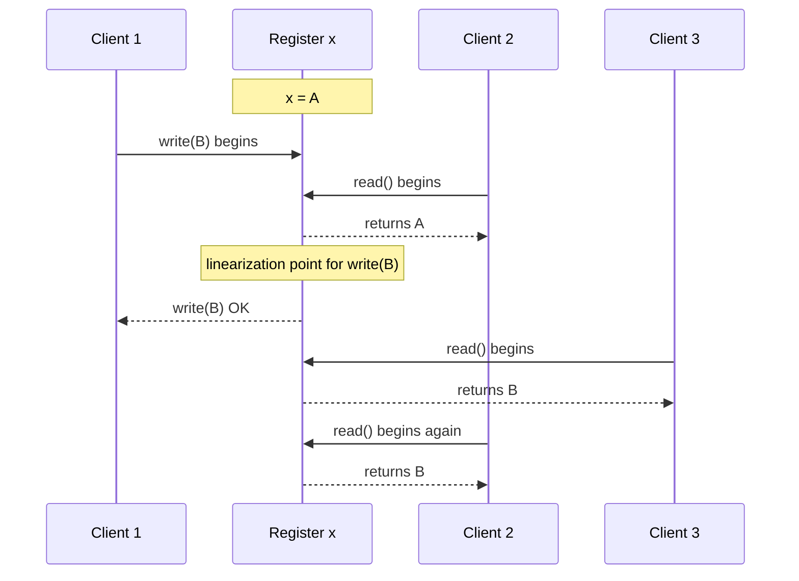

## Overview

Linearizability is a **recency** guarantee: a register, row, lock, counter, or other single object behaves as if there is exactly one copy of it, and every operation takes effect atomically at one instant between its call and its response. If one client reads the new value after a write completes, every later read must also return that value, even when the data is actually replicated across many machines. That illusion is why linearizability is sometimes called *atomic consistency* or *strong consistency*: users can reason as though they are talking to one up-to-date object.

Do not confuse it with serializability. Serializability is a transaction-isolation property about the order of transactions over multiple objects; linearizability is a real-time recency property about operations on one object. A database can be serializable but stale if it runs transactions against an old snapshot, and a single-key store can be linearizable without supporting multi-object transactions. **Strict serializability** is the combination: transactions behave as if they ran one at a time, and that order respects real time. In practice, linearizability often sits beside [single-leader replication](single-leader-replication), [consensus and coordination services](consensus-and-coordination-services), and the [CAP theorem](cap-theorem), because it asks replicas to agree on what "latest" means.

## The Single-Copy Illusion

The simplest mental model is a single register with `read()` and `write(value)`. A linearizable implementation may have replicas, logs, caches, leader elections, and retries underneath, but its observable behavior must match one sequential history. Once any read returns `B`, no later read may return the old value `A`; time cannot go backward for that object.

That makes linearizability stronger than "eventual convergence." Eventual consistency says all replicas will agree later if no new writes arrive. Linearizability says every completed operation has a real-time order now, and all clients observe that order consistently. If a write completes at 10:00:00.100 and a read begins at 10:00:00.101, the read must see that write or a later one.

## Histories, Overlap, and Linearization Points

You prove or disprove linearizability by drawing a **history**: calls and responses over time. Operations that do not overlap must keep their real-time order. Operations that overlap are flexible: the implementation may pretend one happened before the other, as long as each operation can be assigned a single **linearization point** somewhere between its invocation and response and the resulting sequential order is legal.

This history can be linearizable. The first read overlaps the write, so it may be ordered before the write and return `A`. The later reads start after the write's linearization point and after one read has observed `B`, so they must return `B` or a newer value. A history would not be linearizable if a read that begins after `write(B)` has completed returns `A`, because there is no legal instant where that read can be placed.

## Linearizability Versus Serializability

Serializability answers the question "Can these transactions be rearranged into some one-at-a-time order that preserves database correctness?" It does not, by itself, require that the order match wall-clock time. A transaction that starts after another transaction commits may still be serialized before it, depending on the isolation mechanism and snapshot it used.

Linearizability answers a different question: "After a value is visible, can anyone still see the old value?" It is normally defined per object, not across arbitrary sets of rows. This distinction matters in interviews and design reviews: unique usernames need a linearizable decision point for the username key, while a financial transfer may need serializable transactions across multiple account rows. If both real-time freshness and multi-object transaction ordering are required, the target is strict serializability, discussed alongside [transactions, ACID, and isolation levels](transactions-acid-and-isolation-levels).

## Where Systems Rely on Linearizability

Distributed locks and leader election are the canonical examples. If two processes both believe they hold the same lock, or two nodes both believe they are leader, the system can corrupt data. Coordination systems such as ZooKeeper and etcd therefore expose linearizable update paths, commonly implemented with consensus, so lock acquisition and leadership changes have one authoritative order. The lock service itself must be linearizable; otherwise it only moves the race into another component.

Uniqueness constraints are another common dependency. A username service, order-number allocator, idempotency-key table, or double-spend prevention path needs exactly one winner. Two concurrent requests for `alex` cannot both check "does not exist" against stale replicas and then both insert. Either route the constraint through one linearizable object, or redesign the business rule so duplicates can be detected and compensated later.

Linearizability also appears in **cross-channel timing dependencies**. Suppose a web app writes an image to storage and then enqueues a message for a resizer. If the queue consumer receives the message and reads storage through a stale replica, it may fail to find the image even though the upload endpoint already returned success. The bug is not in the queue; it is in assuming that "message delivered after write" implies "read path sees write." Linearizable reads, read-your-writes routing, or a single causally ordered channel are ways to close that gap.

## Implementing Linearizable Systems

Single-leader replication **can** be linearizable when all writes go through the leader and reads that require freshness also go to the leader or otherwise prove they are up to date. Follower reads are often intentionally stale, so "single-leader" alone is not enough; the read path matters. Consensus protocols such as Raft, Paxos, and Multi-Paxos are designed to choose one order of operations even through leader changes, which is why consensus-backed stores can offer linearizable operations.

Multi-leader replication is not linearizable for the objects that more than one leader may write, because two leaders can accept conflicting updates without first agreeing on their order. Leaderless Dynamo-style quorums are also not reliably linearizable, even when `w + r > n`: sloppy quorums, concurrent writes, read repair races, failed writes that later become visible, and last-write-wins conflict resolution can all break the single-copy illusion. They are excellent availability and latency tools, but they should not be described as linearizable without a specific proof of the algorithm and configuration; see [multi-leader and leaderless replication](multi-leader-and-leaderless-replication).

## The Cost of Looking Current

CAP is best framed as a failure-mode trade-off, not a label permanently stamped on a database. Under a network partition, a system that preserves linearizability must sometimes refuse or delay operations because it cannot know whether the other side of the partition accepted a newer write. That is the **CP** choice: linearizable but unavailable for some clients. A system that keeps accepting reads and writes on both sides is the **AP** choice: available but not linearizable. Many real systems mix these choices by operation, consistency level, or configuration, which is why blanket "CP database" and "AP database" labels are misleading.

The cost is not only partitions. Attiya and Welch showed that linearizable reads and writes in a distributed system have latency tied to network delay, because a replica must communicate enough to rule out a concurrent newer value. In wide-area systems that may mean an inter-region round trip on the critical path. Google Spanner is the famous exception that provides externally consistent transactions at global scale, but it pays with TrueTime, clock uncertainty waits, GPS, and atomic clocks. Most systems give up linearizability on some paths because users notice latency long before they notice a carefully documented consistency model.

## Trade-offs

- **Linearizability gives the simplest user-facing semantics at the highest coordination cost** — the application can behave as if there is one current copy of each object, which makes locks, leaders, uniqueness checks, and cross-service timing easier to reason about. The price is that the system must coordinate before answering, and coordination is exactly what replication was trying to avoid on the fast path.
- **Leader reads preserve recency and cap scalability** — sending fresh reads to the leader avoids stale followers and can make a single-leader system linearizable, but it concentrates read load on one node and turns leader slowness into global slowness. Follower reads improve throughput and latency, but they usually weaken the guarantee.
- **Consensus gives a real order and makes availability conditional** — Raft, Paxos, ZooKeeper, and etcd can linearize updates because a quorum agrees on one log order. During partitions, clients outside a quorum cannot safely receive successful linearizable operations, so the system must reject, block, or serve weaker reads.
- **Quorums are not a magic synonym for linearizability** — Dynamo-style `w + r > n` improves the probability that a read intersects a recent write, but probability is not a correctness proof. Concurrent writes, sloppy quorums, read repair, clock-based conflict resolution, and ambiguous failures can still expose old or conflicting values.
- **Strict serializability is stronger and rarer than either ingredient alone** — serializable isolation protects multi-object invariants, while linearizability protects real-time freshness. Combining them is ideal for correctness-critical domains, but it usually means fewer local-only operations, higher tail latency, and more careful failure handling.
- **Giving up linearizability can be an explicit product decision** — feeds, caches, analytics, collaborative drafts, and local-first applications often prefer fast, available, mergeable behavior over immediate global recency. The key is to keep non-linearizable paths away from invariants such as money, identity, ownership, and leadership.

## Interview Questions

- A replicated register starts at `A`; one client writes `B` while two reads overlap the write. What information do you need to decide whether a history is linearizable?
- Explain the difference between linearizability, serializability, and strict serializability without using the phrase "strong consistency."
- Why does a distributed lock service need linearizable operations, and what can go wrong if lock reads are served from stale replicas?
- A Dynamo-style store uses `n = 3`, `w = 2`, and `r = 2`. Why does that arithmetic not automatically prove linearizability?
- During a network partition, what choices does CAP actually force for a linearizable service, and why is "this database is CP" often too imprecise?

## References

- [Martin Kleppmann, "Designing Data-Intensive Applications", 2nd Edition (O'Reilly) — Chapter 10, "Consistency and Consensus", section "Linearizability"](https://www.oreilly.com/library/view/designing-data-intensive-applications/9781098119058/)
- [Herlihy and Wing — "Linearizability: A Correctness Condition for Concurrent Objects" (ACM TOPLAS 1990)](https://dl.acm.org/doi/10.1145/78969.78972)
- [Gilbert and Lynch — "Brewer's Conjecture and the Feasibility of Consistent, Available, Partition-Tolerant Web Services"](https://people.csail.mit.edu/lynch/publications/CAP.pdf)
- [Martin Kleppmann — "Please stop calling databases CP or AP"](https://martin.kleppmann.com/2015/05/05/cap-theorem.html)
- [Apache ZooKeeper Programmer's Guide — Consistency Guarantees](https://zookeeper.apache.org/doc/current/zookeeperProgrammers.html#ch_zkGuarantees)
- [etcd Documentation — Consistency](https://etcd.io/docs/v3.5/learning/api_guarantees/)
- [Google Cloud Spanner Documentation — TrueTime and External Consistency](https://cloud.google.com/spanner/docs/true-time-external-consistency)
