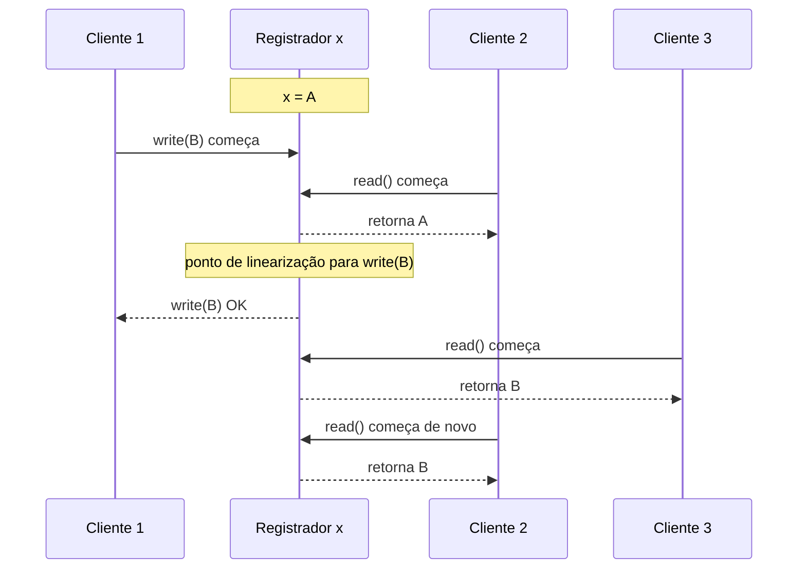

## Visão Geral

Linearizabilidade é uma garantia de **atualidade**: um registrador, linha, lock, contador ou outro objeto único se comporta como se houvesse exatamente uma cópia dele, e toda operação tem efeito atomicamente em um instante entre sua chamada e sua resposta. Se um cliente lê o novo valor depois de uma escrita completar, toda leitura posterior também precisa retornar esse valor, mesmo quando os dados são na verdade replicados através de muitas máquinas. Essa ilusão é por que linearizabilidade às vezes é chamada de *consistência atômica* ou *consistência forte*: usuários podem raciocinar como se estivessem falando com um único objeto atualizado.

Não a confunda com serializabilidade. Serializabilidade é uma propriedade de isolamento de transação sobre a ordem de transações através de múltiplos objetos; linearizabilidade é uma propriedade de atualidade em tempo real sobre operações em um objeto. Um banco de dados pode ser serializável mas desatualizado se roda transações contra um snapshot antigo, e um store de chave única pode ser linearizável sem suportar transações multi-objeto. **Strict serializability** é a combinação: transações se comportam como se rodassem uma de cada vez, e essa ordem respeita tempo real. Na prática, linearizabilidade frequentemente se posiciona ao lado de [replicação de líder único](single-leader-replication), [serviços de consenso e coordenação](consensus-and-coordination-services) e o [teorema CAP](cap-theorem), porque pede que réplicas concordem sobre o que "mais recente" significa.

## A Ilusão de Cópia Única

O modelo mental mais simples é um único registrador com `read()` e `write(value)`. Uma implementação linearizável pode ter réplicas, logs, caches, eleições de líder e novas tentativas por baixo, mas seu comportamento observável precisa corresponder a um único histórico sequencial. Uma vez que qualquer leitura retorna `B`, nenhuma leitura posterior pode retornar o valor antigo `A`; o tempo não pode andar para trás para aquele objeto.

Isso torna linearizabilidade mais forte que "convergência eventual". Consistência eventual diz que todas as réplicas vão concordar mais tarde se nenhuma nova escrita chegar. Linearizabilidade diz que toda operação completada tem uma ordem de tempo real agora, e todos os clientes observam essa ordem consistentemente. Se uma escrita completa às 10:00:00.100 e uma leitura começa às 10:00:00.101, a leitura precisa ver aquela escrita ou uma posterior.

## Históricos, Sobreposição e Pontos de Linearização

Você prova ou refuta linearizabilidade desenhando um **histórico**: chamadas e respostas ao longo do tempo. Operações que não se sobrepõem precisam manter sua ordem de tempo real. Operações que se sobrepõem são flexíveis: a implementação pode fingir que uma aconteceu antes da outra, desde que cada operação possa ter um único **ponto de linearização** atribuído em algum lugar entre sua invocação e resposta e a ordem sequencial resultante seja legal.

Este histórico pode ser linearizável. A primeira leitura se sobrepõe à escrita, então pode ser ordenada antes da escrita e retornar `A`. As leituras posteriores começam depois do ponto de linearização da escrita e depois que uma leitura observou `B`, então precisam retornar `B` ou um valor mais novo. Um histórico não seria linearizável se uma leitura que começa depois de `write(B)` ter completado retornasse `A`, porque não há instante legal onde essa leitura possa ser posicionada.

## Linearizabilidade Versus Serializabilidade

Serializabilidade responde à pergunta "Essas transações podem ser reorganizadas em alguma ordem-de-cada-vez que preserve a correção do banco de dados?" Não requer, por si só, que a ordem corresponda ao tempo do relógio de parede. Uma transação que começa depois de outra transação confirmar ainda pode ser serializada antes dela, dependendo do mecanismo de isolamento e snapshot que usou.

Linearizabilidade responde uma pergunta diferente: "Depois que um valor é visível, alguém ainda pode ver o valor antigo?" É normalmente definida por objeto, não através de conjuntos arbitrários de linhas. Essa distinção importa em entrevistas e revisões de design: nomes de usuário únicos precisam de um ponto de decisão linearizável para a chave de nome de usuário, enquanto uma transferência financeira pode precisar de transações serializáveis através de múltiplas linhas de conta. Se tanto atualidade em tempo real quanto ordenação de transação multi-objeto são necessárias, o alvo é strict serializability, discutido junto com [transactions, ACID, and isolation levels](transactions-acid-and-isolation-levels).

## Onde Sistemas Dependem de Linearizabilidade

Locks distribuídos e eleição de líder são os exemplos canônicos. Se dois processos ambos acreditam que mantêm o mesmo lock, ou dois nós ambos acreditam que são líder, o sistema pode corromper dados. Sistemas de coordenação como ZooKeeper e etcd, portanto, expõem caminhos de atualização linearizáveis, comumente implementados com consenso, para que aquisição de lock e mudanças de liderança tenham uma ordem autoritativa. O próprio serviço de lock precisa ser linearizável; caso contrário só move a corrida para outro componente.

Restrições de unicidade são outra dependência comum. Um serviço de nome de usuário, alocador de número de pedido, tabela de chave de idempotência ou caminho de prevenção de gasto duplo precisa de exatamente um vencedor. Duas requisições concorrentes para `alex` não podem ambas verificar "não existe" contra réplicas desatualizadas e depois ambas inserir. Ou roteie a restrição através de um objeto linearizável, ou reprojete a regra de negócio para que duplicatas possam ser detectadas e compensadas depois.

Linearizabilidade também aparece em **dependências de timing entre canais**. Suponha que uma aplicação web escreve uma imagem em armazenamento e depois enfileira uma mensagem para um redimensionador. Se o consumidor da fila recebe a mensagem e lê o armazenamento através de uma réplica desatualizada, pode falhar em encontrar a imagem mesmo que o endpoint de upload já tenha retornado sucesso. O bug não está na fila; está em assumir que "mensagem entregue depois da escrita" implica "caminho de leitura vê a escrita". Leituras linearizáveis, roteamento ler-suas-escritas ou um único canal causalmente ordenado são formas de fechar essa lacuna.

## Implementando Sistemas Linearizáveis

Replicação de líder único **pode** ser linearizável quando todas as escritas passam pelo líder e leituras que requerem atualidade também vão para o líder ou de outra forma provam que estão atualizadas. Leituras de seguidor são frequentemente intencionalmente desatualizadas, então "líder único" sozinho não é suficiente; o caminho de leitura importa. Protocolos de consenso como Raft, Paxos e Multi-Paxos são projetados para escolher uma ordem de operações mesmo através de mudanças de líder, que é por que stores apoiados em consenso podem oferecer operações linearizáveis.

Replicação multi-líder não é linearizável para os objetos que mais de um líder pode escrever, porque dois líderes podem aceitar atualizações conflitantes sem primeiro concordar sobre sua ordem. Quóruns sem líder estilo Dynamo também não são confiavelmente linearizáveis, mesmo quando `w + r > n`: quóruns sloppy, escritas concorrentes, corridas de read repair, escritas falhadas que depois se tornam visíveis e resolução de conflito last-write-wins podem todos quebrar a ilusão de cópia única. São excelentes ferramentas de disponibilidade e latência, mas não deveriam ser descritas como linearizáveis sem uma prova específica do algoritmo e configuração; veja [multi-leader and leaderless replication](multi-leader-and-leaderless-replication).

## O Custo de Parecer Atual

CAP é melhor enquadrado como um trade-off de modo de falha, não um rótulo permanentemente estampado em um banco de dados. Sob uma partição de rede, um sistema que preserva linearizabilidade às vezes precisa recusar ou atrasar operações porque não pode saber se o outro lado da partição aceitou uma escrita mais nova. Essa é a escolha **CP**: linearizável mas indisponível para alguns clientes. Um sistema que continua aceitando leituras e escritas em ambos os lados é a escolha **AP**: disponível mas não linearizável. Muitos sistemas reais misturam essas escolhas por operação, nível de consistência ou configuração, que é por que rótulos genéricos de "banco de dados CP" e "banco de dados AP" são enganosos.

O custo não é apenas partições. Attiya e Welch mostraram que leituras e escritas linearizáveis em um sistema distribuído têm latência ligada ao atraso de rede, porque uma réplica precisa se comunicar o suficiente para descartar um valor mais novo concorrente. Em sistemas de área ampla isso pode significar uma ida e volta entre regiões no caminho crítico. O Google Spanner é a famosa exceção que fornece transações externamente consistentes em escala global, mas paga com TrueTime, esperas de incerteza de relógio, GPS e relógios atômicos. A maioria dos sistemas abre mão de linearizabilidade em alguns caminhos porque usuários notam latência muito antes de notarem um modelo de consistência cuidadosamente documentado.

## Trade-offs

- **Linearizabilidade dá a semântica mais simples voltada ao usuário ao maior custo de coordenação** — a aplicação pode se comportar como se houvesse uma cópia atual de cada objeto, o que torna locks, líderes, verificações de unicidade e timing entre serviços mais fáceis de raciocinar. O preço é que o sistema precisa coordenar antes de responder, e coordenação é exatamente o que a replicação estava tentando evitar no caminho rápido.
- **Leituras do líder preservam atualidade e limitam escalabilidade** — enviar leituras frescas para o líder evita seguidores desatualizados e pode tornar um sistema de líder único linearizável, mas concentra carga de leitura em um nó e transforma lentidão do líder em lentidão global. Leituras de seguidor melhoram throughput e latência, mas geralmente enfraquecem a garantia.
- **Consenso dá uma ordem real e torna disponibilidade condicional** — Raft, Paxos, ZooKeeper e etcd podem linearizar atualizações porque um quórum concorda sobre uma ordem de log. Durante partições, clientes fora de um quórum não podem receber com segurança operações linearizáveis bem-sucedidas, então o sistema precisa rejeitar, bloquear, ou servir leituras mais fracas.
- **Quóruns não são um sinônimo mágico para linearizabilidade** — `w + r > n` estilo Dynamo melhora a probabilidade de que uma leitura intersecte uma escrita recente, mas probabilidade não é uma prova de correção. Escritas concorrentes, quóruns sloppy, read repair, resolução de conflito baseada em relógio e falhas ambíguas ainda podem expor valores antigos ou conflitantes.
- **Strict serializability é mais forte e mais rara que qualquer ingrediente sozinho** — isolamento serializável protege invariantes multi-objeto, enquanto linearizabilidade protege atualidade em tempo real. Combiná-los é ideal para domínios críticos de correção, mas geralmente significa menos operações apenas-locais, latência de cauda mais alta e tratamento de falha mais cuidadoso.
- **Abrir mão de linearizabilidade pode ser uma decisão de produto explícita** — feeds, caches, analytics, rascunhos colaborativos e aplicações local-first frequentemente preferem comportamento rápido, disponível, mesclável sobre atualidade global imediata. A chave é manter caminhos não linearizáveis longe de invariantes como dinheiro, identidade, posse e liderança.

## Perguntas de Entrevista

- Um registrador replicado começa em `A`; um cliente escreve `B` enquanto duas leituras se sobrepõem à escrita. Que informação você precisa para decidir se um histórico é linearizável?
- Explique a diferença entre linearizabilidade, serializabilidade e strict serializability sem usar a frase "consistência forte".
- Por que um serviço de lock distribuído precisa de operações linearizáveis, e o que pode dar errado se leituras de lock são servidas de réplicas desatualizadas?
- Um store estilo Dynamo usa `n = 3`, `w = 2` e `r = 2`. Por que essa aritmética não prova automaticamente linearizabilidade?
- Durante uma partição de rede, quais escolhas o CAP realmente força para um serviço linearizável, e por que "este banco de dados é CP" é frequentemente impreciso demais?

## Referências

- [Martin Kleppmann, "Designing Data-Intensive Applications", 2ª Edição (O'Reilly) — Capítulo 10, "Consistency and Consensus", seção "Linearizability"](https://www.oreilly.com/library/view/designing-data-intensive-applications/9781098119058/)
- [Herlihy e Wing — "Linearizability: A Correctness Condition for Concurrent Objects" (ACM TOPLAS 1990)](https://dl.acm.org/doi/10.1145/78969.78972)
- [Gilbert e Lynch — "Brewer's Conjecture and the Feasibility of Consistent, Available, Partition-Tolerant Web Services"](https://people.csail.mit.edu/lynch/publications/CAP.pdf)
- [Martin Kleppmann — "Please stop calling databases CP or AP"](https://martin.kleppmann.com/2015/05/05/cap-theorem.html)
- [Apache ZooKeeper Programmer's Guide — Consistency Guarantees](https://zookeeper.apache.org/doc/current/zookeeperProgrammers.html#ch_zkGuarantees)
- [etcd Documentation — Consistency](https://etcd.io/docs/v3.5/learning/api_guarantees/)
- [Google Cloud Spanner Documentation — TrueTime and External Consistency](https://cloud.google.com/spanner/docs/true-time-external-consistency)
