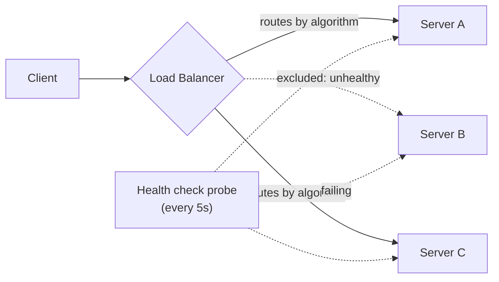

## Overview

A load balancer's job is to keep every backend server doing roughly the same amount of *work* — not necessarily the same number of *requests*. Those sound like the same goal, but they diverge as soon as requests aren't uniform: some are cheap reads, some are expensive writes, some hold a connection open for seconds or minutes (a file upload, a streamed response, a websocket). Picking the wrong algorithm, or the wrong signal to balance on, means some servers sit idle while others are saturated and dropping requests, even though the load balancer is technically "balancing."

## Round-Robin and Weighted Round-Robin

Plain round-robin sends each new request to the next server in the pool, cycling back to the start:

```
servers = [A, B, C]
next_server = servers[request_count % len(servers)]
```

It's simple and works well when every server has equal capacity and every request costs about the same. It breaks down the moment either assumption fails: a server with half the CPU of its peers gets the same share of traffic as the others, and a run of expensive requests can pile up on whichever server happens to be next in the cycle.

**Weighted round-robin** fixes the first problem by giving each server a weight proportional to its capacity, so a server rated twice as powerful gets roughly twice the requests:

```
servers = [(A, weight=2), (B, weight=1), (C, weight=1)]
# effective cycle: A, A, B, C, A, A, B, C, ...
```

This is a common fit for a pool with mixed instance sizes (e.g. mid-migration to bigger nodes), but the weight is usually a static, hand-tuned number — it says nothing about what each server's *current* load actually is.

## Least Connections

Instead of cycling blindly, **least-connections** routes each new request to whichever backend currently has the fewest open connections:

```
def pick_server(servers):
    return min(servers, key=lambda s: s.active_connections)
```

This adapts to uneven request cost automatically: a server stuck processing a handful of slow requests naturally accumulates open connections and stops receiving new ones, while a server churning through fast requests keeps clearing its queue and keeps getting picked. It's a meaningfully better default than round-robin for workloads with variable request duration, and it's the standard choice for anything with long-lived connections — file transfers, streaming responses, websockets — where "number of requests sent so far" (what round-robin implicitly balances) says almost nothing about current load.

## Balancing on the Right Signal

Least-connections is still just one proxy for load. For CPU-bound workloads (image resizing, request-heavy APIs doing real computation per call), CPU utilization is often the right signal, and a load balancer can poll or receive server-reported CPU metrics and route away from hot nodes. But CPU is the wrong signal for I/O-bound and streaming workloads: a server can be at 10% CPU while its network interface is saturated pushing bytes to hundreds of open streaming connections, and a CPU-based load balancer would happily send it more traffic right up until it starts dropping packets.

The general principle: **balance on the metric that actually predicts saturation for this workload**, not on whatever metric is easiest to read. For a streaming service, that's often outbound bandwidth or concurrent-stream count rather than CPU; for a compute-heavy API it's CPU or request queue depth; for a connection-pool-limited service it might be active connections against a hard connection-count ceiling. A load balancer that only round-robins on request count has no visibility into any of this — it's balancing on the one signal least connected to actual saturation.

## L4 vs. L7 Load Balancing

A **Layer 4 (transport layer)** load balancer routes based on IP and TCP/UDP port alone, without looking at the request content. It's fast and protocol-agnostic — it forwards packets, not requests — but it can't make decisions based on anything inside the payload: it doesn't know one connection is a `GET /health` and another is a 2 GB video upload.

A **Layer 7 (application layer)** load balancer terminates the connection, reads the actual HTTP request (path, headers, cookies, even body), and routes on that: sending `/api/*` to one pool and `/static/*` to a CDN-fronted pool, or routing based on a session cookie. This is strictly more powerful but costs more per request (TLS termination, parsing) and adds a hop of latency that L4 doesn't have.

```
# L4: routes on IP:port only, blind to content
client:54213 -> lb:443 -> backend_7:8443   (picked by connection hash)

# L7: terminates TLS, reads the request, routes on path
GET /api/orders/42 HTTP/1.1
Host: example.com
Cookie: session=abc123
-> routed to "orders-service" pool, sticky to backend_3 via session cookie
```

Most production systems use both: an L4 balancer (or the cloud provider's network load balancer) as the first hop for raw throughput and DDoS absorption, fronting an L7 balancer or API gateway that does the content-aware routing.

## Health Checks

A load balancer that keeps sending traffic to a dead or degraded server is worse than useless — it's actively routing users to failures. Health checks are periodic probes (a lightweight `GET /health` endpoint, or a TCP connect) that remove a server from the pool when it stops responding correctly, and add it back once it recovers:



```
every 5s:
    for server in pool:
        try:
            response = http_get(f"{server}/health", timeout=2s)
            if response.status != 200:
                mark_unhealthy(server)
        except Timeout:
            mark_unhealthy(server)
```

Two failure modes are worth naming: a health check that's too shallow (server responds 200 from a lightweight handler while the actual database connection pool behind it is exhausted) gives false confidence, and a health check that's too aggressive (marks a server unhealthy after one slow response during a brief GC pause) causes unnecessary flapping in and out of the pool. A short streak of consecutive failures/successes before flipping status (rather than acting on a single probe) is the standard mitigation for the latter.

## Sticky Sessions

Some applications keep per-user state in server memory (an in-process session cache, a websocket connection, an in-progress multi-step upload) rather than in a shared store. **Sticky sessions** (session affinity) route a given client's requests to the same backend server every time, usually via a cookie the load balancer sets or a hash of the client IP:

```
Set-Cookie: SERVERID=backend_3; Path=/
```

This makes server-local state work without any distributed coordination, but it directly fights against even load distribution — if one server accumulates a disproportionate share of long-lived, resource-heavy "sticky" clients, the load balancer's other algorithms can't rebalance around it, and taking that server down for deploy or failure forces every session pinned to it to reconnect and lose its local state. The standard fix, when possible, is to move the session state out of the server entirely (a shared Redis-backed session store) so any server can serve any request and stickiness is unnecessary — trading the operational simplicity of local state for a genuinely stateless, freely-balanceable fleet.

## Trade-offs

- **Round-robin is simple but blind to both server capacity and request cost** — it's a reasonable default only when the fleet is homogeneous and requests are roughly uniform in cost, which is a narrower case than it first appears.
- **Least-connections adapts to load automatically but reacts to symptoms, not causes** — it notices a server is backed up because connections are piling up, which is one step removed from the actual resource (CPU, bandwidth, memory) that's actually saturated.
- **L7 routing is more powerful but adds latency and a point of compute cost per request** — every request pays for TLS termination and header parsing that L4 skips entirely, which matters at very high request volumes.
- **Sticky sessions simplify the application at the cost of balance and resilience** — pinning a client to one server trades even load distribution and painless failover for the convenience of not needing a shared state store.

## Interview Questions

- Why does least-connections outperform round-robin for a service with highly variable request duration?
- Give an example of a workload where CPU utilization is the wrong metric to load-balance on, and explain what a better signal would be.
- What's the practical difference between an L4 and an L7 load balancer, and why might a system use both in front of each other?
- What are the two failure modes of a poorly-tuned health check, and how does requiring a streak of failures/successes address one of them?
- Why do sticky sessions work against a load balancer's ability to distribute load evenly, and what's the usual way to avoid needing them?

## References

- [NGINX Documentation — Load Balancing](https://docs.nginx.com/nginx/admin-guide/load-balancer/http-load-balancer/)
- [AWS — Elastic Load Balancing: Application, Network, and Gateway Load Balancers](https://aws.amazon.com/elasticloadbalancing/)
- [Google Cloud Architecture Center — Load Balancing Overview](https://cloud.google.com/load-balancing/docs/load-balancing-overview)
- Martin Kleppmann, [*Designing Data-Intensive Applications*](https://www.oreilly.com/library/view/designing-data-intensive-applications/9781098119058/) (O'Reilly, 2nd Edition) — Chapter 6, "Partitioning" (touches on request routing and hot spots)
