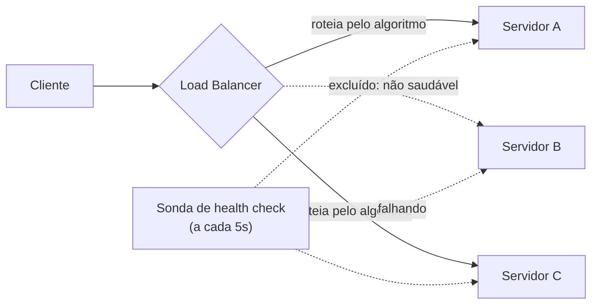

## Visão Geral

O trabalho de um load balancer é manter todo servidor de backend fazendo aproximadamente a mesma quantidade de *trabalho* — não necessariamente o mesmo número de *requisições*. Isso soa como o mesmo objetivo, mas diverge assim que as requisições não são uniformes: algumas são leituras baratas, algumas são escritas caras, algumas mantêm uma conexão aberta por segundos ou minutos (um upload de arquivo, uma resposta em streaming, um websocket). Escolher o algoritmo errado, ou o sinal errado para balancear, significa que alguns servidores ficam ociosos enquanto outros estão saturados e descartando requisições, mesmo que o load balancer esteja tecnicamente "balanceando".

## Round-Robin e Round-Robin Ponderado

Round-robin simples envia cada nova requisição para o próximo servidor no pool, voltando ao início ao ciclar:

```
servers = [A, B, C]
next_server = servers[request_count % len(servers)]
```

É simples e funciona bem quando todo servidor tem capacidade igual e toda requisição custa aproximadamente o mesmo. Quebra no momento em que qualquer uma das suposições falha: um servidor com metade da CPU de seus pares recebe a mesma fatia de tráfego que os outros, e uma sequência de requisições caras pode se acumular em qualquer servidor que por acaso esteja próximo no ciclo.

**Round-robin ponderado** corrige o primeiro problema dando a cada servidor um peso proporcional à sua capacidade, então um servidor avaliado como duas vezes mais poderoso recebe aproximadamente o dobro de requisições:

```
servers = [(A, weight=2), (B, weight=1), (C, weight=1)]
# ciclo efetivo: A, A, B, C, A, A, B, C, ...
```

Isso é um encaixe comum para um pool com tamanhos de instância mistos (ex.: no meio de uma migração para nós maiores), mas o peso geralmente é um número estático, ajustado manualmente — não diz nada sobre qual é a carga *atual* de cada servidor.

## Least Connections

Em vez de ciclar cegamente, **least-connections** roteia cada nova requisição para o backend que atualmente tem o menor número de conexões abertas:

```
def pick_server(servers):
    return min(servers, key=lambda s: s.active_connections)
```

Isso se adapta automaticamente a custo de requisição desigual: um servidor preso processando um punhado de requisições lentas naturalmente acumula conexões abertas e para de receber novas, enquanto um servidor processando requisições rápidas continua limpando sua fila e continua sendo escolhido. É um padrão significativamente melhor que round-robin para cargas de trabalho com duração de requisição variável, e é a escolha padrão para qualquer coisa com conexões de longa duração — transferências de arquivo, respostas em streaming, websockets — onde "número de requisições enviadas até agora" (o que round-robin implicitamente balanceia) não diz quase nada sobre a carga atual.

## Balanceando no Sinal Certo

Least-connections ainda é apenas mais um proxy para carga. Para cargas de trabalho limitadas por CPU (redimensionamento de imagem, APIs intensivas em requisições fazendo computação real por chamada), utilização de CPU é frequentemente o sinal certo, e um load balancer pode sondar ou receber métricas de CPU reportadas pelo servidor e rotear para longe de nós quentes. Mas CPU é o sinal errado para cargas de trabalho limitadas por I/O e streaming: um servidor pode estar a 10% de CPU enquanto sua interface de rede está saturada empurrando bytes para centenas de conexões de streaming abertas, e um load balancer baseado em CPU alegremente enviaria mais tráfego a ele até começar a descartar pacotes.

O princípio geral: **balanceie na métrica que realmente prevê saturação para esta carga de trabalho**, não na métrica mais fácil de ler. Para um serviço de streaming, isso é frequentemente banda de saída ou contagem de streams concorrentes em vez de CPU; para uma API intensiva em computação é CPU ou profundidade de fila de requisições; para um serviço limitado por pool de conexões pode ser conexões ativas contra um teto rígido de contagem de conexões. Um load balancer que apenas faz round-robin na contagem de requisições não tem visibilidade de nada disso — está balanceando no único sinal menos conectado à saturação real.

## Load Balancing L4 vs. L7

Um load balancer de **Camada 4 (camada de transporte)** roteia baseado apenas em IP e porta TCP/UDP, sem olhar o conteúdo da requisição. É rápido e agnóstico a protocolo — encaminha pacotes, não requisições — mas não pode tomar decisões baseadas em nada dentro do payload: não sabe que uma conexão é um `GET /health` e outra é um upload de vídeo de 2 GB.

Um load balancer de **Camada 7 (camada de aplicação)** termina a conexão, lê a requisição HTTP real (caminho, cabeçalhos, cookies, até o corpo), e roteia com base nisso: enviando `/api/*` para um pool e `/static/*` para um pool com CDN na frente, ou roteando com base em um cookie de sessão. Isso é estritamente mais poderoso mas custa mais por requisição (terminação TLS, parsing) e adiciona um salto de latência que L4 não tem.

```
# L4: roteia apenas por IP:porta, cego ao conteúdo
client:54213 -> lb:443 -> backend_7:8443   (escolhido por hash de conexão)

# L7: termina TLS, lê a requisição, roteia pelo caminho
GET /api/orders/42 HTTP/1.1
Host: example.com
Cookie: session=abc123
-> roteado para o pool "orders-service", fixo ao backend_3 via cookie de sessão
```

A maioria dos sistemas em produção usa ambos: um balanceador L4 (ou o load balancer de rede do provedor de nuvem) como o primeiro salto para throughput bruto e absorção de DDoS, servindo de frente para um balanceador L7 ou API gateway que faz o roteamento consciente de conteúdo.

## Health Checks

Um load balancer que continua enviando tráfego para um servidor morto ou degradado é pior que inútil — está ativamente roteando usuários para falhas. Health checks são sondas periódicas (um endpoint leve `GET /health`, ou uma conexão TCP) que removem um servidor do pool quando ele para de responder corretamente, e o adicionam de volta assim que se recupera:



```
a cada 5s:
    for server in pool:
        try:
            response = http_get(f"{server}/health", timeout=2s)
            if response.status != 200:
                mark_unhealthy(server)
        except Timeout:
            mark_unhealthy(server)
```

Dois modos de falha merecem menção: um health check raso demais (servidor responde 200 de um handler leve enquanto o pool de conexões real do banco de dados por trás dele está esgotado) dá falsa confiança, e um health check agressivo demais (marca um servidor como não saudável após uma resposta lenta durante uma pausa breve de GC) causa oscilação desnecessária entre entrar e sair do pool. Uma sequência curta de falhas/sucessos consecutivos antes de mudar o status (em vez de agir sobre uma única sonda) é a mitigação padrão para o segundo caso.

## Sessões Fixas (Sticky Sessions)

Algumas aplicações mantêm estado por usuário na memória do servidor (um cache de sessão em processo, uma conexão websocket, um upload de múltiplos passos em andamento) em vez de em um store compartilhado. **Sticky sessions** (afinidade de sessão) roteiam as requisições de um dado cliente para o mesmo servidor de backend toda vez, geralmente via um cookie que o load balancer define ou um hash do IP do cliente:

```
Set-Cookie: SERVERID=backend_3; Path=/
```

Isso faz o estado local do servidor funcionar sem nenhuma coordenação distribuída, mas luta diretamente contra a distribuição uniforme de carga — se um servidor acumula uma fatia desproporcional de clientes "fixos" de longa duração e intensivos em recursos, os outros algoritmos do load balancer não conseguem rebalancear em torno dele, e derrubar aquele servidor para deploy ou por falha força toda sessão fixada nele a reconectar e perder seu estado local. A correção padrão, quando possível, é mover o estado de sessão para fora do servidor completamente (um store de sessão compartilhado com Redis) para que qualquer servidor possa servir qualquer requisição e a fixação seja desnecessária — trocando a simplicidade operacional do estado local por uma frota genuinamente sem estado e livremente balanceável.

## Trade-offs

- **Round-robin é simples mas cego tanto à capacidade do servidor quanto ao custo da requisição** — é um padrão razoável apenas quando a frota é homogênea e as requisições são aproximadamente uniformes em custo, o que é um caso mais estreito do que parece à primeira vista.
- **Least-connections se adapta à carga automaticamente mas reage a sintomas, não causas** — percebe que um servidor está sobrecarregado porque conexões estão se acumulando, o que está um passo distante do recurso real (CPU, banda, memória) que está de fato saturado.
- **Roteamento L7 é mais poderoso mas adiciona latência e um ponto de custo computacional por requisição** — toda requisição paga por terminação TLS e parsing de cabeçalho que L4 pula completamente, o que importa em volumes muito altos de requisição.
- **Sticky sessions simplificam a aplicação ao custo de balanceamento e resiliência** — fixar um cliente a um servidor troca distribuição uniforme de carga e failover indolor pela conveniência de não precisar de um store de estado compartilhado.

## Perguntas de Entrevista

- Por que least-connections supera round-robin para um serviço com duração de requisição altamente variável?
- Dê um exemplo de uma carga de trabalho onde utilização de CPU é a métrica errada para balancear, e explique qual seria um sinal melhor.
- Qual é a diferença prática entre um load balancer L4 e um L7, e por que um sistema poderia usar ambos em conjunto?
- Quais são os dois modos de falha de um health check mal ajustado, e como exigir uma sequência de falhas/sucessos aborda um deles?
- Por que sticky sessions trabalham contra a capacidade de um load balancer de distribuir carga uniformemente, e qual é a forma usual de evitar precisar delas?

## Referências

- [NGINX Documentation — Load Balancing](https://docs.nginx.com/nginx/admin-guide/load-balancer/http-load-balancer/)
- [AWS — Elastic Load Balancing: Application, Network, and Gateway Load Balancers](https://aws.amazon.com/elasticloadbalancing/)
- [Google Cloud Architecture Center — Load Balancing Overview](https://cloud.google.com/load-balancing/docs/load-balancing-overview)
- Martin Kleppmann, [*Designing Data-Intensive Applications*](https://www.oreilly.com/library/view/designing-data-intensive-applications/9781098119058/) (O'Reilly, 2nd Edition) — Capítulo 6, "Partitioning" (aborda roteamento de requisições e hot spots)
