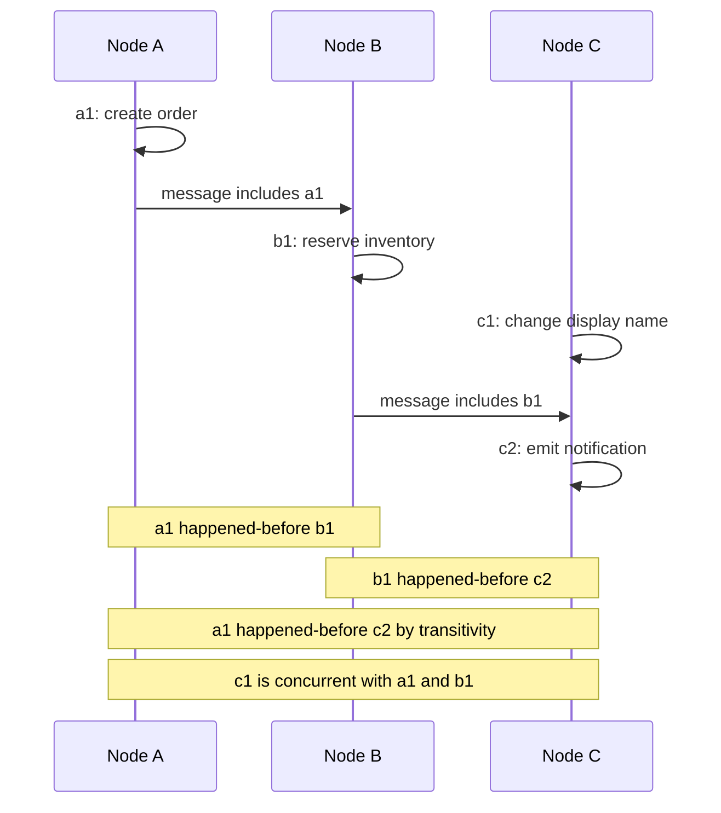
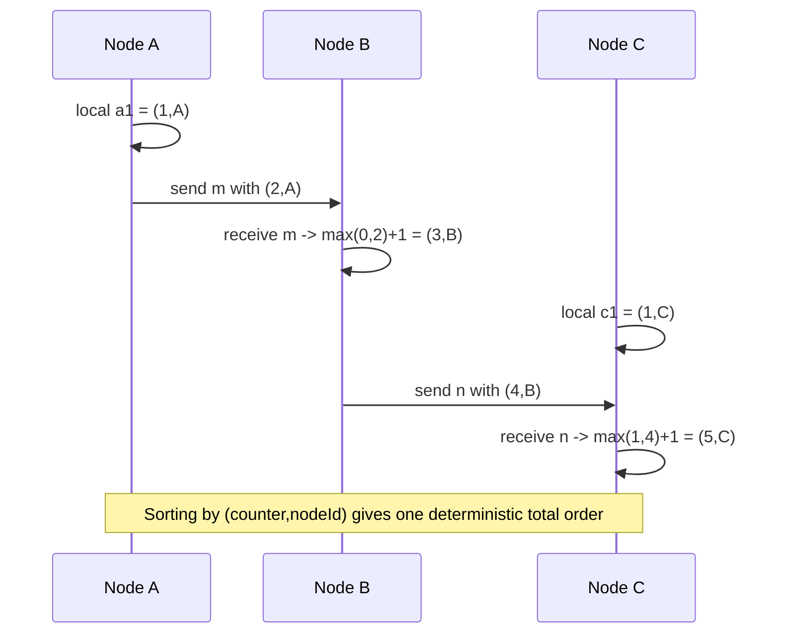

## Overview

Ordered IDs look deceptively mundane: database sequence numbers, primary keys, fencing tokens, event-log offsets, and request IDs often need to be unique, increasing, or at least sortable enough that storage engines and humans can reason about them. On one machine this is a counter. In a distributed system it becomes a consistency problem, because several nodes may generate IDs while messages are delayed, clocks drift, and failures hide which node has seen which event. The practical companion topic, [Distributed ID Generation](distributed-id-generation), covers concrete formats; this entry focuses on what their ordering guarantees really mean.

The key distinction is between **causal order** and **real-time global order**. If event B reads, receives, or builds on event A, then A happened before B; if neither event knew about the other, they are concurrent even if one wall-clock timestamp is larger. Physical clocks are therefore an unsafe foundation for correctness: clock skew, leap adjustments, VM pauses, and NTP corrections can make a "later" timestamp come from an event that did not actually know about the earlier one, as discussed in [The Trouble with Distributed Systems: Partial Failures, Clocks, and Pauses](distributed-systems-partial-failures).

## Why Ordered IDs Matter

Systems use ordered identifiers for more than lookup keys:

- **Sequence numbers** make logs replayable: consumer offset 149 must be applied before 150.
- **Primary keys** that increase roughly with insertion time reduce random B-tree writes and make recent rows easy to scan.
- **Tokens and fencing numbers** let a storage service reject writes from an old leader whose lease has expired.
- **Event ordering** lets downstream systems answer "what happened first?" without calling every producer.

Those uses require different strengths. A social-media post ID may only need to be globally unique and roughly time-sortable. A database commit timestamp that decides whether a uniqueness constraint is valid needs a much stronger guarantee: everyone must agree on a single order that respects causality and real-time decisions.

## Happens-Before, Concurrency, and the Wall-Clock Trap

The **happens-before** relation says event A precedes event B if A and B occur in the same process in that order, or B receives a message sent by A, or there is a chain of such dependencies from A to B. If neither A happened before B nor B happened before A, the events are concurrent. "Concurrent" does not mean simultaneous; it means causally independent.



Wall-clock timestamps collapse this causal structure into one number. That is fine for observability dashboards and approximate sorting, but not for safety-critical ordering. If node C's clock is 400 ms fast, `c1` may carry a larger timestamp than `b1` even though `c1` did not see `b1`; if node A's clock jumps backward, two events in the same process can appear reversed. Last-write-wins conflict resolution has exactly this failure mode: a larger timestamp can overwrite a causally independent value that no user actually superseded. [Multi-Leader and Leaderless Replication](multi-leader-and-leaderless-replication) covers version vectors for that conflict-detection use case.

## Lamport Timestamps: Total Order Consistent with Causality

Lamport clocks replace wall time with a logical counter. Each timestamp is a pair `(counter, nodeId)`, ordered first by counter and then by node ID as a deterministic tie-breaker. The algorithm is small enough to implement directly:

```text
state:
  counter := 0
  nodeId := stable unique node identifier

on local event or send(message):
  counter := counter + 1
  message.lamport := (counter, nodeId)
  return message.lamport

on receive(message):
  counter := max(counter, message.lamport.counter) + 1
  return (counter, nodeId)
```



If event A causally precedes event B, then A's Lamport timestamp is smaller than B's. Adding `nodeId` gives a **total order consistent with causality**: every event can be sorted, and causally dependent events appear in the right order. This is stronger than a wall clock for causality, but it is not the same as knowing which real-time event "finished first" at every node.

Version vectors solve a different problem. A vector keeps one counter per replica, so comparing two vectors can say "A dominates B", "B dominates A", or "these writes are concurrent." That is what a leaderless database needs when it must preserve both concurrent updates. Lamport timestamps intentionally do not preserve that ambiguity; they impose a deterministic total order. Use version vectors to **detect concurrency**, and Lamport timestamps when you need an order that is compatible with causality but can tolerate arbitrary ordering among concurrent events.

## Why Lamport Order Is Not Enough for Uniqueness Constraints

The limitation is subtle: a Lamport timestamp's total order is normally known only **after the fact**. Suppose node A wants to create username `sam` with timestamp `(10,A)`. It can see that `(10,A)` sorts before `(11,B)` and after `(9,C)` once it has those events, but at decision time it cannot know whether an unseen message with `(9,D)` is still in flight. If it accepts `sam` immediately, another node may already have accepted the same username with a lower Lamport timestamp that has not arrived yet.

That uncertainty breaks real-time uniqueness constraints. The system needs not merely a sortable timestamp, but a delivery rule saying every node will process the same candidate writes in the same order and will not skip over missing earlier messages. This is **total order broadcast** (also called atomic broadcast): if one correct node delivers message X before Y, every correct node that delivers both messages delivers X before Y. Once all username claims go through that log, the first claim wins and all later claims are rejected consistently.

Total order broadcast is equivalent to consensus: if you can solve consensus, you can append each decided value to a totally ordered log; if you have total order broadcast, you can solve consensus by broadcasting proposals and deciding the first delivered value. This is why strict global ordering shows up in systems built on Raft, Paxos, ZooKeeper, or etcd, and why [Consensus and Coordination Services](consensus-and-coordination-services) is the natural next concept.

## Linearizable ID Generators

A **linearizable** ID generator behaves as though every `nextId()` call happens atomically at one instant between request and response. If request B starts after request A has completed, B must receive a larger ID. Common implementations include:

- **Single-leader auto-increment** — one database primary owns the sequence and serializes increments.
- **Linearizable compare-and-set** — clients repeatedly increment a counter stored in a linearizable key-value store.
- **Block allocation** — a linearizable allocator hands node A `[1000, 1999]`, node B `[2000, 2999]`, and so on.

Block allocation reduces the number of coordination calls, but it does not make every generated ID globally gap-free or strictly increasing by wall-clock completion time. If node B receives `[2000, 2999]` and emits `2000` before node A has used `1001`, observed IDs can go backward. To preserve strict monotonicity for every call, each call must pass through the serialization point, making the generator a latency and availability bottleneck. This is the same strictness required by [Linearizability](linearizability).

## Scalable Ordered IDs in Practice

Most high-throughput systems choose a weaker but scalable contract. Twitter Snowflake-style IDs combine timestamp bits, a machine or worker ID, and a per-millisecond sequence number. The result is globally unique when worker IDs are unique, compact enough for database keys, and **k-sortable**: sorting by ID is usually close to sorting by creation time.

That is not linearizability. If one machine's clock is ahead, its IDs sort after events that have not happened yet on another node; if clocks move backward, the generator must wait, switch sequence space, or risk disorder; if two clients complete calls in real-time order on different machines, the second is not guaranteed a larger ID. Snowflake is excellent for posts, orders, metrics, and sharded tables that need locality and uniqueness. It is not a consensus protocol and should not be used to enforce "the first request wins" across the whole system.

Hybrid logical clocks sit between pure Lamport counters and physical timestamps: they preserve causality while keeping values close to wall time. They are useful in storage systems that want timestamp-like values with better causal behavior, but they still do not remove the need for consensus when the application requires one globally agreed first writer.

## Trade-offs

- **Strict order buys correctness by introducing a serialization point** — a linearizable sequence can protect fencing tokens, uniqueness checks, and externally visible ordering, but every strictly ordered decision must pass through a leader, quorum, or equivalent consensus path.
- **Lamport timestamps order events without trusting wall clocks, but they do not reveal missing earlier events** — they give a total order consistent with causality after messages are known, yet a node cannot safely conclude that no lower timestamp is still delayed somewhere in the network.
- **Version vectors preserve concurrency instead of hiding it** — they cost more metadata and do not produce a single global sort order, but they can say that two writes are concurrent and must both be merged rather than arbitrarily choosing a winner.
- **Total order broadcast turns ordering into agreement** — once every node delivers the same messages in the same order, constraints such as unique usernames become enforceable, and the price is the same fault-tolerance and latency profile as consensus.
- **Snowflake-style IDs scale because they weaken the guarantee** — timestamp bits plus worker IDs produce unique, roughly time-ordered keys without a central bottleneck, but skewed clocks and independent workers mean the IDs are not strictly monotonic or linearizable.

## Interview Questions

- Why can two events be concurrent even if their wall-clock timestamps are minutes apart?
- What update rules does a Lamport clock apply on local events and on message receipt, and what ordering guarantee does that provide?
- Why does a Lamport-timestamp total order fail to enforce a real-time uniqueness constraint by itself?
- How are version vectors different from Lamport timestamps when two writes are concurrent?
- When would you choose a Snowflake-style ID over a linearizable sequence, and what guarantee are you giving up?

## References

- [Martin Kleppmann, "Designing Data-Intensive Applications", 2nd Edition (O'Reilly) — Chapter 10, "Consistency and Consensus", section "ID Generators and Logical Clocks"](https://www.oreilly.com/library/view/designing-data-intensive-applications/9781098119058/)
- [Leslie Lamport — "Time, Clocks, and the Ordering of Events in a Distributed System"](https://dl.acm.org/doi/10.1145/359545.359563)
- [Twitter Engineering — "Announcing Snowflake"](https://blog.twitter.com/engineering/en_us/a/2010/announcing-snowflake)
- [Tushar Deepak Chandra and Sam Toueg — "Unreliable Failure Detectors for Reliable Distributed Systems"](https://dl.acm.org/doi/10.1145/226643.226647)
- [Sandeep Kulkarni, Murat Demirbas, Deepak Madeppa, Bharadwaj Avva, and Marcelo Leone — "Logical Physical Clocks and Consistent Snapshots in Globally Distributed Databases"](https://cse.buffalo.edu/tech-reports/2014-04.pdf)
