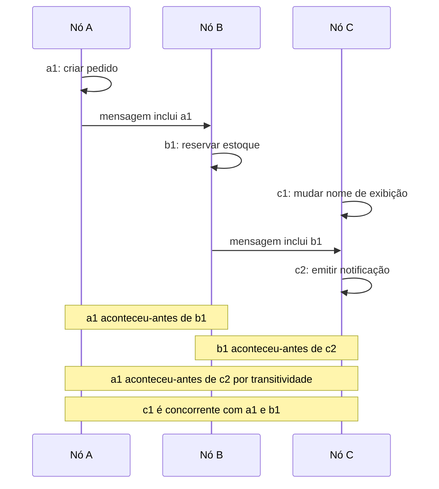
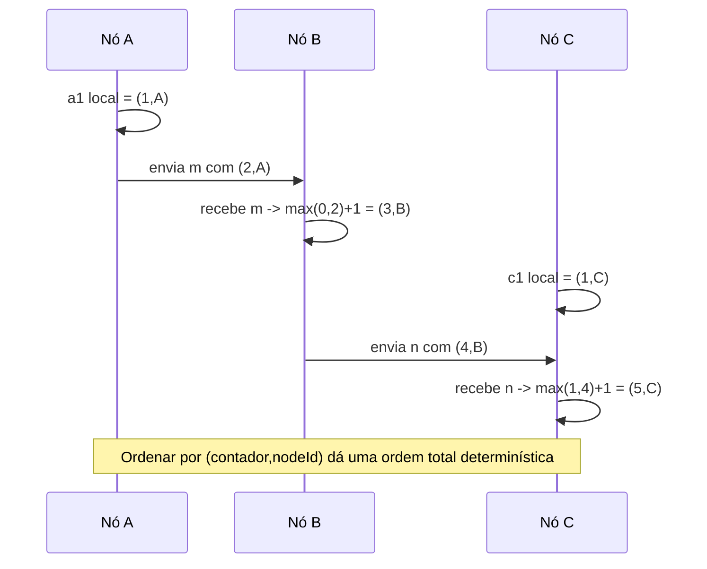

## Visão Geral

IDs ordenados parecem enganosamente mundanos: números de sequência de banco de dados, chaves primárias, fencing tokens, offsets de log de eventos, e IDs de requisição frequentemente precisam ser únicos, crescentes, ou pelo menos ordenáveis o suficiente para que motores de armazenamento e humanos consigam raciocinar sobre eles. Em uma máquina isso é um contador. Em um sistema distribuído isso vira um problema de consistência, porque vários nós podem gerar IDs enquanto mensagens são atrasadas, relógios derivam, e falhas escondem qual nó viu qual evento. O tópico complementar prático, [Distributed ID Generation](distributed-id-generation), cobre formatos concretos; esta entrada foca no que suas garantias de ordenação realmente significam.

A distinção chave é entre **ordem causal** e **ordem global em tempo real**. Se o evento B lê, recebe, ou constrói sobre o evento A, então A aconteceu antes de B; se nenhum evento sabia sobre o outro, eles são concorrentes mesmo que um timestamp de relógio de parede seja maior. Relógios físicos são, portanto, uma fundação insegura para correção: desvio de relógio, ajustes de segundo bissexto, pausas de VM, e correções NTP podem fazer um timestamp "mais tardio" vir de um evento que não sabia de fato sobre o mais cedo, como discutido em [The Trouble with Distributed Systems: Partial Failures, Clocks, and Pauses](distributed-systems-partial-failures).

## Por Que IDs Ordenados Importam

Sistemas usam identificadores ordenados para mais do que chaves de busca:

- **Números de sequência** tornam logs reproduzíveis: o offset de consumidor 149 deve ser aplicado antes do 150.
- **Chaves primárias** que crescem aproximadamente com o horário de inserção reduzem escritas aleatórias em B-tree e tornam linhas recentes fáceis de escanear.
- **Tokens e números de fencing** permitem que um serviço de armazenamento rejeite escritas de um líder antigo cujo lease expirou.
- **Ordenação de eventos** permite que sistemas downstream respondam "o que aconteceu primeiro?" sem chamar cada produtor.

Esses usos exigem forças diferentes. Um ID de post de rede social pode só precisar ser globalmente único e aproximadamente ordenável por tempo. Um timestamp de commit de banco de dados que decide se uma restrição de unicidade é válida precisa de uma garantia muito mais forte: todos devem concordar em uma única ordem que respeite causalidade e decisões em tempo real.

## Happens-Before, Concorrência, e a Armadilha do Relógio de Parede

A relação **happens-before** diz que o evento A precede o evento B se A e B ocorrem no mesmo processo naquela ordem, ou B recebe uma mensagem enviada por A, ou há uma cadeia de tais dependências de A para B. Se nem A aconteceu antes de B nem B aconteceu antes de A, os eventos são concorrentes. "Concorrente" não significa simultâneo; significa causalmente independente.



Timestamps de relógio de parede colapsam essa estrutura causal em um número. Isso é bom para dashboards de observabilidade e ordenação aproximada, mas não para ordenação crítica de segurança. Se o relógio do nó C está 400 ms adiantado, `c1` pode carregar um timestamp maior que `b1` mesmo que `c1` não tenha visto `b1`; se o relógio do nó A pular para trás, dois eventos no mesmo processo podem parecer invertidos. Resolução de conflito last-write-wins tem exatamente esse modo de falha: um timestamp maior pode sobrescrever um valor causalmente independente que nenhum usuário de fato substituiu. [Multi-Leader and Leaderless Replication](multi-leader-and-leaderless-replication) cobre vetores de versão para esse caso de uso de detecção de conflito.

## Timestamps de Lamport: Ordem Total Consistente com Causalidade

Relógios de Lamport substituem o tempo de relógio de parede por um contador lógico. Cada timestamp é um par `(contador, nodeId)`, ordenado primeiro por contador e depois por nodeId como um desempate determinístico. O algoritmo é pequeno o suficiente para implementar diretamente:

```text
estado:
  contador := 0
  nodeId := identificador de nó único e estável

ao evento local ou enviar(mensagem):
  contador := contador + 1
  mensagem.lamport := (contador, nodeId)
  retorna mensagem.lamport

ao receber(mensagem):
  contador := max(contador, mensagem.lamport.contador) + 1
  retorna (contador, nodeId)
```



Se o evento A precede causalmente o evento B, então o timestamp de Lamport de A é menor que o de B. Adicionar `nodeId` dá uma **ordem total consistente com causalidade**: todo evento pode ser ordenado, e eventos causalmente dependentes aparecem na ordem certa. Isso é mais forte que um relógio de parede para causalidade, mas não é o mesmo que saber qual evento em tempo real "terminou primeiro" em cada nó.

Vetores de versão resolvem um problema diferente. Um vetor mantém um contador por réplica, então comparar dois vetores pode dizer "A domina B", "B domina A", ou "essas escritas são concorrentes." Isso é o que um banco de dados sem líder precisa quando deve preservar ambas as atualizações concorrentes. Timestamps de Lamport intencionalmente não preservam essa ambiguidade; eles impõem uma ordem total determinística. Use vetores de versão para **detectar concorrência**, e timestamps de Lamport quando você precisa de uma ordem compatível com causalidade mas pode tolerar ordenação arbitrária entre eventos concorrentes.

## Por Que a Ordem de Lamport Não É Suficiente para Restrições de Unicidade

A limitação é sutil: a ordem total de um timestamp de Lamport normalmente só é conhecida **depois do fato**. Suponha que o nó A queira criar o nome de usuário `sam` com timestamp `(10,A)`. Ele pode ver que `(10,A)` ordena antes de `(11,B)` e depois de `(9,C)` uma vez que tenha esses eventos, mas no momento da decisão não pode saber se uma mensagem não vista com `(9,D)` ainda está em trânsito. Se aceitar `sam` imediatamente, outro nó pode já ter aceitado o mesmo nome de usuário com um timestamp de Lamport menor que ainda não chegou.

Essa incerteza quebra restrições de unicidade em tempo real. O sistema precisa não apenas de um timestamp ordenável, mas de uma regra de entrega dizendo que todo nó vai processar as mesmas escritas candidatas na mesma ordem e não vai pular por cima de mensagens anteriores faltando. Isso é **broadcast de ordem total** (também chamado de broadcast atômico): se um nó correto entrega a mensagem X antes de Y, todo nó correto que entrega ambas as mensagens as entrega X antes de Y. Uma vez que todas as reivindicações de nome de usuário passem por aquele log, a primeira reivindicação vence e todas as reivindicações posteriores são rejeitadas consistentemente.

Broadcast de ordem total é equivalente a consenso: se você consegue resolver consenso, você consegue anexar cada valor decidido a um log totalmente ordenado; se você tem broadcast de ordem total, você consegue resolver consenso transmitindo propostas e decidindo o primeiro valor entregue. É por isso que ordenação global estrita aparece em sistemas construídos sobre Raft, Paxos, ZooKeeper, ou etcd, e por que [Consensus and Coordination Services](consensus-and-coordination-services) é o próximo conceito natural.

## Geradores de ID Linearizáveis

Um gerador de ID **linearizável** se comporta como se toda chamada `nextId()` acontecesse atomicamente em um instante entre requisição e resposta. Se a requisição B começa depois que a requisição A completou, B deve receber um ID maior. Implementações comuns incluem:

- **Auto-incremento com líder único** — um primário de banco de dados possui a sequência e serializa incrementos.
- **Compare-and-set linearizável** — clientes incrementam repetidamente um contador armazenado em um armazenamento chave-valor linearizável.
- **Alocação em blocos** — um alocador linearizável entrega ao nó A `[1000, 1999]`, ao nó B `[2000, 2999]`, e assim por diante.

Alocação em blocos reduz o número de chamadas de coordenação, mas não torna cada ID gerado globalmente livre de lacunas ou estritamente crescente pelo horário de conclusão do relógio de parede. Se o nó B recebe `[2000, 2999]` e emite `2000` antes que o nó A tenha usado `1001`, IDs observados podem retroceder. Para preservar monotonicidade estrita para cada chamada, cada chamada deve passar pelo ponto de serialização, tornando o gerador um gargalo de latência e disponibilidade. Isso é a mesma rigidez exigida por [Linearizability](linearizability).

## IDs Ordenados Escaláveis na Prática

A maioria dos sistemas de alto throughput escolhe um contrato mais fraco mas escalável. IDs estilo Twitter Snowflake combinam bits de timestamp, um ID de máquina ou worker, e um número de sequência por milissegundo. O resultado é globalmente único quando IDs de worker são únicos, compacto o suficiente para chaves de banco de dados, e **k-ordenável**: ordenar por ID é geralmente próximo de ordenar por horário de criação.

Isso não é linearizabilidade. Se o relógio de uma máquina está adiantado, seus IDs ordenam depois de eventos que ainda não aconteceram em outro nó; se relógios se movem para trás, o gerador deve esperar, trocar espaço de sequência, ou arriscar desordem; se dois clientes completam chamadas em ordem de tempo real em máquinas diferentes, a segunda não tem garantia de receber um ID maior. Snowflake é excelente para posts, pedidos, métricas, e tabelas fragmentadas que precisam de localidade e unicidade. Não é um protocolo de consenso e não deveria ser usado para impor "a primeira requisição vence" através do sistema inteiro.

Relógios lógicos híbridos ficam entre contadores de Lamport puros e timestamps físicos: eles preservam causalidade enquanto mantêm valores próximos do tempo de parede. São úteis em sistemas de armazenamento que querem valores tipo timestamp com melhor comportamento causal, mas ainda não removem a necessidade de consenso quando a aplicação exige um primeiro escritor globalmente acordado.

## Trade-offs

- **Ordem estrita compra correção introduzindo um ponto de serialização** — uma sequência linearizável pode proteger fencing tokens, checagens de unicidade, e ordenação visível externamente, mas toda decisão estritamente ordenada deve passar por um líder, quorum, ou caminho de consenso equivalente.
- **Timestamps de Lamport ordenam eventos sem confiar em relógios de parede, mas não revelam eventos anteriores faltando** — eles dão uma ordem total consistente com causalidade depois que mensagens são conhecidas, mas um nó não pode concluir com segurança que nenhum timestamp menor ainda está atrasado em algum lugar da rede.
- **Vetores de versão preservam concorrência em vez de escondê-la** — custam mais metadados e não produzem uma única ordem de classificação global, mas conseguem dizer que duas escritas são concorrentes e devem ambas ser mescladas em vez de escolher arbitrariamente uma vencedora.
- **Broadcast de ordem total transforma ordenação em acordo** — uma vez que cada nó entrega as mesmas mensagens na mesma ordem, restrições como nomes de usuário únicos se tornam impostas, e o preço é o mesmo perfil de tolerância a falhas e latência de consenso.
- **IDs estilo Snowflake escalam porque enfraquecem a garantia** — bits de timestamp mais IDs de worker produzem chaves únicas, aproximadamente ordenadas por tempo, sem um gargalo central, mas relógios desviados e workers independentes significam que os IDs não são estritamente monotônicos ou linearizáveis.

## Perguntas de Entrevista

- Por que dois eventos podem ser concorrentes mesmo que seus timestamps de relógio de parede estejam minutos separados?
- Quais regras de atualização um relógio de Lamport aplica em eventos locais e no recebimento de mensagens, e que garantia de ordenação isso fornece?
- Por que uma ordem total de timestamp de Lamport falha em impor uma restrição de unicidade em tempo real por si só?
- Como vetores de versão são diferentes de timestamps de Lamport quando duas escritas são concorrentes?
- Quando você escolheria um ID estilo Snowflake em vez de uma sequência linearizável, e que garantia você está abrindo mão?

## Referências

- [Martin Kleppmann, "Designing Data-Intensive Applications", 2nd Edition (O'Reilly) — Capítulo 10, "Consistency and Consensus", seção "ID Generators and Logical Clocks"](https://www.oreilly.com/library/view/designing-data-intensive-applications/9781098119058/)
- [Leslie Lamport — "Time, Clocks, and the Ordering of Events in a Distributed System"](https://dl.acm.org/doi/10.1145/359545.359563)
- [Twitter Engineering — "Announcing Snowflake"](https://blog.twitter.com/engineering/en_us/a/2010/announcing-snowflake)
- [Tushar Deepak Chandra e Sam Toueg — "Unreliable Failure Detectors for Reliable Distributed Systems"](https://dl.acm.org/doi/10.1145/226643.226647)
- [Sandeep Kulkarni, Murat Demirbas, Deepak Madeppa, Bharadwaj Avva, e Marcelo Leone — "Logical Physical Clocks and Consistent Snapshots in Globally Distributed Databases"](https://cse.buffalo.edu/tech-reports/2014-04.pdf)
