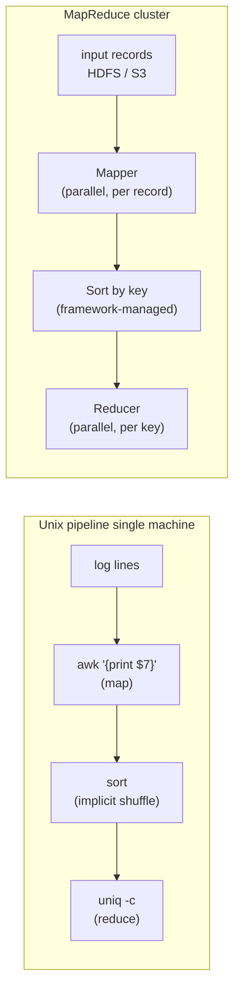

## Overview

The [previous concept](/concepts/batch-processing-in-distributed-systems) covered the infrastructure a batch job runs on: a distributed filesystem standing in for local disk, a resource manager and scheduler standing in for the kernel, task executors that isolate and retry individual tasks. This concept is about the program that actually runs on top of that infrastructure — **MapReduce**, the data-processing pattern that gave the "big data" era its shape and, indirectly, its vocabulary.

MapReduce's core claim is that an enormous number of data-processing tasks reduce to the same four-step shape, and that shape is exactly the one you'd build by hand with Unix pipes for a much smaller dataset. Kleppmann's *Designing Data-Intensive Applications* introduces MapReduce right after walking through a web-server log-analysis pipeline built from `awk`, `sort`, and `uniq -c` — and the point of putting them back to back is that MapReduce isn't a different algorithm from that pipeline, it's the same algorithm running on a cluster instead of one machine.

## The Four Steps

1. **Read a set of input files and break them into records.** For the log-analysis example, a record is one line, and `\n` is the separator. In Hadoop's MapReduce, input lives in a distributed filesystem (HDFS) or object store (S3), typically in a columnar format like Parquet or a row-based format like Avro.
2. **Call the mapper once per record to extract a key and a value.** In the Unix pipeline, the mapper is `awk '{print $7}'` — it extracts the URL (`$7`) as the key and leaves the value empty.
3. **Sort all key-value pairs by key.** In the Unix pipeline this is the `sort` command. In MapReduce, this step is **implicit** — you never write it, because the framework always sorts the mapper's output before handing it to the reducer.
4. **Call the reducer to iterate over the sorted key-value pairs.** Because sorting already grouped every occurrence of a key next to each other, the reducer can combine values for a key without holding much state in memory. In the Unix pipeline, `uniq -c` is the reducer — it counts adjacent records sharing a key.

You write steps 2 and 4 — the mapper and the reducer. Step 1 is handled by the input format parser, and step 3 is handled entirely by the framework. If you need a second sorting pass — the log-analysis example's second `sort`, which ranks URLs by request count — you don't add a step to the same job; you write a **second MapReduce job** and feed it the first job's output. Seen this way, a mapper's real job is to shape data so it's useful to sort, and a reducer's real job is to process data once it's already sorted.

## The Mapper/Reducer Contract

- **Mapper**: called once per input record. For each record it may emit any number of key-value pairs, including zero. It keeps no state between calls — record *N* can't see anything about record *N-1*. That statelessness is what lets many mappers run in parallel across different slices of the input.
- **Reducer**: the framework collects every value produced for a given key across all mappers and calls the reducer once per key, with an iterator over that key's values. Reducers for different keys are independent of each other, so they too can run in parallel.

This is the same mapper/reducer contract regardless of which cluster framework implements it, and it's also exactly the fault-tolerance boundary described in the batch-processing concept: because a task's output depends only on the input the framework explicitly handed it, a failed mapper or reducer can simply be re-run — on the same node or a different one — without touching any other task's state.

## Why "Functional Programming" Isn't Just a Label

MapReduce runs as a batch system, but the *programming model* is functional programming: `map` and `reduce` (or `fold`) are higher-order functions on lists that trace back to Lisp, long before "big data" was a phrase, and the same two functions now sit in the standard library of Python, Rust, and Java's `Stream` API. A surprising amount of what SQL does can be expressed on top of map and reduce.

The specific functional-programming principle doing the work here is **avoiding mutable state**. Because every mapper and reducer call depends only on the data the framework explicitly passes in — never on some shared variable another task might be modifying concurrently — the framework is free to run independent calls on different nodes at the same time, and free to re-run any call that fails using the exact same input on a different node. That's not a side benefit of the functional style; it's the specific property the previous concept called "per-task fault tolerance," restated at the language level instead of the infrastructure level. The infrastructure (task executors, retries) and the programming model (no mutable state) are two sides of the same design decision.

## The Cost of Working at This Level

Two things make raw MapReduce a rough tool once you actually try to build something nontrivial with it:

- **Joins have to be hand-implemented.** MapReduce gives you a map step and a reduce step; anything as common as "join these two datasets on a key" isn't a primitive — you write it yourself, on top of map and reduce, every time.
- **File-based I/O blocks pipelining between jobs.** Every MapReduce job writes its full output to the distributed filesystem before the next job in a chain is allowed to start reading it. A downstream job can't begin consuming records as soon as they're produced — it has to wait for the upstream job to finish completely and materialize everything to disk first. For a multi-job DAG (see the previous concept's discussion of 50-100 job pipelines), that's a lot of unnecessary disk I/O and unnecessary end-to-end latency, purely because the execution model has no notion of "stream this job's output directly into the next job's input."

That second limitation is the one the rest of the chapter — and modern batch engines — exist to fix.

## Where This Shows Up Today

MapReduce's four-step shape didn't go away; it got absorbed into something more general. **Apache Spark** is the clearest example: its foundational abstraction, the RDD (Resilient Distributed Dataset), and the higher-level DataFrame API built on top of it, still express computation as chains of map-like and reduce-like transformations — but Spark's scheduler can keep intermediate results in memory (or spill to disk only when it must) and pipeline data directly from one stage into the next within a single job, instead of forcing a full materialize-to-disk-and-restart between every step. That's a direct answer to the file-based I/O problem this concept ends on: the programming model (map, then aggregate by key) survived; the "write everything to disk between jobs" execution strategy didn't. Flink's dataflow model and warehouse engines like BigQuery and Snowflake take the same idea further with their own query planners, but the lineage back to "extract a key, group by it, aggregate" is still visible in all of them.

## Trade-offs

- **The implicit sort is MapReduce's most reused idea, and its biggest hidden cost.** Guaranteeing every reducer sees its key's values already grouped is what makes reducers simple to write — but sorting a job's entire intermediate output is expensive, and it happens whether or not the reducer actually needs global ordering (often it only needs grouping, not order).
- **Statelessness buys parallelism and retryability, not expressiveness.** The same constraint that lets the framework freely parallelize and retry mapper/reducer calls is what makes multi-dataset joins awkward — a join fundamentally needs to correlate state across records, which is precisely what a stateless per-record callback doesn't want to do.
- **Chaining jobs instead of chaining operators is simple to reason about and slow to run.** Treating "job N+1 reads job N's output from disk" as the only composition primitive makes each job trivially independent and separately retryable, at the cost of end-to-end latency and disk I/O that a pipelined execution engine avoids by design.
- **The programming model outlived the execution strategy.** Spark and Flink didn't discard "map, then group by key, then reduce" — they discarded "materialize everything to disk between every job." That distinction is why understanding MapReduce is still useful even though almost nobody deploys vanilla MapReduce today.

## Interview Questions

- Walk through the four steps of the MapReduce model and map each one onto the equivalent stage of the `awk` / `sort` / `uniq -c` Unix pipeline.
- Why is the sort step in MapReduce "implicit," and what does that buy the person writing the reducer?
- What can a mapper assume — and not assume — about the record it's called with, and why does that constraint matter for parallelism?
- Why does avoiding mutable state in the mapper/reducer contract make both parallel execution and retry-on-failure easier to implement?
- What specifically makes joins hard to implement on top of raw MapReduce?
- MapReduce's file-based I/O "prevents job pipelining." What does that mean concretely, and how does Spark's RDD/DataFrame model address it?
- If MapReduce is largely obsolete, why is it still worth learning the model instead of jumping straight to Spark or Flink?

## References

- Martin Kleppmann, [*Designing Data-Intensive Applications*, 2nd Edition](https://www.oreilly.com/library/view/designing-data-intensive-applications/9781098119058/) (O'Reilly) — Chapter 11, "Batch Processing," section "Batch Processing Models: MapReduce"
- Jeffrey Dean and Sanjay Ghemawat, ["MapReduce: Simplified Data Processing on Large Clusters"](https://research.google/pubs/mapreduce-simplified-data-processing-on-large-clusters/) (OSDI 2004)
- Matei Zaharia et al., ["Resilient Distributed Datasets: A Fault-Tolerant Abstraction for In-Memory Cluster Computing"](https://www.usenix.org/conference/nsdi12/technical-sessions/presentation/zaharia) (NSDI 2012) — the paper behind Spark's in-memory alternative to disk-based MapReduce
- [Apache Spark Documentation — RDD Programming Guide](https://spark.apache.org/docs/latest/rdd-programming-guide.html)
- [Apache Hadoop — MapReduce Tutorial](https://hadoop.apache.org/docs/stable/hadoop-mapreduce-client/hadoop-mapreduce-client-core/MapReduceTutorial.html)
