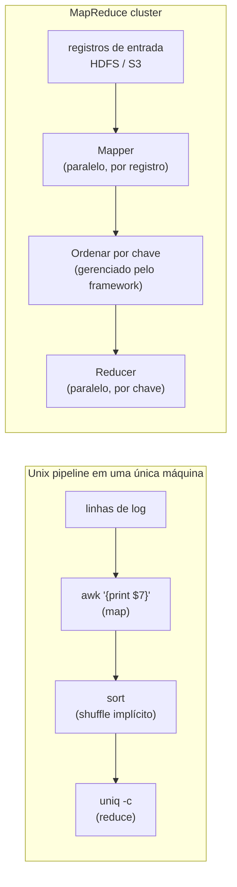

## Visão Geral

O [conceito anterior](/concepts/batch-processing-in-distributed-systems) cobriu a infraestrutura sobre a qual um job em lote roda: um sistema de arquivos distribuído substituindo o disco local, um gerenciador de recursos e escalonador substituindo o kernel, executores de tarefas que isolam e tentam de novo tarefas individuais. Este conceito é sobre o programa que de fato roda em cima dessa infraestrutura — **MapReduce**, o padrão de processamento de dados que deu à era do "big data" sua forma e, indiretamente, seu vocabulário.

A alegação central do MapReduce é que um número enorme de tarefas de processamento de dados se reduz à mesma forma de quatro passos, e essa forma é exatamente a que você construiria à mão com pipes do Unix para um conjunto de dados muito menor. *Designing Data-Intensive Applications*, de Kleppmann, introduz o MapReduce logo depois de percorrer um pipeline de análise de logs de servidor web construído com `awk`, `sort`, e `uniq -c` — e o objetivo de colocá-los lado a lado é que o MapReduce não é um algoritmo diferente daquele pipeline, é o mesmo algoritmo rodando em um cluster em vez de uma máquina.

## Os Quatro Passos

1. **Ler um conjunto de arquivos de entrada e quebrá-los em registros.** No exemplo de análise de logs, um registro é uma linha, e `\n` é o separador. No MapReduce do Hadoop, a entrada vive em um sistema de arquivos distribuído (HDFS) ou armazenamento de objetos (S3), tipicamente em um formato colunar como Parquet ou um formato baseado em linhas como Avro.
2. **Chamar o mapper uma vez por registro para extrair uma chave e um valor.** No pipeline Unix, o mapper é `awk '{print $7}'` — ele extrai a URL (`$7`) como a chave e deixa o valor vazio.
3. **Ordenar todos os pares chave-valor por chave.** No pipeline Unix isso é o comando `sort`. No MapReduce, este passo é **implícito** — você nunca o escreve, porque o framework sempre ordena a saída do mapper antes de entregá-la ao reducer.
4. **Chamar o reducer para iterar sobre os pares chave-valor ordenados.** Como a ordenação já agrupou toda ocorrência de uma chave lado a lado, o reducer pode combinar valores para uma chave sem manter muito estado na memória. No pipeline Unix, `uniq -c` é o reducer — ele conta registros adjacentes compartilhando uma chave.

Você escreve os passos 2 e 4 — o mapper e o reducer. O passo 1 é tratado pelo parser de formato de entrada, e o passo 3 é tratado inteiramente pelo framework. Se você precisa de um segundo passe de ordenação — o segundo `sort` do exemplo de análise de logs, que ordena URLs por contagem de requisições — você não adiciona um passo ao mesmo job; você escreve um **segundo job MapReduce** e o alimenta com a saída do primeiro job. Visto assim, o trabalho real de um mapper é moldar dados para que sejam úteis para ordenar, e o trabalho real de um reducer é processar dados uma vez que já estejam ordenados.

## O Contrato Mapper/Reducer

- **Mapper**: chamado uma vez por registro de entrada. Para cada registro ele pode emitir qualquer número de pares chave-valor, incluindo zero. Ele não mantém estado entre chamadas — o registro *N* não consegue ver nada sobre o registro *N-1*. Essa ausência de estado é o que permite que muitos mappers rodem em paralelo através de fatias diferentes da entrada.
- **Reducer**: o framework coleta cada valor produzido para uma dada chave em todos os mappers e chama o reducer uma vez por chave, com um iterador sobre os valores daquela chave. Reducers para chaves diferentes são independentes entre si, então eles também podem rodar em paralelo.

Esse é o mesmo contrato mapper/reducer independentemente de qual framework de cluster o implementa, e é também exatamente a fronteira de tolerância a falhas descrita no conceito de processamento em lote: como a saída de uma tarefa depende apenas da entrada que o framework explicitamente entregou a ela, um mapper ou reducer que falhou pode simplesmente ser rodado de novo — no mesmo nó ou em um diferente — sem tocar no estado de nenhuma outra tarefa.

## Por Que "Programação Funcional" Não É Só um Rótulo

O MapReduce roda como um sistema em lote, mas o *modelo de programação* é programação funcional: `map` e `reduce` (ou `fold`) são funções de ordem superior sobre listas que remontam ao Lisp, muito antes de "big data" ser uma expressão, e as mesmas duas funções agora estão na biblioteca padrão de Python, Rust, e na API `Stream` do Java. Uma quantidade surpreendente do que SQL faz pode ser expressa em cima de map e reduce.

O princípio específico de programação funcional fazendo o trabalho aqui é **evitar estado mutável**. Como toda chamada de mapper e reducer depende apenas dos dados que o framework explicitamente passou, nunca de alguma variável compartilhada que outra tarefa possa estar modificando concorrentemente, o framework é livre para rodar chamadas independentes em nós diferentes ao mesmo tempo, e livre para rodar de novo qualquer chamada que falhe usando exatamente a mesma entrada em um nó diferente. Isso não é um benefício colateral do estilo funcional; é a propriedade específica que o conceito anterior chamou de "tolerância a falhas por tarefa", reafirmada no nível da linguagem em vez do nível da infraestrutura. A infraestrutura (executores de tarefas, retentativas) e o modelo de programação (sem estado mutável) são dois lados da mesma decisão de design.

## O Custo de Trabalhar Neste Nível

Duas coisas tornam o MapReduce puro uma ferramenta difícil assim que você realmente tenta construir algo não trivial com ele:

- **Joins têm que ser implementados à mão.** MapReduce te dá um passo de map e um passo de reduce; qualquer coisa tão comum quanto "junte esses dois conjuntos de dados em uma chave" não é uma primitiva — você a escreve você mesmo, em cima de map e reduce, toda vez.
- **I/O baseado em arquivo bloqueia pipelining entre jobs.** Todo job MapReduce escreve sua saída completa no sistema de arquivos distribuído antes que o próximo job em uma cadeia seja permitido começar a lê-la. Um job downstream não pode começar a consumir registros assim que são produzidos — ele tem que esperar o job upstream terminar completamente e materializar tudo em disco primeiro. Para um DAG multi-job (veja a discussão do conceito anterior sobre pipelines de 50-100 jobs), isso é muito I/O de disco desnecessário e latência ponta-a-ponta desnecessária, puramente porque o modelo de execução não tem noção de "transmita a saída deste job diretamente para a entrada do próximo job".

Essa segunda limitação é a que o resto do capítulo — e motores de lote modernos — existem para corrigir.

## Onde Isso Aparece Hoje

A forma de quatro passos do MapReduce não desapareceu — ela foi absorvida em algo mais geral. O **Apache Spark** é o exemplo mais claro: sua abstração fundacional, o RDD (Resilient Distributed Dataset, Conjunto de Dados Distribuído Resiliente), e a API DataFrame de nível mais alto construída sobre ele, ainda expressam computação como cadeias de transformações estilo map e estilo reduce — mas o escalonador do Spark consegue manter resultados intermediários em memória (ou derramar em disco só quando precisa) e transmitir dados diretamente de um estágio para o próximo dentro de um único job, em vez de forçar uma materialização completa em disco e reinício entre cada passo. Essa é uma resposta direta ao problema de I/O baseado em arquivo com que este conceito termina: o modelo de programação (map, depois agregar por chave) sobreviveu; a estratégia de execução "escreva tudo em disco entre jobs" não. O modelo de dataflow do Flink e motores de data warehouse como BigQuery e Snowflake levam a mesma ideia mais longe com seus próprios planejadores de consulta, mas a linhagem de volta a "extrair uma chave, agrupar por ela, agregar" ainda é visível em todos eles.

## Trade-offs

- **A ordenação implícita é a ideia mais reaproveitada do MapReduce, e seu maior custo escondido.** Garantir que todo reducer veja os valores de sua chave já agrupados é o que torna reducers simples de escrever — mas ordenar a saída intermediária inteira de um job é caro, e isso acontece quer o reducer realmente precise de ordenação global ou não (frequentemente ele só precisa de agrupamento, não ordem).
- **Ausência de estado compra paralelismo e capacidade de retentativa, não expressividade.** A mesma restrição que permite que o framework paralelize e tente de novo livremente chamadas de mapper/reducer é o que torna joins de múltiplos conjuntos de dados desajeitados — um join fundamentalmente precisa correlacionar estado entre registros, que é precisamente o que um callback sem estado por registro não quer fazer.
- **Encadear jobs em vez de encadear operadores é simples de raciocinar e lento de rodar.** Tratar "o job N+1 lê a saída do job N do disco" como a única primitiva de composição torna cada job trivialmente independente e separadamente retentável, ao custo de latência ponta-a-ponta e I/O de disco que um motor de execução com pipeline evita por design.
- **O modelo de programação sobreviveu à estratégia de execução.** Spark e Flink não descartaram "map, depois agrupar por chave, depois reduzir" — eles descartaram "materialize tudo em disco entre cada job". Essa distinção é por que entender o MapReduce ainda é útil mesmo que quase ninguém implante MapReduce puro hoje.

## Perguntas de Entrevista

- Percorra os quatro passos do modelo MapReduce e mapeie cada um no estágio equivalente do pipeline Unix `awk` / `sort` / `uniq -c`.
- Por que o passo de ordenação no MapReduce é "implícito", e o que isso compra para quem escreve o reducer?
- O que um mapper pode assumir — e não assumir — sobre o registro com o qual é chamado, e por que essa restrição importa para paralelismo?
- Por que evitar estado mutável no contrato mapper/reducer torna tanto a execução paralela quanto a retentativa em falha mais fáceis de implementar?
- O que especificamente torna joins difíceis de implementar em cima de MapReduce puro?
- O I/O baseado em arquivo do MapReduce "impede pipelining de jobs". O que isso significa concretamente, e como o modelo RDD/DataFrame do Spark aborda isso?
- Se o MapReduce é largamente obsoleto, por que ainda vale a pena aprender o modelo em vez de pular direto para Spark ou Flink?

## Referências

- Martin Kleppmann, [*Designing Data-Intensive Applications*, 2nd Edition](https://www.oreilly.com/library/view/designing-data-intensive-applications/9781098119058/) (O'Reilly) — Capítulo 11, "Batch Processing," seção "Batch Processing Models: MapReduce"
- Jeffrey Dean e Sanjay Ghemawat, ["MapReduce: Simplified Data Processing on Large Clusters"](https://research.google/pubs/mapreduce-simplified-data-processing-on-large-clusters/) (OSDI 2004)
- Matei Zaharia et al., ["Resilient Distributed Datasets: A Fault-Tolerant Abstraction for In-Memory Cluster Computing"](https://www.usenix.org/conference/nsdi12/technical-sessions/presentation/zaharia) (NSDI 2012) — o artigo por trás da alternativa em memória do Spark ao MapReduce baseado em disco
- [Apache Spark Documentation — RDD Programming Guide](https://spark.apache.org/docs/latest/rdd-programming-guide.html)
- [Apache Hadoop — MapReduce Tutorial](https://hadoop.apache.org/docs/stable/hadoop-mapreduce-client/hadoop-mapreduce-client-core/MapReduceTutorial.html)
