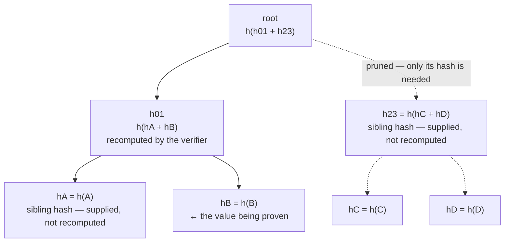
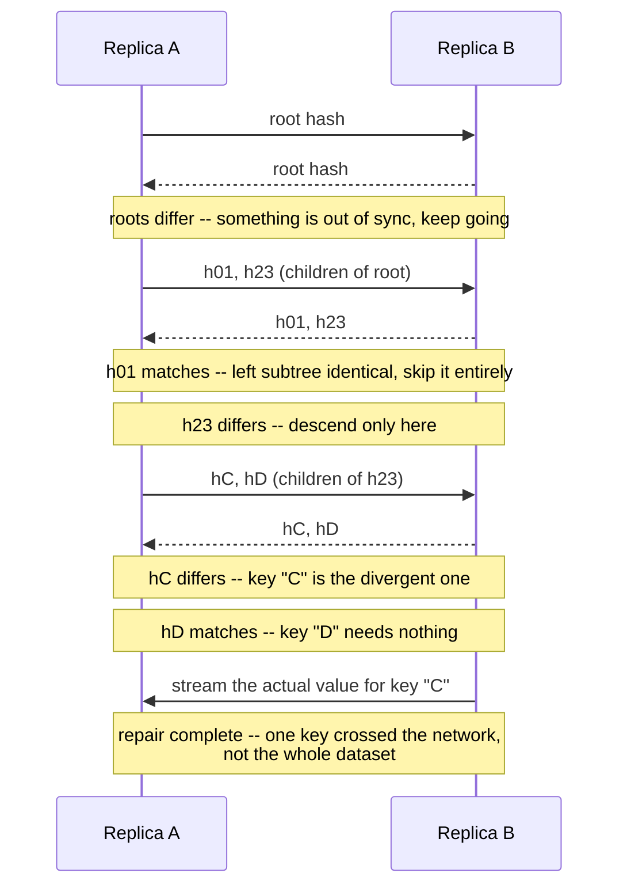

## Overview

A **Merkle tree** (Ralph Merkle, 1979) is a binary tree where every leaf holds the hash of a piece of data, and every non-leaf node holds the hash of the concatenation of its children's hashes. The payoff is that a single hash at the root -- 32 bytes, for SHA-256 -- fingerprints an arbitrarily large dataset, and the tree structure lets you do two things a flat hash of the whole dataset cannot: prove that one specific record belongs to the set without transmitting the rest of it, and find exactly what changed between two versions of the dataset without comparing them byte by byte. Those two properties are why the same data structure shows up, almost unchanged, in Git's object store, every Bitcoin and Ethereum block, Certificate Transparency logs, Cassandra and DynamoDB's replica repair, ZFS and Btrfs checksums, and IPFS's content addressing.

## How the Tree Is Built

The structure is drawn top-down, but it is **computed bottom-up**: every leaf hashes its own value first, and a parent's hash cannot exist until both of its children's hashes do.

```viz
type: tree
insert root h(h01+h23) | Drawn top-down for layout, but keep watching -- the real build order is bottom-up, leaves first.
insert h01 h(hA+hB) parent=root side=left
insert h23 h(hC+hD) parent=root side=right
insert hA h(A) parent=h01 side=left | Leaf hash: SHA-256 of the raw value stored under key "A".
insert hB h(B) parent=h01 side=right
insert hC h(C) parent=h23 side=left
insert hD h(D) parent=h23 side=right
mark hA | Real build, step 1: hash every leaf's value independently -- these are embarrassingly parallel.
mark hB
mark hC
mark hD
mark h01 | Step 2: hash the concatenation of each sibling pair to get their parent.
mark h23
mark root | Step 3: one pair left -- hashing h01 and h23 together produces the root, a fingerprint of all four leaves.
```

For `n` leaves the tree has `⌈log2 n⌉` levels, hashing costs `O(n)` total (every level does half the hashes of the level below), and the whole structure can be built with nothing more than a hash function and an array -- no keys, no comparisons, no rotations. If the leaves are already sorted by key, adjacent leaves in the tree correspond to adjacent key ranges, which is what makes the anti-entropy walk below effective: a mismatch localizes to a contiguous slice of the keyspace, not a scattered set of individual keys.

## Verifying One Leaf Without the Whole Dataset: Merkle Proofs

Given only the root hash (which you already trust) and a claimed leaf value, you can prove that leaf is really part of the tree by supplying just the **sibling hash at every level on the path to the root** -- `⌈log2 n⌉` hashes total, not the other `n - 1` leaves.



To verify "B" is really in the tree, the verifier is handed the proof `[hA, h23]` plus the claimed value of B. It recomputes `h01' = h(hA + h(B))`, then `root' = h(h01' + h23)`, and compares `root'` to the root hash it already trusts. Two hashes proved membership in a set of any size -- this is exactly the mechanism behind a Bitcoin SPV (light) client confirming a transaction is in a block without downloading the block, and behind Certificate Transparency proving a certificate is in a public log without downloading the whole log.

Here is that same recomputation as a trace, over the same seven-node tree, to make the "verifier only ever recomputes the path" claim concrete rather than diagrammatic:

```viz
type: tree
insert root h(h01+h23) | Verifier already trusts this exact root hash -- it arrived over a channel outside the tree (a signed block header, a full node it runs itself).
insert h01 h(hA+hB) parent=root side=left
insert h23 h(hC+hD) parent=root side=right
insert hA h(A) parent=h01 side=left
insert hB h(B) parent=h01 side=right
insert hC h(C) parent=h23 side=left
insert hD h(D) parent=h23 side=right
mark hB | Prover's claim: "here is the value of B."
mark hA | Prover supplies hA as the sibling hash -- the verifier never receives "A" itself, only its hash.
recolor h01 red | Verifier locally computes h01' = h(hA + h(B)) and holds it up against what the tree structure says h01 should be.
mark h23 | Prover supplies h23 as the second sibling hash -- again the hash only, never "C" or "D".
recolor root red | Verifier computes root' = h(h01' + h23) and compares it to the root it already trusted. They match: "B" is proven to belong to the tree, using two supplied hashes and zero access to the other three leaves.
```

Put a number on it: for a tree with `n = 1,000,000` leaves, a proof is `⌈log2 1,000,000⌉ = 20` sibling hashes. At 32 bytes per SHA-256 hash, that is a 640-byte proof regardless of whether the other 999,999 leaves are gigabytes or terabytes. Double `n` to two million and the proof grows by exactly one more hash -- 21 -- which is the whole point of `O(log n)`: the proof barely notices the dataset getting bigger.

## Comparing Two Replicas: Anti-Entropy Repair

The second use is the opposite direction: two replicas each build a Merkle tree over their own keyspace, exchange hashes starting from the root, and recurse only into subtrees whose hashes disagree.

```viz
type: tree
insert root h(h01+h23) | Both replicas already hold a full tree; the repair session starts by exchanging only the root hash.
insert h01 h(hA+hB) parent=root side=left
insert h23 h(hC+hD) parent=root side=right
insert hA h(A) parent=h01 side=left
insert hB h(B) parent=h01 side=right
insert hC h(C') parent=h23 side=left | Replica B stores a different value under key "C" -- its leaf hash disagrees with Replica A's.
insert hD h(D) parent=h23 side=right
recolor root red | Root hashes disagree between A and B -- something under this tree is out of sync, but not yet which part.
mark h01 | Compare h01 next: both replicas report the same hash.
recolor h23 red | h23 disagrees -- descend only here. The whole A/B subtree under h01 is never even read from disk.
mark hC | Compare hC: mismatch found.
mark hD | Compare hD: matches -- key "D" needs nothing.
recolor hC red | Confirmed: key "C" is the one divergent leaf. Only its value crosses the network.
```



The number of round trips is `O(log n)`, and the volume of data actually transferred is proportional to how much the replicas *differ*, not to how much data they hold -- a replica holding a billion keys that fell one node-outage behind syncs back in seconds, not by re-streaming a billion keys. This is exactly the mechanism Dynamo, Cassandra, and Riak use for anti-entropy repair, and it is the reason `nodetool repair` on a large, mostly-in-sync Cassandra cluster is fast: almost every subtree hash matches on the first comparison and the walk prunes immediately.

## Domain Separation: The Bug That Breaks the Proof

The tree only works if a leaf hash and an internal-node hash can never be confused for each other. If they can, an attacker can take an internal node's hash `h(hA + hB)` and present it as if it were itself a valid *leaf* value somewhere else in the tree -- forging a shorter tree with a different set of leaves but the same root hash. RFC 6962 (Certificate Transparency) closes this with **domain separation**: every leaf hash is computed as `h(0x00 || data)` and every internal hash as `h(0x01 || left || right)`, so the two hash spaces never collide by construction.

Early Bitcoin got this wrong in a related way and paid for it: its merkle root computation, when a block had an odd number of transactions, duplicated the last transaction's hash to pad the level to an even count. That opened a distinguishable-but-colliding construction where two different transaction lists (one with a transaction duplicated, one without) could hash to the same merkle root -- tracked as **CVE-2012-2459**, fixed by having nodes reject blocks containing duplicated transactions rather than changing the padding rule. The lesson generalizes: "just hash the children together" is not a complete Merkle tree spec until you've pinned down exactly how leaves are tagged, how odd counts are padded, and how the two are kept from ever looking alike.

## Where This Shows Up

| System | What gets hashed into the tree | Why a Merkle tree specifically |
|---|---|---|
| Git | Blobs (file contents) and trees (directories), recursively | Content addressing: identical content across commits/branches shares storage; a commit hash certifies the entire tree beneath it |
| Bitcoin / Ethereum | Transactions in a block | The block header only needs the merkle root; SPV/light clients prove a transaction is in a block without downloading it |
| Ethereum state & storage | Account balances and contract storage, sparsely keyed | Merkle-Patricia trie: one root per block commits the entire world state, with proofs that don't require a dense leaf array |
| zk-Rollups (Arbitrum, zkSync, StarkNet, Polygon zkEVM) | Batched Layer-2 account state | A new Merkle root plus a succinct proof lets Layer-1 verify thousands of transactions without re-executing any of them |
| Certificate Transparency (RFC 6962) | Issued TLS certificates, in an append-only log | Auditors get O(log n) inclusion proofs and consistency proofs that the log was never rewritten |
| Amazon Dynamo, Cassandra, Riak | Key ranges (buckets) per replica | Anti-entropy repair transfers data proportional to the *difference* between replicas, not their size |
| IPFS | Content-addressed blocks forming a Merkle DAG | Deduplication and verifiable, tamper-evident content addressing across a P2P network |
| ZFS, Btrfs | Data blocks, up through indirect block pointers | End-to-end checksums that catch silent bit rot anywhere in the tree, not just at the leaves |
| XMSS / LMS firmware & code signing (RFC 8391, RFC 8554) | One-time-signature public keys, one per leaf | A single root public key authenticates many one-time signatures, with post-quantum security resting only on hash-preimage resistance |

## Beyond Balanced Binary Trees

A few variants matter enough to name. A **Merkle DAG** drops the "tree" constraint -- nodes can be shared by multiple parents, which is exactly how Git deduplicates an unchanged file across commits and how IPFS deduplicates identical blocks across unrelated files. A **sparse Merkle tree** fixes the tree's shape to cover an entire key space (e.g., all 2²⁵⁶ possible SHA-256 outputs) with well-defined empty subtrees, which turns "prove this key is *absent*" into the same O(log n) proof as "prove this key is present" -- used in Certificate Transparency revocation and in several blockchain state trees. And **Verkle trees**, proposed for Ethereum's state trie, replace the hash-based tree with vector commitments (KZG polynomial commitments), trading a heavier cryptographic assumption for proofs that stay a near-constant size regardless of tree depth, instead of growing with `O(log n)` sibling hashes -- the difference matters at Ethereum's scale, where state proofs are gossiped constantly.

## Merkle-Patricia Tries: Ethereum's State Trie

A plain Merkle tree, as built above, assumes a dense array of leaves indexed `0..n-1`. Ethereum needs something different: a key-value map from sparse 160-bit account addresses (and 256-bit storage slots) to balances and contract data, where most of the address space is empty, keys get inserted and deleted constantly, and every intermediate state still needs a single root hash that commits to the whole map. The **Merkle-Patricia trie** answers this by combining a Merkle tree's hashing with a **Patricia trie's** (radix trie's) prefix-sharing: keys are walked nibble-by-nibble (4 bits at a time) through three node types -- a **branch** node with up to 16 children (one per hex nibble) plus a value slot, an **extension** node that compresses a run of nibbles shared by every key below it into a single edge, and a **leaf** node holding the remaining key suffix and the value. Every node -- branch, extension, or leaf -- is still hashed, and a parent still embeds its children's hashes, so the whole structure keeps every property a Merkle tree has: one root hash per state snapshot, and an `O(log n)`-ish proof (in practice bounded by the trie's depth, roughly the key length in nibbles) that a given account has a given balance at a given block, **without** requiring the tree to be a dense, fully populated array. This is exactly why an Ethereum light client can verify "this account had this balance at block N" from a single block header plus a small proof, the same trick as the plain Merkle proof above, generalized to a sparse key space.

## The Original Idea, Full Circle: Hash-Based Signatures

Merkle's actual 1979 motivation for the hash tree was not anti-entropy or blockchains -- it was **signing more than one message** with a **one-time signature scheme**. A Lamport one-time signature (OTS) is secure using nothing but a hash function, but each key pair can only ever sign a single message safely; reusing it leaks enough information to forge a second signature. Merkle's fix: generate many Lamport key pairs, put their public keys in the leaves of a hash tree, and publish only the *root* as the actual public key. Signing message number `i` means signing with leaf key `i` and attaching a Merkle proof that leaf `i`'s public key really is under that root -- the same inclusion proof from the section above, repurposed to authenticate a one-time public key instead of a database record.

That construction, largely dormant for decades, is now standardized and in production: **XMSS** (RFC 8391) and **LMS** (RFC 8554), together specified by NIST in SP 800-208 as **stateful hash-based signatures**. They matter today because Shor's algorithm breaks RSA and elliptic-curve signatures on a sufficiently large quantum computer, but a hash-based signature's security reduces to nothing more than "the hash function resists preimage attacks" -- a much more conservative assumption. The catch is exactly the "stateful" part: the signer must track which leaf index has already been used and never sign twice with the same one, because doing so reduces to the Lamport-key-reuse break above; hardware and firmware signing systems (Cisco's use of LMS is a documented example) accept that operational burden specifically because the security assumption is so much simpler than the newer lattice-based schemes (ML-DSA/Dilithium) that don't require state tracking.

## Merkle Trees Meet Zero-Knowledge Proofs: zk-Rollups

The newest reuse of the same shape is in **zk-rollups**, a scaling technique where a Layer-2 network processes thousands of transactions off-chain, then submits to the Layer-1 chain only a new Merkle root of the resulting account state plus a **zk-SNARK or zk-STARK proof** that the transition from the old root to the new root followed the network's rules -- without disclosing or re-executing any individual transaction. The Merkle tree still does exactly its two original jobs: it commits to the entire state in one hash, and it lets any single account prove its own balance via an inclusion proof against the published root. What's new is that the *transition itself* -- "every one of these thousands of leaf updates was valid" -- is proven succinctly, so a Layer-1 verifier checks one small proof instead of re-running every transaction, while still inheriting Layer-1's security because the new root is meaningless unless the accompanying proof verifies. This is precisely why a zk-rollup's Layer-1 gas cost barely grows with the number of transactions batched: the Merkle tree keeps "what changed" compact, and the proof keeps "the change was legitimate" cheap to check.

## Trade-offs

- **O(log n) proofs and repairs are only as cheap as the tree is rebuilt** -- a naive Merkle tree recomputes every hash on the path from a changed leaf to the root on every write, which is fine for Git (content is immutable, so trees are built once and never mutated) but too expensive for a live database to maintain incrementally. That's why Cassandra and Dynamo build Merkle trees **on demand** for a repair session rather than keeping one continuously updated, trading a periodic rebuild cost for not paying a rehash on every write.
- **Bucket/leaf granularity trades comparison overhead against repair precision** -- fewer, larger leaves mean a shallower tree and fewer round trips, but a single-byte mismatch inside a large bucket forces re-syncing the whole bucket; more, smaller leaves localize a mismatch precisely but grow the tree and the per-comparison overhead. Cassandra's common default of roughly one million buckets per billion keys is a specific answer to that trade-off, not an arbitrary constant.
- **A Merkle proof is only as trustworthy as the root hash the verifier already has** -- the tree proves consistency with a root, not correctness of the root itself; an SPV client that accepts a root hash from an untrusted peer can be proven a lie just as convincingly as the truth. The root has to arrive over a channel that's independently trusted (a full node you run, a chain of block headers with proof-of-work, a CT log's signed tree head).
- **Skipping domain separation is a silent, exploitable bug, not a style choice** -- as CVE-2012-2459 shows, treating leaf hashes and internal hashes as the same hash space opens forgery/collision constructions that are cheap to build and easy to miss in review, because the tree still "looks correct" until someone constructs the colliding input.
- **Verkle trees trade a familiar assumption (a hash function is a random oracle) for a less familiar one (polynomial commitments and pairings)** -- smaller, near-constant-size proofs are a real win at blockchain state-trie scale, but the cryptographic machinery is heavier to implement correctly and to reason about than "call SHA-256 twice."
- **The Merkle-Patricia trie's prefix compression buys sparse-key efficiency at the cost of four node types instead of one** -- a plain Merkle tree over a dense array needs one kind of node and one insert rule; branch/extension/leaf nodes make every read, write, and proof a small state machine, which is exactly the complexity Verkle trees are trying to trade away in Ethereum's next iteration.
- **Stateful hash-based signatures (XMSS/LMS) buy the most conservative post-quantum security assumption available at the cost of key-management discipline** -- reusing a one-time leaf index is not a performance bug, it is a total signature forgery, which is why these schemes fit hardware/firmware signing (a controlled, low-throughput, auditable process) better than a high-volume, easy-to-misuse general-purpose signing service.
- **A zk-rollup's Merkle root only means anything alongside its proof** -- the tree still compresses "what the state is" to one hash, but *trusting* a new root without verifying the accompanying SNARK/STARK is exactly as unsafe as trusting an unsigned block header; the proof, not the tree, is what makes the transition trustworthy.

## Interview Questions

- A key-value store's anti-entropy repair transfers data proportional to the difference between two replicas. Explain why, in terms of what the root-hash comparison actually skips.
- Why can't a Merkle proof of inclusion also prove *exclusion* (that a key is absent) without a different tree structure? What structure fixes that, and what does it cost?
- Two replicas each rebuild their Merkle tree independently after a compaction that reorders keys on disk. Under what condition would their root hashes now differ even though the underlying data is identical, and how would you design the tree to avoid that?
- What specifically goes wrong if leaf hashes and internal-node hashes are computed the same way (no domain separation), and how does RFC 6962's `0x00`/`0x01` prefix fix it?
- Ethereum's state trie is a Merkle-Patricia trie rather than a plain Merkle tree over a dense array. What problem does the Patricia/radix part solve that a plain binary Merkle tree can't, given that account addresses are sparse 160-bit values?
- XMSS and LMS are described as "stateful" signature schemes. What exactly is the state, and what catastrophic failure happens if it isn't tracked correctly across signing operations?
- A zk-rollup publishes a new Merkle root for its Layer-2 state on Layer-1. Why is that root alone insufficient for Layer-1 to trust the new state, and what specifically restores that trust?

## References

- [Ralph C. Merkle, "Protocols for Public Key Cryptosystems" (IEEE Symposium on Security and Privacy, 1980) — the original hash-tree construction](https://www.ralphmerkle.com/papers/Protocols.pdf)
- [Laurie, Langley, Kasper, RFC 6962 — "Certificate Transparency"](https://www.rfc-editor.org/rfc/rfc6962)
- [Crosby & Wallach, "Efficient Data Structures for Tamper-Evident Logging" (USENIX Security 2009)](https://www.usenix.org/legacy/event/sec09/tech/full_papers/crosby.pdf)
- [DeCandia et al., "Dynamo: Amazon's Highly Available Key-value Store" (SOSP 2007)](https://www.allthingsdistributed.com/files/amazon-dynamo-sosp2007.pdf)
- [Satoshi Nakamoto, "Bitcoin: A Peer-to-Peer Electronic Cash System" (2008)](https://bitcoin.org/bitcoin.pdf)
- [Pro Git — "Git Internals: Git Objects"](https://git-scm.com/book/en/v2/Git-Internals-Git-Objects)
- [IPFS Docs — "Merkle DAGs"](https://docs.ipfs.tech/concepts/merkle-dag/)
- [Martin Kleppmann, "Designing Data-Intensive Applications" (O'Reilly, 2017) — Ch. 5, anti-entropy and read repair](https://www.oreilly.com/library/view/designing-data-intensive-applications/9781491903063/)
- [Alex Petrov, "Database Internals" (O'Reilly, 2019) — Merkle trees for replica synchronization](https://www.oreilly.com/library/view/database-internals/9781492040330/)
- [Andreas M. Antonopoulos, "Mastering Bitcoin" (free online edition) — Ch. 9, Merkle trees](https://github.com/bitcoinbook/bitcoinbook)
- [Gavin Wood, "Ethereum: A Secure Decentralised Generalised Transaction Ledger" (Yellow Paper) — Appendix D, the Merkle-Patricia trie](https://ethereum.github.io/yellowpaper/paper.pdf)
- [Ethereum.org Docs — "Merkle Patricia Trie"](https://ethereum.org/en/developers/docs/data-structures-and-encoding/patricia-merkle-trie/)
- [Huelsing, Butin, Gazdag, Rijneveld, Mohaisen, RFC 8391 — "XMSS: eXtended Merkle Signature Scheme"](https://www.rfc-editor.org/rfc/rfc8391)
- [McGrew, Curcio, Fluhrer, RFC 8554 — "Leighton-Micali Hash-Based Signatures" (LMS)](https://www.rfc-editor.org/rfc/rfc8554)
- [Ethereum.org Docs — "ZK-Rollups"](https://ethereum.org/en/developers/docs/scaling/zk-rollups/)
- [Wikipedia — Merkle tree](https://en.wikipedia.org/wiki/Merkle_tree)
