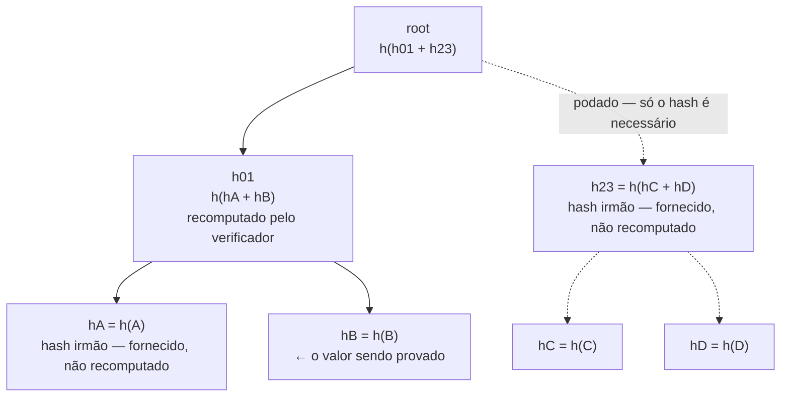
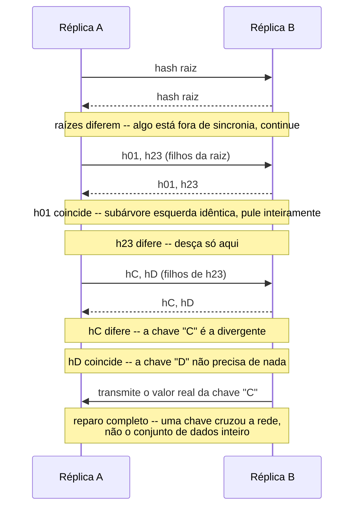

## Visão Geral

Uma **árvore de Merkle** (Ralph Merkle, 1979) é uma árvore binária onde toda folha guarda o hash de um pedaço de dado, e todo nó não-folha guarda o hash da concatenação dos hashes de seus filhos. O retorno é que um único hash na raiz -- 32 bytes, para SHA-256 -- identifica um conjunto de dados arbitrariamente grande, e a estrutura de árvore permite fazer duas coisas que um hash simples do conjunto de dados inteiro não consegue: provar que um registro específico pertence ao conjunto sem transmitir o resto dele, e encontrar exatamente o que mudou entre duas versões do conjunto de dados sem compará-las byte a byte. Essas duas propriedades são por que a mesma estrutura de dados aparece, quase inalterada, no armazenamento de objetos do Git, em todo bloco do Bitcoin e Ethereum, nos logs de Certificate Transparency, no reparo de réplicas do Cassandra e DynamoDB, nos checksums do ZFS e Btrfs, e no endereçamento de conteúdo do IPFS.

## Como a Árvore É Construída

A estrutura é desenhada de cima para baixo, mas é **computada de baixo para cima**: toda folha faz o hash do seu próprio valor primeiro, e o hash de um pai não pode existir até que os hashes de ambos os filhos existam.

```viz
type: tree
insert root h(h01+h23) | Desenhado de cima para baixo por questão de layout, mas continue observando -- a ordem real de construção é de baixo para cima, folhas primeiro.
insert h01 h(hA+hB) parent=root side=left
insert h23 h(hC+hD) parent=root side=right
insert hA h(A) parent=h01 side=left | Hash de folha: SHA-256 do valor bruto armazenado sob a chave "A".
insert hB h(B) parent=h01 side=right
insert hC h(C) parent=h23 side=left
insert hD h(D) parent=h23 side=right
mark hA | Construção real, passo 1: faça o hash do valor de cada folha independentemente -- são embaraçosamente paralelizáveis.
mark hB
mark hC
mark hD
mark h01 | Passo 2: faça o hash da concatenação de cada par de irmãos para obter seu pai.
mark h23
mark root | Passo 3: sobra um par -- fazer o hash de h01 e h23 juntos produz a raiz, uma impressão digital de todas as quatro folhas.
```

Para `n` folhas a árvore tem `⌈log2 n⌉` níveis, o hashing custa `O(n)` no total (cada nível faz metade dos hashes do nível abaixo), e a estrutura inteira pode ser construída com nada mais que uma função de hash e um array -- sem chaves, sem comparações, sem rotações. Se as folhas já estiverem ordenadas por chave, folhas adjacentes na árvore correspondem a intervalos de chave adjacentes, o que é o que torna eficaz a caminhada de anti-entropia abaixo: uma divergência se localiza em uma fatia contígua do espaço de chaves, não em um conjunto disperso de chaves individuais.

## Verificando Uma Folha Sem o Conjunto de Dados Inteiro: Provas de Merkle

Dado apenas o hash raiz (no qual você já confia) e um valor de folha reivindicado, você pode provar que aquela folha realmente faz parte da árvore fornecendo apenas o **hash irmão em cada nível no caminho até a raiz** -- `⌈log2 n⌉` hashes no total, não as outras `n - 1` folhas.



Para verificar que "B" está realmente na árvore, o verificador recebe a prova `[hA, h23]` mais o valor reivindicado de B. Ele recomputa `h01' = h(hA + h(B))`, depois `root' = h(h01' + h23)`, e compara `root'` ao hash raiz em que já confia. Dois hashes provaram associação em um conjunto de qualquer tamanho -- esse é exatamente o mecanismo por trás de um cliente SPV (leve) do Bitcoin confirmando que uma transação está em um bloco sem baixar o bloco, e por trás do Certificate Transparency provando que um certificado está em um log público sem baixar o log inteiro.

Aqui está essa mesma recomputação como um traço, sobre a mesma árvore de sete nós, para tornar concreta em vez de diagramática a afirmação de "o verificador só recomputa o caminho":

```viz
type: tree
insert root h(h01+h23) | O verificador já confia neste hash raiz exato -- ele chegou por um canal fora da árvore (um cabeçalho de bloco assinado, um nó completo que ele mesmo roda).
insert h01 h(hA+hB) parent=root side=left
insert h23 h(hC+hD) parent=root side=right
insert hA h(A) parent=h01 side=left
insert hB h(B) parent=h01 side=right
insert hC h(C) parent=h23 side=left
insert hD h(D) parent=h23 side=right
mark hB | Reivindicação do provador: "aqui está o valor de B."
mark hA | O provador fornece hA como o hash irmão -- o verificador nunca recebe "A" em si, só seu hash.
recolor h01 red | O verificador computa localmente h01' = h(hA + h(B)) e o compara com o que a estrutura da árvore diz que h01 deveria ser.
mark h23 | O provador fornece h23 como o segundo hash irmão -- de novo só o hash, nunca "C" ou "D".
recolor root red | O verificador computa root' = h(h01' + h23) e compara com a raiz em que já confiava. Elas coincidem: "B" está provado como pertencente à árvore, usando dois hashes fornecidos e zero acesso às outras três folhas.
```

Coloque um número nisso: para uma árvore com `n = 1.000.000` folhas, uma prova são `⌈log2 1.000.000⌉ = 20` hashes irmãos. A 32 bytes por hash SHA-256, isso é uma prova de 640 bytes independentemente de as outras 999.999 folhas serem gigabytes ou terabytes. Dobre `n` para dois milhões e a prova cresce exatamente mais um hash -- 21 -- que é todo o ponto do `O(log n)`: a prova mal percebe o conjunto de dados crescendo.

## Comparando Duas Réplicas: Reparo por Anti-Entropia

O segundo uso é a direção oposta: duas réplicas cada uma constrói uma árvore de Merkle sobre seu próprio espaço de chaves, trocam hashes começando da raiz, e recursam apenas nas subárvores cujos hashes discordam.

```viz
type: tree
insert root h(h01+h23) | Ambas as réplicas já têm uma árvore completa; a sessão de reparo começa trocando apenas o hash raiz.
insert h01 h(hA+hB) parent=root side=left
insert h23 h(hC+hD) parent=root side=right
insert hA h(A) parent=h01 side=left
insert hB h(B) parent=h01 side=right
insert hC h(C') parent=h23 side=left | A Réplica B armazena um valor diferente sob a chave "C" -- seu hash de folha discorda do da Réplica A.
insert hD h(D) parent=h23 side=right
recolor root red | Os hashes raiz discordam entre A e B -- algo sob esta árvore está fora de sincronia, mas ainda não sabemos qual parte.
mark h01 | Compare h01 em seguida: ambas as réplicas reportam o mesmo hash.
recolor h23 red | h23 discorda -- desça apenas aqui. A subárvore inteira A/B sob h01 nunca é sequer lida do disco.
mark hC | Compare hC: divergência encontrada.
mark hD | Compare hD: coincide -- a chave "D" não precisa de nada.
recolor hC red | Confirmado: a chave "C" é a folha divergente. Só seu valor cruza a rede.
```



O número de viagens de ida e volta é `O(log n)`, e o volume de dados de fato transferido é proporcional a quanto as réplicas *diferem*, não a quantos dados elas têm -- uma réplica com um bilhão de chaves que ficou um nó-outage atrás sincroniza de volta em segundos, não retransmitindo um bilhão de chaves. Esse é exatamente o mecanismo que Dynamo, Cassandra, e Riak usam para reparo por anti-entropia, e é a razão pela qual `nodetool repair` em um cluster Cassandra grande e majoritariamente sincronizado é rápido: quase toda subárvore coincide na primeira comparação e a caminhada poda imediatamente.

## Separação de Domínio: O Bug Que Quebra a Prova

A árvore só funciona se um hash de folha e um hash de nó interno nunca puderem ser confundidos entre si. Se puderem, um atacante pode pegar o hash de um nó interno `h(hA + hB)` e apresentá-lo como se fosse ele mesmo um valor de *folha* válido em algum outro lugar da árvore -- forjando uma árvore mais curta com um conjunto diferente de folhas mas o mesmo hash raiz. A RFC 6962 (Certificate Transparency) fecha isso com **separação de domínio**: todo hash de folha é computado como `h(0x00 || dado)` e todo hash interno como `h(0x01 || esquerda || direita)`, então os dois espaços de hash nunca colidem por construção.

O Bitcoin inicial errou nisso de uma forma relacionada e pagou por isso: seu cálculo de raiz de merkle, quando um bloco tinha um número ímpar de transações, duplicava o hash da última transação para preencher o nível até um número par. Isso abriu uma construção distinguível-mas-colidente onde duas listas de transações diferentes (uma com uma transação duplicada, uma sem) poderiam gerar o mesmo hash de raiz merkle -- rastreado como **CVE-2012-2459**, corrigido fazendo com que nós rejeitassem blocos contendo transações duplicadas em vez de mudar a regra de preenchimento. A lição generaliza: "só faça o hash dos filhos juntos" não é uma especificação completa de árvore de Merkle até que você tenha determinado exatamente como folhas são marcadas, como contagens ímpares são preenchidas, e como as duas são impedidas de nunca parecerem iguais.

## Onde Isso Aparece

| Sistema | O que é hasheado na árvore | Por que uma árvore de Merkle especificamente |
|---|---|---|
| Git | Blobs (conteúdo de arquivo) e trees (diretórios), recursivamente | Endereçamento de conteúdo: conteúdo idêntico entre commits/branches compartilha armazenamento; um hash de commit certifica a árvore inteira abaixo dele |
| Bitcoin / Ethereum | Transações em um bloco | O cabeçalho do bloco só precisa da raiz merkle; clientes SPV/leves provam que uma transação está em um bloco sem baixá-lo |
| Estado e armazenamento do Ethereum | Saldos de conta e armazenamento de contrato, esparsamente indexados | Merkle-Patricia trie: uma raiz por bloco compromete o estado mundial inteiro, com provas que não exigem um array denso de folhas |
| zk-Rollups (Arbitrum, zkSync, StarkNet, Polygon zkEVM) | Estado de conta em lote da Camada 2 | Uma nova raiz de Merkle mais uma prova sucinta permite que a Camada 1 verifique milhares de transações sem re-executar nenhuma delas |
| Certificate Transparency (RFC 6962) | Certificados TLS emitidos, em um log append-only | Auditores obtêm provas de inclusão O(log n) e provas de consistência de que o log nunca foi reescrito |
| Amazon Dynamo, Cassandra, Riak | Intervalos de chave (buckets) por réplica | O reparo por anti-entropia transfere dados proporcionais à *diferença* entre réplicas, não ao seu tamanho |
| IPFS | Blocos endereçados por conteúdo formando um DAG de Merkle | Deduplicação e endereçamento de conteúdo verificável e à prova de adulteração através de uma rede P2P |
| ZFS, Btrfs | Blocos de dados, até ponteiros de bloco indireto | Checksums de ponta a ponta que capturam apodrecimento de bit silencioso em qualquer lugar na árvore, não só nas folhas |
| Assinatura e firmware XMSS / LMS (RFC 8391, RFC 8554) | Chaves públicas de assinatura de uso único, uma por folha | Uma única chave pública raiz autentica muitas assinaturas de uso único, com segurança pós-quântica repousando apenas na resistência a pré-imagem de hash |

## Além de Árvores Binárias Balanceadas

Algumas variantes importam o suficiente para nomear. Um **DAG de Merkle** abandona a restrição de "árvore" -- nós podem ser compartilhados por múltiplos pais, que é exatamente como o Git deduplica um arquivo inalterado entre commits e como o IPFS deduplica blocos idênticos entre arquivos não relacionados. Uma **árvore de Merkle esparsa** fixa a forma da árvore para cobrir um espaço de chaves inteiro (ex.: todas as 2²⁵⁶ saídas SHA-256 possíveis) com subárvores vazias bem definidas, o que transforma "prove que esta chave está *ausente*" na mesma prova O(log n) que "prove que esta chave está presente" -- usado em revogação do Certificate Transparency e em várias árvores de estado de blockchain. E **árvores Verkle**, propostas para o trie de estado do Ethereum, substituem a árvore baseada em hash por compromissos vetoriais (compromissos polinomiais KZG), trocando uma suposição criptográfica mais pesada por provas que permanecem em tamanho quase constante independentemente da profundidade da árvore, em vez de crescer com `O(log n)` hashes irmãos -- a diferença importa na escala do Ethereum, onde provas de estado são propagadas constantemente.

## Merkle-Patricia Tries: O Trie de Estado do Ethereum

Uma árvore de Merkle simples, como construída acima, assume um array denso de folhas indexado `0..n-1`. O Ethereum precisa de algo diferente: um mapa chave-valor de endereços de conta esparsos de 160 bits (e slots de armazenamento de 256 bits) para saldos e dados de contrato, onde a maior parte do espaço de endereços está vazia, chaves são inseridas e deletadas constantemente, e todo estado intermediário ainda precisa de um único hash raiz que comprometa o mapa inteiro. O **Merkle-Patricia trie** responde a isso combinando o hashing de uma árvore de Merkle com o compartilhamento de prefixo de um **Patricia trie** (radix trie): chaves são percorridas nibble por nibble (4 bits de cada vez) através de três tipos de nó -- um nó **branch** com até 16 filhos (um por nibble hexadecimal) mais um slot de valor, um nó **extension** que comprime uma sequência de nibbles compartilhados por toda chave abaixo dele em uma única aresta, e um nó **leaf** guardando o sufixo restante da chave e o valor. Todo nó -- branch, extension, ou leaf -- ainda é hasheado, e um pai ainda embute os hashes de seus filhos, então a estrutura inteira mantém toda propriedade que uma árvore de Merkle tem: um hash raiz por snapshot de estado, e uma prova `O(log n)`-ish (na prática limitada pela profundidade do trie, aproximadamente o comprimento da chave em nibbles) de que uma dada conta tem um dado saldo em um dado bloco, **sem** exigir que a árvore seja um array denso, totalmente populado. Isso é exatamente por que um cliente leve do Ethereum consegue verificar "esta conta tinha este saldo no bloco N" a partir de um único cabeçalho de bloco mais uma pequena prova, o mesmo truque da prova de Merkle simples acima, generalizado para um espaço de chaves esparso.

## A Ideia Original, Voltando ao Início: Assinaturas Baseadas em Hash

A motivação real de Merkle em 1979 para a árvore de hash não era anti-entropia ou blockchains -- era **assinar mais de uma mensagem** com um **esquema de assinatura de uso único**. Uma assinatura de uso único de Lamport (OTS) é segura usando nada além de uma função de hash, mas cada par de chaves só pode assinar uma única mensagem com segurança; reutilizá-lo vaza informação suficiente para forjar uma segunda assinatura. A correção de Merkle: gerar muitos pares de chaves Lamport, colocar suas chaves públicas nas folhas de uma árvore de hash, e publicar apenas a *raiz* como a chave pública real. Assinar a mensagem número `i` significa assinar com a chave de folha `i` e anexar uma prova de Merkle de que a chave pública da folha `i` realmente está sob aquela raiz -- a mesma prova de inclusão da seção acima, reaproveitada para autenticar uma chave pública de uso único em vez de um registro de banco de dados.

Essa construção, largamente adormecida por décadas, agora está padronizada e em produção: **XMSS** (RFC 8391) e **LMS** (RFC 8554), juntas especificadas pelo NIST na SP 800-208 como **assinaturas baseadas em hash com estado**. Elas importam hoje porque o algoritmo de Shor quebra assinaturas RSA e de curva elíptica em um computador quântico suficientemente grande, mas a segurança de uma assinatura baseada em hash se reduz a nada mais que "a função de hash resiste a ataques de pré-imagem" -- uma suposição muito mais conservadora. A pegadinha é exatamente a parte "com estado": o assinante deve rastrear qual índice de folha já foi usado e nunca assinar duas vezes com o mesmo, porque fazer isso se reduz à quebra de reutilização de chave Lamport acima; sistemas de assinatura de hardware e firmware (o uso de LMS pela Cisco é um exemplo documentado) aceitam esse fardo operacional especificamente porque a suposição de segurança é muito mais simples que os esquemas mais novos baseados em reticulados (ML-DSA/Dilithium) que não exigem rastreamento de estado.

## Árvores de Merkle Encontram Provas de Conhecimento Zero: zk-Rollups

O reaproveitamento mais recente da mesma forma está nos **zk-rollups**, uma técnica de escalonamento onde uma rede de Camada 2 processa milhares de transações fora da cadeia, depois submete à cadeia de Camada 1 apenas uma nova raiz de Merkle do estado de conta resultante mais uma **prova zk-SNARK ou zk-STARK** de que a transição da raiz antiga para a nova raiz seguiu as regras da rede -- sem divulgar ou re-executar nenhuma transação individual. A árvore de Merkle ainda faz exatamente seus dois trabalhos originais: ela compromete o estado inteiro em um hash, e permite que qualquer conta individual prove seu próprio saldo via uma prova de inclusão contra a raiz publicada. O que é novo é que a *transição em si* -- "cada uma dessas milhares de atualizações de folha foi válida" -- é provada de forma sucinta, então um verificador de Camada 1 checa uma pequena prova em vez de re-rodar cada transação, ao mesmo tempo herdando a segurança da Camada 1 porque a nova raiz não significa nada a menos que a prova acompanhante seja verificada. É precisamente por isso que o custo de gás de Camada 1 de um zk-rollup mal cresce com o número de transações em lote: a árvore de Merkle mantém "o que mudou" compacto, e a prova mantém "a mudança foi legítima" barata de checar.

## Trade-offs

- **Provas e reparos O(log n) só são baratos se a árvore for reconstruída assim** -- uma árvore de Merkle ingênua recomputa todo hash no caminho de uma folha alterada até a raiz em cada escrita, o que é bom para o Git (conteúdo é imutável, então árvores são construídas uma vez e nunca mutadas) mas caro demais para um banco de dados vivo manter incrementalmente. É por isso que Cassandra e Dynamo constroem árvores de Merkle **sob demanda** para uma sessão de reparo em vez de manter uma continuamente atualizada, trocando um custo periódico de reconstrução por não pagar um rehash a cada escrita.
- **Granularidade de bucket/folha troca overhead de comparação por precisão de reparo** -- folhas menores em número e maiores em tamanho significam uma árvore mais rasa e menos viagens de ida e volta, mas uma divergência de um único byte dentro de um bucket grande força a ressincronização do bucket inteiro; mais folhas, menores, localizam uma divergência precisamente mas fazem crescer a árvore e o overhead por comparação. O padrão comum do Cassandra de aproximadamente um milhão de buckets por bilhão de chaves é uma resposta específica a essa troca, não uma constante arbitrária.
- **Uma prova de Merkle só é confiável quanto o hash raiz que o verificador já tem** -- a árvore prova consistência com uma raiz, não a correção da própria raiz; um cliente SPV que aceita um hash raiz de um par não confiável pode ser convencido de uma mentira tão convincentemente quanto da verdade. A raiz tem que chegar por um canal que seja independentemente confiável (um nó completo que você roda, uma cadeia de cabeçalhos de bloco com prova de trabalho, o tree head assinado de um log CT).
- **Pular separação de domínio é um bug silencioso e explorável, não uma escolha de estilo** -- como o CVE-2012-2459 mostra, tratar hashes de folha e hashes internos como o mesmo espaço de hash abre construções de forjamento/colisão que são baratas de construir e fáceis de perder em revisão, porque a árvore ainda "parece correta" até que alguém construa a entrada colidente.
- **Árvores Verkle trocam uma suposição familiar (uma função de hash é um oráculo aleatório) por uma menos familiar (compromissos polinomiais e emparelhamentos)** -- provas menores, de tamanho quase constante, são uma vitória real na escala do trie de estado de blockchain, mas a maquinaria criptográfica é mais pesada de implementar corretamente e de raciocinar sobre do que "chame SHA-256 duas vezes".
- **A compressão de prefixo do Merkle-Patricia trie compra eficiência de chave esparsa ao custo de quatro tipos de nó em vez de um** -- uma árvore de Merkle simples sobre um array denso precisa de um tipo de nó e uma regra de inserção; nós branch/extension/leaf tornam toda leitura, escrita, e prova uma pequena máquina de estados, que é exatamente a complexidade que árvores Verkle estão tentando trocar na próxima iteração do Ethereum.
- **Assinaturas baseadas em hash com estado (XMSS/LMS) compram a suposição de segurança pós-quântica mais conservadora disponível ao custo de disciplina de gerenciamento de chaves** -- reutilizar um índice de folha de uso único não é um bug de desempenho, é uma forja total de assinatura, que é por que esses esquemas se encaixam melhor em assinatura de hardware/firmware (um processo controlado, de baixo throughput, auditável) do que em um serviço de assinatura de propósito geral de alto volume e fácil de usar mal.
- **A raiz de Merkle de um zk-rollup só significa algo junto com sua prova** -- a árvore ainda comprime "qual é o estado" em um hash, mas *confiar* em uma nova raiz sem verificar o SNARK/STARK acompanhante é exatamente tão inseguro quanto confiar em um cabeçalho de bloco não assinado; a prova, não a árvore, é o que torna a transição confiável.

## Perguntas de Entrevista

- O reparo por anti-entropia de um armazenamento chave-valor transfere dados proporcionais à diferença entre duas réplicas. Explique por quê, em termos do que a comparação de hash raiz realmente pula.
- Por que uma prova de Merkle de inclusão não consegue também provar *exclusão* (que uma chave está ausente) sem uma estrutura de árvore diferente? Qual estrutura corrige isso, e quanto custa?
- Duas réplicas cada uma reconstrói sua árvore de Merkle independentemente depois de uma compactação que reordena chaves em disco. Sob que condição seus hashes raiz agora difeririam mesmo que os dados subjacentes sejam idênticos, e como você projetaria a árvore para evitar isso?
- O que especificamente dá errado se hashes de folha e hashes de nó interno são computados da mesma forma (sem separação de domínio), e como o prefixo `0x00`/`0x01` da RFC 6962 corrige isso?
- O trie de estado do Ethereum é um Merkle-Patricia trie em vez de uma árvore de Merkle simples sobre um array denso. Que problema a parte Patricia/radix resolve que uma árvore de Merkle binária simples não resolve, dado que endereços de conta são valores esparsos de 160 bits?
- XMSS e LMS são descritos como esquemas de assinatura "com estado". Qual exatamente é o estado, e qual falha catastrófica acontece se ele não for rastreado corretamente através de operações de assinatura?
- Um zk-rollup publica uma nova raiz de Merkle para seu estado de Camada 2 na Camada 1. Por que essa raiz sozinha é insuficiente para que a Camada 1 confie no novo estado, e o que especificamente restaura essa confiança?

## Referências

- [Ralph C. Merkle, "Protocols for Public Key Cryptosystems" (IEEE Symposium on Security and Privacy, 1980) — a construção original da árvore de hash](https://www.ralphmerkle.com/papers/Protocols.pdf)
- [Laurie, Langley, Kasper, RFC 6962 — "Certificate Transparency"](https://www.rfc-editor.org/rfc/rfc6962)
- [Crosby & Wallach, "Efficient Data Structures for Tamper-Evident Logging" (USENIX Security 2009)](https://www.usenix.org/legacy/event/sec09/tech/full_papers/crosby.pdf)
- [DeCandia et al., "Dynamo: Amazon's Highly Available Key-value Store" (SOSP 2007)](https://www.allthingsdistributed.com/files/amazon-dynamo-sosp2007.pdf)
- [Satoshi Nakamoto, "Bitcoin: A Peer-to-Peer Electronic Cash System" (2008)](https://bitcoin.org/bitcoin.pdf)
- [Pro Git — "Git Internals: Git Objects"](https://git-scm.com/book/en/v2/Git-Internals-Git-Objects)
- [IPFS Docs — "Merkle DAGs"](https://docs.ipfs.tech/concepts/merkle-dag/)
- [Martin Kleppmann, "Designing Data-Intensive Applications" (O'Reilly, 2017) — Ch. 5, anti-entropia e read repair](https://www.oreilly.com/library/view/designing-data-intensive-applications/9781491903063/)
- [Alex Petrov, "Database Internals" (O'Reilly, 2019) — Árvores de Merkle para sincronização de réplicas](https://www.oreilly.com/library/view/database-internals/9781492040330/)
- [Andreas M. Antonopoulos, "Mastering Bitcoin" (edição online gratuita) — Cap. 9, árvores de Merkle](https://github.com/bitcoinbook/bitcoinbook)
- [Gavin Wood, "Ethereum: A Secure Decentralised Generalised Transaction Ledger" (Yellow Paper) — Apêndice D, o Merkle-Patricia trie](https://ethereum.github.io/yellowpaper/paper.pdf)
- [Ethereum.org Docs — "Merkle Patricia Trie"](https://ethereum.org/en/developers/docs/data-structures-and-encoding/patricia-merkle-trie/)
- [Huelsing, Butin, Gazdag, Rijneveld, Mohaisen, RFC 8391 — "XMSS: eXtended Merkle Signature Scheme"](https://www.rfc-editor.org/rfc/rfc8391)
- [McGrew, Curcio, Fluhrer, RFC 8554 — "Leighton-Micali Hash-Based Signatures" (LMS)](https://www.rfc-editor.org/rfc/rfc8554)
- [Ethereum.org Docs — "ZK-Rollups"](https://ethereum.org/en/developers/docs/scaling/zk-rollups/)
- [Wikipedia — Merkle tree](https://en.wikipedia.org/wiki/Merkle_tree)
