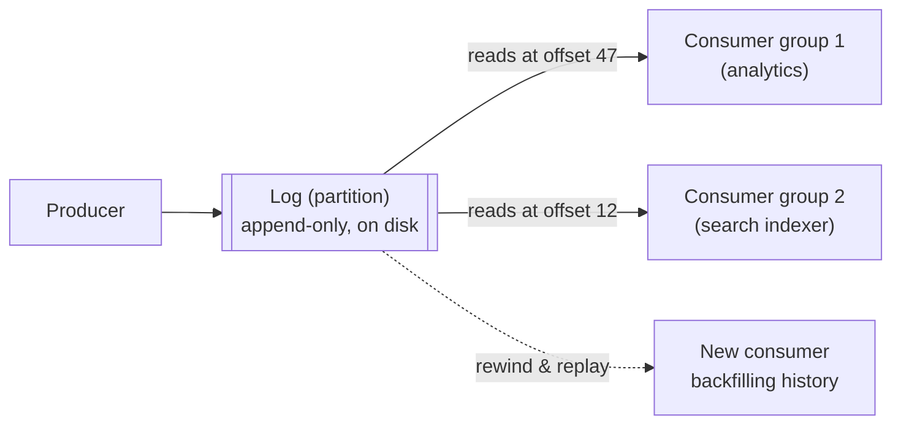

## Overview

A message broker sits between producers and consumers so neither has to know about the other directly, or be online at the same time. That's the whole shared idea. Where broker designs diverge sharply is what happens to a message *after* it's delivered — and that one design decision cascades into everything else: how many consumers can process a topic in parallel, whether ordering is preserved, and whether a consumer can ever go back and re-read history.

## Traditional Brokers: Delivery Is Destructive

JMS/AMQP-style brokers — RabbitMQ, ActiveMQ, Amazon SQS — inherited their mental model from transient network protocols: a message is meant to be delivered once, acknowledged, and then gone. The broker keeps a message only until a consumer confirms it processed it, at which point it's deleted. Adding a new consumer to a queue only gets it messages sent *after* it subscribed — anything already delivered and gone is unrecoverable.

Two delivery patterns matter here:

- **Load balancing** — each message goes to exactly *one* consumer in a competing group, so adding consumers parallelizes throughput. Useful when messages are expensive to process individually.
- **Fan-out** — each message is delivered to *every* subscriber independently, like several batch jobs reading the same input file without affecting each other.

Consumers can crash mid-processing, so brokers use **acknowledgments**: a consumer explicitly tells the broker "I'm done with this one" before it's removed. No ack within a timeout means redelivery — to the same consumer or another one in the group. That safety net has a real cost: combining load balancing with redelivery means messages can be processed *out of the order they were sent*, since a redelivered message can land after ones sent later. If a queue backs up faster than it can be drained, most brokers apply **backpressure** (blocking the producer) or unbounded on-disk buffering rather than silently dropping messages.

## The Poison Message Problem

A message that reliably crashes its consumer — say, malformed JSON missing a required field — creates a nasty loop under strict-ordering + auto-redelivery: the consumer crashes, the broker redelivers, the consumer crashes again, forever, blocking every message behind it. **Dead letter queues (DLQs)** solve this by moving a message to a separate queue after N failed attempts, unblocking the main queue and giving an operator (or automated tooling) a place to inspect, fix, or discard the offending message instead of it looping indefinitely.

## Log-Based Brokers: Delivery Is Just Reading

Kafka (and lookalikes like Redpanda, Amazon Kinesis) throws out the "delete on delivery" model entirely. A **log** is just an append-only sequence of records on disk — the same structure underlying write-ahead logs, replication logs, and consensus logs elsewhere in a database. A producer appends; a consumer reads sequentially and tracks its own position (its **offset**) in that log. Consuming a message is a *read*, not a delete — the log is untouched, so any number of independent consumers can each track their own offset through the same data at their own pace, and a consumer can rewind to an earlier offset and reprocess history at will.

To scale past what one disk can do, a topic is **sharded into partitions**. Ordering is only guaranteed *within* a partition — never across the whole topic — so anything that must stay strictly ordered (every event for one user, say) has to be routed to the same partition via a consistent **partition key**.

```
Topic B, Partition 1:  [1][2][3][4][5][6][7]   <- total order within this partition
Topic B, Partition 2:  [1][2]...[12]           <- no ordering relationship to Partition 1
```

Because a consumer just tracks "I've processed everything below offset N," the broker doesn't need per-message acknowledgment bookkeeping — it periodically checkpoints the offset instead, which is cheaper and enables batching. A consumer that crashes after processing but before checkpointing will simply reprocess a few messages on restart — an at-least-once guarantee, the same trade-off traditional brokers make with ack timeouts.



Each group tracks its own offset independently — nothing is deleted on read, so one slow or brand-new consumer never affects another.

## Consumer Groups: Both Patterns, One Mechanism

Kafka's **consumer group** unifies load balancing and fan-out: within one group, each partition is assigned to exactly one consumer (load balancing across the group); two separate groups subscribed to the same topic each get their own full copy of every message (fan-out across groups). The trade-off for this coarser-grained assignment is that parallelism within a group is capped at the number of partitions — you can't have more active consumers *in one group* than partitions, no matter how many machines you throw at it.

## Disk as a Large, Cheap Buffer

A disk-backed log can retain far more than a traditional broker's in-memory queue is built for — a modern large drive can buffer many hours to days of even sustained heavy traffic before old segments need deleting, and increasingly, log-based brokers tier older segments off to object storage (S3-compatible stores) entirely, the same pattern databases have adopted for cheap, elastic long-term storage. That buffer is what makes it safe for one slow consumer to fall behind without disrupting anyone else — it just risks missing data that ages out of the retention window, not taking down the broker.

## Trade-offs

- **Log-based brokers trade per-message parallelism for ordering and replay.** A partition is consumed single-threaded by design — splitting work finer than "one partition, one consumer" needs more partitions, not more threads on the same one. Traditional brokers hand out individual messages to any available consumer, which parallelizes trivially but gives up strict ordering the moment redelivery happens.
- **"Processing a message" means something different in each model.** In a traditional broker it's destructive — you get one shot, and a consumer added later has missed everything already delivered. In a log-based broker it's a read — nothing is consumed away, so replaying the last day's data to fix a bug in derived output is a normal operation, not a special recovery procedure.
- **Book vs. practice: Kafka no longer needs ZooKeeper at all.** Kafka historically depended on a separate ZooKeeper ensemble for its own cluster metadata and controller election. **KRaft mode** — where Kafka's controller nodes run their own Raft quorum internally — became production-ready in Kafka 3.3, and as of **Kafka 4.0 (released March 2025), ZooKeeper support was removed entirely** — KRaft is now the only way to run a cluster. Any new deployment or reference architecture assuming a ZooKeeper dependency alongside Kafka is describing a legacy setup.
- **The two architectures are converging, which makes "just use Kafka" a less obviously wrong default than it used to be.** Modern log-based brokers now support JMS/AMQP-style consumer-group semantics for per-message parallelism, and DLQs — once a queue-only feature — are now common in log-based and stream-processing tooling too. The clean two-category split is real at the extremes but blurrier in current products than a first-principles comparison suggests.

## Interview Questions

- Why does combining load balancing with message redelivery break strict ordering in a traditional broker, and why doesn't the same problem occur the same way in a log-based broker?
- A new consumer needs to reprocess the last 3 days of events to backfill a new feature. Is that a normal operation or an unusual one, and does the answer depend on which broker architecture is in use?
- What limits how many consumers can process one Kafka topic in parallel within a single consumer group, and how would you increase that limit?
- What problem do dead letter queues solve, and why does it matter more for strictly-ordered queues than for log-based streams?
- Kafka historically required ZooKeeper — what replaced that dependency, and roughly when did it become the only supported option?

## References

- Martin Kleppmann, [*Designing Data-Intensive Applications*, 2nd Edition](https://www.oreilly.com/library/view/designing-data-intensive-applications/9781098119058/) (O'Reilly) — Chapter 12, "Stream Processing," section "Transmitting Event Streams"
- [Apache Kafka Documentation — Introduction and Design](https://kafka.apache.org/documentation/#introduction)
- [Confluent — KRaft: Apache Kafka Without ZooKeeper](https://developer.confluent.io/learn/kraft/)
- [AWS — Choosing Between Amazon SQS and Amazon Kinesis](https://docs.aws.amazon.com/whitepapers/latest/streaming-data-solutions-on-aws/amazon-sqs.html)
