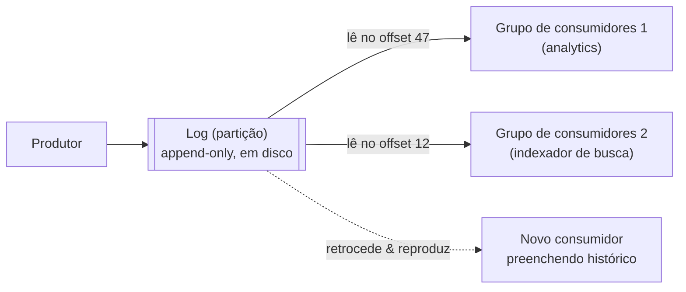

## Visão Geral

Um message broker fica entre produtores e consumidores para que nenhum dos dois precise conhecer o outro diretamente, nem estar online ao mesmo tempo. Essa é toda a ideia compartilhada. Onde os designs de broker divergem fortemente é no que acontece com uma mensagem *depois* que ela é entregue — e essa única decisão de design se propaga para tudo o mais: quantos consumidores podem processar um tópico em paralelo, se a ordenação é preservada, e se um consumidor consegue voltar e reler o histórico.

## Brokers Tradicionais: Entrega É Destrutiva

Brokers no estilo JMS/AMQP — RabbitMQ, ActiveMQ, Amazon SQS — herdaram seu modelo mental de protocolos de rede transientes: uma mensagem deve ser entregue uma vez, confirmada, e então desaparecer. O broker mantém uma mensagem apenas até que um consumidor confirme que a processou, momento em que ela é apagada. Adicionar um novo consumidor a uma fila só faz com que ele receba mensagens enviadas *depois* que se inscreveu — qualquer coisa já entregue e apagada é irrecuperável.

Dois padrões de entrega importam aqui:

- **Balanceamento de carga** — cada mensagem vai para exatamente *um* consumidor em um grupo competidor, então adicionar consumidores paraleliza o throughput. Útil quando mensagens são caras de processar individualmente.
- **Fan-out** — cada mensagem é entregue a *todos* os assinantes de forma independente, como vários jobs em lote lendo o mesmo arquivo de entrada sem se afetarem.

Consumidores podem travar no meio do processamento, então brokers usam **confirmações (acknowledgments)**: um consumidor diz explicitamente ao broker "terminei com essa" antes que ela seja removida. Nenhum ack dentro de um timeout significa reentrega — para o mesmo consumidor ou outro no grupo. Essa rede de segurança tem um custo real: combinar balanceamento de carga com reentrega significa que mensagens podem ser processadas *fora da ordem em que foram enviadas*, já que uma mensagem reentregue pode chegar depois de outras enviadas mais tarde. Se uma fila acumula mais rápido do que consegue ser drenada, a maioria dos brokers aplica **backpressure** (bloqueando o produtor) ou buffering em disco sem limite, em vez de descartar mensagens silenciosamente.

## O Problema da Mensagem Envenenada

Uma mensagem que consistentemente derruba seu consumidor — digamos, JSON malformado faltando um campo obrigatório — cria um loop desagradável sob ordenação estrita + reentrega automática: o consumidor trava, o broker reentrega, o consumidor trava de novo, para sempre, bloqueando toda mensagem atrás dela. **Dead letter queues (DLQs)** resolvem isso movendo uma mensagem para uma fila separada após N tentativas falhas, desbloqueando a fila principal e dando a um operador (ou ferramenta automatizada) um lugar para inspecionar, corrigir ou descartar a mensagem problemática em vez de ela ficar em loop indefinidamente.

## Brokers Baseados em Log: Entrega É Apenas Leitura

Kafka (e equivalentes como Redpanda, Amazon Kinesis) descarta completamente o modelo "apagar na entrega". Um **log** é apenas uma sequência de registros somente-para-anexar (append-only) em disco — a mesma estrutura que sustenta write-ahead logs, logs de replicação e logs de consenso em outros lugares de um banco de dados. Um produtor anexa; um consumidor lê sequencialmente e rastreia sua própria posição (seu **offset**) nesse log. Consumir uma mensagem é uma *leitura*, não uma exclusão — o log fica intocado, então qualquer número de consumidores independentes pode rastrear seu próprio offset através dos mesmos dados em seu próprio ritmo, e um consumidor pode retroceder para um offset anterior e reprocessar o histórico à vontade.

Para escalar além do que um único disco consegue fazer, um tópico é **shardado em partições**. A ordenação só é garantida *dentro* de uma partição — nunca através do tópico inteiro — então qualquer coisa que precise permanecer estritamente ordenada (todo evento de um usuário, digamos) tem que ser roteada para a mesma partição via uma **chave de partição** consistente.

```
Tópico B, Partição 1:  [1][2][3][4][5][6][7]   <- ordem total dentro desta partição
Tópico B, Partição 2:  [1][2]...[12]           <- sem relação de ordenação com a Partição 1
```

Como um consumidor apenas rastreia "já processei tudo abaixo do offset N," o broker não precisa de contabilidade de confirmação por mensagem — em vez disso, ele registra o offset periodicamente (checkpoint), o que é mais barato e permite batching. Um consumidor que trava depois de processar mas antes de fazer o checkpoint simplesmente reprocessará algumas mensagens ao reiniciar — uma garantia de pelo menos-uma-vez, o mesmo trade-off que brokers tradicionais fazem com timeouts de ack.



Cada grupo rastreia seu próprio offset de forma independente — nada é apagado na leitura, então um consumidor lento ou recém-chegado nunca afeta outro.

## Grupos de Consumidores: Ambos os Padrões, Um Mecanismo

O **consumer group** do Kafka unifica balanceamento de carga e fan-out: dentro de um grupo, cada partição é atribuída a exatamente um consumidor (balanceamento de carga dentro do grupo); dois grupos separados inscritos no mesmo tópico recebem cada um sua própria cópia completa de toda mensagem (fan-out entre grupos). O trade-off dessa atribuição mais grosseira é que o paralelismo dentro de um grupo é limitado ao número de partições — você não pode ter mais consumidores ativos *em um grupo* do que partições, não importa quantas máquinas você jogue no problema.

## Disco Como um Buffer Grande e Barato

Um log em disco pode reter muito mais do que a fila em memória de um broker tradicional foi construída para suportar — um disco grande moderno consegue armazenar em buffer muitas horas a dias mesmo de tráfego pesado sustentado antes que segmentos antigos precisem ser apagados, e cada vez mais, brokers baseados em log movem segmentos mais antigos para armazenamento de objetos (stores compatíveis com S3) completamente, o mesmo padrão que bancos de dados adotaram para armazenamento de longo prazo barato e elástico. Esse buffer é o que torna seguro um consumidor lento ficar para trás sem atrapalhar ninguém mais — ele apenas arrisca perder dados que envelheceram além da janela de retenção, não derrubar o broker.

## Trade-offs

- **Brokers baseados em log trocam paralelismo por mensagem por ordenação e replay.** Uma partição é consumida por design com uma única thread — dividir o trabalho mais granularmente do que "uma partição, um consumidor" exige mais partições, não mais threads na mesma. Brokers tradicionais distribuem mensagens individuais para qualquer consumidor disponível, o que paraleliza trivialmente mas abre mão da ordenação estrita no momento em que a reentrega acontece.
- **"Processar uma mensagem" significa algo diferente em cada modelo.** Em um broker tradicional é destrutivo — você tem uma chance, e um consumidor adicionado depois perdeu tudo que já foi entregue. Em um broker baseado em log é uma leitura — nada é apagado ao ser consumido, então reproduzir os dados do último dia para corrigir um bug em uma saída derivada é uma operação normal, não um procedimento de recuperação especial.
- **Livro vs. prática: o Kafka não precisa mais do ZooKeeper de forma alguma.** Historicamente, o Kafka dependia de um ensemble ZooKeeper separado para seus próprios metadados de cluster e eleição de controlador. O **modo KRaft** — onde os nós controladores do Kafka rodam seu próprio quórum Raft internamente — se tornou pronto para produção no Kafka 3.3, e a partir do **Kafka 4.0 (lançado em março de 2025), o suporte ao ZooKeeper foi removido completamente** — KRaft agora é a única forma de rodar um cluster. Qualquer nova implantação ou arquitetura de referência que assuma uma dependência do ZooKeeper junto com o Kafka está descrevendo uma configuração legada.
- **As duas arquiteturas estão convergindo, o que torna "apenas use Kafka" um padrão menos obviamente errado do que costumava ser.** Brokers modernos baseados em log agora suportam semântica de consumer-group no estilo JMS/AMQP para paralelismo por mensagem, e DLQs — antes um recurso exclusivo de filas — agora são comuns também em ferramentas baseadas em log e de processamento de streams. A divisão limpa em duas categorias é real nos extremos, mas mais nebulosa nos produtos atuais do que uma comparação de primeiros princípios sugere.

## Perguntas de Entrevista

- Por que combinar balanceamento de carga com reentrega de mensagens quebra a ordenação estrita em um broker tradicional, e por que o mesmo problema não ocorre da mesma forma em um broker baseado em log?
- Um novo consumidor precisa reprocessar os últimos 3 dias de eventos para preencher um novo recurso. Isso é uma operação normal ou incomum, e a resposta depende de qual arquitetura de broker está em uso?
- O que limita quantos consumidores podem processar um tópico Kafka em paralelo dentro de um único consumer group, e como você aumentaria esse limite?
- Que problema as dead letter queues resolvem, e por que isso importa mais para filas estritamente ordenadas do que para streams baseados em log?
- O Kafka historicamente exigia o ZooKeeper — o que substituiu essa dependência, e aproximadamente quando isso se tornou a única opção suportada?

## Referências

- Martin Kleppmann, [*Designing Data-Intensive Applications*, 2ª Edição](https://www.oreilly.com/library/view/designing-data-intensive-applications/9781098119058/) (O'Reilly) — Capítulo 12, "Stream Processing," seção "Transmitting Event Streams"
- [Documentação do Apache Kafka — Introduction and Design](https://kafka.apache.org/documentation/#introduction)
- [Confluent — KRaft: Apache Kafka Without ZooKeeper](https://developer.confluent.io/learn/kraft/)
- [AWS — Choosing Between Amazon SQS and Amazon Kinesis](https://docs.aws.amazon.com/whitepapers/latest/streaming-data-solutions-on-aws/amazon-sqs.html)
