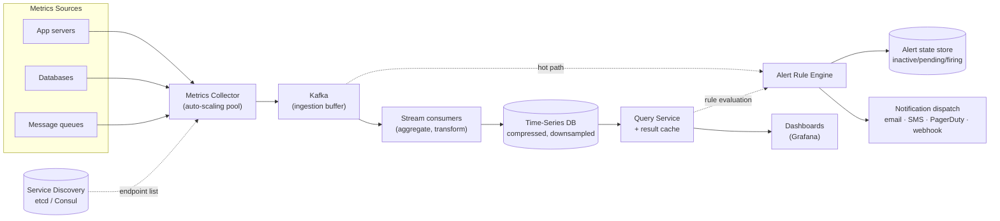

## Overview

A metrics monitoring platform — Prometheus, Datadog, an in-house equivalent — is really two systems wearing one uniform. The first is a bulk ingestion pipeline that has to swallow millions of numeric samples per second from every host, container, and service in the fleet, and store them cheaply enough that a year of history is affordable. The second is a latency-sensitive rule engine that has to notice, within seconds, that one of those series crossed a threshold, and page a human. Those two consumers want opposite things from the same data — the ingestion side wants batching, compression, and eventual consistency; the alerting side wants freshness and an availability guarantee that holds up *during* an outage — and most of the interesting design decisions come from refusing to let one starve the other.

## Requirements

The scope is **operational metrics**, not logs and not distributed traces. A metric is a numeric sample: CPU load, free memory, disk usage, requests per second, queue depth, running instance count in a pool. Logs (unstructured text, usually handled by an ELK-style stack) and traces (causal request paths across services) are different data shapes with different storage engines, and folding them in is how a scoping conversation goes wrong.

**Functional:**

- Collect metrics from every metrics source in the fleet — application servers, databases, message queues, the OS itself.
- Store them with enough retention to answer "was this normal last quarter?" — assume 1 year.
- Support flexible ad-hoc queries for dashboards: aggregate by label, over an arbitrary time range, at an arbitrary resolution ("average CPU across all web servers in `us-west` over the last 10 minutes").
- Evaluate alert rules continuously and deliver notifications over email, SMS, PagerDuty, or a webhook.

**Non-functional**, and this is where the numbers do the work. Take 1,000 server pools × 100 machines per pool × 100 metrics per machine ≈ **10 million distinct time series**. At a 10-second scrape interval that's a sustained **1 million writes per second**, every second, forever, with no diurnal relief — a monitoring system's write load is essentially a constant, because a fleet reports whether or not users are awake.

- **Write throughput dominates.** The write load is heavy and flat; the read load is spiky. Dashboards get opened in bursts (during an incident, everyone opens the same dashboard at once), and alert rules fire queries on a fixed evaluation interval. The storage engine has to be tuned for the constant write, not the occasional read.
- **Query flexibility.** Dashboard queries aren't known in advance. Users slice by arbitrary label combinations over arbitrary windows, so the store needs a real label index, not a precomputed rollup table per known query.
- **Alerting latency measured in seconds, not minutes.** A threshold breach that surfaces five minutes late is a postmortem entry, not an alert. The evaluation loop, the query it issues, and the notification dispatch all live inside that budget.
- **Availability of the alerting path specifically.** Missing an alert is the one unrecoverable failure in this system. Dropping a handful of CPU samples costs you a slightly jagged graph; dropping the page that says the database is down costs you the outage. These are not the same requirement and shouldn't get the same engineering.

## The Data Model, and Why It Determines Everything Else

A metric sample is identified by a **name** plus a set of **labels** (key/value tags), and carries a `<timestamp, value>` pair:

```
metric_name: cpu.load
labels:      {host: i631, env: prod, region: us-west}
timestamp:   1613707265
value:       0.29
```

The (name, label-set) tuple identifies a **time series**; everything written under it is an append-only stream of timestamped floats ordered by time. That shape is unusually constrained, and every downstream decision — storage engine, compression, query language, retention — falls out of it.

The labels are what make queries flexible: `avg(cpu.load{region="us-west", role="web"})` is a scan over every series whose label set matches, which means the store must index labels. It also means **label cardinality is the real capacity metric**. Each distinct label-value combination is a separate series with its own index entry and its own on-disk stream, so putting a user ID or a request ID in a label doesn't add a dimension — it multiplies your series count by the number of users and blows up the index. Keep labels low-cardinality; that's the single most common way a monitoring deployment falls over.

## Why Not a General-Purpose Database

A relational database can technically store `(metric, labels, timestamp, value)` rows, and at small scale that works fine. At 1M writes/sec it does not, for three separate reasons.

First, **write amplification from B-tree indexes**: every insert updates the primary index plus one index per label you want to query on, and a B-tree under a sustained random-ish write load spends its life splitting pages.

Second, **the queries are awkward**. Time-series analysis is dominated by windowed operations — moving averages, rate-of-change, percentiles over sliding windows — and expressing a rolling average in SQL means nested subqueries with window functions and manual bucket arithmetic. Purpose-built query languages exist precisely because this is painful: PromQL's `rate(http_requests_total[5m])` and Flux's `|> exponentialMovingAverage(size: -10s)` compress a page of SQL into a clause.

Third, and most important, **general-purpose stores can't exploit the structure of the data**. Which brings us to compression.

## Why Time-Series Data Compresses So Well

Consecutive samples in a time series are boring, and boring data compresses. Two properties do the heavy lifting:

**Timestamps are nearly evenly spaced.** A 10-second scrape produces timestamps `1610087371, 1610087381, 1610087391, …`. Storing absolute 64-bit timestamps wastes almost all of those bits; storing *deltas* (`10, 10, 10, …`) needs a handful, and storing *delta-of-deltas* — the change in the interval, usually zero — often needs a single bit. Facebook's Gorilla paper reports that roughly 96% of timestamps compress to one bit this way.

**Values change slowly.** CPU load doesn't teleport from 0.29 to 900; consecutive floats share most of their leading bits. XOR the current value with the previous one, and the result is mostly zeros — store only the meaningful middle window of bits and a tiny header describing where it sits. Gorilla measured average compression down to roughly 1.37 bytes per sample, from 16.

That's an order-of-magnitude difference, and it's *why* the storage choice matters so much. At 12 bytes per sample a fleet's metrics need a rack; at 1.4 bytes they fit in memory on a handful of machines, which in turn is what makes sub-second queries over recent data possible. Columnar, per-series-contiguous layout is what enables this — you cannot bolt it onto a row store. Pick a time-series database (Prometheus' TSDB, InfluxDB, or a managed equivalent) and inherit the encoding rather than building it.

The same paper found that **at least 85% of queries touch data from the last 26 hours**. That skew justifies a tiered layout: recent data in memory or on fast local disk, older data on cheaper storage, oldest data in cold object storage. Recency is the access pattern, so make it the storage hierarchy.

## Downsampling and Retention

Compression shrinks each sample; **downsampling** deletes samples you no longer need at full fidelity. Nobody debugging an incident from eight months ago cares about 10-second resolution — they care about the shape of the day. So the retention policy rolls data up in stages:

| Age | Resolution | Rationale |
|---|---|---|
| 0–7 days | Raw (as collected) | Active debugging; you need every spike. |
| 7–30 days | 1 minute | Recent trend analysis, week-over-week comparison. |
| 30 days–1 year | 1 hour | Capacity planning, seasonality, audit. |

Rolling six 10-second samples into one 30-second average cuts volume 6× and is irreversible — which is the point and also the risk. A one-second latency spike that triggered a cascade is invisible in hourly averages, so rollups should keep more than the mean: min, max, count, and sum per bucket preserve enough to see that *something* extreme happened even if you can't see exactly when.

Beyond a year, **cold storage** (object storage at a tenth the cost, with retrieval measured in seconds or minutes) is where compliance-retained data goes. Nothing queries it interactively, and that's an acceptable trade.

## High-Level Architecture



The dashed lines are the alerting path. Note that it can read from the queue directly as well as through the query service — more on why below.

**Metrics collector.** A horizontally scaled pool that gathers samples and forwards them. It is deliberately not the thing that writes to the database.

**Ingestion buffer.** A distributed log — Kafka or equivalent, see [Designing a Distributed Message Queue](distributed-message-queue-design) — sits between collection and storage. It absorbs bursts, decouples collector scaling from database scaling, and, critically, means a TSDB outage or a slow compaction doesn't lose data: samples pile up in the log and drain when the database recovers. Partition by metric name so a consumer owns a coherent slice, and sub-partition by label if a single metric is hot. Prioritized topics let critical metrics drain first when the pipeline is behind.

The counter-argument is real: running production Kafka is a substantial operational commitment, and systems like Gorilla skip the intermediate queue entirely in favor of a write path that stays available under partial network failure. If the TSDB itself is designed to never reject a write, the buffer buys less than it costs.

**Stream consumers.** Read from the log and write to the TSDB, optionally aggregating first. Aggregation can happen in three places, and the choice is a precision/cost trade: in the **collection agent** (cheapest, but only simple counters), in the **ingestion pipeline** via a stream processor (big write-volume reduction, but you discard raw data and inherit the late-arriving-event problem), or at **query time** (no data loss, but every dashboard refresh recomputes over the full dataset).

**Query service.** A thin layer over the TSDB with a result cache, decoupling dashboards and alerting from the specific database. Be honest that this is optional — most industrial TSDBs ship a query interface and most dashboards ship a plugin for it, and a wrapper you don't need is a component you now have to keep up.

**Rule engine.** Evaluates alert conditions on a fixed interval and manages alert lifecycle.

## Collection: Pull vs. Push

**Pull** (Prometheus): collectors scrape an HTTP `/metrics` endpoint on each target on a schedule. The collector needs the target list, which comes from service discovery (etcd, Consul, the Kubernetes API) rather than a static file, because instances come and go constantly. Scaling the collector pool means sharding targets across collectors — consistent hashing over instance names gives each target exactly one owner and avoids duplicate scrapes.

**Push** (StatsD, CloudWatch, Graphite): an agent on each host sends samples to a collector behind a load balancer, often pre-aggregating counters locally.

The trade-offs, concretely:

| | Pull | Push |
|---|---|---|
| **Debugging** | `curl` the `/metrics` endpoint from anywhere and see current values. | Silence is ambiguous — dead process, or network? |
| **Health check** | A failed scrape *is* a liveness signal; `up == 0` is a free alert rule. | Absence of data requires a separate staleness check. |
| **Short-lived jobs** | A 3-second batch job may never be scraped; needs a push gateway. | Natural fit — the job pushes before exiting. |
| **Network topology** | Every target must be reachable from the collector; painful across NAT, firewalls, multi-DC. | Agents dial out; works from anywhere. |
| **Authenticity** | Targets come from config/discovery, so data provenance is known. | Anything can push; needs allowlisting or auth. |
| **Ephemeral/serverless** | No stable endpoint to scrape. | The only option. |

There's no winner, and a large org typically runs both — pull for long-lived services where scrape-as-health-check is genuinely valuable, push for batch jobs, serverless functions, and anything behind a network boundary you don't control.

## The Alerting Path Is a Different System

Alert rules are declarative config, usually YAML, versioned in a repo:

```yaml
- name: instance_health
  rules:
    - alert: instance_down
      expr: up == 0
      for: 5m
      labels: {severity: page}
```

The `for: 5m` clause is the alert's most important field: it says the condition must hold continuously for five minutes before firing, which is what separates a real outage from a scrape blip. That implies **alert state**, not stateless evaluation — an alert moves through `inactive → pending → firing → resolved`, and the engine persists that state in a key-value store so a restart mid-`pending` doesn't reset the clock or re-page for something already firing.

The engine also has to **deduplicate and group**. When a rack loses power, one hundred `instance_down` alerts fire at once; paging a human one hundred times is worse than not paging at all. Group by shared labels, collapse into one notification, and rate-limit. Delivery goes through its own queue so a slow or down PagerDuty API doesn't block rule evaluation, and retries until acknowledged — the guarantee you want here is at-least-once, and a duplicate page is strictly better than a missing one.

Now the requirement that shapes the architecture: **alerting has to survive the outage it's alerting about.** If the alert engine queries through the same query service, cache, and TSDB cluster that dashboards use, then a TSDB overload — precisely what happens when an incident starts and every engineer opens a dashboard at once — takes out alerting at the exact moment it matters. The monitoring system becomes correlated with the failures it exists to report.

The mitigations all point the same direction: make the alerting path **simpler and more independent** than the query path.

- Give the rule engine its own replicas of the storage it reads, or let it consume the ingestion stream directly and hold a small in-memory window of recent samples. Alert rules almost always look at the last few minutes; they don't need the year of history the dashboard stack serves.
- Run the alert engine and notification dispatch in a separate failure domain — different hosts, different availability zone, ideally a different region from the fleet it watches.
- Reserve capacity for rule evaluation, or shed dashboard queries first under load. Given a choice between a slow dashboard and a missed page, the dashboard loses every time.
- Add a **dead man's switch**: a rule that fires continuously by construction and whose *absence* triggers an external page. It's the only mechanism that catches a monitoring system that has failed silently.

The corollary for build-vs-buy: alerting and visualization are the two components with the strongest case for buying. Grafana plus a mature alert manager integrate with every popular TSDB, handle grouping, silencing, and escalation policies, and represent years of edge cases you'd otherwise rediscover during your own incidents. The storage and ingestion pipeline is where custom engineering earns its keep; the notification fan-out is not.

## Trade-offs

- **A time-series database buys 10× compression and windowed query primitives, at the cost of another specialized system to operate** — a general-purpose store is one less thing to learn, but at a million writes per second the tuning effort to make it work exceeds the effort of adopting a purpose-built engine, and you still don't get delta-of-delta encoding.
- **Downsampling makes a year of retention affordable but permanently destroys resolution** — hourly averages hide the one-second spike that caused the cascade, so keep min/max/count alongside the mean and accept that some historical questions become unanswerable.
- **An ingestion queue prevents data loss during a storage outage but adds a production Kafka cluster to your on-call surface** — if the TSDB is already designed to accept writes under partial failure, the buffer may be protecting against a failure mode you've already solved, and it becomes one more thing that can page you.
- **Pull collection gives you liveness detection and provenance for free; push handles short-lived and network-isolated workloads** — most fleets need both, and the cost is running and reconciling two collection paths rather than one.
- **Aggregating in the ingestion pipeline slashes write volume but discards raw data and struggles with late arrivals; aggregating at query time keeps everything but pays the cost on every dashboard refresh** — the split usually falls along retention age: aggregate aggressively for old data, keep raw for the debugging window.
- **Isolating the alerting path from the query stack costs duplicated infrastructure and a second copy of recent data** — but shared infrastructure means the alerting system's availability is capped by the availability of the dashboards, and dashboards fail exactly when incidents start.

## Interview Questions

- The write load is flat at a million samples per second while the read load is bursty. Which specific storage-engine decisions does that asymmetry drive, and what would change if reads dominated instead?
- Why does putting a request ID in a metric label break the system, when adding a `region` label doesn't? Quantify what actually grows.
- Delta-of-delta timestamp encoding gets most timestamps down to a single bit. What property of the data makes that possible, and what kind of metric would defeat it?
- Your alert engine queries through the same query service the dashboards use. Describe the failure sequence when a region goes down, and what you'd change.
- A rule has `for: 5m`. What state must the engine persist to honor that correctly across its own restart, and what goes wrong if it's stateless?

## References

- [Alex Xu and Sahn Lam, "System Design Interview – An Insider's Guide, Volume 2" (ByteByteGo, 2022) — Chapter 5, "Metrics Monitoring and Alerting System"](https://bytebytego.com)
- [Prometheus Documentation — Data Model and Overview](https://prometheus.io/docs/concepts/data_model/)
- [Prometheus Blog — "Pull doesn't scale — or does it?"](https://prometheus.io/blog/2016/07/23/pull-does-not-scale-or-does-it/)
- [Pelkonen et al., "Gorilla: A Fast, Scalable, In-Memory Time Series Database" (VLDB 2015)](http://www.vldb.org/pvldb/vol8/p1816-teller.pdf)
