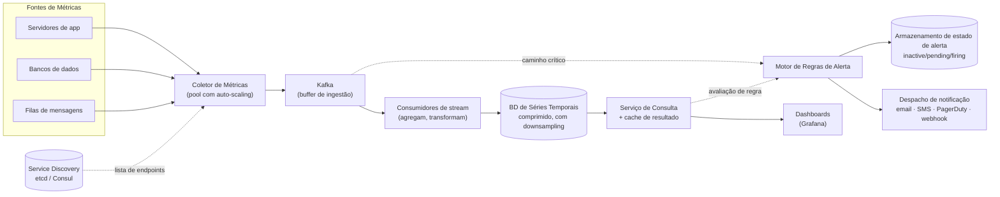

## Visão Geral

Uma plataforma de monitoramento de métricas — Prometheus, Datadog, um equivalente interno — é na verdade dois sistemas vestindo um único uniforme. O primeiro é um pipeline de ingestão em massa que precisa engolir milhões de amostras numéricas por segundo de todo host, container e serviço da frota, e armazená-las barato o suficiente para que um ano de histórico seja viável. O segundo é um motor de regras sensível à latência que precisa perceber, em segundos, que uma dessas séries cruzou um limiar, e avisar um humano. Esses dois consumidores querem coisas opostas dos mesmos dados — o lado da ingestão quer batching, compressão e consistência eventual; o lado dos alertas quer frescor e uma garantia de disponibilidade que se sustente *durante* uma interrupção — e a maioria das decisões de design interessantes vêm de se recusar a deixar um faminto às custas do outro.

## Requisitos

O escopo é **métricas operacionais**, não logs e não traces distribuídos. Uma métrica é uma amostra numérica: carga de CPU, memória livre, uso de disco, requisições por segundo, profundidade de fila, número de instâncias rodando em um pool. Logs (texto não estruturado, geralmente tratado por uma stack no estilo ELK) e traces (caminhos causais de requisições entre serviços) são formatos de dados diferentes com engines de armazenamento diferentes, e incluí-los é como uma conversa de escopo dá errado.

**Funcionais:**

- Coletar métricas de toda fonte de métricas na frota — servidores de aplicação, bancos de dados, filas de mensagens, o próprio SO.
- Armazená-las com retenção suficiente para responder "isso era normal no trimestre passado?" — assuma 1 ano.
- Suportar consultas ad-hoc flexíveis para dashboards: agregar por label, sobre um intervalo de tempo arbitrário, em uma resolução arbitrária ("CPU média entre todos os servidores web em `us-west` nos últimos 10 minutos").
- Avaliar regras de alerta continuamente e entregar notificações por e-mail, SMS, PagerDuty ou webhook.

**Não funcionais**, e é aqui que os números fazem o trabalho. Considere 1.000 pools de servidores × 100 máquinas por pool × 100 métricas por máquina ≈ **10 milhões de séries temporais distintas**. Com um intervalo de coleta de 10 segundos isso é um sustentado **1 milhão de escritas por segundo**, todo segundo, para sempre, sem alívio diurno — a carga de escrita de um sistema de monitoramento é essencialmente constante, porque uma frota reporta independentemente de os usuários estarem acordados ou não.

- **O throughput de escrita domina.** A carga de escrita é pesada e constante; a carga de leitura é intermitente. Dashboards são abertos em rajadas (durante um incidente, todo mundo abre o mesmo dashboard ao mesmo tempo), e regras de alerta disparam consultas em um intervalo de avaliação fixo. O motor de armazenamento tem que ser ajustado para a escrita constante, não a leitura ocasional.
- **Flexibilidade de consulta.** Consultas de dashboard não são conhecidas de antemão. Usuários fatiam por combinações arbitrárias de labels em janelas arbitrárias, então o armazenamento precisa de um índice de labels real, não uma tabela de rollup pré-computada por consulta conhecida.
- **Latência de alertas medida em segundos, não minutos.** Uma violação de limiar que surge cinco minutos atrasada é uma entrada de postmortem, não um alerta. O loop de avaliação, a consulta que ele emite e o despacho de notificação vivem inteiramente dentro desse orçamento.
- **Disponibilidade especificamente do caminho de alertas.** Perder um alerta é a única falha irrecuperável neste sistema. Descartar um punhado de amostras de CPU custa um gráfico um pouco irregular; descartar o aviso que diz que o banco de dados caiu custa a interrupção. Estes não são o mesmo requisito e não devem receber a mesma engenharia.

## O Modelo de Dados, e Por Que Ele Determina Tudo Mais

Uma amostra de métrica é identificada por um **nome** mais um conjunto de **labels** (tags chave/valor), e carrega um par `<timestamp, valor>`:

```
metric_name: cpu.load
labels:      {host: i631, env: prod, region: us-west}
timestamp:   1613707265
value:       0.29
```

A tupla (nome, conjunto-de-labels) identifica uma **série temporal**; tudo que é escrito sob ela é um stream append-only de floats com timestamp, ordenado por tempo. Esse formato é incomumente restrito, e cada decisão a jusante — motor de armazenamento, compressão, linguagem de consulta, retenção — decorre dele.

Os labels são o que torna as consultas flexíveis: `avg(cpu.load{region="us-west", role="web"})` é uma varredura sobre toda série cujo conjunto de labels corresponde, o que significa que o armazenamento precisa indexar labels. Também significa que **a cardinalidade de labels é a verdadeira métrica de capacidade**. Cada combinação distinta de valor de label é uma série separada com sua própria entrada de índice e seu próprio stream em disco, então colocar um ID de usuário ou um ID de requisição em um label não adiciona uma dimensão — multiplica sua contagem de séries pelo número de usuários e explode o índice. Mantenha labels com baixa cardinalidade; essa é a forma mais comum de uma implantação de monitoramento desmoronar.

## Por Que Não um Banco de Dados de Propósito Geral

Um banco de dados relacional pode tecnicamente armazenar linhas `(métrica, labels, timestamp, valor)`, e em pequena escala isso funciona bem. A 1M de escritas/seg, não funciona, por três razões separadas.

Primeiro, **amplificação de escrita por índices B-tree**: cada inserção atualiza o índice primário mais um índice por label que você quer consultar, e uma B-tree sob uma carga de escrita sustentada quase-aleatória passa a vida dividindo páginas.

Segundo, **as consultas são desajeitadas**. Análise de séries temporais é dominada por operações em janela — médias móveis, taxa de variação, percentis sobre janelas deslizantes — e expressar uma média móvel em SQL significa subconsultas aninhadas com funções de janela e aritmética manual de buckets. Linguagens de consulta de propósito específico existem precisamente porque isso é doloroso: `rate(http_requests_total[5m])` do PromQL e `|> exponentialMovingAverage(size: -10s)` do Flux comprimem uma página de SQL em uma cláusula.

Terceiro, e mais importante, **armazenamentos de propósito geral não conseguem explorar a estrutura dos dados**. O que nos leva à compressão.

## Por Que Dados de Séries Temporais Comprimem Tão Bem

Amostras consecutivas em uma série temporal são entediantes, e dados entediantes comprimem bem. Duas propriedades fazem o trabalho pesado:

**Timestamps são quase igualmente espaçados.** Uma coleta de 10 segundos produz timestamps `1610087371, 1610087381, 1610087391, …`. Armazenar timestamps absolutos de 64 bits desperdiça quase todos esses bits; armazenar *deltas* (`10, 10, 10, …`) precisa de poucos, e armazenar *delta-do-delta* — a mudança no intervalo, geralmente zero — muitas vezes precisa de apenas um bit. O paper Gorilla do Facebook relata que aproximadamente 96% dos timestamps comprimem para um bit dessa forma.

**Valores mudam lentamente.** A carga de CPU não teleporta de 0.29 para 900; floats consecutivos compartilham a maioria de seus bits mais significativos. Faça XOR do valor atual com o anterior, e o resultado é majoritariamente zeros — armazene apenas a janela significativa do meio de bits e um pequeno cabeçalho descrevendo onde ela está. O Gorilla mediu uma compressão média de aproximadamente 1,37 bytes por amostra, partindo de 16.

Essa é uma diferença de uma ordem de grandeza, e é *por isso* que a escolha de armazenamento importa tanto. A 12 bytes por amostra, as métricas de uma frota precisam de um rack; a 1,4 bytes elas cabem em memória em um punhado de máquinas, o que por sua vez é o que torna possíveis consultas sub-segundo sobre dados recentes. Layout colunar, contíguo por série, é o que permite isso — você não consegue parafusar isso em cima de um armazenamento em linhas. Escolha um banco de dados de séries temporais (TSDB do Prometheus, InfluxDB, ou um equivalente gerenciado) e herde a codificação em vez de construí-la.

O mesmo paper descobriu que **pelo menos 85% das consultas tocam dados das últimas 26 horas**. Essa distorção justifica um layout em camadas: dados recentes em memória ou em disco local rápido, dados mais antigos em armazenamento mais barato, dados mais antigos ainda em armazenamento de objetos frio. Recência é o padrão de acesso, então torne-a a hierarquia de armazenamento.

## Downsampling e Retenção

Compressão encolhe cada amostra; **downsampling** apaga amostras que você não precisa mais em fidelidade total. Ninguém depurando um incidente de oito meses atrás se importa com resolução de 10 segundos — eles se importam com o formato do dia. Então a política de retenção agrega dados em estágios:

| Idade | Resolução | Justificativa |
|---|---|---|
| 0–7 dias | Bruta (como coletada) | Depuração ativa; você precisa de cada pico. |
| 7–30 dias | 1 minuto | Análise de tendência recente, comparação semana a semana. |
| 30 dias–1 ano | 1 hora | Planejamento de capacidade, sazonalidade, auditoria. |

Agregar seis amostras de 10 segundos em uma média de 30 segundos corta o volume em 6× e é irreversível — o que é o ponto e também o risco. Um pico de latência de um segundo que disparou uma cascata é invisível em médias horárias, então rollups devem manter mais que a média: mínimo, máximo, contagem e soma por bucket preservam o suficiente para ver que *algo* extremo aconteceu, mesmo que você não consiga ver exatamente quando.

Além de um ano, **armazenamento frio** (armazenamento de objetos a um décimo do custo, com recuperação medida em segundos ou minutos) é para onde vão os dados retidos por conformidade. Nada consulta isso interativamente, e essa é uma troca aceitável.

## Arquitetura de Alto Nível



As linhas tracejadas são o caminho de alertas. Note que ele pode ler da fila diretamente assim como através do serviço de consulta — mais sobre o porquê abaixo.

**Coletor de métricas.** Um pool escalado horizontalmente que reúne amostras e as encaminha. É deliberadamente não a coisa que escreve no banco de dados.

**Buffer de ingestão.** Um log distribuído — Kafka ou equivalente, ver [Designing a Distributed Message Queue](distributed-message-queue-design) — fica entre a coleta e o armazenamento. Ele absorve rajadas, desacopla o escalonamento do coletor do escalonamento do banco de dados e, criticamente, significa que uma interrupção do TSDB ou uma compactação lenta não perde dados: as amostras se acumulam no log e drenam quando o banco de dados se recupera. Particione por nome de métrica para que um consumidor tenha uma fatia coerente, e sub-particione por label se uma única métrica estiver muito quente. Tópicos priorizados permitem que métricas críticas drenem primeiro quando o pipeline está atrasado.

O contra-argumento é real: rodar Kafka em produção é um compromisso operacional substancial, e sistemas como Gorilla pulam completamente a fila intermediária em favor de um caminho de escrita que permanece disponível sob falha parcial de rede. Se o próprio TSDB é projetado para nunca rejeitar uma escrita, o buffer compra menos do que custa.

**Consumidores de stream.** Leem do log e escrevem no TSDB, opcionalmente agregando primeiro. A agregação pode acontecer em três lugares, e a escolha é um trade-off precisão/custo: no **agente de coleta** (mais barato, mas apenas contadores simples), no **pipeline de ingestão** via um processador de stream (grande redução de volume de escrita, mas você descarta os dados brutos e herda o problema de eventos que chegam atrasados), ou no **momento da consulta** (sem perda de dados, mas toda atualização de dashboard recomputa sobre o conjunto de dados completo).

**Serviço de consulta.** Uma camada fina sobre o TSDB com um cache de resultados, desacoplando dashboards e alertas do banco de dados específico. Seja honesto que isso é opcional — a maioria dos TSDBs industriais vem com uma interface de consulta e a maioria dos dashboards vem com um plugin para ela, e um wrapper que você não precisa é um componente que agora você tem que manter.

**Motor de regras.** Avalia condições de alerta em um intervalo fixo e gerencia o ciclo de vida do alerta.

## Coleta: Pull vs. Push

**Pull** (Prometheus): coletores fazem scrape de um endpoint HTTP `/metrics` em cada alvo em um cronograma. O coletor precisa da lista de alvos, que vem de service discovery (etcd, Consul, a API do Kubernetes) em vez de um arquivo estático, porque instâncias vêm e vão constantemente. Escalar o pool de coletores significa fragmentar alvos entre coletores — hash consistente sobre nomes de instância dá a cada alvo exatamente um dono e evita scrapes duplicados.

**Push** (StatsD, CloudWatch, Graphite): um agente em cada host envia amostras para um coletor atrás de um load balancer, geralmente pré-agregando contadores localmente.

Os trade-offs, concretamente:

| | Pull | Push |
|---|---|---|
| **Depuração** | `curl` no endpoint `/metrics` de qualquer lugar e veja valores atuais. | Silêncio é ambíguo — processo morto, ou rede? |
| **Health check** | Um scrape falho *é* um sinal de vivacidade; `up == 0` é uma regra de alerta grátis. | Ausência de dados requer uma verificação de staleness separada. |
| **Jobs de vida curta** | Um job em lote de 3 segundos pode nunca ser coletado; precisa de um push gateway. | Encaixe natural — o job faz push antes de sair. |
| **Topologia de rede** | Todo alvo deve ser alcançável a partir do coletor; doloroso através de NAT, firewalls, multi-DC. | Agentes discam para fora; funciona de qualquer lugar. |
| **Autenticidade** | Alvos vêm de config/discovery, então a proveniência dos dados é conhecida. | Qualquer coisa pode fazer push; precisa de allowlisting ou auth. |
| **Efêmero/serverless** | Sem endpoint estável para coletar. | A única opção. |

Não há vencedor, e uma grande organização tipicamente roda ambos — pull para serviços de longa duração onde scrape-como-health-check é genuinamente valioso, push para jobs em lote, funções serverless, e qualquer coisa atrás de uma fronteira de rede que você não controla.

## O Caminho de Alertas É um Sistema Diferente

Regras de alerta são configuração declarativa, geralmente YAML, versionada em um repositório:

```yaml
- name: instance_health
  rules:
    - alert: instance_down
      expr: up == 0
      for: 5m
      labels: {severity: page}
```

A cláusula `for: 5m` é o campo mais importante do alerta: diz que a condição deve se manter continuamente por cinco minutos antes de disparar, o que é o que separa uma interrupção real de uma falha passageira no scrape. Isso implica **estado de alerta**, não avaliação sem estado — um alerta se move através de `inactive → pending → firing → resolved`, e o motor persiste esse estado em um armazenamento chave-valor para que um reinício no meio do `pending` não zere o relógio nem reavise sobre algo que já está disparando.

O motor também precisa **deduplicar e agrupar**. Quando um rack perde energia, cem alertas `instance_down` disparam de uma vez; avisar um humano cem vezes é pior do que não avisar. Agrupe por labels compartilhados, colapse em uma única notificação, e limite a taxa. A entrega passa por sua própria fila para que uma API PagerDuty lenta ou fora do ar não bloqueie a avaliação de regras, e tenta de novo até ser confirmada — a garantia que você quer aqui é pelo menos-uma-vez, e um aviso duplicado é estritamente melhor do que um faltando.

Agora o requisito que molda a arquitetura: **alertar tem que sobreviver à interrupção sobre a qual está alertando.** Se o motor de alertas consulta através do mesmo serviço de consulta, cache e cluster TSDB que os dashboards usam, então uma sobrecarga do TSDB — precisamente o que acontece quando um incidente começa e todo engenheiro abre um dashboard ao mesmo tempo — derruba os alertas exatamente no momento em que eles importam. O sistema de monitoramento se torna correlacionado com as falhas que existe para reportar.

As mitigações apontam todas na mesma direção: tornar o caminho de alertas **mais simples e mais independente** do que o caminho de consulta.

- Dê ao motor de regras suas próprias réplicas do armazenamento que ele lê, ou deixe-o consumir o stream de ingestão diretamente e manter uma pequena janela em memória de amostras recentes. Regras de alerta quase sempre olham para os últimos minutos; elas não precisam do ano de histórico que a stack de dashboard serve.
- Rode o motor de alertas e o despacho de notificação em um domínio de falha separado — hosts diferentes, zona de disponibilidade diferente, idealmente uma região diferente da frota que ele observa.
- Reserve capacidade para avaliação de regras, ou descarte consultas de dashboard primeiro sob carga. Dada a escolha entre um dashboard lento e um aviso perdido, o dashboard perde sempre.
- Adicione um **dead man's switch**: uma regra que dispara continuamente por construção e cuja *ausência* dispara um aviso externo. É o único mecanismo que pega um sistema de monitoramento que falhou silenciosamente.

O corolário para construir versus comprar: alertas e visualização são os dois componentes com o argumento mais forte para comprar. Grafana mais um gerenciador de alertas maduro se integram com todo TSDB popular, lidam com agrupamento, silenciamento e políticas de escalonamento, e representam anos de casos extremos que você de outra forma redescobriria durante seus próprios incidentes. O pipeline de armazenamento e ingestão é onde engenharia customizada compensa; o fan-out de notificação não é.

## Trade-offs

- **Um banco de dados de séries temporais compra 10× de compressão e primitivas de consulta em janela, ao custo de outro sistema especializado para operar** — um armazenamento de propósito geral é uma coisa a menos para aprender, mas a um milhão de escritas por segundo o esforço de ajuste para fazê-lo funcionar excede o esforço de adotar um motor de propósito específico, e você ainda não obtém codificação delta-do-delta.
- **Downsampling torna um ano de retenção viável mas destrói permanentemente a resolução** — médias horárias escondem o pico de um segundo que causou a cascata, então mantenha mínimo/máximo/contagem junto com a média e aceite que algumas perguntas históricas se tornam sem resposta.
- **Uma fila de ingestão previne perda de dados durante uma interrupção de armazenamento mas adiciona um cluster Kafka de produção à sua superfície de plantão** — se o TSDB já é projetado para aceitar escritas sob falha parcial, o buffer pode estar protegendo contra um modo de falha que você já resolveu, e se torna mais uma coisa que pode te chamar de plantão.
- **Coleta por pull te dá detecção de vivacidade e proveniência de graça; push lida com cargas de trabalho de vida curta e isoladas de rede** — a maioria das frotas precisa de ambos, e o custo é rodar e reconciliar dois caminhos de coleta em vez de um.
- **Agregar no pipeline de ingestão reduz drasticamente o volume de escrita mas descarta dados brutos e luta com chegadas atrasadas; agregar no momento da consulta mantém tudo mas paga o custo em cada atualização de dashboard** — a divisão geralmente cai ao longo da idade de retenção: agregue agressivamente para dados antigos, mantenha bruto para a janela de depuração.
- **Isolar o caminho de alertas da stack de consulta custa infraestrutura duplicada e uma segunda cópia de dados recentes** — mas infraestrutura compartilhada significa que a disponibilidade do sistema de alertas é limitada pela disponibilidade dos dashboards, e dashboards falham exatamente quando incidentes começam.

## Perguntas de Entrevista

- A carga de escrita é constante em um milhão de amostras por segundo enquanto a carga de leitura é intermitente. Quais decisões específicas do motor de armazenamento essa assimetria impulsiona, e o que mudaria se as leituras dominassem em vez disso?
- Por que colocar um ID de requisição em um label de métrica quebra o sistema, quando adicionar um label `region` não quebra? Quantifique o que realmente cresce.
- Codificação delta-do-delta de timestamp reduz a maioria dos timestamps a um único bit. Que propriedade dos dados torna isso possível, e que tipo de métrica derrotaria isso?
- Seu motor de alertas consulta através do mesmo serviço de consulta que os dashboards usam. Descreva a sequência de falha quando uma região cai, e o que você mudaria.
- Uma regra tem `for: 5m`. Que estado o motor deve persistir para honrar isso corretamente através de seu próprio reinício, e o que dá errado se ele for sem estado?

## Referências

- [Alex Xu e Sahn Lam, "System Design Interview – An Insider's Guide, Volume 2" (ByteByteGo, 2022) — Capítulo 5, "Metrics Monitoring and Alerting System"](https://bytebytego.com)
- [Documentação do Prometheus — Data Model and Overview](https://prometheus.io/docs/concepts/data_model/)
- [Blog do Prometheus — "Pull doesn't scale — or does it?"](https://prometheus.io/blog/2016/07/23/pull-does-not-scale-or-does-it/)
- [Pelkonen et al., "Gorilla: A Fast, Scalable, In-Memory Time Series Database" (VLDB 2015)](http://www.vldb.org/pvldb/vol8/p1816-teller.pdf)
