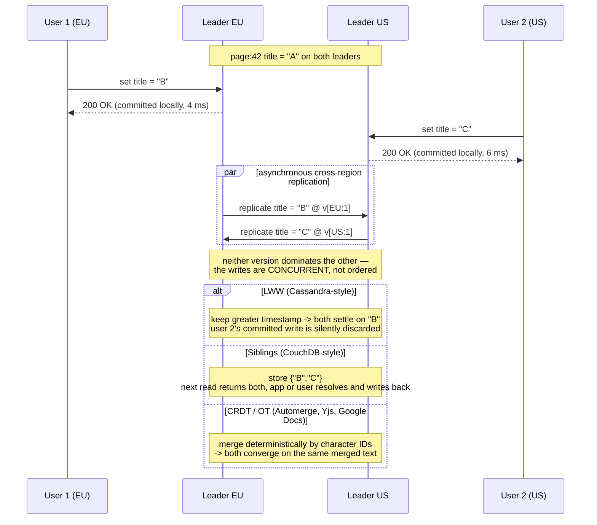

## Overview

[Single-leader replication](single-leader-replication) makes write conflicts impossible by construction: every write for a given record passes through one node, so that node alone decides the order in which writes are applied and every follower replays the same sequence. That constraint is a genuine feature — right up until you need users in Frankfurt to write without a round trip to Virginia, or a phone that keeps accepting edits in a tunnel with no signal. **Multi-leader** and **leaderless** replication both drop the single-writer constraint, and both pay for it with the same bill: two nodes can now accept writes to the same key without knowing about each other, so conflicts stop being impossible and start being an everyday case you must design for.

## Multi-Leader Replication

In a multi-leader configuration (also called *active/active* or *bidirectional* replication), several nodes accept writes, and each one forwards its changes to all the others — every leader is simultaneously a follower of the other leaders. Making that inter-leader replication *synchronous* would defeat the point: if a write to leader A must be confirmed by leader B before it commits, then a broken link between A and B blocks writes, and you have reinvented single-leader replication with extra hops. The interesting configuration is asynchronous, where each leader commits locally and propagates in the background.

### Geographically distributed operation

The canonical use case is a database with replicas in several regions. With a single leader, the leader lives in exactly one region and every write from every other region crosses the internet to reach it — often 80-200 ms of unavoidable latency, which can defeat the entire purpose of having multiple regions. With a leader per region, each write commits against the local leader at single-digit-millisecond latency and replicates to the other regions afterward. Three things improve:

- **Write latency** — the inter-region delay is moved off the user's critical path and into a background process.
- **Regional outage tolerance** — a region whose peers are unreachable keeps serving reads *and writes* from its own leader, and catches up when the link returns. Single-leader replication in the same situation requires a failover with all of its attendant risk.
- **Network fault tolerance** — inter-region links are less reliable than intra-region ones, and a single-leader setup is maximally sensitive to them because every remote write blocks on that link.

What gets worse is consistency, and it gets worse in a way you cannot patch over. You cannot guarantee that a balance stays non-negative or that a username is unique, because two leaders can each process a write that is individually valid and jointly illegal. That is a fundamental limitation, not an implementation gap: enforcing a global constraint requires a single point that sees all the relevant writes. If your domain has such constraints, keep those writes single-leader.

Multi-leader is also frequently a retrofitted feature (MySQL, Oracle, SQL Server, EDB Postgres Distributed, pglogical, Redis Enterprise), which means autoincrementing keys, triggers, and integrity constraints interact with it badly. Beyond two leaders you also have to choose a **topology** — all-to-all, circular, or star. Circular and star topologies use fewer links but let one failed node cut the replication path between the survivors; all-to-all is more fault tolerant but lets messages overtake each other, so a replica can receive an `UPDATE` before the `INSERT` it depends on. That is a causality problem, and attaching wall-clock timestamps does not fix it — see version vectors below.

### Sync engines and local-first software

Take geo-replication to its extreme and each "region" becomes a single device. A calendar app on your phone must accept new meetings whether or not you have signal; each device therefore holds a local replica that acts as a leader, and an asynchronous sync process reconciles them whenever connectivity allows. Replication lag here is not measured in milliseconds but in hours or days.

The same architecture underlies real-time collaboration. In Google Docs, Figma, or Linear, each open browser tab is a replica that applies your edits locally and immediately — rendering within one frame rather than after a server round trip — and asynchronously ships them to collaborators. Even an app with no offline mode is architecturally multi-leader the moment users can edit without waiting for a server response.

The library that handles this is a **sync engine**. Its payoff is not only offline support: it collapses the usual "every read is a fallible network call that needs its own error state" model into local reads and writes that essentially never fail, which is a dramatically simpler programming model for a frontend. An app built this way is **offline-first**; if it also keeps working when the vendor shuts down its servers — typically via an open sync protocol with multiple possible providers — it is **local-first**. Git is the well-known example: you commit locally and sync through GitHub, GitLab, or nothing at all. The main limitation is that sync engines assume the working set can be downloaded and kept on the client, which is fine for one user's documents and nonsensical for an entire ecommerce catalog.

## The Conflict Problem

Two users open the same wiki page, currently titled `A`. User 1, on the European leader, renames it to `B`. User 2, on the US leader, renames it to `C`. Each write succeeds locally. When the leaders exchange changes, they discover they disagree.

Note what "concurrent" means here, because it is not what it sounds like. Two writes are concurrent when *neither was aware of the other*, regardless of physical time. Offline edits made three days apart are concurrent; two writes 50 ms apart where the second read the first's result are not.

### Conflict avoidance

The cheapest fix is to not have conflicts. If all writes for a given record are routed to the same leader, a multi-leader cluster behaves as single-leader per record — give every user a "home" region and route their requests there. This works well for data only its owner edits, and it breaks the moment you need to change a record's home leader (region outage, user relocation), because a write in flight during the handover produces exactly the conflict you were avoiding. It also does not apply at all to a sync engine, where offline devices are leaders by definition.

### Last write wins

Tag every write with a timestamp and keep the greatest. It is trivial to implement and it is what Cassandra and ScyllaDB do. The name is a lie: when two writes are concurrent, "which one is later" is *undefined*, so LWW's real semantics are "pick a random winner among concurrent writes and silently discard the rest." That is fine if you only ever insert immutable records under unique keys. If you update records, LWW is a data-loss mechanism with a reassuring name. It is also acutely sensitive to clock skew when the timestamp is a wall clock — a node whose clock runs fast can make every subsequent write from its peers get dropped as "older."

### Application-level merge (siblings)

Rather than picking a winner, the database can keep both concurrent values as **siblings** and return them all on the next read; the application (or the user) merges them and writes the result back. CouchDB works this way. The costs are real: a field that was a string becomes a set of strings that usually has one element, every caller has to handle that, and naive merges misbehave. Amazon's shopping cart famously merged siblings by set union, so an item you deleted on your laptop reappeared after syncing with your phone — the merge preserved additions but had no way to represent a deletion. Worse, two nodes resolving the same conflict independently can produce two *new* conflicting resolutions (`B/C` versus `C/B`).

### CRDTs and operational transformation

For many data types you can merge automatically and correctly. Two algorithm families do this: **CRDTs** (conflict-free replicated data types) and **OT** (operational transformation). Both guarantee that all replicas which have seen the same set of writes reach the same state regardless of arrival order — eventual consistency plus a convergence guarantee, called **strong eventual consistency**.

The distinction is in how positions are addressed. OT records operations by index (`insert "n" at 0`) and *transforms* incoming indices to account for concurrent operations already applied — inserting `!` at index 3 becomes index 4 once a character was inserted before it. Most CRDTs instead give every element a unique immutable ID and express an insertion relative to the ID of its predecessor, so no transformation is needed and replicas converge by construction. Concurrent insertions at the same position are ordered deterministically by ID.

Purpose-built types exist for the common cases: text that preserves every insertion and deletion; sets and lists that track *deletions as facts*, so the shopping-cart anomaly cannot occur; counters that sum increments per replica rather than overwriting; and maps that apply a per-value strategy key by key. OT dominates real-time text editing (Google Docs, ShareDB); CRDTs are used in Riak, Redis Enterprise, Azure Cosmos DB, and JSON sync engines like Automerge and Yjs. Neither is magic — if your invariant is "this list holds at most five items" and three users concurrently add a sixth, some addition must be dropped. Automatic merge preserves intent, it does not enforce constraints.

## Leaderless Replication

Leaderless replication abandons the leader entirely: any replica accepts writes directly from clients, and no node imposes an ordering. The client (or a coordinator node acting on its behalf, which is *not* a leader — it enforces no order) sends each write to several replicas in parallel and considers it successful once enough of them acknowledge. Reads likewise query several replicas in parallel and reconcile whatever comes back, using version metadata to pick the newest value. This is the **Dynamo-style** design, implemented by Riak, Cassandra, and ScyllaDB. (Confusingly, Amazon's *DynamoDB* is not one of them — it is single-leader on Multi-Paxos.)

When a node is down there is no failover, because there is nothing to fail over from. The write simply lands on the reachable replicas and misses the down one; if `w` of `n` replicas acknowledged, it succeeded. Since the recovered node now holds stale data, reads query `r` replicas and take the newest version, and three background mechanisms drag the laggard forward: **read repair** (a client that sees a stale response writes the newer value back), **hinted handoff** (a substitute replica holds writes on behalf of the down node and replays them on its return), and **anti-entropy** (a background scan that diffs replicas and copies what is missing). The quorum arithmetic `w + r > n`, sloppy quorums, hinted handoff, and Merkle-tree anti-entropy are covered in depth — with the failure modes that make `w + r > n` weaker than it looks — in [Designing a Distributed Key-Value Store](key-value-store-design).

### Single-leader versus leaderless, in plain terms

A single-leader system can offer guarantees a leaderless one cannot — serializable transactions, uniqueness constraints, a real ordering of writes. Reading from the leader is the only way to be sure a read is current, and that route has three structural weaknesses: read throughput is capped by one machine, a leader failure means detection plus failover before service resumes, and *any* slowness on the leader is immediately every user's slowness.

A leaderless system is more resilient precisely because it does not distinguish the normal case from the failure case. Requests already fan out to multiple replicas, so a slow or dead replica barely registers — the client uses whichever `r` responses arrive first, a technique called **request hedging** that also cuts tail latency in healthy conditions. There is no "is this bad enough to fail over?" judgment call, which matters most for **gray failures**, where a node is not down but is degraded and slow: exactly the case a leader-based failure detector handles worst.

Leaderless has its own costs. Hinted handoff loads the cluster hardest at the moment it is already strained. Larger quorums mean waiting on more replicas, and each additional response raises the odds of hitting a slow one — which is why real deployments rarely go beyond 4-of-7 or 5-of-9. And a network fault that isolates a client from too many replicas makes a quorum unformable, unless you enable a **sloppy quorum** (Cassandra's consistency level `ANY`) that accepts writes on any reachable node with no guarantee a later read will see them. Multi-leader replication is more resilient still — a client talks only to its local leader, which can be a few milliseconds away — but reads can be arbitrarily stale, since nothing bounds how far behind a leader is. Quorums sit in between: decent fault tolerance and a high probability, though not a guarantee, of reading current data.

### Multi-region operation, leaderless style

Leaderless replication suits multi-region deployment for the same reason it suits node failure: conflicting concurrent writes, network interruptions, and latency spikes are all the normal case. In Cassandra and ScyllaDB the client picks a **coordinator** in its own region; the coordinator writes to local replicas and to exactly *one* replica per remote region, which fans out within that region — so the expensive cross-region hop is paid once rather than per replica. The consistency level then decides what you wait for: a quorum across all regions, a quorum in each region, or a **local quorum** within your own. Local quorum keeps writes fast and makes stale reads more likely, which is the same trade every multi-region system eventually makes. Riak takes the other path: `n` counts replicas within one region, and cross-region sync happens asynchronously between clusters, in a style much closer to multi-leader.

## Detecting Concurrent Writes Precisely

Both architectures need to answer one question about any two writes: did one *happen before* the other, or are they genuinely concurrent? If A happened before B, B should simply overwrite A. If they are concurrent, there is a conflict and someone must resolve it. Getting this wrong is how systems lose data quietly.

A timestamp cannot answer it. A timestamp tells you which write has the larger number; it says nothing about whether the second write *knew about* the first. LWW conflates the two: it treats "greater timestamp" as "later, therefore supersedes," and so discards a concurrent write that was never overwritten by anything — a write the database acknowledged to a user who has no way to learn it vanished.

The precise formulation is **happens-before**: operation A happens before B if B knows about A, depends on A, or builds upon A. Two operations are concurrent if *neither* happens before the other. Note that physical time is irrelevant — two operations separated by a week are concurrent if a network partition kept either from learning about the other.

Capturing this needs version metadata, not clocks. Start with a single replica: the server keeps a version number per key, and a client must read before it writes. A read returns every value not yet overwritten (the siblings) plus the current version number; a write must carry the version number the client last read, and must merge everything that read returned. On receiving a write at version *v*, the server may overwrite every value at version ≤ *v* — those are provably folded into the incoming value — but must keep anything with a higher version as a sibling, because those are concurrent with the write. Notice the server never inspects the value, only versions; the payload can be any data structure.

With multiple replicas each accepting writes, one counter is not enough. Each replica maintains its own version number per key *and* tracks the versions it has seen from every other replica. That collection is a **version vector** (a variant, the dotted version vector, is what Riak 2.0 uses; Riak ships it to clients as an opaque string it calls *causal context*). Comparing two version vectors gives exactly the three-way answer you need: if every component of X is ≤ the corresponding component of Y, then X happened before Y and Y wins outright; if each has a component greater than the other's, the writes are concurrent and must be surfaced as siblings or merged. That is the whole difference from LWW — the vector can say "I don't know which is later, and that's the correct answer," where a timestamp is forced to guess. It also makes it safe to read from one replica and write back to another: you may create siblings, but you will not lose data as long as siblings are merged.

(Version vectors and *vector clocks* are often used interchangeably; they differ subtly, and version vectors are the right structure for comparing replica state.)

## Trade-offs

- **Multi-leader buys local write latency and regional independence at the price of any global invariant** — each region commits in milliseconds and survives an inter-region partition, but no leader sees all writes, so "balance never goes negative" and "usernames are unique" become unenforceable. Route constraint-bearing writes through a single leader and accept that those writes pay the cross-region round trip.
- **LWW is the only conflict resolution strategy that is free, and it is free because it throws data away** — it guarantees convergence, not preservation, and its "loser" is chosen essentially at random among concurrent writes. It is safe for immutable inserts under unique keys and quietly lossy for anything you update.
- **CRDTs and OT automate merges correctly for specific data types, not for arbitrary business rules** — a set that tracks deletions as facts eliminates the reappearing-shopping-cart-item class of bug outright, but no merge algorithm can uphold "at most five items" when three replicas concurrently add a sixth. Automatic merge preserves intent; it does not enforce constraints.
- **Leaderless replication trades a strong ordering guarantee for the absence of failover** — there is no leader to detect as failed and no failover pause, and a degraded (gray-failing) node is absorbed by simply using the faster `r` responses. What you give up is any well-defined write order, which is why serializable transactions are off the table.
- **Bigger quorums improve the odds of a fresh read and worsen tail latency** — every extra replica you wait for is another chance to hit the slow one, which is why production quorums rarely exceed 4-of-7 or 5-of-9, and why a local quorum (fast, more likely stale) usually beats a global one in multi-region deployments.
- **Version vectors cost metadata and client cooperation, and they are the only mechanism that tells the truth about concurrency** — clients must read before writing, echo the causal context back, and implement a merge function, and the vector grows with the number of replicas that have ever coordinated a write for that key. In exchange, "these two writes are genuinely concurrent" becomes a fact the database can state rather than a case it silently resolves.

## Interview Questions

- A geo-distributed app moves from single-leader to multi-leader so each region writes locally. Which existing correctness guarantees does that migration silently break, and how would you tell which parts of the schema are affected?
- Two writes to the same key carry timestamps 100 ms apart. Why is that not sufficient evidence that the later one should overwrite the earlier one, and what metadata would settle the question?
- Amazon's shopping cart merged concurrent versions by set union and deleted items came back. Explain why the union is wrong, and what a CRDT set represents that the union does not.
- Your leaderless cluster runs `n = 3, w = 2, r = 2`. A client writes, gets a success response, immediately reads, and sees the old value. Give two distinct mechanisms in this architecture that could produce that result.
- A leader-based system needs a failure detector and a failover procedure; a leaderless one needs neither. What class of failure does that difference help most with, and what new operational problem does the leaderless design create in its place?

## References

- [Martin Kleppmann, "Designing Data-Intensive Applications", 2nd Edition (O'Reilly) — Chapter 6, "Replication", sections "Multi-Leader Replication" and "Leaderless Replication"](https://www.oreilly.com/library/view/designing-data-intensive-applications/9781098119058/)
- [Shapiro, Preguiça, Baquero, Zawirski — "Conflict-Free Replicated Data Types" (INRIA / SSS 2011)](https://inria.hal.science/inria-00609399)
- [DeCandia et al., "Dynamo: Amazon's Highly Available Key-value Store" (SOSP 2007)](https://www.allthingsdistributed.com/files/amazon-dynamo-sosp2007.pdf)
- [Ink & Switch — "Local-First Software: You Own Your Data, in Spite of the Cloud"](https://www.inkandswitch.com/local-first/)
