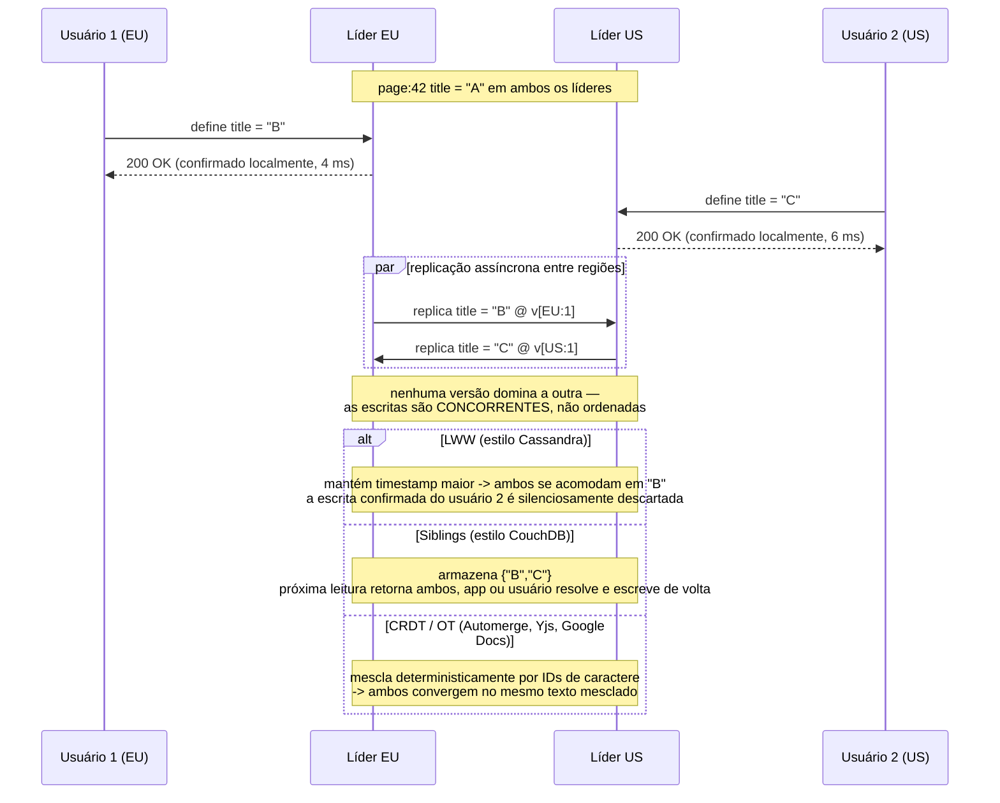

## Visão Geral

[Replicação de líder único](single-leader-replication) torna conflitos de escrita impossíveis por construção: toda escrita para um dado registro passa por um nó, então esse nó sozinho decide a ordem em que escritas são aplicadas e todo seguidor reproduz a mesma sequência. Essa restrição é uma característica genuína — até você precisar que usuários em Frankfurt escrevam sem uma ida e volta até a Virgínia, ou um celular que continua aceitando edições em um túnel sem sinal. **Multi-líder** e replicação **sem líder** ambas abandonam a restrição de escritor único, e ambas pagam por isso com a mesma conta: dois nós agora podem aceitar escritas na mesma chave sem saber um do outro, então conflitos deixam de ser impossíveis e passam a ser um caso cotidiano para o qual você precisa projetar.

## Replicação Multi-Líder

Em uma configuração multi-líder (também chamada de replicação *ativo/ativo* ou *bidirecional*), vários nós aceitam escritas, e cada um encaminha suas mudanças para todos os outros — todo líder é simultaneamente um seguidor dos outros líderes. Tornar essa replicação entre líderes *síncrona* derrotaria o propósito: se uma escrita para o líder A precisa ser confirmada pelo líder B antes de confirmar, então um link quebrado entre A e B bloqueia escritas, e você reinventou replicação de líder único com saltos extras. A configuração interessante é assíncrona, onde cada líder confirma localmente e propaga em segundo plano.

### Operação geograficamente distribuída

O caso de uso canônico é um banco de dados com réplicas em várias regiões. Com um único líder, o líder vive em exatamente uma região e toda escrita de toda outra região cruza a internet para alcançá-lo — frequentemente 80-200 ms de latência inevitável, o que pode derrotar todo o propósito de ter múltiplas regiões. Com um líder por região, cada escrita confirma contra o líder local em latência de dígito único de milissegundos e replica para as outras regiões depois. Três coisas melhoram:

- **Latência de escrita** — o atraso entre regiões é movido para fora do caminho crítico do usuário e para um processo em segundo plano.
- **Tolerância a indisponibilidade regional** — uma região cujos pares estão inalcançáveis continua servindo leituras *e escritas* de seu próprio líder, e se coloca em dia quando o link volta. Replicação de líder único na mesma situação requer um failover com todo seu risco associado.
- **Tolerância a falhas de rede** — links entre regiões são menos confiáveis que intra-regionais, e uma configuração de líder único é maximamente sensível a eles porque toda escrita remota bloqueia nesse link.

O que piora é consistência, e piora de uma forma que você não pode contornar. Você não pode garantir que um saldo permaneça não negativo ou que um nome de usuário seja único, porque dois líderes podem cada um processar uma escrita que é individualmente válida e conjuntamente ilegal. Essa é uma limitação fundamental, não uma lacuna de implementação: aplicar uma restrição global requer um único ponto que veja todas as escritas relevantes. Se seu domínio tem tais restrições, mantenha essas escritas em líder único.

Multi-líder também é frequentemente uma funcionalidade retroadaptada (MySQL, Oracle, SQL Server, EDB Postgres Distributed, pglogical, Redis Enterprise), o que significa que chaves autoincrement, triggers, e restrições de integridade interagem mal com ela. Além de dois líderes você também precisa escolher uma **topologia** — todos-para-todos, circular, ou estrela. Topologias circular e estrela usam menos links mas deixam um nó falho cortar o caminho de replicação entre os sobreviventes; todos-para-todos é mais tolerante a falhas mas deixa mensagens ultrapassarem umas às outras, então uma réplica pode receber um `UPDATE` antes do `INSERT` do qual depende. Isso é um problema de causalidade, e anexar timestamps de relógio de parede não o corrige — veja version vectors abaixo.

### Sync engines e software local-first

Leve geo-replicação ao extremo e cada "região" se torna um único dispositivo. Um app de calendário no seu celular precisa aceitar novas reuniões esteja ou não com sinal; cada dispositivo, portanto, mantém uma réplica local que age como líder, e um processo de sincronização assíncrono os reconcilia sempre que a conectividade permite. O lag de replicação aqui não é medido em milissegundos mas em horas ou dias.

A mesma arquitetura fundamenta colaboração em tempo real. No Google Docs, Figma, ou Linear, cada aba de navegador aberta é uma réplica que aplica suas edições localmente e imediatamente — renderizando dentro de um frame em vez de depois de uma ida e volta ao servidor — e as envia assincronamente para colaboradores. Mesmo um app sem modo offline é arquiteturalmente multi-líder no momento em que usuários podem editar sem esperar uma resposta do servidor.

A biblioteca que trata disso é um **sync engine**. Seu benefício não é apenas suporte offline: ele colapsa o modelo usual de "toda leitura é uma chamada de rede falível que precisa de seu próprio estado de erro" em leituras e escritas locais que essencialmente nunca falham, que é um modelo de programação dramaticamente mais simples para um frontend. Um app construído dessa forma é **offline-first**; se também continua funcionando quando o fornecedor desliga seus servidores — tipicamente via um protocolo de sync aberto com múltiplos provedores possíveis — é **local-first**. Git é o exemplo bem conhecido: você commita localmente e sincroniza através do GitHub, GitLab, ou nada. A limitação principal é que sync engines assumem que o conjunto de trabalho pode ser baixado e mantido no cliente, o que é bom para os documentos de um usuário e sem sentido para um catálogo inteiro de e-commerce.

## O Problema do Conflito

Dois usuários abrem a mesma página de wiki, atualmente intitulada `A`. Usuário 1, no líder europeu, a renomeia para `B`. Usuário 2, no líder americano, a renomeia para `C`. Cada escrita tem sucesso localmente. Quando os líderes trocam mudanças, descobrem que discordam.

Note o que "concorrente" significa aqui, porque não é o que parece. Duas escritas são concorrentes quando *nenhuma sabia da outra*, independentemente do tempo físico. Edições offline feitas com três dias de diferença são concorrentes; duas escritas com 50 ms de diferença onde a segunda leu o resultado da primeira não são.

### Evitar Conflitos

A correção mais barata é não ter conflitos. Se todas as escritas para um dado registro são roteadas para o mesmo líder, um cluster multi-líder se comporta como líder único por registro — dê a cada usuário uma região "casa" e roteie suas requisições para lá. Isso funciona bem para dados que só seu dono edita, e quebra no momento em que você precisa mudar o líder casa de um registro (indisponibilidade de região, relocação de usuário), porque uma escrita em trânsito durante a transição produz exatamente o conflito que você estava evitando. Também não se aplica de forma alguma a um sync engine, onde dispositivos offline são líderes por definição.

### Last Write Wins

Marque toda escrita com um timestamp e mantenha o maior. É trivial de implementar e é o que Cassandra e ScyllaDB fazem. O nome é uma mentira: quando duas escritas são concorrentes, "qual é mais tarde" é *indefinido*, então a semântica real do LWW é "escolha um vencedor aleatório entre escritas concorrentes e descarte silenciosamente o resto". Isso é bom se você só insere registros imutáveis sob chaves únicas. Se você atualiza registros, LWW é um mecanismo de perda de dados com um nome reconfortante. Também é agudamente sensível a desvio de relógio quando o timestamp é um relógio de parede — um nó cujo relógio corre rápido pode fazer com que toda escrita subsequente de seus pares seja descartada como "mais antiga".

### Merge em Nível de Aplicação (siblings)

Em vez de escolher um vencedor, o banco de dados pode manter ambos os valores concorrentes como **siblings** e retornar todos na próxima leitura; a aplicação (ou o usuário) os mescla e escreve o resultado de volta. O CouchDB funciona dessa forma. Os custos são reais: um campo que era uma string se torna um conjunto de strings que geralmente tem um elemento, todo chamador precisa lidar com isso, e merges ingênuos se comportam mal. O carrinho de compras da Amazon famosamente mesclava siblings por união de conjunto, então um item que você excluiu no seu laptop reapareceu depois de sincronizar com seu celular — o merge preservou adições mas não tinha forma de representar uma exclusão. Pior, dois nós resolvendo o mesmo conflito independentemente podem produzir duas *novas* resoluções conflitantes (`B/C` versus `C/B`).

### CRDTs e Transformação Operacional

Para muitos tipos de dados você pode mesclar automaticamente e corretamente. Duas famílias de algoritmo fazem isso: **CRDTs** (conflict-free replicated data types) e **OT** (operational transformation). Ambas garantem que todas as réplicas que viram o mesmo conjunto de escritas alcancem o mesmo estado independentemente da ordem de chegada — consistência eventual mais uma garantia de convergência, chamada **strong eventual consistency**.

A distinção está em como posições são endereçadas. OT registra operações por índice (`insert "n" at 0`) e *transforma* índices recebidos para levar em conta operações concorrentes já aplicadas — inserir `!` no índice 3 se torna índice 4 uma vez que um caractere foi inserido antes dele. A maioria dos CRDTs em vez disso dá a todo elemento um ID único e imutável e expressa uma inserção em relação ao ID de seu predecessor, então nenhuma transformação é necessária e réplicas convergem por construção. Inserções concorrentes na mesma posição são ordenadas deterministicamente por ID.

Tipos de propósito específico existem para os casos comuns: texto que preserva toda inserção e exclusão; conjuntos e listas que rastreiam *exclusões como fatos*, para que a anomalia do carrinho de compras não possa ocorrer; contadores que somam incrementos por réplica em vez de sobrescrever; e mapas que aplicam uma estratégia por-valor chave por chave. OT domina edição de texto em tempo real (Google Docs, ShareDB); CRDTs são usados no Riak, Redis Enterprise, Azure Cosmos DB, e sync engines JSON como Automerge e Yjs. Nenhum é mágica — se seu invariante é "esta lista mantém no máximo cinco itens" e três usuários concorrentemente adicionam um sexto, alguma adição precisa ser descartada. Merge automático preserva intenção, não aplica restrições.

## Replicação Sem Líder

Replicação sem líder abandona o líder completamente: qualquer réplica aceita escritas diretamente de clientes, e nenhum nó impõe uma ordenação. O cliente (ou um nó coordenador agindo em seu nome, que *não* é um líder — não aplica ordem alguma) envia cada escrita para várias réplicas em paralelo e a considera bem-sucedida uma vez que o suficiente delas confirma. Leituras igualmente consultam várias réplicas em paralelo e reconciliam o que quer que volte, usando metadados de versão para escolher o valor mais novo. Este é o design **estilo Dynamo**, implementado por Riak, Cassandra, e ScyllaDB. (Confusamente, o *DynamoDB* da Amazon não é um deles — é líder único sobre Multi-Paxos.)

Quando um nó está fora do ar não há failover, porque não há nada de onde fazer failover. A escrita simplesmente cai nas réplicas alcançáveis e perde a que está fora do ar; se `w` de `n` réplicas confirmaram, teve sucesso. Já que o nó recuperado agora mantém dados desatualizados, leituras consultam `r` réplicas e pegam a versão mais nova, e três mecanismos em segundo plano arrastam o atrasado para frente: **read repair** (um cliente que vê uma resposta desatualizada escreve o valor mais novo de volta), **hinted handoff** (uma réplica substituta mantém escritas em nome do nó fora do ar e as reproduz em seu retorno), e **anti-entropy** (uma varredura em segundo plano que compara réplicas e copia o que está faltando). A aritmética de quórum `w + r > n`, quóruns sloppy, hinted handoff, e anti-entropy com Merkle tree são cobertos em profundidade — com os modos de falha que tornam `w + r > n` mais fraco do que parece — em [Designing a Distributed Key-Value Store](key-value-store-design).

### Líder Único versus Sem Líder, em Termos Simples

Um sistema de líder único pode oferecer garantias que um sem líder não pode — transações serializáveis, restrições de unicidade, uma ordenação real de escritas. Ler do líder é a única forma de ter certeza de que uma leitura está atual, e essa rota tem três fraquezas estruturais: throughput de leitura é limitado por uma máquina, uma falha de líder significa detecção mais failover antes do serviço retomar, e *qualquer* lentidão no líder é imediatamente a lentidão de todo usuário.

Um sistema sem líder é mais resiliente precisamente porque não distingue o caso normal do caso de falha. Requisições já se espalham para múltiplas réplicas, então uma réplica lenta ou morta mal registra — o cliente usa quaisquer `r` respostas que chegarem primeiro, uma técnica chamada **request hedging** que também corta latência de cauda em condições saudáveis. Não há uma decisão de "isso é ruim o suficiente para fazer failover?", que importa mais para **falhas cinzentas**, onde um nó não está fora do ar mas está degradado e lento: exatamente o caso que um detector de falha baseado em líder trata pior.

Sem líder tem seus próprios custos. Hinted handoff carrega o cluster mais pesadamente no momento em que já está tenso. Quóruns maiores significam esperar por mais réplicas, e cada resposta adicional aumenta as chances de atingir uma lenta — que é por que deployments reais raramente vão além de 4-de-7 ou 5-de-9. E uma falha de rede que isola um cliente de réplicas demais torna um quórum não-formável, a menos que você habilite um **quórum sloppy** (nível de consistência `ANY` do Cassandra) que aceita escritas em qualquer nó alcançável sem garantia de que uma leitura posterior as verá. Replicação multi-líder é ainda mais resiliente — um cliente fala apenas com seu líder local, que pode estar a poucos milissegundos de distância — mas leituras podem estar arbitrariamente desatualizadas, já que nada limita quão atrasado um líder está. Quóruns ficam no meio: tolerância a falhas decente e uma alta probabilidade, embora não uma garantia, de ler dados atuais.

### Operação Multi-Região, Estilo Sem Líder

Replicação sem líder combina com deployment multi-região pela mesma razão que combina com falha de nó: escritas concorrentes conflitantes, interrupções de rede, e picos de latência são todos o caso normal. No Cassandra e ScyllaDB o cliente escolhe um **coordenador** em sua própria região; o coordenador escreve para réplicas locais e para exatamente *uma* réplica por região remota, que se espalha dentro daquela região — então o salto caro entre regiões é pago uma vez em vez de por réplica. O nível de consistência então decide o que você espera: um quórum através de todas as regiões, um quórum em cada região, ou um **quórum local** dentro da sua própria. Quórum local mantém escritas rápidas e torna leituras desatualizadas mais prováveis, que é a mesma troca que todo sistema multi-região eventualmente faz. Riak toma o outro caminho: `n` conta réplicas dentro de uma região, e sync entre regiões acontece assincronamente entre clusters, em um estilo muito mais próximo de multi-líder.

## Detectando Escritas Concorrentes com Precisão

Ambas arquiteturas precisam responder uma pergunta sobre quaisquer duas escritas: uma *aconteceu antes* da outra, ou são genuinamente concorrentes? Se A aconteceu antes de B, B deveria simplesmente sobrescrever A. Se são concorrentes, há um conflito e alguém precisa resolvê-lo. Errar isso é como sistemas perdem dados silenciosamente.

Um timestamp não consegue responder isso. Um timestamp diz qual escrita tem o número maior; não diz nada sobre se a segunda escrita *sabia sobre* a primeira. LWW confunde as duas: trata "timestamp maior" como "mais tarde, portanto substitui", e assim descarta uma escrita concorrente que nunca foi sobrescrita por nada — uma escrita que o banco de dados confirmou a um usuário que não tem como saber que sumiu.

A formulação precisa é **happens-before**: a operação A acontece antes de B se B sabe sobre A, depende de A, ou constrói sobre A. Duas operações são concorrentes se *nenhuma* acontece antes da outra. Note que tempo físico é irrelevante — duas operações separadas por uma semana são concorrentes se uma partição de rede impediu qualquer uma de saber sobre a outra.

Capturar isso precisa de metadados de versão, não relógios. Comece com uma única réplica: o servidor mantém um número de versão por chave, e um cliente precisa ler antes de escrever. Uma leitura retorna todo valor ainda não sobrescrito (os siblings) mais o número de versão atual; uma escrita precisa carregar o número de versão que o cliente leu por último, e precisa mesclar tudo que a leitura retornou. Ao receber uma escrita na versão *v*, o servidor pode sobrescrever todo valor na versão ≤ *v* — esses são provavelmente dobrados no valor recebido — mas precisa manter qualquer coisa com versão mais alta como sibling, porque esses são concorrentes com a escrita. Note que o servidor nunca inspeciona o valor, apenas versões; o payload pode ser qualquer estrutura de dados.

Com múltiplas réplicas cada uma aceitando escritas, um contador não é suficiente. Cada réplica mantém seu próprio número de versão por chave *e* rastreia as versões que viu de toda outra réplica. Essa coleção é um **version vector** (uma variante, o dotted version vector, é o que o Riak 2.0 usa; o Riak o envia aos clientes como uma string opaca que chama de *causal context*). Comparar dois version vectors dá exatamente a resposta de três vias que você precisa: se todo componente de X é ≤ o componente correspondente de Y, então X aconteceu antes de Y e Y vence completamente; se cada um tem um componente maior que o do outro, as escritas são concorrentes e precisam ser expostas como siblings ou mescladas. Essa é toda a diferença em relação ao LWW — o vetor pode dizer "eu não sei qual é mais tarde, e essa é a resposta correta", onde um timestamp é forçado a chutar. Também torna seguro ler de uma réplica e escrever de volta para outra: você pode criar siblings, mas não vai perder dados desde que siblings sejam mesclados.

(Version vectors e *vector clocks* são frequentemente usados de forma intercambiável; diferem sutilmente, e version vectors são a estrutura certa para comparar estado de réplica.)

## Trade-offs

- **Multi-líder compra latência de escrita local e independência regional ao preço de qualquer invariante global** — cada região confirma em milissegundos e sobrevive a uma partição entre regiões, mas nenhum líder vê todas as escritas, então "saldo nunca fica negativo" e "nomes de usuário são únicos" se tornam inaplicáveis. Roteie escritas que carregam restrições através de um único líder e aceite que essas escritas pagam a ida e volta entre regiões.
- **LWW é a única estratégia de resolução de conflito que é gratuita, e é gratuita porque descarta dados** — garante convergência, não preservação, e seu "perdedor" é escolhido essencialmente ao acaso entre escritas concorrentes. É seguro para inserções imutáveis sob chaves únicas e silenciosamente lossy para qualquer coisa que você atualiza.
- **CRDTs e OT automatizam merges corretamente para tipos específicos de dados, não para regras de negócio arbitrárias** — um conjunto que rastreia exclusões como fatos elimina completamente a classe de bug do item-reaparecendo-no-carrinho, mas nenhum algoritmo de merge pode manter "no máximo cinco itens" quando três réplicas concorrentemente adicionam um sexto. Merge automático preserva intenção; não aplica restrições.
- **Replicação sem líder troca uma garantia forte de ordenação pela ausência de failover** — não há líder para detectar como falho e nenhuma pausa de failover, e um nó degradado (falhando cinza) é absorvido simplesmente usando as respostas `r` mais rápidas. O que você abre mão é qualquer ordem de escrita bem definida, que é por que transações serializáveis estão fora de cogitação.
- **Quóruns maiores melhoram as chances de uma leitura fresca e pioram latência de cauda** — toda réplica extra pela qual você espera é outra chance de atingir a lenta, que é por que quóruns de produção raramente excedem 4-de-7 ou 5-de-9, e por que um quórum local (rápido, mais provavelmente desatualizado) geralmente vence um global em deployments multi-região.
- **Version vectors custam metadados e cooperação do cliente, e são o único mecanismo que diz a verdade sobre concorrência** — clientes precisam ler antes de escrever, ecoar o causal context de volta, e implementar uma função de merge, e o vetor cresce com o número de réplicas que já coordenaram uma escrita para aquela chave. Em troca, "essas duas escritas são genuinamente concorrentes" se torna um fato que o banco de dados pode declarar em vez de um caso que resolve silenciosamente.

## Perguntas de Entrevista

- Um app geo-distribuído migra de líder único para multi-líder para que cada região escreva localmente. Quais garantias de correção existentes essa migração silenciosamente quebra, e como você diria quais partes do esquema são afetadas?
- Duas escritas na mesma chave carregam timestamps com 100 ms de diferença. Por que isso não é evidência suficiente de que a mais tarde deveria sobrescrever a mais antiga, e que metadado resolveria a questão?
- O carrinho de compras da Amazon mesclava versões concorrentes por união de conjunto e itens excluídos voltavam. Explique por que a união está errada, e o que um conjunto CRDT representa que a união não representa.
- Seu cluster sem líder roda `n = 3, w = 2, r = 2`. Um cliente escreve, recebe uma resposta de sucesso, imediatamente lê, e vê o valor antigo. Dê dois mecanismos distintos nessa arquitetura que poderiam produzir esse resultado.
- Um sistema baseado em líder precisa de um detector de falha e um procedimento de failover; um sem líder não precisa de nenhum dos dois. Com qual classe de falha essa diferença mais ajuda, e que novo problema operacional o design sem líder cria em seu lugar?

## Referências

- [Martin Kleppmann, "Designing Data-Intensive Applications", 2ª Edição (O'Reilly) — Capítulo 6, "Replication", seções "Multi-Leader Replication" e "Leaderless Replication"](https://www.oreilly.com/library/view/designing-data-intensive-applications/9781098119058/)
- [Shapiro, Preguiça, Baquero, Zawirski — "Conflict-Free Replicated Data Types" (INRIA / SSS 2011)](https://inria.hal.science/inria-00609399)
- [DeCandia et al., "Dynamo: Amazon's Highly Available Key-value Store" (SOSP 2007)](https://www.allthingsdistributed.com/files/amazon-dynamo-sosp2007.pdf)
- [Ink & Switch — "Local-First Software: You Own Your Data, in Spite of the Cloud"](https://www.inkandswitch.com/local-first/)
</content>
