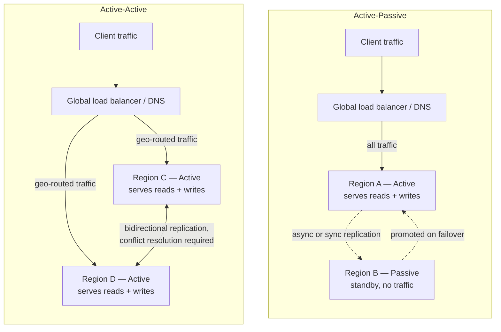

## Overview

A whole cloud region has failed, more than once, in ways that made the news rather than just an internal postmortem: an AWS US-EAST-1 outage has taken down a large fraction of the consumer web with it; a Google Cloud region has gone dark from a network configuration change; entire data centers have lost power or cooling and stayed down for hours. These are not hypothetical failure modes invoked to justify an architecture diagram — they are documented incidents, and the postmortems are public. The consequence for anyone designing for high availability is blunt: **a single-region architecture has a hard ceiling on availability no matter how well-engineered it is internally**, because every technique covered elsewhere in this material — replication, load balancing, circuit breakers, careful capacity planning — operates *inside* a region, and a regional failure takes every replica of everything in that region down at once. You can eliminate every single point of failure within a region and still be one region away from a total outage.

Multi-region design is the answer, and it is worth being honest that it is a genuinely different problem from in-region high availability, not a bigger version of the same problem. In-region replication assumes single-digit-millisecond network latency between nodes, so synchronous coordination — wait for a quorum, wait for a follower's ack — is cheap enough to do on every write. Cross-region latency is tens to hundreds of milliseconds depending on geography (US-East to US-West is around 60-70ms round trip; US to Europe or Asia is 100-200ms+), which makes synchronous coordination across regions expensive on every write and, past a certain distance and a certain write volume, simply infeasible for a latency-sensitive workload. Everything in this concept — active-passive versus active-active, how you replicate data, how failover decides when to trigger — is downstream of that one physical fact: **the network between regions is slow enough that you cannot pretend it isn't there.**

## RTO and RPO: Naming the Acceptable Damage

Before choosing a topology, you need two numbers, because "make it disaster-proof" is not a specification and every architecture decision below is a trade against these two objectives.

- **Recovery Time Objective (RTO)** — how long the system is allowed to be down after a disaster before it's back and serving traffic. If your RTO is 4 hours, a design that takes 4 hours and 5 minutes to fail over has failed its objective even if it eventually succeeds.
- **Recovery Point Objective (RPO)** — how much data you're allowed to lose, measured as a span of time. An RPO of 5 minutes means that in the worst case, the 5 minutes of writes immediately preceding the disaster are gone; anything replicated before that point is recoverable.

These are business decisions dressed up as engineering parameters — a trading platform's RPO might be measured in single-digit seconds because a lost trade is a lost trade, while an internal analytics dashboard might tolerate an RPO of a day because last night's batch load is an acceptable fallback. The reason to nail these numbers down *before* picking a topology is that they mechanically determine which topologies and replication strategies are even on the table:

- **A near-zero RPO forces synchronous cross-region replication** (or a system built on cross-region consensus, like Spanner or CockroachDB) — the only way to guarantee no committed write is lost when a region disappears is to have already durably placed that write somewhere else before acknowledging it. That buys you an RPO close to zero at the cost of the cross-region round trip landing on every write's latency, which is the tens-to-hundreds-of-milliseconds tax from the Overview, paid every single time.
- **A relaxed RPO allows asynchronous replication and periodic snapshots** — the standby region trails the primary by however long replication lag or the snapshot interval is, and that lag *is* your RPO. Writes stay fast because nothing waits on the cross-region hop, but any write not yet shipped when the primary region dies is gone.
- **RTO is mostly a function of topology and automation, not data**. Active-passive with a manual failover runbook might have an RTO of 30-60 minutes even with a perfectly replicated standby, because promoting the standby, repointing DNS or a load balancer, and validating the failover are all human-paced operations. Active-active with automated traffic shifting can have an RTO in the low single-digit minutes, or even seconds, because there's no promotion step — the other region was already serving traffic.

| Replication strategy | Typical RPO | RTO impact | Write-path cost |
| --- | --- | --- | --- |
| Synchronous cross-region | Near zero (no committed write lost) | Independent of RPO; still needs failover automation | High latency added to every write |
| Asynchronous cross-region | Seconds to low minutes (replication lag) | Independent of RPO; standby is warm and current | No added write latency |
| Periodic snapshot / backup | Minutes to hours (snapshot interval) | Restore time adds to RTO on top of failover | No added write latency; cheapest to run |

Notice that RTO and RPO are independent axes — a system can have an excellent RPO (synchronous replication, no data loss) and a terrible RTO (a fully manual, unrehearsed failover runbook that takes three hours to execute correctly under pressure), or the reverse (an automated failover that completes in ninety seconds, but only after losing the last two minutes of asynchronously replicated writes). Any DR design has to state both numbers, not just one.

## Active-Passive: Standby That Waits

In an **active-passive** (also called active-standby, or primary-DR) topology, one region — the primary — serves all live production traffic. A second region holds a standby copy of the data, kept current through the replication strategy chosen above, but it serves no traffic in the normal case. On a regional failure, an operator or an automated system **promotes** the standby: it starts accepting traffic, DNS or a global load balancer is repointed at it, and it becomes the new primary.

The appeal is simplicity. There's exactly one region accepting writes at any time, so there are no cross-region write conflicts to resolve — this is precisely the single-leader replication model from [Single-Leader Replication](single-leader-replication), just with the leader and follower in different regions instead of different racks. Capacity planning is also simpler in one sense: the standby region typically doesn't need to be sized to serve full production load *continuously*, only to be ready to absorb it during a failover.

The risk is concentrated entirely in the failover itself, and the SRE literature is blunt about why that risk is real rather than theoretical: **failover is an operation, and operations that are rarely executed are exactly the ones most likely to go wrong.** A standby region that has been quietly replicating data for eight months has almost certainly never actually served a production request. Its load balancer configuration, its connection pool sizing, its cache warm-up behavior, its autoscaling policies, its feature-flag defaults — all of that is code that has been deployed but never truly exercised end to end under real traffic. The Google SRE Book's discussion of testing and of postmortem culture makes this exact point about untested recovery paths in general: a procedure that has not been rehearsed is not verified to work, it is merely believed to work, and those are different states. A failover that trips over a misconfigured health check, an expired certificate that was never rotated because the standby never took traffic, or a database connection limit sized for zero load, converts "our primary region died" into "our primary region died *and* our failover didn't work," which is a strictly worse outage.

## Active-Active: Every Region Takes Traffic

In an **active-active** topology, multiple regions serve live production traffic simultaneously, all the time, with a global load balancer or DNS-based routing (typically by geographic proximity — see [Load Balancing Strategies](load-balancing-strategies)) distributing users across them. There is no promotion step on failure: if one region goes down, the load balancer simply stops sending it traffic and the surviving regions absorb the load they were already capable of serving.

This gets you two real advantages over active-passive. First, **resource utilization**: the standby capacity isn't sitting idle waiting for a disaster — it's doing useful work every day, which is also the only way you get honest confidence that it *can* do useful work, because it's being exercised continuously rather than once a year in a drill. Second, **failover speed**: RTO drops dramatically because there's no cold-start problem. The surviving region was already warm, already serving real traffic, already had its caches populated and its autoscaling calibrated to load.

The cost is that active-active reintroduces exactly the problem active-passive avoided: if two regions both accept writes to the same logical data, you now have the multi-leader replication problem — see [Multi-Leader and Leaderless Replication](multi-leader-and-leaderless-replication) — at cross-region distance and cross-region latency. Two users in different regions can concurrently update the same record, and now something has to decide what "the current value" is: last-write-wins (simple, silently discards one of the updates), version vectors or CRDTs (preserves more information, more implementation complexity), or application-level conflict resolution (correct for the specific domain, but bespoke work per data type). Some workloads dodge this entirely by **partitioning writes geographically** — a user's writes always land in their home region, and cross-region replication is one-directional per partition, which sidesteps concurrent-write conflicts at the cost of a user in one region reading potentially stale data about a user from another region. Whether that trade is acceptable is a product decision as much as an engineering one.

## Data Replication Across Regions

Whichever topology you choose, the mechanics of moving data between regions come down to the same three options already summarized in the RTO/RPO table, now examined at the level of what each one actually requires operationally:

- **Synchronous cross-region replication** means the writing region's database (or the application) blocks until the write is durably acknowledged in at least one other region. This is what systems like Google Spanner and CockroachDB do transparently via cross-region consensus (a write commits only once a quorum of replicas, spread across regions, has durably logged it), and it's what you'd hand-build with a two-phase commit or a Raft-style log spanning regions if you weren't using one of those databases. It gives you the near-zero RPO from the table above, but every write pays the cross-region round trip — which is why these systems are usually deployed with a small number of well-chosen regions (often three, for quorum) rather than replicating everywhere.
- **Asynchronous cross-region replication** is the far more common choice for systems that can't absorb synchronous latency on every write: the primary region acknowledges the write locally and ships it to other regions in the background, the same async-follower pattern from single-leader replication, just crossing a continent instead of a rack. The standby is "warm" — usually seconds behind — but the gap is exactly the data you can lose if the primary dies mid-shipment.
- **Periodic snapshot and backup** is the cheapest and least operationally demanding option: take a full or incremental snapshot on a schedule (hourly, nightly) and ship it to another region's object storage. There's no continuous replication infrastructure to run, but your RPO is bounded below by the snapshot interval, and your RTO includes the time to actually restore from that snapshot and replay any logs since, which is often the most underestimated number in a DR plan — restoring a multi-terabyte snapshot is not instantaneous, and nobody knows the real number until they've timed an actual restore.

A subtlety worth naming: these three options aren't mutually exclusive across a system's components. It's common to run synchronous replication for a small, high-value dataset (account balances, order state) and asynchronous replication or snapshots for everything else (activity logs, analytics data, generated recommendations) — the RTO/RPO conversation should happen per data class, not once for the entire system.

## Split-Brain and Failover Risk

The decision of *when* to fail over is its own hazard, independent of how data is replicated, and it mirrors the leader-failure problem from single-leader replication at a larger scale. **Automatic failover** — a health check trips, and the system promotes a standby or shifts traffic away from a region without a human in the loop — gets you a fast RTO, which matters when every minute of downtime is measured in real cost. But automatic detection is fundamentally a guess based on a timeout, and the guess can be wrong in a specific, dangerous way: a **network partition that isolates a region from your monitoring** can look identical to that region actually being down, even though the region is healthy and still serving the traffic it already has. If the failover system reacts to that false positive by promoting a second region to primary while the first region is still up and still believes it's primary, you now have **split brain** — two regions, each accepting writes, each unaware of the other's changes. This is the general split-brain problem from distributed systems and consensus literature (the same failure mode covered under leader election and fencing in [Single-Leader Replication](single-leader-replication)), except at regional scale the blast radius is every write made by every user routed to the "wrong" region during the window before someone notices and fences one side off.

**Manual failover** avoids the false-positive problem by putting a human judgment in the loop before anything is promoted, at the direct cost of RTO: someone has to be paged, has to assess the situation, and has to decide, and all of that takes real minutes that automatic failover doesn't need. Many organizations land on a middle position: automatic *detection and alerting*, with the actual promotion gated behind a human confirmation, or automatic failover only for the specific, well-understood case of a clean regional outage (cloud provider status page confirms it, not just an internal health check disagreeing with itself) while anything ambiguous escalates to a person. Whichever you choose, the fencing mechanism matters as much as the trigger: whatever gets promoted needs a way to make the old primary's writes rejected once it's no longer authoritative — a monotonically increasing epoch or generation number that storage checks on every write is the standard tool, exactly as it is for single-region leader failover.

## Testing Disaster Recovery: Game Days and DiRT

A disaster recovery plan that has never been executed is a document, not a capability, and the industry's answer to that gap is to trigger disasters on purpose. Google's internal program for this, described in the SRE literature, is **DiRT — Disaster Recovery Testing** (sometimes expanded as Disaster Recovery Training): a company-wide, deliberately induced set of failures — simulated regional outages, degraded dependencies, staged data corruption — run against production or production-like systems so that a team's actual response, not their belief about their response, gets exercised. The point is explicitly to surface the gap between the written runbook and reality: a pipeline that's "supposed to" fail over automatically to another region either does or it doesn't, and DiRT is how you find out during a scheduled exercise rather than during an actual incident, when a restore procedure tied to an SLO is verified against the clock rather than assumed.

This generalizes into the broader industry practice of **game days**: a scheduled, deliberate exercise where a team triggers a real (or realistically simulated) failure — kill a region, sever a network path, revoke a credential — against production or a faithful staging replica, and watches whether the actual failover happens within the RTO/RPO the design promised. The value is specifically in the friction a game day surfaces that a design review cannot: a runbook step that references a tool nobody has permission to run anymore, a DNS TTL set high enough that "failover" takes twenty minutes to actually redirect traffic, an alert that fires but pages a rotation that no longer exists, a standby database whose schema silently drifted from the primary's. None of those show up by reading the architecture diagram; all of them show up the first time someone actually pulls the plug. Google Cloud's own architecture guidance on disaster recovery planning makes the same point from the other direction: recovery design should be driven by the RTO/RPO you actually need, and then validated by testing that scenario, not by whichever backup feature happened to be easiest to turn on.

The uncomfortable implication is that DR testing has to happen periodically and against realistic scenarios, not once at launch. Systems change — new dependencies get added, runbooks go stale, on-call rotations turn over, cloud provider APIs change their behavior — and a DR plan validated a year ago is a claim about a system that no longer exists.

## Trade-offs

- **Active-passive is simpler to reason about but its untested code paths are the real risk.** No cross-region write conflicts to resolve, but the standby region's correctness is a hypothesis until a real failover — planned or unplanned — actually exercises it end to end.
- **Active-active gets faster failover and better utilization at the cost of the multi-leader conflict problem.** You trade a fast, low-drama RTO and daily exercise of every region for the genuine complexity of concurrent cross-region writes to the same data, which needs an explicit conflict-resolution strategy (partitioning, CRDTs, last-write-wins, or application logic) rather than being avoidable by architecture alone.
- **A near-zero RPO is bought with latency on every write, forever.** Synchronous cross-region replication (or cross-region consensus) is the only honest way to guarantee no committed write is lost, and that guarantee is paid for on the hot path of every single write, not just during a disaster.
- **Automatic failover trades a slower, safer decision for a faster, riskier one.** It shrinks RTO but risks a false-positive failover from a network partition that looks like a regional death but isn't — and the failure mode when that happens, split brain, can be worse than the outage the automation was trying to shorten.
- **A DR plan is a hypothesis until it's exercised.** Game days and programs like DiRT cost real engineering time and carry real risk of triggering an actual incident during a "test," but the alternative — discovering the runbook is wrong during a real disaster — is strictly more expensive and happens at the worst possible time.
- **Per-data-class replication strategy beats a single system-wide choice.** Treating every dataset with the same RPO target either overpays for latency on data that could tolerate more loss, or underpays durability on the data that can't — segmenting by actual business impact is more work up front but avoids both failure modes.

## Interview Questions

- Explain precisely what RTO and RPO measure, in your own words, and describe a system where they'd be set to very different orders of magnitude (e.g., RTO in minutes, RPO in milliseconds, or vice versa) — what business reasoning would justify that gap?
- Why does synchronous cross-region replication make sense for a near-zero RPO but become impractical past a certain write volume or geographic distance? Where exactly does the cost show up?
- A team runs active-passive DR and hasn't failed over in fourteen months. What specific things are likely to have silently drifted on the standby side, and how would you find out before an actual disaster forces the question?
- Walk through how a network partition — not an actual regional failure — can cause a system with automatic failover to end up with two regions both accepting writes. What's the standard mitigation, and why doesn't simply "picking a winner" always work safely?
- Why does active-active reduce to the multi-leader replication conflict problem? Describe two different strategies for resolving concurrent cross-region writes to the same record and the trade-off each makes.
- What is Google's DiRT program, and why does the SRE literature treat exercising a real failover as categorically different from reviewing the runbook that describes one?

## References

- [Site Reliability Engineering — Data Integrity: What You Read Is What You Wrote](https://sre.google/sre-book/data-integrity/) — Google SRE Book, Chapter 26 (references DiRT exercises validating restore procedures against SLOs)
- [The Site Reliability Workbook — Data Processing Pipelines](https://sre.google/workbook/data-processing/) — Google SRE Workbook, Chapter 13 (defines Disaster Recovery Testing (DiRT) and its use in simulating regional outages)
- [AWS Well-Architected Framework — Reliability Pillar](https://docs.aws.amazon.com/wellarchitected/latest/reliability-pillar/welcome.html) — Amazon Web Services
- [Disaster Recovery of Workloads on AWS: Recovery in the Cloud](https://docs.aws.amazon.com/whitepapers/latest/disaster-recovery-workloads-on-aws/disaster-recovery-workloads-on-aws.html) — AWS Whitepaper, defines RTO/RPO and DR strategy tiers (backup and restore, pilot light, warm standby, multi-site active/active)
- [Architecting disaster recovery for cloud infrastructure outages](https://docs.cloud.google.com/architecture/disaster-recovery) — Google Cloud Architecture Center
