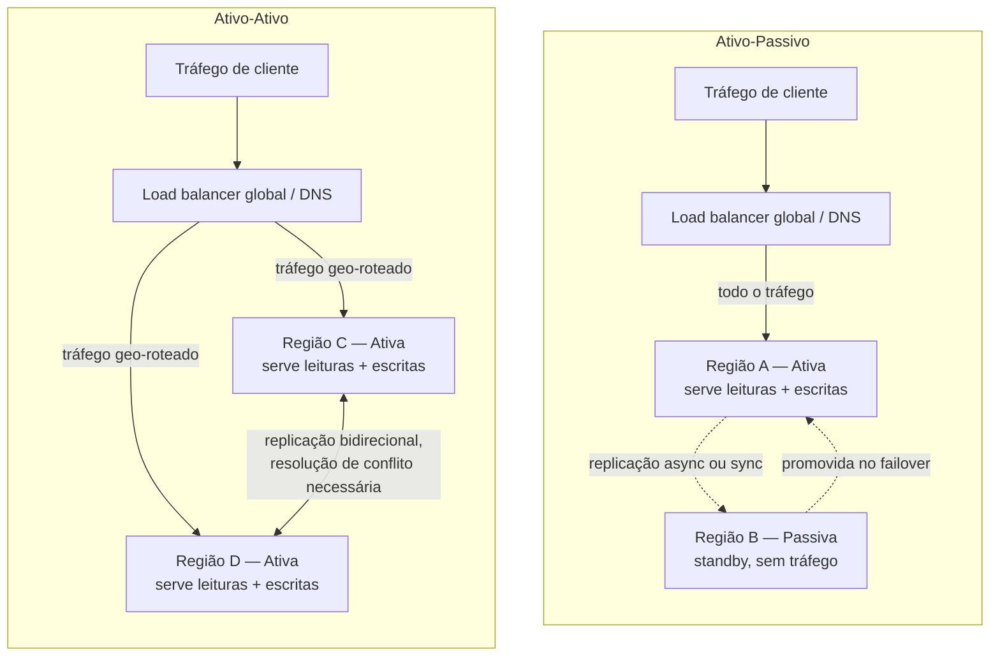

## Visão Geral

Uma região inteira de nuvem já falhou, mais de uma vez, de formas que viraram notícia em vez de apenas um postmortem interno: uma interrupção do AWS US-EAST-1 já derrubou uma grande fração da web de consumo junto com ela; uma região do Google Cloud já ficou apagada por uma mudança de configuração de rede; data centers inteiros já perderam energia ou refrigeração e ficaram fora do ar por horas. Esses não são modos de falha hipotéticos invocados para justificar um diagrama de arquitetura — são incidentes documentados, e os postmortems são públicos. A consequência para quem projeta para alta disponibilidade é direta: **uma arquitetura de região única tem um teto rígido de disponibilidade não importa quão bem projetada internamente ela seja**, porque toda técnica coberta em outros lugares deste material — replicação, balanceamento de carga, circuit breakers, planejamento cuidadoso de capacidade — opera *dentro* de uma região, e uma falha regional derruba toda réplica de tudo naquela região de uma vez. Você pode eliminar todo ponto único de falha dentro de uma região e ainda estar a uma região de distância de uma interrupção total.

O design multi-região é a resposta, e vale a pena ser honesto que é um problema genuinamente diferente de alta disponibilidade dentro da região, não uma versão maior do mesmo problema. Replicação dentro da região assume latência de rede de milissegundos de um dígito entre nós, então coordenação síncrona — esperar por um quórum, esperar pelo ack de um seguidor — é barata o suficiente para fazer a cada escrita. Latência entre regiões é de dezenas a centenas de milissegundos dependendo da geografia (Leste dos EUA para Oeste dos EUA é cerca de 60-70ms de ida e volta; EUA para Europa ou Ásia é 100-200ms+), o que torna a coordenação síncrona entre regiões cara em cada escrita e, além de certa distância e certo volume de escrita, simplesmente inviável para uma carga de trabalho sensível à latência. Tudo neste conceito — ativo-passivo versus ativo-ativo, como você replica dados, como o failover decide quando disparar — decorre desse único fato físico: **a rede entre regiões é lenta o suficiente para que você não possa fingir que ela não existe.**

## RTO e RPO: Nomeando o Dano Aceitável

Antes de escolher uma topologia, você precisa de dois números, porque "torne isso à prova de desastres" não é uma especificação e toda decisão de arquitetura abaixo é um trade-off contra esses dois objetivos.

- **Recovery Time Objective (RTO)** — quanto tempo o sistema pode ficar fora do ar após um desastre antes de voltar e servir tráfego. Se seu RTO é 4 horas, um design que leva 4 horas e 5 minutos para fazer failover falhou seu objetivo mesmo que eventualmente tenha sucesso.
- **Recovery Point Objective (RPO)** — quantos dados você pode perder, medidos como um intervalo de tempo. Um RPO de 5 minutos significa que, no pior caso, os 5 minutos de escritas imediatamente anteriores ao desastre estão perdidos; qualquer coisa replicada antes desse ponto é recuperável.

Essas são decisões de negócio disfarçadas de parâmetros de engenharia — o RPO de uma plataforma de trading pode ser medido em segundos de um único dígito porque um trade perdido é um trade perdido, enquanto um dashboard interno de analytics pode tolerar um RPO de um dia porque a carga em lote da noite anterior é um fallback aceitável. A razão para fixar esses números *antes* de escolher uma topologia é que eles determinam mecanicamente quais topologias e estratégias de replicação estão sequer na mesa:

- **Um RPO próximo de zero força replicação síncrona entre regiões** (ou um sistema construído sobre consenso entre regiões, como Spanner ou CockroachDB) — a única forma de garantir que nenhuma escrita commitada é perdida quando uma região desaparece é já ter colocado durável essa escrita em outro lugar antes de confirmá-la. Isso te dá um RPO próximo de zero ao custo de a ida e volta entre regiões pousar na latência de cada escrita, que é o imposto de dezenas-a-centenas-de-milissegundos da Visão Geral, pago toda vez.
- **Um RPO relaxado permite replicação assíncrona e snapshots periódicos** — a região standby fica atrás da primária pelo tempo que o atraso de replicação ou o intervalo de snapshot durar, e esse atraso *é* seu RPO. Escritas permanecem rápidas porque nada espera pelo salto entre regiões, mas qualquer escrita ainda não enviada quando a região primária morre está perdida.
- **RTO é majoritariamente uma função de topologia e automação, não de dados**. Ativo-passivo com um runbook de failover manual pode ter um RTO de 30-60 minutos mesmo com um standby perfeitamente replicado, porque promover o standby, reapontar DNS ou um load balancer, e validar o failover são todas operações em ritmo humano. Ativo-ativo com deslocamento automático de tráfego pode ter um RTO na casa de poucos minutos, ou até segundos, porque não há etapa de promoção — a outra região já estava servindo tráfego.

| Estratégia de replicação | RPO típico | Impacto no RTO | Custo no caminho de escrita |
| --- | --- | --- | --- |
| Síncrona entre regiões | Próximo de zero (nenhuma escrita commitada perdida) | Independente do RPO; ainda precisa de automação de failover | Alta latência adicionada a cada escrita |
| Assíncrona entre regiões | Segundos a poucos minutos (atraso de replicação) | Independente do RPO; standby está aquecido e atualizado | Sem latência de escrita adicional |
| Snapshot periódico / backup | Minutos a horas (intervalo de snapshot) | Tempo de restauração se soma ao RTO além do failover | Sem latência de escrita adicional; o mais barato de operar |

Note que RTO e RPO são eixos independentes — um sistema pode ter um RPO excelente (replicação síncrona, nenhuma perda de dados) e um RTO terrível (um runbook de failover totalmente manual e não ensaiado que leva três horas para ser executado corretamente sob pressão), ou o inverso (um failover automatizado que completa em noventa segundos, mas apenas depois de perder os últimos dois minutos de escritas replicadas assincronamente). Todo design de DR tem que declarar ambos os números, não apenas um.

## Ativo-Passivo: Standby Que Espera

Em uma topologia **ativo-passivo** (também chamada active-standby, ou primária-DR), uma região — a primária — serve todo o tráfego de produção ao vivo. Uma segunda região mantém uma cópia standby dos dados, mantida atualizada através da estratégia de replicação escolhida acima, mas não serve tráfego no caso normal. Em uma falha regional, um operador ou um sistema automatizado **promove** o standby: ele começa a aceitar tráfego, o DNS ou um load balancer global é reapontado para ele, e ele se torna a nova primária.

O apelo é a simplicidade. Há exatamente uma região aceitando escritas a qualquer momento, então não há conflitos de escrita entre regiões para resolver — isso é precisamente o modelo de replicação single-leader de [Single-Leader Replication](single-leader-replication), só que com o líder e o seguidor em regiões diferentes em vez de racks diferentes. O planejamento de capacidade também é mais simples em certo sentido: a região standby tipicamente não precisa ser dimensionada para servir a carga total de produção *continuamente*, apenas para estar pronta para absorvê-la durante um failover.

O risco está concentrado inteiramente no próprio failover, e a literatura de SRE é direta sobre por que esse risco é real em vez de teórico: **failover é uma operação, e operações raramente executadas são exatamente aquelas com maior probabilidade de dar errado.** Uma região standby que tem replicado dados silenciosamente por oito meses quase certamente nunca serviu de fato uma requisição de produção. Sua configuração de load balancer, seu dimensionamento de connection pool, seu comportamento de aquecimento de cache, suas políticas de autoscaling, seus defaults de feature-flag — tudo isso é código que foi implantado mas nunca verdadeiramente exercitado de ponta a ponta sob tráfego real. A discussão do Google SRE Book sobre testes e sobre cultura de postmortem faz exatamente esse ponto sobre caminhos de recuperação não testados em geral: um procedimento que não foi ensaiado não é verificado que funciona, apenas se acredita que funciona, e esses são estados diferentes. Um failover que tropeça em um health check malconfigurado, um certificado expirado que nunca foi rotacionado porque o standby nunca recebeu tráfego, ou um limite de conexão de banco de dados dimensionado para carga zero, converte "nossa região primária morreu" em "nossa região primária morreu *e* nosso failover não funcionou," o que é uma interrupção estritamente pior.

## Ativo-Ativo: Toda Região Recebe Tráfego

Em uma topologia **ativo-ativo**, múltiplas regiões servem tráfego de produção ao vivo simultaneamente, o tempo todo, com um load balancer global ou roteamento baseado em DNS (tipicamente por proximidade geográfica — ver [Load Balancing Strategies](load-balancing-strategies)) distribuindo usuários entre elas. Não há etapa de promoção em uma falha: se uma região cai, o load balancer simplesmente para de enviar tráfego para ela e as regiões sobreviventes absorvem a carga que já eram capazes de servir.

Isso traz duas vantagens reais sobre ativo-passivo. Primeiro, **utilização de recursos**: a capacidade standby não está parada esperando um desastre — ela está fazendo trabalho útil todo dia, o que também é a única forma de você ter confiança honesta de que ela *consegue* fazer trabalho útil, porque está sendo exercitada continuamente em vez de uma vez por ano em um simulado. Segundo, **velocidade de failover**: o RTO cai drasticamente porque não há problema de partida a frio. A região sobrevivente já estava aquecida, já servindo tráfego real, já com seus caches populados e seu autoscaling calibrado para a carga.

O custo é que ativo-ativo reintroduz exatamente o problema que ativo-passivo evitava: se duas regiões aceitam escritas nos mesmos dados lógicos, você agora tem o problema de replicação multi-leader — ver [Multi-Leader and Leaderless Replication](multi-leader-and-leaderless-replication) — em distância e latência entre regiões. Dois usuários em regiões diferentes podem atualizar concorrentemente o mesmo registro, e agora algo tem que decidir qual é "o valor atual": last-write-wins (simples, descarta silenciosamente uma das atualizações), version vectors ou CRDTs (preserva mais informação, mais complexidade de implementação), ou resolução de conflito em nível de aplicação (correta para o domínio específico, mas trabalho sob medida por tipo de dado). Algumas cargas de trabalho escapam disso completamente **particionando escritas geograficamente** — as escritas de um usuário sempre pousam em sua região de origem, e a replicação entre regiões é unidirecional por partição, o que evita conflitos de escrita concorrente ao custo de um usuário em uma região ler dados potencialmente desatualizados sobre um usuário de outra região. Se esse trade-off é aceitável é uma decisão de produto tanto quanto de engenharia.

## Replicação de Dados Entre Regiões

Qualquer que seja a topologia escolhida, a mecânica de mover dados entre regiões se resume às mesmas três opções já resumidas na tabela de RTO/RPO, agora examinadas no nível do que cada uma realmente exige operacionalmente:

- **Replicação síncrona entre regiões** significa que o banco de dados (ou a aplicação) da região que escreve bloqueia até que a escrita seja durável e confirmada em pelo menos uma outra região. Isso é o que sistemas como Google Spanner e CockroachDB fazem de forma transparente via consenso entre regiões (uma escrita commita apenas quando um quórum de réplicas, espalhadas por regiões, registrou-a de forma durável), e é o que você construiria manualmente com um commit em duas fases ou um log estilo Raft abrangendo regiões se você não estivesse usando um desses bancos de dados. Isso te dá o RPO próximo de zero da tabela acima, mas toda escrita paga a ida e volta entre regiões — por isso esses sistemas são geralmente implantados com um pequeno número de regiões bem escolhidas (frequentemente três, para quórum) em vez de replicar em todo lugar.
- **Replicação assíncrona entre regiões** é a escolha muito mais comum para sistemas que não podem absorver latência síncrona em cada escrita: a região primária confirma a escrita localmente e a envia para outras regiões em segundo plano, o mesmo padrão de seguidor assíncrono da replicação single-leader, só que atravessando um continente em vez de um rack. O standby está "aquecido" — geralmente segundos atrás — mas a lacuna é exatamente o dado que você pode perder se a primária morrer no meio do envio.
- **Snapshot periódico e backup** é a opção mais barata e menos exigente operacionalmente: tire um snapshot completo ou incremental em um cronograma (a cada hora, todo dia) e envie-o para o armazenamento de objetos de outra região. Não há infraestrutura de replicação contínua para rodar, mas seu RPO é limitado inferiormente pelo intervalo de snapshot, e seu RTO inclui o tempo para realmente restaurar a partir desse snapshot e reproduzir quaisquer logs desde então, que é frequentemente o número mais subestimado em um plano de DR — restaurar um snapshot de múltiplos terabytes não é instantâneo, e ninguém sabe o número real até ter cronometrado uma restauração de verdade.

Uma sutileza que vale nomear: essas três opções não são mutuamente exclusivas entre os componentes de um sistema. É comum rodar replicação síncrona para um conjunto pequeno e de alto valor de dados (saldos de conta, estado de pedido) e replicação assíncrona ou snapshots para tudo mais (logs de atividade, dados de analytics, recomendações geradas) — a conversa de RTO/RPO deveria acontecer por classe de dado, não uma única vez para o sistema inteiro.

## Split-Brain e Risco de Failover

A decisão de *quando* fazer failover é seu próprio risco, independente de como os dados são replicados, e espelha o problema de falha de líder da replicação single-leader em uma escala maior. **Failover automático** — um health check dispara, e o sistema promove um standby ou desloca tráfego para longe de uma região sem um humano no loop — te dá um RTO rápido, o que importa quando cada minuto de indisponibilidade é medido em custo real. Mas a detecção automática é fundamentalmente um palpite baseado em um timeout, e o palpite pode estar errado de uma forma específica e perigosa: uma **partição de rede que isola uma região do seu monitoramento** pode parecer idêntica a essa região realmente estar fora do ar, mesmo que a região esteja saudável e ainda servindo o tráfego que já tinha. Se o sistema de failover reage a esse falso positivo promovendo uma segunda região a primária enquanto a primeira ainda está no ar e ainda acredita que é primária, você agora tem **split brain** — duas regiões, cada uma aceitando escritas, cada uma inconsciente das mudanças da outra. Este é o problema geral de split-brain da literatura de sistemas distribuídos e consenso (o mesmo modo de falha coberto sob eleição de líder e fencing em [Single-Leader Replication](single-leader-replication)), exceto que em escala regional o raio de explosão é toda escrita feita por todo usuário roteado para a região "errada" durante a janela antes que alguém perceba e isole um dos lados.

**Failover manual** evita o problema de falso positivo colocando julgamento humano no loop antes que qualquer coisa seja promovida, ao custo direto do RTO: alguém tem que ser acionado, tem que avaliar a situação, e tem que decidir, e tudo isso leva minutos reais que o failover automático não precisa. Muitas organizações chegam a uma posição intermediária: **detecção e alerta** automáticos, com a promoção real bloqueada atrás de uma confirmação humana, ou failover automático apenas para o caso específico e bem compreendido de uma interrupção regional clara (a página de status do provedor de nuvem confirma isso, não apenas um health check interno discordando de si mesmo) enquanto qualquer coisa ambígua escala para uma pessoa. Qualquer que seja sua escolha, o mecanismo de fencing importa tanto quanto o gatilho: o que quer que seja promovido precisa de uma forma de fazer com que as escritas da antiga primária sejam rejeitadas assim que ela não for mais autoritativa — um número de época ou geração monotonicamente crescente que o armazenamento verifica em cada escrita é a ferramenta padrão, exatamente como é para failover de líder em região única.

## Testando Recuperação de Desastres: Game Days e DiRT

Um plano de recuperação de desastres que nunca foi executado é um documento, não uma capacidade, e a resposta da indústria para essa lacuna é disparar desastres de propósito. O programa interno do Google para isso, descrito na literatura de SRE, é o **DiRT — Disaster Recovery Testing** (às vezes expandido como Disaster Recovery Training): um conjunto de falhas induzido deliberadamente em toda a empresa — interrupções regionais simuladas, dependências degradadas, corrupção de dados encenada — rodado contra sistemas de produção ou similares à produção para que a resposta real de uma equipe, não sua crença sobre sua resposta, seja exercitada. O ponto é explicitamente expor a lacuna entre o runbook escrito e a realidade: um pipeline que "supostamente" faz failover automaticamente para outra região ou faz ou não faz, e o DiRT é como você descobre isso durante um exercício agendado em vez de durante um incidente real, quando um procedimento de restauração vinculado a um SLO é verificado contra o relógio em vez de assumido.

Isso se generaliza na prática mais ampla da indústria de **game days**: um exercício agendado e deliberado onde uma equipe dispara uma falha real (ou realisticamente simulada) — mata uma região, corta um caminho de rede, revoga uma credencial — contra a produção ou uma réplica fiel de staging, e observa se o failover real acontece dentro do RTO/RPO que o design prometeu. O valor está especificamente na fricção que um game day expõe e que uma revisão de design não consegue: um passo de runbook que referencia uma ferramenta que ninguém mais tem permissão para rodar, um TTL de DNS configurado alto o suficiente para que "failover" leve vinte minutos para realmente redirecionar tráfego, um alerta que dispara mas avisa uma escala que não existe mais, um banco de dados standby cujo schema silenciosamente divergiu do primário. Nenhum desses aparece lendo o diagrama de arquitetura; todos aparecem na primeira vez que alguém realmente puxa o plugue. A própria orientação de arquitetura do Google Cloud sobre planejamento de recuperação de desastres faz o mesmo ponto pelo lado oposto: o design de recuperação deveria ser guiado pelo RTO/RPO que você realmente precisa, e então validado testando esse cenário, não por qualquer recurso de backup que aconteceu de ser o mais fácil de ligar.

A implicação desconfortável é que testes de DR têm que acontecer periodicamente e contra cenários realistas, não uma única vez no lançamento. Sistemas mudam — novas dependências são adicionadas, runbooks ficam desatualizados, escalas de plantão rotacionam, APIs de provedores de nuvem mudam seu comportamento — e um plano de DR validado há um ano é uma alegação sobre um sistema que não existe mais.

## Trade-offs

- **Ativo-passivo é mais simples de raciocinar mas seus caminhos de código não testados são o risco real.** Sem conflitos de escrita entre regiões para resolver, mas a corretude da região standby é uma hipótese até que um failover real — planejado ou não — a exercite de ponta a ponta.
- **Ativo-ativo ganha failover mais rápido e melhor utilização ao custo do problema de conflito multi-leader.** Você troca um RTO rápido, sem drama, e exercício diário de toda região pela complexidade genuína de escritas concorrentes entre regiões nos mesmos dados, o que precisa de uma estratégia explícita de resolução de conflito (particionamento, CRDTs, last-write-wins, ou lógica de aplicação) em vez de ser evitável apenas pela arquitetura.
- **Um RPO próximo de zero é comprado com latência em cada escrita, para sempre.** Replicação síncrona entre regiões (ou consenso entre regiões) é a única forma honesta de garantir que nenhuma escrita commitada é perdida, e essa garantia é paga no caminho crítico de cada escrita individual, não apenas durante um desastre.
- **Failover automático troca uma decisão mais lenta e segura por uma mais rápida e arriscada.** Ele encolhe o RTO mas arrisca um failover de falso positivo por uma partição de rede que parece uma morte regional mas não é — e o modo de falha quando isso acontece, split brain, pode ser pior do que a interrupção que a automação estava tentando encurtar.
- **Um plano de DR é uma hipótese até ser exercitado.** Game days e programas como DiRT custam tempo de engenharia real e carregam risco real de disparar um incidente de verdade durante um "teste," mas a alternativa — descobrir que o runbook está errado durante um desastre real — é estritamente mais cara e acontece no pior momento possível.
- **Estratégia de replicação por classe de dado vence uma única escolha para todo o sistema.** Tratar todo conjunto de dados com o mesmo alvo de RPO ou paga demais por latência em dados que poderiam tolerar mais perda, ou paga de menos por durabilidade nos dados que não podem — segmentar por impacto real de negócio é mais trabalho de início mas evita ambos os modos de falha.

## Perguntas de Entrevista

- Explique precisamente o que RTO e RPO medem, com suas próprias palavras, e descreva um sistema onde eles seriam configurados para ordens de magnitude bem diferentes (por exemplo, RTO em minutos, RPO em milissegundos, ou vice-versa) — que raciocínio de negócio justificaria essa lacuna?
- Por que a replicação síncrona entre regiões faz sentido para um RPO próximo de zero mas se torna impraticável além de certo volume de escrita ou distância geográfica? Onde exatamente o custo aparece?
- Uma equipe roda DR ativo-passivo e não faz failover há quatorze meses. Que coisas específicas provavelmente divergiram silenciosamente do lado standby, e como você descobriria isso antes que um desastre real force a questão?
- Percorra como uma partição de rede — não uma falha regional real — pode fazer com que um sistema com failover automático acabe com duas regiões ambas aceitando escritas. Qual é a mitigação padrão, e por que simplesmente "escolher um vencedor" nem sempre funciona com segurança?
- Por que ativo-ativo se reduz ao problema de conflito de replicação multi-leader? Descreva duas estratégias diferentes para resolver escritas concorrentes entre regiões no mesmo registro e o trade-off que cada uma faz.
- O que é o programa DiRT do Google, e por que a literatura de SRE trata exercitar um failover real como categoricamente diferente de revisar o runbook que descreve um?

## Referências

- [Site Reliability Engineering — Data Integrity: What You Read Is What You Wrote](https://sre.google/sre-book/data-integrity/) — Google SRE Book, Capítulo 26 (referencia exercícios DiRT validando procedimentos de restauração contra SLOs)
- [The Site Reliability Workbook — Data Processing Pipelines](https://sre.google/workbook/data-processing/) — Google SRE Workbook, Capítulo 13 (define Disaster Recovery Testing (DiRT) e seu uso em simular interrupções regionais)
- [AWS Well-Architected Framework — Reliability Pillar](https://docs.aws.amazon.com/wellarchitected/latest/reliability-pillar/welcome.html) — Amazon Web Services
- [Disaster Recovery of Workloads on AWS: Recovery in the Cloud](https://docs.aws.amazon.com/whitepapers/latest/disaster-recovery-workloads-on-aws/disaster-recovery-workloads-on-aws.html) — AWS Whitepaper, define RTO/RPO e camadas de estratégia de DR (backup and restore, pilot light, warm standby, multi-site active/active)
- [Architecting disaster recovery for cloud infrastructure outages](https://docs.cloud.google.com/architecture/disaster-recovery) — Google Cloud Architecture Center
