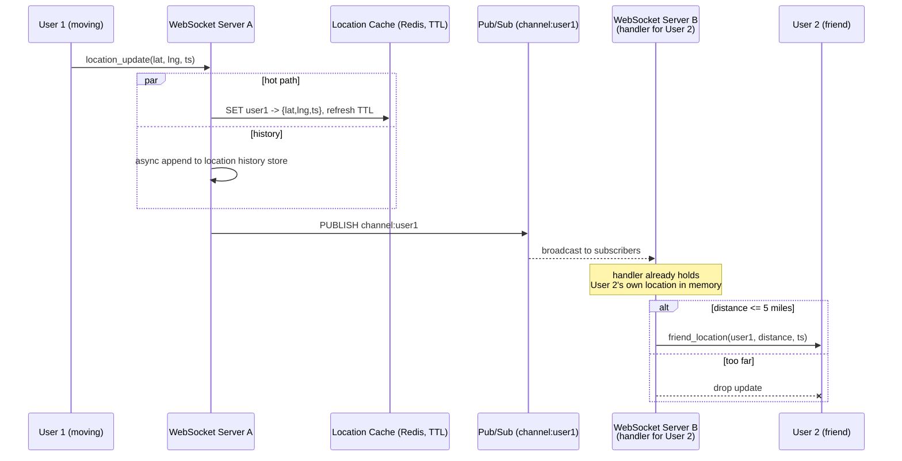

## Overview

A [Proximity Service](proximity-service) answers "what businesses are near me?" against data that almost never moves — a restaurant's coordinates change maybe once in its lifetime, so the system can afford to build a geospatial index once and serve millions of reads from it. **Nearby Friends** (Facebook's feature of the same name, Snap Map, Find My) inverts that: every single entity in the dataset is a person who moves continuously, reporting a fresh location every few seconds. The dataset is no longer something you index and query; it's a firehose you route. That reframing — from *read-heavy indexed lookup* to *high-write real-time fan-out* — is the entire design problem, and it changes which component sits at the center: not a spatial index, but a message bus.

## Functional Requirements

- A user who opts in sees a list of friends currently within a configurable radius (5 miles is the usual working number), each entry showing the distance and the timestamp when that distance was last computed.
- The list updates continuously, within a few seconds of a friend actually moving — not on pull-to-refresh.
- A friend who stops reporting (app backgrounded, phone offline) disappears from the list after an inactivity window (~10 minutes), rather than being shown at a stale last-known position.
- Location history is retained separately, for analytics and ML, but is explicitly *not* on the path that renders the nearby list.

## Non-Functional Requirements

- **Low latency.** A location update should reach a nearby friend's screen in seconds. This is a soft real-time system: late data is nearly worthless, because by the time it arrives the friend has moved.
- **Eventual consistency is fine.** Two replicas disagreeing about a user's position for a few seconds is invisible to the product. There is no read-your-writes requirement and no cross-entity invariant to protect.
- **Lossy is acceptable.** Dropping an occasional update is a non-event — the next one arrives 30 seconds later and supersedes it. This single concession unlocks most of the design's cheapest choices.
- **Availability over durability on the hot path.** Losing the entire current-location dataset costs one refresh cycle of degraded lists, not data loss.

### Where the write rate comes from

Take 100M daily active users of the feature, 10% concurrent, each reporting every 30 seconds (a refresh interval chosen deliberately: walking speed is 3–4 mph, so 30 seconds of movement barely changes who counts as "nearby"):

```
concurrent users      = 100M * 10%          = 10M
location update QPS   = 10M / 30s           = ~334,000 writes/sec
```

Now the fan-out. Average 400 friends, of whom roughly 10% are online and near enough to care:

```
pushes/sec = 334,000 * 400 * 10%            = ~14,000,000 pushes/sec
```

334K writes per second is a big but tractable number. **14 million pushes per second is the actual system.** Every architectural decision below exists to make that multiplication cheap.

## Why Persisting and Re-Querying Doesn't Scale

The instinct carried over from a proximity service is: write each location update to a table, maintain a geospatial index on it, and have each client periodically query "friends within 5 miles of me." Both halves of that break here.

**Write amplification on the index.** A geohash, quadtree, or S2 index (covered in depth in [Proximity Service](proximity-service)) is a structure optimized for the assumption that entries are inserted once and read many times. Under 334K writes per second, every update potentially moves a row between cells, which means an index mutation, a rebalance in the tree case, and B-tree page churn beneath it — plus replication of all that churn to every replica. You are paying full durable-write cost for a value whose useful lifetime is 30 seconds.

**Query amplification on the read side.** Even with a perfect index, "friends within 5 miles" is not a pure spatial query: it's a spatial query *intersected with a social graph*. Ten million clients polling for a 400-way friend-list join against a constantly-mutating index every few seconds is a second, independent 334K+ QPS load on the same storage.

**The data doesn't deserve a database.** Only one location per user matters — the latest. History is a separate, append-only concern that can be written asynchronously to a store built for heavy sequential writes (Cassandra, or a sharded relational table keyed by `user_id`) and never read by this feature. The hot path needs exactly one value per user, with an expiry, and nothing else.

## The In-Memory Location Cache

Replace the indexed table with a key-value cache holding one entry per active user:

| key | value |
|---|---|
| `user_id` | `{latitude, longitude, timestamp}` |

Redis (or any KV store with TTL) fits precisely:

- **One entry per user, overwritten in place.** No index to maintain, no rows accumulating — the write is an O(1) `SET`, not an index mutation.
- **TTL is the presence mechanism.** Set the TTL to the inactivity window and refresh it on every update. A user who stops reporting simply evaporates from the cache, which is exactly the "inactive friends disappear" requirement implemented for free — no separate reaper job, no `is_online` column to keep truthful.
- **Trivially shardable by `user_id`.** Each user's location is independent of every other's, so 334K writes/sec spread evenly across a handful of shards with no cross-shard coordination. Add replicas per shard for failover.
- **Loss is recoverable by doing nothing.** If a shard dies, replace it empty. It refills within one 30-second update cycle; affected users miss a cycle or two of friend positions. Compare that to losing a shard of a durable index.

At ~100 bytes per entry, 10M concurrent users is about 1 GB of location data — a rounding error. Memory is never the constraint here; write throughput and push throughput are.

## WebSockets, Not Polling

Polling is doubly wrong for this workload. It burns mobile radio and battery on requests that usually return nothing new, and it caps freshness at the poll interval, which for a "who's near me right now" feature is the whole product.

Each client instead holds one long-lived, bidirectional **WebSocket** connection to a stateful server, and that single connection carries traffic in both directions:

| Message | Direction | Purpose |
|---|---|---|
| `location_update` | client → server | Periodic lat/lng/timestamp report. |
| `friend_location` | server → client | A friend's new position and distance, pushed as it happens. |
| `init` | client → server | Sent on connect with the user's current location. |
| `init_response` | server → client | Locations of all currently-nearby online friends, to seed the list. |
| `subscribe` / `unsubscribe` | client → server | Friend added, removed, or opted in/out of location sharing. |

The server-side connection handler is not just a socket — it's the per-user state that makes fan-out cheap. It caches that user's own latest location in process memory, so when a friend's update arrives, the distance check is arithmetic on two in-memory points, with no cache round trip at all. Servers holding connections are stateful, which brings the usual operational obligations: connection draining before a node is removed, careful rolling deploys, and a load balancer that understands both. The broader mechanics of pushing to millions of persistent connections are covered in [Scaling Real-Time Messaging](scaling-real-time-messaging-ordering-and-fan-out).

## Pub/Sub Fan-out

The remaining question is routing: when user A moves, how does the update reach the WebSocket handlers of A's 400 friends, which are scattered across hundreds of servers? Having the receiving server look up friends and open direct connections to peer servers rebuilds a mesh by hand. Instead, put a **message broker** between them and give every user their own channel.

- On publish: a user's WebSocket server writes the new location to that user's channel.
- On subscribe: at connection setup, a user's handler subscribes to **every friend's** channel — online or not.

Subscribing to inactive friends looks wasteful and is deliberate. An idle channel costs a small hash-table and linked-list entry (~20 bytes per subscriber) and *zero* CPU, since nothing is published to it. Paying that memory removes an entire class of coordination: no subscribe-on-friend-comes-online, no unsubscribe-on-friend-goes-offline, no presence events racing against location events.

This is the ephemeral, fire-and-forget end of the spectrum described in [Message Brokers: Queues vs. Log-Based Streaming](message-brokers-queues-vs-logs). Redis pub/sub is a good fit exactly *because* it is not a log: messages are pushed to current subscribers and discarded, with nothing retained, no offsets to track, and no replay. For a value that's stale in 30 seconds, durability would be pure cost. A log-based broker like Kafka would be the wrong tool — partition-per-user is infeasible at 100M users, and retaining location updates you will never re-read is expense with no payoff.



Two properties of this flow matter. First, **the distance filter runs at the subscriber, not the publisher** — the publishing server has no idea where the 400 friends are, and asking would mean a 400-key cache read per update, 334K times per second. Pushing the check to the handler that already knows its own user's position makes it free. Second, **the database is nowhere on the delivery path**; the history write is fire-and-forget and can fall behind or fail without affecting what users see.

### Scaling the routing layer

Memory for channels is modest — 100M channels at ~100 active subscribers each is roughly 200 GB, a couple of servers. CPU is the real bottleneck: at a conservative 100K subscriber-pushes per second per node, 14M pushes/sec needs on the order of 140 nodes. Channels are independent, so shard them by publisher `user_id` across a consistent hash ring, with the ring itself stored in a service discovery system (etcd, ZooKeeper) that every WebSocket server caches locally and watches for changes.

Treat that cluster as **stateful**, not as autoscaling stateless capacity. The messages are ephemeral, but the *subscriber list per channel* is state: resizing the ring relocates channels, and every affected subscriber must unsubscribe from the old node and resubscribe on the new one. A resize therefore produces a resubscription stampede and a window of dropped updates — tolerable given the lossy requirement, but a reason to over-provision for peak and resize during the daily trough. Replacing a single dead node is far cheaper: only that node's channels move.

## Privacy

Location is among the most sensitive data a product can hold, and the design must make oversharing structurally difficult rather than policy-dependent.

- **Mutual friendship, plus explicit opt-in, gates every subscription.** Subscriptions are established from the authoritative friend list at connection setup; a client cannot ask to subscribe to an arbitrary `user_id`. Opting out fires an `unsubscribe` for every subscriber, using the same path as unfriending.
- **Bidirectional only.** Friendship here is symmetric, unlike a follower graph — which is also why there is no celebrity fan-out problem. A hard cap on friends (Facebook's is 5,000) bounds the worst case, and "whale" users spread across ~140 pub/sub nodes don't create a hotspot.
- **Coarse data on the wire.** Clients need a *distance* and a timestamp, not raw coordinates. Sending the derived distance rather than exact lat/lng limits what a compromised client or intercepted payload reveals.
- **History is separately governed.** The history store has different retention, access, and deletion requirements (GDPR/CCPA erasure applies to it, and it's the store analysts and ML pipelines touch). Keeping it off the hot path also keeps it behind its own authorization boundary.
- **Nearby strangers is a different feature with a different consent model.** Showing opted-in strangers means abandoning per-user channels for **geohash-cell channels**: publish to the channel for your current cell, and subscribe to your cell plus its eight neighbors so border cases work. That reuses the cell decomposition from [Proximity Service](proximity-service) — but note it shares your position with people you have no relationship with, so it warrants its own explicit opt-in, never inheritance from the friends setting.

## Trade-offs

- **Storing current locations only in an expiring in-memory cache trades durability for throughput and free presence** — losing a shard costs a refresh cycle of stale friend lists, and TTL expiry doubles as the inactivity timeout, removing a reaper job and an `is_online` column that would otherwise need to stay truthful.
- **Subscribing to every friend's channel, including offline ones, trades memory for a much simpler control plane** — ~20 bytes per idle subscriber against eliminating subscribe-on-online / unsubscribe-on-offline coordination and the races between presence and location events. Memory is not the bottleneck here; CPU is.
- **Filtering by distance at the subscriber rather than the publisher trades redundant work for avoided reads** — every one of 400 handlers computes a distance and most discard the update, but the alternative is a 400-key cache lookup per publish, 334K times a second.
- **Ephemeral pub/sub over a log-based broker trades replay and durability for cost** — a location update is worthless 30 seconds later, so retention, offsets, and consumer-group bookkeeping would be pure overhead; the price is that a subscriber disconnected mid-update simply misses it.
- **Stateful WebSocket and pub/sub tiers trade elastic autoscaling for delivery guarantees** — both require connection draining, careful rolling deploys, and planned resizes at low traffic, so the clusters run over-provisioned for peak rather than tracking load.
- **A 30-second refresh interval trades precision for a 30x reduction in load** — justified by walking speed, but it silently breaks if the feature is later extended to vehicles, where the same interval means friends appear up to a half-mile from where they actually are.

## Interview Questions

- A proximity service and nearby friends both answer "what's within radius R?" — why does one get built around a spatial index and the other around a message bus?
- The location cache holds one entry per user with a TTL. Which two separate requirements does that TTL satisfy, and what would you have to build if the store didn't support expiry?
- Why is the distance check performed by the subscriber's connection handler rather than by the server that receives the location update?
- The system publishes ~334K updates/sec but delivers ~14M pushes/sec. Which of those two numbers determines your cluster sizing, and which component does it size?
- Redis pub/sub drops messages that have no subscribers and retains nothing. Argue why that's the correct property for this workload, then describe a change to the requirements that would make it the wrong choice.

## References

- [Alex Xu and Sahn Lam, "System Design Interview – An Insider's Guide, Volume 2" (ByteByteGo, 2022) — Chapter 2, "Nearby Friends"](https://bytebytego.com)
- [Redis Documentation — Pub/Sub](https://redis.io/docs/latest/develop/pubsub/)
- [IETF, "RFC 6455 — The WebSocket Protocol"](https://datatracker.ietf.org/doc/html/rfc6455)
- [TechCrunch — "Facebook Launches Nearby Friends" (2014)](https://techcrunch.com/2014/04/17/facebook-nearby-friends/)
