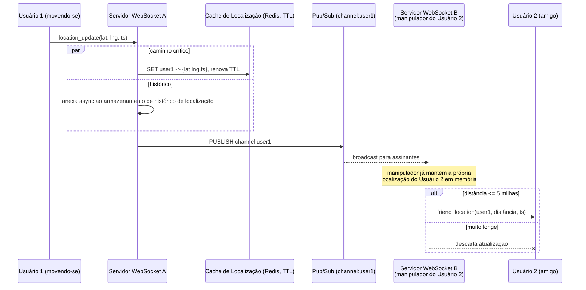

## Visão Geral

Um [Proximity Service](proximity-service) responde "quais estabelecimentos estão perto de mim?" contra dados que quase nunca se movem — as coordenadas de um restaurante mudam talvez uma vez em sua vida, então o sistema pode se dar ao luxo de construir um índice geoespacial uma vez e servir milhões de leituras a partir dele. **Nearby Friends** (o recurso de mesmo nome do Facebook, Snap Map, Find My) inverte isso: cada entidade individual no conjunto de dados é uma pessoa que se move continuamente, reportando uma localização nova a cada poucos segundos. O conjunto de dados não é mais algo que você indexa e consulta; é uma mangueira de incêndio que você roteia. Esse reenquadramento — de *busca indexada com foco em leitura* para *fan-out em tempo real com alta escrita* — é o problema de design inteiro, e muda qual componente fica no centro: não um índice espacial, mas um barramento de mensagens.

## Requisitos Funcionais

- Um usuário que opta por participar vê uma lista de amigos atualmente dentro de um raio configurável (5 milhas é o número de trabalho usual), cada entrada mostrando a distância e o timestamp de quando essa distância foi calculada pela última vez.
- A lista se atualiza continuamente, dentro de alguns segundos de um amigo realmente se mover — não em um puxar-para-atualizar.
- Um amigo que para de reportar (app em segundo plano, telefone offline) desaparece da lista após uma janela de inatividade (~10 minutos), em vez de ser mostrado em uma posição desatualizada.
- O histórico de localização é retido separadamente, para analytics e ML, mas explicitamente *não* está no caminho que renderiza a lista de proximidade.

## Requisitos Não Funcionais

- **Baixa latência.** Uma atualização de localização deve chegar à tela de um amigo próximo em segundos. Este é um sistema de tempo real suave: dados atrasados quase não valem nada, porque quando chegam o amigo já se moveu.
- **Consistência eventual está bem.** Duas réplicas discordando sobre a posição de um usuário por alguns segundos é invisível para o produto. Não há requisito de ler-suas-próprias-escritas nem invariante entre entidades para proteger.
- **Perdas são aceitáveis.** Perder uma atualização ocasional é um não-evento — a próxima chega 30 segundos depois e a substitui. Essa única concessão desbloqueia a maioria das escolhas mais baratas do design.
- **Disponibilidade sobre durabilidade no caminho crítico.** Perder todo o conjunto de dados de localização atual custa um ciclo de atualização de listas degradadas, não perda de dados.

### De onde vem a taxa de escrita

Considere 100 milhões de usuários ativos diários do recurso, 10% concorrentes, cada um reportando a cada 30 segundos (um intervalo de atualização escolhido deliberadamente: velocidade de caminhada é 3-4 mph, então 30 segundos de movimento mal muda quem conta como "próximo"):

```
usuários concorrentes      = 100M * 10%          = 10M
QPS de atualização de local = 10M / 30s           = ~334.000 escritas/seg
```

Agora o fan-out. Em média 400 amigos, dos quais aproximadamente 10% estão online e perto o suficiente para importar:

```
pushes/seg = 334.000 * 400 * 10%            = ~14.000.000 pushes/seg
```

334 mil escritas por segundo é um número grande mas tratável. **14 milhões de pushes por segundo é o sistema real.** Toda decisão arquitetural abaixo existe para tornar essa multiplicação barata.

## Por Que Persistir e Reconsultar Não Escala

O instinto herdado de um serviço de proximidade é: escreva cada atualização de localização em uma tabela, mantenha um índice geoespacial sobre ela, e faça cada cliente consultar periodicamente "amigos dentro de 5 milhas de mim." Ambas as metades disso quebram aqui.

**Amplificação de escrita no índice.** Um índice geohash, quadtree, ou S2 (coberto em profundidade em [Proximity Service](proximity-service)) é uma estrutura otimizada sob a suposição de que entradas são inseridas uma vez e lidas muitas vezes. Sob 334 mil escritas por segundo, cada atualização potencialmente move uma linha entre células, o que significa uma mutação de índice, um rebalanceamento no caso de árvore, e churn de páginas B-tree por baixo — mais replicação de todo esse churn para toda réplica. Você está pagando o custo total de escrita durável por um valor cuja vida útil é 30 segundos.

**Amplificação de consulta no lado da leitura.** Mesmo com um índice perfeito, "amigos dentro de 5 milhas" não é uma consulta espacial pura: é uma consulta espacial *intersectada com um grafo social*. Dez milhões de clientes fazendo polling para um join de lista de amigos de 400 vias contra um índice constantemente mutante a cada poucos segundos é uma segunda carga independente de 334 mil+ QPS na mesma infraestrutura de armazenamento.

**Os dados não merecem um banco de dados.** Apenas uma localização por usuário importa — a mais recente. Histórico é uma preocupação separada, append-only, que pode ser escrita assincronamente em um armazenamento construído para escritas sequenciais pesadas (Cassandra, ou uma tabela relacional fragmentada chaveada por `user_id`) e nunca lida por este recurso. O caminho crítico precisa de exatamente um valor por usuário, com uma expiração, e nada mais.

## O Cache de Localização em Memória

Substitua a tabela indexada por um cache chave-valor mantendo uma entrada por usuário ativo:

| chave | valor |
|---|---|
| `user_id` | `{latitude, longitude, timestamp}` |

Redis (ou qualquer armazenamento KV com TTL) se encaixa precisamente:

- **Uma entrada por usuário, sobrescrita no local.** Nenhum índice para manter, nenhuma linha se acumulando — a escrita é um `SET` O(1), não uma mutação de índice.
- **TTL é o mecanismo de presença.** Configure o TTL para a janela de inatividade e o renove a cada atualização. Um usuário que para de reportar simplesmente evapora do cache, o que é exatamente o requisito "amigos inativos desaparecem" implementado de graça — sem job de limpeza separado, sem coluna `is_online` para manter verdadeira.
- **Trivialmente fragmentável por `user_id`.** A localização de cada usuário é independente de qualquer outra, então 334 mil escritas/seg se distribuem uniformemente entre um punhado de fragmentos sem coordenação entre fragmentos. Adicione réplicas por fragmento para failover.
- **Perda é recuperável sem fazer nada.** Se um fragmento morre, substitua-o vazio. Ele se preenche novamente dentro de um ciclo de atualização de 30 segundos; usuários afetados perdem um ou dois ciclos de posições de amigos. Compare isso com perder um fragmento de um índice durável.

A cerca de 100 bytes por entrada, 10 milhões de usuários concorrentes é cerca de 1 GB de dados de localização — um erro de arredondamento. Memória nunca é a restrição aqui; throughput de escrita e de push são.

## WebSockets, Não Polling

Polling está duplamente errado para essa carga de trabalho. Ele queima rádio móvel e bateria em requisições que geralmente não retornam nada novo, e limita o frescor ao intervalo de polling, que para um recurso de "quem está perto de mim agora" é o produto inteiro.

Cada cliente, em vez disso, mantém uma única conexão **WebSocket** bidirecional de longa duração com um servidor stateful, e essa única conexão carrega tráfego em ambas as direções:

| Mensagem | Direção | Propósito |
|---|---|---|
| `location_update` | cliente → servidor | Relatório periódico de lat/lng/timestamp. |
| `friend_location` | servidor → cliente | A nova posição e distância de um amigo, enviada assim que acontece. |
| `init` | cliente → servidor | Enviado na conexão com a localização atual do usuário. |
| `init_response` | servidor → cliente | Localizações de todos os amigos online atualmente próximos, para preencher a lista. |
| `subscribe` / `unsubscribe` | cliente → servidor | Amigo adicionado, removido, ou optou por entrar/sair do compartilhamento de localização. |

O manipulador de conexão do lado do servidor não é apenas um socket — é o estado por usuário que torna o fan-out barato. Ele guarda a própria localização mais recente desse usuário em memória do processo, então quando a atualização de um amigo chega, a verificação de distância é aritmética sobre dois pontos em memória, sem nenhuma ida e volta ao cache. Servidores mantendo conexões são stateful, o que traz as obrigações operacionais usuais: drenagem de conexão antes de um nó ser removido, deploys progressivos cuidadosos, e um load balancer que entenda ambos. A mecânica mais ampla de fazer push para milhões de conexões persistentes é coberta em [Scaling Real-Time Messaging](scaling-real-time-messaging-ordering-and-fan-out).

## Fan-out via Pub/Sub

A questão restante é roteamento: quando o usuário A se move, como a atualização chega aos manipuladores WebSocket dos 400 amigos de A, que estão espalhados por centenas de servidores? Fazer o servidor receptor procurar amigos e abrir conexões diretas com servidores pares reconstrói uma malha manualmente. Em vez disso, coloque um **message broker** entre eles e dê a cada usuário seu próprio canal.

- Ao publicar: o servidor WebSocket de um usuário escreve a nova localização no canal desse usuário.
- Ao se inscrever: na configuração da conexão, o manipulador de um usuário se inscreve no canal de **cada amigo** — online ou não.

Inscrever-se em amigos inativos parece um desperdício e é deliberado. Um canal ocioso custa uma pequena entrada de hash-table e lista encadeada (~20 bytes por assinante) e *zero* CPU, já que nada é publicado nele. Pagar essa memória remove toda uma classe de coordenação: sem inscrição-quando-amigo-fica-online, sem cancelamento-quando-amigo-fica-offline, sem eventos de presença correndo contra eventos de localização.

Este é o extremo efêmero e fire-and-forget do espectro descrito em [Message Brokers: Queues vs. Log-Based Streaming](message-brokers-queues-vs-logs). O pub/sub do Redis é uma boa opção precisamente *porque* não é um log: mensagens são enviadas aos assinantes atuais e descartadas, sem nada retido, sem offsets a rastrear, e sem replay. Para um valor que fica obsoleto em 30 segundos, durabilidade seria puro custo. Um broker baseado em log como o Kafka seria a ferramenta errada — partição-por-usuário é inviável a 100 milhões de usuários, e reter atualizações de localização que você nunca vai reler é despesa sem retorno.



Duas propriedades desse fluxo importam. Primeiro, **o filtro de distância roda no assinante, não no publicador** — o servidor que publica não tem ideia de onde estão os 400 amigos, e perguntar significaria uma leitura de cache de 400 chaves por atualização, 334 mil vezes por segundo. Empurrar a verificação para o manipulador que já conhece a posição de seu próprio usuário torna isso gratuito. Segundo, **o banco de dados não está em nenhum lugar do caminho de entrega**; a escrita de histórico é fire-and-forget e pode atrasar ou falhar sem afetar o que os usuários veem.

### Escalando a camada de roteamento

Memória para canais é modesta — 100 milhões de canais com ~100 assinantes ativos cada é aproximadamente 200 GB, alguns servidores. CPU é o gargalo real: a um conservador 100 mil pushes-por-assinante por segundo por nó, 14 milhões de pushes/seg precisam da ordem de 140 nós. Canais são independentes, então fragmente-os por `user_id` do publicador em um anel de hash consistente, com o anel em si armazenado em um sistema de service discovery (etcd, ZooKeeper) que todo servidor WebSocket armazena em cache localmente e observa por mudanças.

Trate esse cluster como **stateful**, não como capacidade autoscaling sem estado. As mensagens são efêmeras, mas a *lista de assinantes por canal* é estado: redimensionar o anel realoca canais, e todo assinante afetado deve cancelar a inscrição do nó antigo e reinscrever-se no novo. Um redimensionamento, portanto, produz uma corrida de reinscrição e uma janela de atualizações perdidas — tolerável dado o requisito de perda, mas uma razão para superprovisionar para o pico e redimensionar durante o vale diário. Substituir um único nó morto é muito mais barato: apenas os canais desse nó se movem.

## Privacidade

Localização está entre os dados mais sensíveis que um produto pode possuir, e o design deve tornar o compartilhamento excessivo estruturalmente difícil em vez de dependente de política.

- **Amizade mútua, mais opt-in explícito, protege cada inscrição.** Inscrições são estabelecidas a partir da lista de amigos autoritativa na configuração da conexão; um cliente não pode pedir para se inscrever em um `user_id` arbitrário. Optar por sair dispara um `unsubscribe` para cada assinante, usando o mesmo caminho que desfazer amizade.
- **Apenas bidirecional.** Amizade aqui é simétrica, ao contrário de um grafo de seguidores — o que também é por que não há problema de fan-out de celebridade. Um limite rígido de amigos (o do Facebook é 5.000) limita o pior caso, e usuários "baleia" espalhados por ~140 nós pub/sub não criam um hotspot.
- **Dados grosseiros no fio.** Clientes precisam de uma *distância* e um timestamp, não coordenadas brutas. Enviar a distância derivada em vez de lat/lng exatos limita o que um cliente comprometido ou um payload interceptado revela.
- **Histórico é governado separadamente.** O armazenamento de histórico tem requisitos diferentes de retenção, acesso e exclusão (exclusão do GDPR/CCPA se aplica a ele, e é o armazenamento que analistas e pipelines de ML tocam). Mantê-lo fora do caminho crítico também o mantém atrás de sua própria fronteira de autorização.
- **Estranhos próximos é um recurso diferente com um modelo de consentimento diferente.** Mostrar estranhos que optaram por participar significa abandonar canais por usuário para **canais de célula geohash**: publique no canal da sua célula atual, e inscreva-se na sua célula mais suas oito vizinhas para que casos de borda funcionem. Isso reutiliza a decomposição de células de [Proximity Service](proximity-service) — mas note que isso compartilha sua posição com pessoas com quem você não tem relacionamento, então merece seu próprio opt-in explícito, nunca herdado da configuração de amigos.

## Trade-offs

- **Armazenar localizações atuais apenas em um cache em memória com expiração troca durabilidade por throughput e presença gratuita** — perder um fragmento custa um ciclo de atualização de listas de amigos desatualizadas, e a expiração do TTL serve também como o timeout de inatividade, removendo um job de limpeza e uma coluna `is_online` que de outra forma precisaria se manter verdadeira.
- **Inscrever-se no canal de cada amigo, incluindo os offline, troca memória por um plano de controle muito mais simples** — ~20 bytes por assinante ocioso contra eliminar a coordenação inscrição-ao-ficar-online / cancelamento-ao-ficar-offline e as corridas entre eventos de presença e de localização. Memória não é o gargalo aqui; CPU é.
- **Filtrar por distância no assinante em vez de no publicador troca trabalho redundante por leituras evitadas** — cada um dos 400 manipuladores calcula uma distância e a maioria descarta a atualização, mas a alternativa é uma busca de cache de 400 chaves por publicação, 334 mil vezes por segundo.
- **Pub/sub efêmero em vez de um broker baseado em log troca replay e durabilidade por custo** — uma atualização de localização não vale nada 30 segundos depois, então retenção, offsets e contabilidade de consumer-group seriam puro overhead; o preço é que um assinante desconectado no meio de uma atualização simplesmente a perde.
- **Camadas de WebSocket e pub/sub stateful trocam autoscaling elástico por garantias de entrega** — ambas exigem drenagem de conexão, deploys progressivos cuidadosos, e redimensionamentos planejados em baixo tráfego, então os clusters rodam superprovisionados para o pico em vez de acompanhar a carga.
- **Um intervalo de atualização de 30 segundos troca precisão por uma redução de 30x na carga** — justificado pela velocidade de caminhada, mas quebra silenciosamente se o recurso for estendido para veículos depois, onde o mesmo intervalo significa que amigos aparecem até meia milha de onde realmente estão.

## Perguntas de Entrevista

- Um serviço de proximidade e nearby friends ambos respondem "o que está dentro do raio R?" — por que um é construído em torno de um índice espacial e o outro em torno de um barramento de mensagens?
- O cache de localização mantém uma entrada por usuário com um TTL. Quais dois requisitos separados esse TTL satisfaz, e o que você teria que construir se o armazenamento não suportasse expiração?
- Por que a verificação de distância é realizada pelo manipulador de conexão do assinante em vez do servidor que recebe a atualização de localização?
- O sistema publica ~334 mil atualizações/seg mas entrega ~14 milhões de pushes/seg. Qual desses dois números determina o dimensionamento do seu cluster, e qual componente ele dimensiona?
- O pub/sub do Redis descarta mensagens que não têm assinantes e não retém nada. Argumente por que essa é a propriedade correta para essa carga de trabalho, e então descreva uma mudança nos requisitos que tornaria isso a escolha errada.

## Referências

- [Alex Xu e Sahn Lam, "System Design Interview – An Insider's Guide, Volume 2" (ByteByteGo, 2022) — Capítulo 2, "Nearby Friends"](https://bytebytego.com)
- [Documentação do Redis — Pub/Sub](https://redis.io/docs/latest/develop/pubsub/)
- [IETF, "RFC 6455 — The WebSocket Protocol"](https://datatracker.ietf.org/doc/html/rfc6455)
- [TechCrunch — "Facebook Launches Nearby Friends" (2014)](https://techcrunch.com/2014/04/17/facebook-nearby-friends/)
