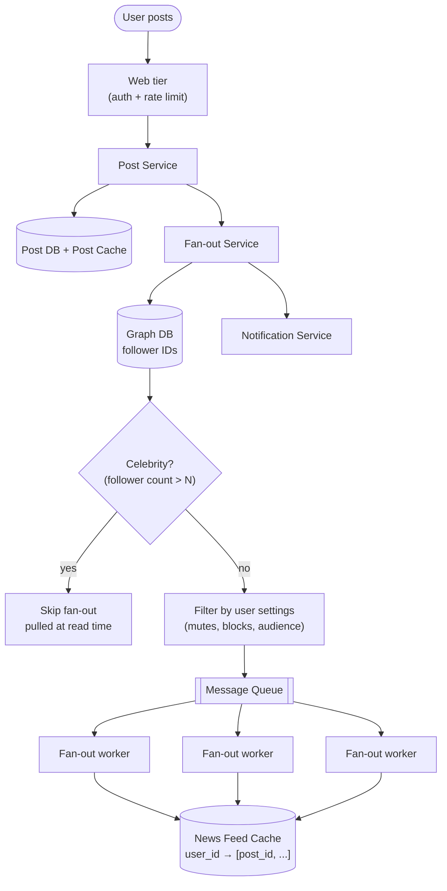

## Overview

A news feed system looks like one product feature and is actually two systems glued together at a cache. **Feed publishing** is a write path: a user posts once, and that single post has to reach the feeds of everyone who follows them — potentially millions of people — which makes it a fan-out and throughput problem. **Feed retrieval** is a read path: a user opens the app and expects a fully rendered, personalized, media-rich feed in under a couple hundred milliseconds, which makes it a caching and hydration problem. The two paths have opposite cost profiles, and almost every interesting decision in this design comes from choosing which of them absorbs the work.

## Functional Requirements

Scope the prompt down before designing anything. A defensible MVP:

- **Publish a post** containing text and optional media (images, video), from web or mobile.
- **Retrieve a personalized feed** of posts from the accounts a user follows.
- **Follow / unfollow** an account, which changes who a future post fans out to.
- **Reverse-chronological ordering** as the baseline, with ranking treated as a pluggable layer on top (covered below).

Explicitly out of scope for a 45-minute session: comments, likes and their counters, stories, ads insertion, and search. Naming them as deferred is worth more than half-designing them.

## Non-Functional Requirements

Every quality here needs a number, either supplied by the interviewer or stated as an assumption:

- **Scale.** 10M DAU, up to 5,000 friends/followers per ordinary account, and celebrity accounts with tens of millions of followers. At 10M DAU with a handful of feed refreshes each, the read path sits in the low thousands of QPS sustained and several times that at peak.
- **Feed retrieval latency.** A feed request should complete in **under ~200ms at p99** — this is the number that forces feeds to be precomputed rather than assembled by querying every followed account at read time.
- **Freshness ("real-time-ish").** A post should appear in an ordinary follower's feed within seconds, not minutes. This is *not* a hard real-time requirement: unlike chat, nobody can tell the difference between 200ms and 3 seconds of fan-out lag, and that slack is exactly what makes asynchronous fan-out via a message queue acceptable.
- **High availability over strict consistency.** Serving a feed that's missing the last five seconds of posts is fine; refusing to serve a feed is not. The feed is an AP system.
- **Read-heavy by orders of magnitude.** Feed reads outnumber posts by roughly 100:1, which is the structural justification for paying extra cost on the write path to make the read path cheap.

## The Two APIs

The entire design hangs off two HTTP endpoints, and it's worth writing them down because their asymmetry mirrors the architecture:

**Feed publishing:**

```
POST /v1/me/feed
Authorization: Bearer <auth_token>

{ "content": "Hello", "media_ids": ["m_8f2a", "m_8f2b"] }
```

The request carries text plus *references* to already-uploaded media, never the bytes themselves. Response is `202 Accepted` with the new `post_id` — the post is durably persisted, but fan-out to followers happens asynchronously after the response returns.

**Feed retrieval:**

```
GET /v1/me/feed?cursor=<opaque_cursor>&limit=20
Authorization: Bearer <auth_token>
```

Cursor-based pagination, not offset-based: a feed is a continuously-changing list, and `OFFSET 40` on a list that gained six new items since the last page means the client sees six duplicates. The cursor encodes the position of the last item returned (typically a `post_id` plus its score/timestamp).

The web tier in front of both endpoints is stateless and handles authentication plus [rate limiting](rate-limiting) — a per-user cap on posts per minute is the primary defense against spam, and it belongs at the edge, before any fan-out work is triggered.

## Feed Publishing: Fan-out on Write vs. Fan-out on Read

The base trade-off between pushing content to recipients at write time versus pulling it at read time is worked through in [Scaling Real-Time Messaging](scaling-real-time-messaging-ordering-and-fan-out); what changes for a news feed is that the fan-out target is not a bounded chat room but a follower graph with a power-law degree distribution.

**Fan-out on write (push).** When a post is created, the system immediately appends its ID to the precomputed feed of every follower. Reads become trivial — the feed already exists, so serving it is a single cache range read. The costs are twofold: an account with millions of followers generates millions of cache writes from one user action (the **hotkey problem**), and every inactive follower's feed gets maintained forever by users who will never log in to read it.

**Fan-out on read (pull).** Nothing is precomputed. When a user opens the app, the system fetches their follow list, queries recent posts from each followed account, merges, and returns. No hotkey problem and no wasted work on dormant accounts — but the read path now does a scatter-gather across up to 5,000 accounts on the request that has a 200ms budget, which is exactly backwards for a system where reads outnumber writes 100:1.

**The hybrid model is the answer, and the split is on the author, not the reader.** Ordinary accounts fan out on write. Accounts above a follower threshold — celebrities, brands, news organizations — are marked and *skipped* by the fan-out service entirely. At read time, the feed service reads the user's precomputed feed cache and then separately pulls recent posts from the small number of celebrity accounts that user follows, merging the two lists before returning. A user typically follows a handful of celebrities, so the pull side is a bounded, cache-friendly lookup rather than an unbounded scatter-gather.

## The Fan-out Service

The fan-out service is the machinery of the write path, and it is deliberately asynchronous:



Walking the path:

1. **Fetch follower IDs from a graph database.** Follower/following relationships are recursive edge traversals ("who follows me", "friends of friends"), which is the access pattern graph stores are built for and the one relational joins degrade on.
2. **Filter the recipient list.** Mutes, blocks, and audience restrictions ("friends except X") are applied *here*, at fan-out time, not at read time. Filtering once per post beats filtering on every subsequent feed read.
3. **Enqueue `(post_id, recipient_ids)` onto a message queue.** This is the decoupling point: the `POST` returned to the client long before this work runs, and a fan-out backlog degrades freshness rather than availability. It also gives the write path natural back-pressure — a celebrity-adjacent burst grows the queue instead of melting the cache tier.
4. **Fan-out workers append to each recipient's feed cache.** Workers scale horizontally with queue depth and are idempotent, since at-least-once queue delivery means the same `(post_id, user_id)` pair will occasionally be written twice.

### What lives in the per-user feed cache

The single most important modeling decision on the write path: **the feed cache stores IDs, not objects.** Each entry is a `<post_id, author_id>` pair, held in a per-user sorted structure keyed by the feed owner and scored by timestamp (or ranking score) — Redis sorted sets are the canonical fit, since `ZADD` on publish and `ZREVRANGEBYSCORE` on read map exactly onto append and paginated fetch.

Two consequences follow. First, storing full post objects in every follower's feed would duplicate the same content millions of times across the cache tier; storing an 8-byte ID keeps the memory footprint proportional to the *feed structure* rather than the *content volume*. Second, because IDs are cheap, the per-user feed can be **capped at a configurable length** — a few hundred entries, trimmed on write. Virtually nobody scrolls past a few hundred posts, and the rare user who does falls through to a slower database-backed path. The cache hit rate stays high precisely because the truncation matches real access patterns.

## Feed Retrieval and Hydration

Reading a feed is a two-phase operation, and conflating them is a common design error:

1. **Fetch the ID list.** Read a page of `post_id`s from the user's feed cache, merge in recent posts pulled from the celebrity accounts they follow, sort, and truncate to the page size.
2. **Hydrate.** A list of IDs is not a renderable feed — the client needs author usernames and avatars, post text, media URLs, and counters. The feed service batch-fetches these from the content cache, user cache, and counter caches (a multi-get per cache, not one lookup per post), assembles the JSON, and returns it.

Hydration is why the ID-only feed cache works: the expensive, high-cardinality content is stored *once* in a shared cache and joined in at read time, while the per-user structure stays tiny. It's also where the read path's fan-out lives — a 20-post page means a handful of batched cache reads, not 20 sequential round-trips.

## Media Content

Post media never travels through the post service. The client requests a presigned URL, uploads the bytes directly to object storage, and sends only the resulting `media_id` in the publish request — the [direct-upload pattern](object-storage-and-direct-upload). On the read path, hydrated posts carry CDN URLs rather than origin URLs, so images and video are served from an edge PoP near the viewer.

This matters disproportionately for feeds: the JSON payload of a 20-post page is a few kilobytes, while the media it references is tens of megabytes. Keeping the metadata path in the application tier and the byte path on the CDN means the part of the system you scale for QPS and the part you scale for bandwidth are entirely separate — see [Caching Strategies and CDNs](caching-strategies-and-cdns).

## The Cache Tier

"Cache" in a feed system is not one thing. It's a tier with five distinct layers, each with its own invalidation rules and eviction pressure:

| Layer | Contents | Access pattern |
|---|---|---|
| **News Feed** | Per-user ordered `post_id` lists | Append on fan-out, range-read on retrieval |
| **Content** | Post objects; hot posts kept in a separate hot cache | Read-heavy, written once |
| **Social Graph** | Follower/following edges, mute and block lists | Read on every fan-out; changes rarely |
| **Action** | Whether a given user liked/replied to a given post | Read per rendered post, written on interaction |
| **Counters** | Like, reply, follower, and following counts | Extremely write-heavy; usually approximate |

Splitting them apart lets each be sized, sharded, and evicted independently. Counters churn constantly and tolerate approximation; the social graph is read on every single fan-out and is nearly static; content is written once and read millions of times, so the hottest posts get promoted to a dedicated hot cache rather than competing for space with cold ones. A single undifferentiated cache would let counter churn evict graph data that the entire write path depends on.

## Ranking on Top of Reverse Chronological

Reverse-chronological ordering is the simplifying assumption, not the product. Adding ranking doesn't change the architecture — it changes the **score** written into the feed cache. Instead of scoring an entry by post timestamp, the fan-out worker (or a downstream ranking service at read time) computes a relevance score from author affinity, content type, recency decay, and predicted engagement, and uses that as the sorted-set score.

The placement of that computation is the real decision. **Scoring at write time** keeps reads trivial but bakes in a score that goes stale — a user's affinity for an author changes, and every already-fanned-out entry keeps its old score. **Scoring at read time** over a candidate set (say, the top few hundred entries from the feed cache) keeps the model current and personalizable per request, at the cost of a ranking inference call inside the 200ms budget. Production systems do both: cheap recency scoring on write to build a candidate set, a learned model on read to reorder it.

## Trade-offs

- **Fan-out on write buys a fast read path with an enormous write amplification factor** — one post by an account with 5,000 followers becomes 5,000 cache writes, and the system is deliberately choosing to pay that because reads outnumber writes ~100:1. Invert that ratio (an internal tool where each post has three readers) and fan-out on read is the correct design.
- **The hybrid celebrity model removes the hotkey problem but introduces two code paths for the same feature** — every feed read now merges a precomputed list with a live pull, and the threshold that decides which side an account falls on is an operational knob that has to be tuned, monitored, and handled when an account crosses it mid-flight.
- **Storing only IDs in the per-user feed keeps the cache tier affordable but makes every read a fan-out of its own** — hydration turns one feed request into several batched cache multi-gets, so a partial failure in the content or user cache degrades a feed into a page of unrenderable IDs rather than failing cleanly.
- **Capping each user's feed cache at a few hundred entries makes memory bounded and predictable, at the cost of a cliff** — the user who scrolls past the cap falls off the fast path onto a database-backed query that's an order of magnitude slower, so the cap is a product decision about acceptable scroll depth disguised as a caching parameter.
- **Asynchronous fan-out via a message queue converts an availability problem into a freshness problem** — a fan-out backlog means posts arrive late rather than the publish endpoint failing, which is the right failure mode for a feed but means queue lag must be monitored as a user-facing metric, not just an infrastructure one.
- **Filtering mutes and audience settings at fan-out time makes reads cheap but makes the feed cache stale on setting changes** — muting someone doesn't retroactively remove their already-fanned-out posts, so either the read path re-filters (partly defeating the optimization) or the product accepts that mutes take effect going forward.

## Interview Questions

- The read:write ratio is the argument for fan-out on write. At what ratio does that argument stop holding, and what would you change in the design?
- An account crosses the celebrity threshold between publishing a post and the fan-out workers processing it. What does a follower's feed look like, and how do you avoid duplicates?
- Why does the per-user feed cache store `post_id`s instead of post objects, and what does that decision cost you on the read path?
- A user mutes an account. Their already-built feed cache still contains that account's posts. Where do you fix it — write path, read path, or a backfill — and what does each choice cost?
- If you move from reverse-chronological to ML-ranked ordering, does the score belong in the feed cache at write time or computed at read time? What breaks in each case?

## References

- [Alex Xu, "System Design Interview – An Insider's Guide, Volume 1" (ByteByteGo, 2020) — Chapter 11, "Design A News Feed System"](https://bytebytego.com)
- Raffi Krikorian (Twitter), ["Timelines at Scale" — QCon San Francisco 2012](https://www.infoq.com/presentations/Twitter-Timeline-Scalability/)
- Meta Engineering, ["Serving Facebook Multifeed: Efficiency, performance gains through redesign"](https://engineering.fb.com/2015/03/10/production-engineering/serving-facebook-multifeed-efficiency-performance-gains-through-redesign/)
- Redis Documentation, ["Redis sorted sets"](https://redis.io/docs/latest/develop/data-types/sorted-sets/)
