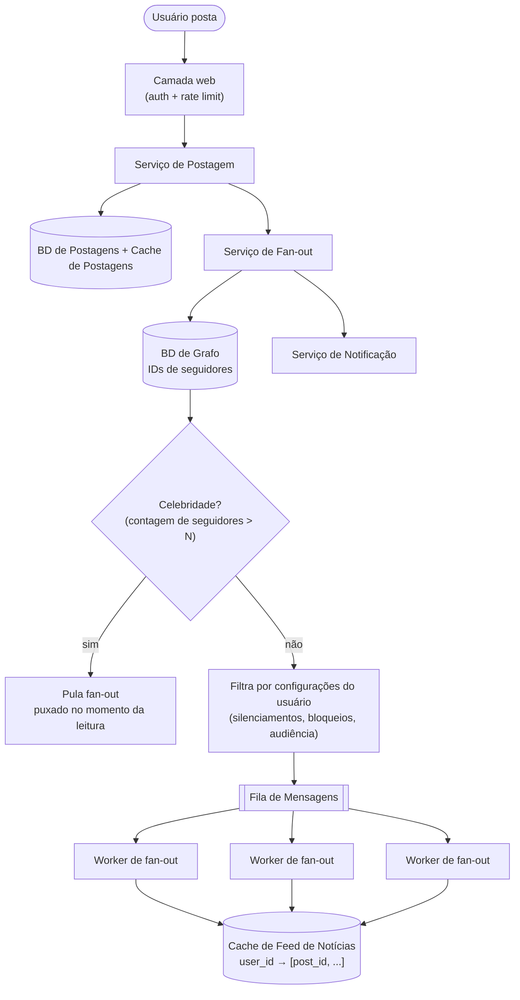

## Visão Geral

Um sistema de feed de notícias parece um único recurso de produto e na verdade são dois sistemas colados em um cache. **Publicação de feed** é um caminho de escrita: um usuário posta uma vez, e essa única postagem precisa alcançar os feeds de todo mundo que o segue — potencialmente milhões de pessoas — o que a torna um problema de fan-out e throughput. **Recuperação de feed** é um caminho de leitura: um usuário abre o app e espera um feed totalmente renderizado, personalizado e rico em mídia em menos de algumas centenas de milissegundos, o que a torna um problema de caching e hidratação. Os dois caminhos têm perfis de custo opostos, e quase toda decisão interessante neste design vem de escolher qual deles absorve o trabalho.

## Requisitos Funcionais

Delimite o escopo do prompt antes de projetar qualquer coisa. Um MVP defensável:

- **Publicar uma postagem** contendo texto e mídia opcional (imagens, vídeo), a partir da web ou mobile.
- **Recuperar um feed personalizado** de postagens das contas que um usuário segue.
- **Seguir / deixar de seguir** uma conta, o que muda para quem uma postagem futura será distribuída.
- **Ordenação reversa-cronológica** como linha de base, com ranking tratado como uma camada plugável por cima (coberto abaixo).

Explicitamente fora de escopo para uma sessão de 45 minutos: comentários, curtidas e seus contadores, stories, inserção de anúncios, e busca. Nomeá-los como adiados vale mais do que meio-projetá-los.

## Requisitos Não Funcionais

Toda qualidade aqui precisa de um número, seja fornecido pelo entrevistador ou declarado como uma suposição:

- **Escala.** 10 milhões de DAU, até 5.000 amigos/seguidores por conta comum, e contas de celebridade com dezenas de milhões de seguidores. A 10 milhões de DAU com um punhado de atualizações de feed cada, o caminho de leitura fica na casa de poucos milhares de QPS sustentados e várias vezes isso no pico.
- **Latência de recuperação de feed.** Uma requisição de feed deve completar em **menos de ~200ms no p99** — este é o número que força feeds a serem pré-computados em vez de montados consultando toda conta seguida no momento da leitura.
- **Frescor ("quase em tempo real").** Uma postagem deve aparecer no feed de um seguidor comum dentro de segundos, não minutos. Isso *não* é um requisito de tempo real rígido: ao contrário de chat, ninguém consegue perceber a diferença entre 200ms e 3 segundos de atraso no fan-out, e essa folga é exatamente o que torna o fan-out assíncrono via fila de mensagens aceitável.
- **Alta disponibilidade sobre consistência estrita.** Servir um feed que está faltando as últimas cinco segundos de postagens está bem; recusar-se a servir um feed não está. O feed é um sistema AP.
- **Focado em leitura por ordens de magnitude.** Leituras de feed superam postagens em aproximadamente 100:1, o que é a justificativa estrutural para pagar custo extra no caminho de escrita para tornar o caminho de leitura barato.

## As Duas APIs

O design inteiro depende de dois endpoints HTTP, e vale a pena escrevê-los porque sua assimetria espelha a arquitetura:

**Publicação de feed:**

```
POST /v1/me/feed
Authorization: Bearer <auth_token>

{ "content": "Hello", "media_ids": ["m_8f2a", "m_8f2b"] }
```

A requisição carrega texto mais *referências* a mídia já enviada, nunca os bytes em si. A resposta é `202 Accepted` com o novo `post_id` — a postagem é persistida de forma durável, mas o fan-out para seguidores acontece assincronamente depois que a resposta retorna.

**Recuperação de feed:**

```
GET /v1/me/feed?cursor=<opaque_cursor>&limit=20
Authorization: Bearer <auth_token>
```

Paginação baseada em cursor, não baseada em offset: um feed é uma lista em constante mudança, e `OFFSET 40` em uma lista que ganhou seis novos itens desde a última página significa que o cliente vê seis duplicatas. O cursor codifica a posição do último item retornado (tipicamente um `post_id` mais sua pontuação/timestamp).

A camada web na frente de ambos os endpoints é sem estado e lida com autenticação mais [rate limiting](rate-limiting) — um limite por usuário de postagens por minuto é a defesa primária contra spam, e pertence à borda, antes de qualquer trabalho de fan-out ser disparado.

## Publicação de Feed: Fan-out na Escrita vs. Fan-out na Leitura

O trade-off básico entre empurrar conteúdo para destinatários no momento da escrita versus puxá-lo no momento da leitura é trabalhado em [Scaling Real-Time Messaging](scaling-real-time-messaging-ordering-and-fan-out); o que muda para um feed de notícias é que o alvo do fan-out não é uma sala de chat limitada, mas um grafo de seguidores com uma distribuição de grau de lei de potência.

**Fan-out na escrita (push).** Quando uma postagem é criada, o sistema imediatamente anexa seu ID ao feed pré-computado de cada seguidor. Leituras se tornam triviais — o feed já existe, então servi-lo é uma única leitura de intervalo em cache. Os custos são duplos: uma conta com milhões de seguidores gera milhões de escritas de cache a partir de uma ação de usuário (o **problema da chave-quente**), e o feed de cada seguidor inativo é mantido para sempre por usuários que nunca vão logar para lê-lo.

**Fan-out na leitura (pull).** Nada é pré-computado. Quando um usuário abre o app, o sistema busca sua lista de seguidos, consulta postagens recentes de cada conta seguida, mescla, e retorna. Sem problema de chave-quente e sem trabalho desperdiçado em contas dormentes — mas o caminho de leitura agora faz um scatter-gather em até 5.000 contas na requisição que tem um orçamento de 200ms, o que é exatamente o oposto do que se precisa para um sistema onde leituras superam escritas em 100:1.

**O modelo híbrido é a resposta, e a divisão está no autor, não no leitor.** Contas comuns fazem fan-out na escrita. Contas acima de um limiar de seguidores — celebridades, marcas, organizações de notícias — são marcadas e *puladas* pelo serviço de fan-out completamente. No momento da leitura, o serviço de feed lê o cache de feed pré-computado do usuário e então separadamente puxa postagens recentes das poucas contas de celebridade que esse usuário segue, mesclando as duas listas antes de retornar. Um usuário tipicamente segue um punhado de celebridades, então o lado do pull é uma busca limitada e amigável ao cache em vez de um scatter-gather sem limites.

## O Serviço de Fan-out

O serviço de fan-out é a maquinaria do caminho de escrita, e é deliberadamente assíncrono:



Percorrendo o caminho:

1. **Buscar IDs de seguidores de um banco de dados de grafo.** Relacionamentos de seguidor/seguido são travessias recursivas de arestas ("quem me segue", "amigos de amigos"), que é o padrão de acesso para o qual armazenamentos de grafo são construídos e no qual joins relacionais degradam.
2. **Filtrar a lista de destinatários.** Silenciamentos, bloqueios, e restrições de audiência ("amigos exceto X") são aplicados *aqui*, no momento do fan-out, não no momento da leitura. Filtrar uma vez por postagem vence filtrar em cada leitura de feed subsequente.
3. **Enfileirar `(post_id, recipient_ids)` em uma fila de mensagens.** Este é o ponto de desacoplamento: o `POST` retorna ao cliente muito antes desse trabalho rodar, e um acúmulo no fan-out degrada o frescor em vez da disponibilidade. Também dá ao caminho de escrita uma contrapressão natural — uma rajada perto de uma celebridade faz a fila crescer em vez de derreter a camada de cache.
4. **Workers de fan-out anexam ao cache de feed de cada destinatário.** Workers escalam horizontalmente com a profundidade da fila e são idempotentes, já que a entrega pelo menos-uma-vez da fila significa que o mesmo par `(post_id, user_id)` ocasionalmente será escrito duas vezes.

### O que vive no cache de feed por usuário

A decisão de modelagem mais importante no caminho de escrita: **o cache de feed armazena IDs, não objetos.** Cada entrada é um par `<post_id, author_id>`, mantido em uma estrutura ordenada por usuário chaveada pelo dono do feed e pontuada por timestamp (ou pontuação de ranking) — sorted sets do Redis são o encaixe canônico, já que `ZADD` na publicação e `ZREVRANGEBYSCORE` na leitura mapeiam exatamente para anexar e buscar paginado.

Duas consequências decorrem disso. Primeiro, armazenar objetos de postagem completos no feed de cada seguidor duplicaria o mesmo conteúdo milhões de vezes na camada de cache; armazenar um ID de 8 bytes mantém a pegada de memória proporcional à *estrutura do feed* em vez do *volume de conteúdo*. Segundo, porque IDs são baratos, o feed por usuário pode ser **limitado a um comprimento configurável** — algumas centenas de entradas, cortado na escrita. Virtualmente ninguém rola além de algumas centenas de postagens, e o raro usuário que rola cai para um caminho mais lento com banco de dados. A taxa de acerto do cache permanece alta precisamente porque o corte corresponde aos padrões de acesso reais.

## Recuperação e Hidratação de Feed

Ler um feed é uma operação de duas fases, e confundi-las é um erro de design comum:

1. **Buscar a lista de IDs.** Ler uma página de `post_id`s do cache de feed do usuário, mesclar com postagens recentes puxadas das contas de celebridade que ele segue, ordenar, e cortar para o tamanho da página.
2. **Hidratar.** Uma lista de IDs não é um feed renderizável — o cliente precisa de nomes de usuário e avatares de autores, texto da postagem, URLs de mídia, e contadores. O serviço de feed busca esses dados em lote do cache de conteúdo, cache de usuário, e caches de contador (um multi-get por cache, não uma busca por postagem), monta o JSON, e retorna.

Hidratação é por que o cache de feed apenas-IDs funciona: o conteúdo caro e de alta cardinalidade é armazenado *uma vez* em um cache compartilhado e unido no momento da leitura, enquanto a estrutura por usuário permanece minúscula. Também é onde vive o fan-out do caminho de leitura — uma página de 20 postagens significa um punhado de leituras de cache em lote, não 20 idas e voltas sequenciais.

## Conteúdo de Mídia

Mídia de postagem nunca passa pelo serviço de postagem. O cliente solicita uma URL pré-assinada, faz upload dos bytes diretamente para o armazenamento de objetos, e envia apenas o `media_id` resultante na requisição de publicação — o [padrão de upload direto](object-storage-and-direct-upload). No caminho de leitura, postagens hidratadas carregam URLs de CDN em vez de URLs de origem, então imagens e vídeo são servidos a partir de um PoP de borda perto do espectador.

Isso importa desproporcionalmente para feeds: o payload JSON de uma página de 20 postagens tem alguns kilobytes, enquanto a mídia que ele referencia tem dezenas de megabytes. Manter o caminho de metadados na camada de aplicação e o caminho de bytes na CDN significa que a parte do sistema que você escala para QPS e a parte que você escala para largura de banda são inteiramente separadas — ver [Caching Strategies and CDNs](caching-strategies-and-cdns).

## A Camada de Cache

"Cache" em um sistema de feed não é uma coisa só. É uma camada com cinco níveis distintos, cada um com suas próprias regras de invalidação e pressão de despejo:

| Camada | Conteúdo | Padrão de acesso |
|---|---|---|
| **Feed de Notícias** | Listas ordenadas de `post_id` por usuário | Anexar no fan-out, leitura de intervalo na recuperação |
| **Conteúdo** | Objetos de postagem; postagens quentes mantidas em um cache quente separado | Muito lido, escrito uma vez |
| **Grafo Social** | Arestas de seguidor/seguido, listas de silenciamento e bloqueio | Lido a cada fan-out; muda raramente |
| **Ação** | Se um dado usuário curtiu/respondeu a uma dada postagem | Lido por postagem renderizada, escrito na interação |
| **Contadores** | Contagens de curtidas, respostas, seguidores, e seguidos | Extremamente escrito com frequência; geralmente aproximado |

Separá-los permite que cada um seja dimensionado, fragmentado, e despejado independentemente. Contadores mudam constantemente e toleram aproximação; o grafo social é lido em cada fan-out e é quase estático; conteúdo é escrito uma vez e lido milhões de vezes, então as postagens mais quentes são promovidas para um cache quente dedicado em vez de competir por espaço com as frias. Um cache único e indiferenciado deixaria o churn de contadores despejar dados de grafo dos quais todo o caminho de escrita depende.

## Ranking em Cima de Reverso-Cronológico

Ordenação reversa-cronológica é a suposição simplificadora, não o produto. Adicionar ranking não muda a arquitetura — muda a **pontuação** escrita no cache de feed. Em vez de pontuar uma entrada pelo timestamp da postagem, o worker de fan-out (ou um serviço de ranking downstream no momento da leitura) calcula uma pontuação de relevância a partir da afinidade com o autor, tipo de conteúdo, decaimento de recência, e engajamento previsto, e usa isso como a pontuação do sorted set.

O posicionamento desse cálculo é a decisão real. **Pontuar no momento da escrita** mantém as leituras triviais mas fixa uma pontuação que fica obsoleta — a afinidade de um usuário por um autor muda, e toda entrada já distribuída mantém sua pontuação antiga. **Pontuar no momento da leitura** sobre um conjunto candidato (digamos, as poucas centenas de entradas do topo do cache de feed) mantém o modelo atual e personalizável por requisição, ao custo de uma chamada de inferência de ranking dentro do orçamento de 200ms. Sistemas de produção fazem ambos: pontuação barata de recência na escrita para construir um conjunto candidato, um modelo aprendido na leitura para reordená-lo.

## Trade-offs

- **Fan-out na escrita compra um caminho de leitura rápido com um fator de amplificação de escrita enorme** — uma postagem de uma conta com 5.000 seguidores se torna 5.000 escritas de cache, e o sistema está deliberadamente escolhendo pagar isso porque leituras superam escritas ~100:1. Inverta essa proporção (uma ferramenta interna onde cada postagem tem três leitores) e fan-out na leitura é o design correto.
- **O modelo híbrido de celebridade remove o problema da chave-quente mas introduz dois caminhos de código para o mesmo recurso** — toda leitura de feed agora mescla uma lista pré-computada com um pull ao vivo, e o limiar que decide de qual lado uma conta cai é um botão operacional que tem que ser ajustado, monitorado, e tratado quando uma conta o cruza no meio do caminho.
- **Armazenar apenas IDs no feed por usuário mantém a camada de cache acessível mas torna toda leitura um fan-out em si** — hidratação transforma uma requisição de feed em vários multi-gets de cache em lote, então uma falha parcial no cache de conteúdo ou de usuário degrada um feed em uma página de IDs não renderizáveis em vez de falhar de forma limpa.
- **Limitar o cache de feed de cada usuário a algumas centenas de entradas torna a memória limitada e previsível, ao custo de um precipício** — o usuário que rola além do limite cai do caminho rápido para uma consulta com banco de dados que é uma ordem de magnitude mais lenta, então o limite é uma decisão de produto sobre profundidade de rolagem aceitável disfarçada de parâmetro de caching.
- **Fan-out assíncrono via uma fila de mensagens converte um problema de disponibilidade em um problema de frescor** — um acúmulo no fan-out significa que postagens chegam atrasadas em vez do endpoint de publicação falhar, o que é o modo de falha correto para um feed mas significa que o atraso da fila precisa ser monitorado como uma métrica voltada ao usuário, não apenas uma de infraestrutura.
- **Filtrar silenciamentos e configurações de audiência no momento do fan-out torna leituras baratas mas torna o cache de feed obsoleto em mudanças de configuração** — silenciar alguém não remove retroativamente suas postagens já distribuídas, então ou o caminho de leitura refiltra (parcialmente anulando a otimização) ou o produto aceita que silenciamentos passam a valer dali para frente.

## Perguntas de Entrevista

- A razão leitura:escrita é o argumento para fan-out na escrita. Em que razão esse argumento para de se sustentar, e o que você mudaria no design?
- Uma conta cruza o limiar de celebridade entre publicar uma postagem e os workers de fan-out a processarem. Como fica o feed de um seguidor, e como você evita duplicatas?
- Por que o cache de feed por usuário armazena `post_id`s em vez de objetos de postagem, e o que essa decisão custa no caminho de leitura?
- Um usuário silencia uma conta. Seu cache de feed já construído ainda contém as postagens dessa conta. Onde você corrige isso — caminho de escrita, caminho de leitura, ou um backfill — e o que cada escolha custa?
- Se você migrar de ordenação reversa-cronológica para ordenação ranqueada por ML, a pontuação pertence ao cache de feed no momento da escrita ou é calculada no momento da leitura? O que quebra em cada caso?

## Referências

- [Alex Xu, "System Design Interview – An Insider's Guide, Volume 1" (ByteByteGo, 2020) — Capítulo 11, "Design A News Feed System"](https://bytebytego.com)
- Raffi Krikorian (Twitter), ["Timelines at Scale" — QCon San Francisco 2012](https://www.infoq.com/presentations/Twitter-Timeline-Scalability/)
- Meta Engineering, ["Serving Facebook Multifeed: Efficiency, performance gains through redesign"](https://engineering.fb.com/2015/03/10/production-engineering/serving-facebook-multifeed-efficiency-performance-gains-through-redesign/)
- Documentação do Redis, ["Redis sorted sets"](https://redis.io/docs/latest/develop/data-types/sorted-sets/)
