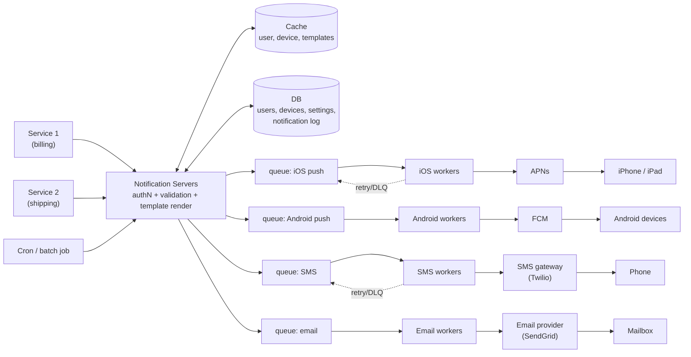

## Overview

A notification system takes one event — "your package ships tomorrow," "your invoice is due," "Bob wants to play chess" — and delivers it to a user who may not have your app open, across whichever channels that user has agreed to receive: mobile push, SMS, and email. That "may not have your app open" is what makes it a different problem from the in-app delivery covered in [Scaling Real-Time Messaging](scaling-real-time-messaging-ordering-and-fan-out): there is no WebSocket to push down, so every delivery leaves your infrastructure and lands in someone else's — Apple's APNs, Google's FCM, an SMS gateway like Twilio, an email provider like SendGrid. The design problem is therefore not "how do I write bytes to a socket" but "how do I fan one event out to several third-party services that are slow, rate-limited, independently unreliable, and outside my control, without losing a single notification or annoying the user into disabling notifications entirely."

## Functional Requirements

- **Three channels**: mobile push notification (iOS and Android), SMS message, and email. Each has a different provider, a different payload format, and a different failure profile.
- **Multiple trigger sources**: any internal service can request a notification — a billing microservice, a cron job that batches daily digests, a shipping pipeline. The notification system is a shared platform, not a feature of one service.
- **Multiple devices per user**: a user can be logged in on a phone, a tablet, and a laptop, so a single push notification may map to several device tokens.
- **Templates**: most notifications are one of a few dozen preformatted messages with parameters substituted in (`[ITEM NAME]`, `[DATE]`). Rendering each one from scratch in the calling service means every service duplicates formatting and localization logic.
- **Opt-out**: a user who turns off marketing email or SMS must stop receiving it, per channel, immediately.

## Non-Functional Requirements

- **Soft real-time.** Users should get notifications as soon as possible, but a delay of seconds under load is acceptable. This is the single most useful requirement to establish early, because it licenses the whole asynchronous design — if delivery had to be synchronous and sub-second, queues would be off the table.
- **No dropped notifications.** Notifications can be delayed or reordered; they cannot be lost. A payment reminder that silently vanished because a third-party API returned a 503 is a business failure, not a technical one. This drives persistence plus retries.
- **Volume.** A working assumption of 10M push, 1M SMS, and 5M email per day is roughly 185 notifications/second averaged, with peaks several times that during scheduled batch sends. The peaks, not the average, size the system.
- **Explicit non-goal: do not spam users.** A system that maximizes delivery throughput and nothing else optimizes straight into users disabling notifications at the OS level — a permanent, unrecoverable loss of the channel. Frequency capping and preference checks are functional requirements dressed as constraints, not nice-to-haves.
- **Extensibility across providers.** A provider can become unavailable in a market (FCM is not reachable in mainland China, which is why Jpush and PushY exist there). Adding or swapping a provider must be a worker-level change, not a redesign.

## How Each Channel Actually Works

The three channels look uniform from the caller's perspective and are anything but underneath:

- **iOS push**: your backend acts as a *provider*, sending an HTTP/2 request to **APNs** containing a **device token** (a per-app, per-device identifier the OS hands your app at registration) and a JSON payload under an `aps` key with `alert`, `badge`, and similar fields. APNs relays it to the device.
- **Android push**: structurally identical, with **FCM** in the role of APNs and its own token format and payload schema.
- **SMS**: a REST call to a commercial gateway (Twilio, Vonage/Nexmo) with a phone number and body. Per-message cost is real money, and carrier throughput limits apply per sending number.
- **Email**: a REST call to SendGrid, Mailchimp, SES, or a self-hosted MTA. Deliverability — reputation, SPF/DKIM, bounce handling — is the reason most teams buy rather than build.

Collecting the routing data is its own flow: when a user installs the app or signs up, the API servers store the email address and phone number on the `user` row and insert a row per device into a `device` table (`user_id`, `device_token`, `platform`, `last_seen_at`). One user to many devices is the reason a single "send push" request fans out to several APNs/FCM calls.

## High-Level Design

The naive version — one notification server that receives an API call, looks up contact info, and calls the third-party API inline — fails in three predictable ways: it is a single point of failure, it can't scale its channel-specific work independently (rendering HTML email is nothing like signing an APNs request), and it blocks the caller for as long as the slowest provider takes to respond. The fix is to split it into stateless notification servers in front of one queue per channel, with a dedicated worker pool draining each queue:



Reading left to right: a calling service hits an internal API (`POST /v1/notifications`) with a recipient reference and a template id plus parameters. The notification server authenticates the caller, validates the payload, looks up the user's contact info, device tokens, and channel preferences from cache (falling back to the database), renders the template, writes a row to the **notification log** for durability and auditing, and enqueues one message per target channel. Workers pull from their own queue, translate the generic event into that provider's wire format, call the provider, and record the outcome.

Two properties fall out of that shape. The notification servers are stateless, so they scale horizontally behind a load balancer and any one of them can die mid-request without losing work already enqueued. And each channel is isolated: an APNs outage backs up the iOS queue while SMS and email keep flowing, because they never shared a thread pool or a connection pool in the first place.

## Why a Queue Per Channel

The queue is doing more than buffering. It converts a *synchronous dependency on someone else's uptime* into an *asynchronous dependency on your own storage* — see [Message Brokers: Queues vs. Log-Based Streaming](message-brokers-queues-vs-logs) for the delivery-semantics detail. Three things it buys you:

**Absorbing bursts.** A scheduled campaign that enqueues two million emails in thirty seconds doesn't have to be sent in thirty seconds. The queue holds the backlog while a fixed worker pool drains it at whatever rate the provider tolerates. Without the queue, the burst would either be dropped or would have to be absorbed by provisioning enough synchronous capacity for the peak.

**Respecting provider rate limits.** Every provider throttles: SMS gateways cap messages per second per sending number, email providers cap per-account send rates, APNs will shed load under pressure. Worker concurrency is the natural place to enforce a matching send rate, and the queue is what makes throttling safe — slowing workers down only grows the backlog, it never rejects a notification.

**Failure isolation.** One queue per channel means an outage or a poison-message storm in one provider is bounded to that channel. Sharing a queue would let a stalled email provider consume every worker slot and starve push notifications that were perfectly deliverable.

The metric that tells you whether the design is holding is **queue depth**. A steadily growing backlog means workers can't keep up with producers, and the remedy is more workers (or, if the provider is the bottleneck, accepting a longer delivery SLA). Alerting on queue depth and consumer lag catches delivery degradation long before users report missing notifications.

## Retries and Dead-Lettering

Third-party APIs fail constantly at scale: transient 5xx, connection resets, throttling responses. The worker's contract is that a notification is only acknowledged off the queue once the provider has accepted it. On a retryable failure, the message goes back for another attempt with **exponential backoff and jitter** — immediate uniform retries from a large worker pool are how a provider's brief hiccup becomes a self-inflicted thundering herd.

Not every failure is retryable, and treating them alike is the classic bug. Distinguish:

- **Transient** (503, timeout, 429 throttle) — retry with backoff. A 429 in particular should also slow the whole worker pool, not just the one message.
- **Permanent** (invalid device token, unsubscribed email address, malformed payload) — never retry. APNs returning `BadDeviceToken` or `Unregistered` means the app was deleted or the token rotated; the correct action is to delete that token row so future sends skip it. Retrying a permanently invalid token wastes quota forever.

After a bounded number of attempts, the message moves to a **dead-letter queue** rather than being discarded or retried indefinitely. The DLQ is what makes "we never lose a notification" true: nothing evaporates, failures accumulate somewhere inspectable, and an alert fires when the DLQ is non-empty so a human can decide to fix and replay or drop. Pair it with the notification log — a persisted row per notification with its terminal status — and you can answer "did user X ever get their payment reminder?" after the fact, which is the question that actually gets asked during an incident.

## Avoiding Duplicates

Exactly-once delivery does not exist across a network boundary you don't control. A worker that calls APNs successfully and then crashes before acknowledging the queue message will see that message redelivered, and it has no way to know the first call went through. At-least-once plus deduplication is the achievable target.

Give every notification event a stable **event ID** minted by the notification server at enqueue time (not by the worker, and not derived from a timestamp). Before sending, the worker checks that ID against a dedupe store — typically Redis with a TTL long enough to cover the retry window — and discards the event if it's already marked sent:

```
event_id = "notif:9f2c1e...:apns"
if not cache.set(event_id, "sent", nx=True, ex=86400):
    ack_and_skip()   # already delivered by a previous attempt
else:
    send_to_provider()
```

The check-and-set has to be atomic (`SET NX`), or two workers processing the same redelivered message race through the gap between read and write and both send. Where the provider supports it, also pass an idempotency key on the outbound call so the provider itself can collapse duplicates — belt and braces, since your dedupe window is finite and theirs may not be.

Deduplication is also the reason event IDs must be deterministic per channel: the same logical notification going to push *and* email is two distinct sends that must not deduplicate each other.

## Rate Limiting and User Preferences

Two different limits apply, for two different reasons.

**Per-user frequency capping** exists to protect the user. Someone who receives eleven push notifications in an hour doesn't unsubscribe from one category — they disable notifications for the app at the OS level, and you have permanently lost the channel. A token bucket per `(user_id, channel, category)` is the usual mechanism (see [Rate Limiting](rate-limiting)): a small capacity for burst tolerance, a slow refill rate, and notifications over the cap either dropped or rolled into a digest. Which of those two is correct is a product decision that depends on category — a fraud alert should never be capped; a "someone liked your post" notification should be.

**Per-provider throttling** exists to protect the provider relationship. Exceeding a gateway's documented send rate earns 429s, degraded deliverability, or account suspension. This limit lives in the worker pool as a shared token bucket across all workers for that channel, not per-worker, since fifty workers each politely under their own local limit still hammer the provider fifty times over.

Preferences are checked before either. A `notification_setting` table keyed by `(user_id, channel, category)` with an `opt_in` boolean is consulted at the notification server, before enqueueing — filtering early keeps opted-out notifications from consuming queue and worker capacity at all. Making the check late (in the worker) is a correctness risk too: a user who opts out while a message sits in the queue should not receive it, so the worker re-checking cheap cached state before sending is a reasonable second gate for anything with a long queue delay.

## Security

The notification API is an unusually attractive target: whoever can call it can send an authenticated-looking push notification to your users' lock screens. Three controls:

- **Internal-only access.** The send API is not exposed publicly. Callers are internal services authenticated with a per-service credential pair (appKey/appSecret, mTLS, or signed service tokens), and every request is attributable to a specific caller for audit and per-caller rate limits.
- **Authorization on the recipient.** A caller passes a `user_id`, never a raw device token or phone number. The system resolves contact info itself, which means a compromised or buggy service cannot exfiltrate contact details or address a user it has no business addressing.
- **Payload hygiene.** Push payloads traverse Apple's and Google's infrastructure and land on a lock screen visible without unlocking the device. Sensitive content doesn't belong there — send "You have a new message," not the message body, and let the app fetch the content over an authenticated channel once opened.

## Trade-offs

- **Asynchronous queueing buys burst absorption and failure isolation, but the caller loses any delivery guarantee at API-call time** — the API can only confirm "accepted for delivery," so anything that needs to know the outcome has to consult the notification log or subscribe to a delivery-status event, which is strictly more machinery than a synchronous call would need.
- **At-least-once plus dedupe is achievable; exactly-once is not** — the dedupe store adds a Redis dependency in the hot path of every send, and its TTL is a bet that no retry arrives after the window expires. Sizing the TTL too short readmits duplicates; too long, and the store's memory footprint grows with send volume.
- **One queue per channel isolates provider outages but multiplies operational surface** — four queues, four worker pools, four sets of dashboards, alerts, and scaling policies instead of one, and a fifth for every new channel or region-specific provider.
- **Aggressive frequency capping protects the channel long-term but suppresses individual notifications the user may have wanted** — a cap that silently drops the one message that mattered is indistinguishable from a delivery bug from the user's side, which is why caps should be per-category and never applied to transactional or safety-critical sends.
- **Templates centralize formatting and cut duplication across services, but they make the notification system a deploy dependency for copy changes** — teams that want to ship marketing copy without a code change end up needing template versioning, preview, and a non-engineer editing path, none of which is free.
- **Buying delivery from third parties is the right call, but it caps your ceiling at their reliability and rate limits** — you inherit their outages, their throttles, and their market availability (FCM being unreachable in China forces a per-region provider abstraction you would not otherwise build).

## Interview Questions

- Why does the notification server enqueue instead of calling APNs directly, given that the queue adds latency to a system whose whole purpose is timely delivery?
- A worker successfully calls FCM and then crashes before acknowledging the queue message. Walk through what happens next and what stops the user seeing the notification twice.
- Which third-party error responses should trigger a retry and which should not, and what's the cost of getting that classification wrong in each direction?
- Where would you enforce a per-user frequency cap — at the calling service, the notification server, or the worker — and what breaks with each placement?
- Queue depth for the email channel has been climbing steadily for an hour while push and SMS are healthy. What do you check, and when is adding workers the wrong response?

## References

- [Alex Xu, "System Design Interview – An Insider's Guide, Volume 1" (ByteByteGo, 2020) — Chapter 10, "Design A Notification System"](https://bytebytego.com)
- [Apple Developer Documentation — Sending notification requests to APNs](https://developer.apple.com/documentation/usernotifications/sending-notification-requests-to-apns)
- [Google — Firebase Cloud Messaging documentation](https://firebase.google.com/docs/cloud-messaging)
- [Tyler Treat — You Cannot Have Exactly-Once Delivery](https://bravenewgeek.com/you-cannot-have-exactly-once-delivery/)
