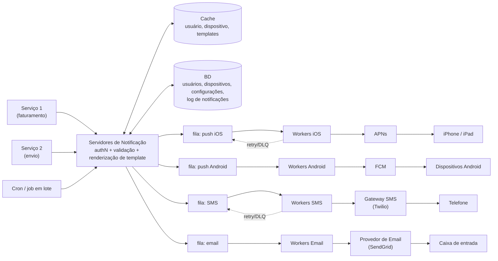

## Visão Geral

Um sistema de notificações pega um evento — "seu pacote é enviado amanhã," "sua fatura está vencida," "Bob quer jogar xadrez" — e o entrega a um usuário que talvez não tenha seu app aberto, através de quaisquer canais que esse usuário tenha concordado em receber: push mobile, SMS e e-mail. Esse "talvez não tenha seu app aberto" é o que torna isso um problema diferente da entrega in-app coberta em [Scaling Real-Time Messaging](scaling-real-time-messaging-ordering-and-fan-out): não há um WebSocket para empurrar dados através, então toda entrega sai da sua infraestrutura e pousa na de outra pessoa — a APNs da Apple, o FCM do Google, um gateway de SMS como Twilio, um provedor de e-mail como SendGrid. O problema de design, portanto, não é "como escrevo bytes em um socket" mas "como faço fan-out de um evento para vários serviços de terceiros que são lentos, limitados por taxa, independentemente não confiáveis, e fora do meu controle, sem perder uma única notificação ou incomodar o usuário a ponto de desativar notificações completamente."

## Requisitos Funcionais

- **Três canais**: notificação push mobile (iOS e Android), mensagem SMS, e e-mail. Cada um tem um provedor diferente, um formato de payload diferente, e um perfil de falha diferente.
- **Múltiplas fontes de disparo**: qualquer serviço interno pode solicitar uma notificação — um microsserviço de faturamento, um cron job que agrupa resumos diários, um pipeline de envio. O sistema de notificações é uma plataforma compartilhada, não um recurso de um único serviço.
- **Múltiplos dispositivos por usuário**: um usuário pode estar logado em um telefone, um tablet, e um laptop, então uma única notificação push pode mapear para vários tokens de dispositivo.
- **Templates**: a maioria das notificações é uma de algumas dezenas de mensagens pré-formatadas com parâmetros substituídos (`[NOME DO ITEM]`, `[DATA]`). Renderizar cada uma do zero no serviço chamador significa que todo serviço duplica lógica de formatação e localização.
- **Opt-out**: um usuário que desativa e-mail ou SMS de marketing deve parar de recebê-lo, por canal, imediatamente.

## Requisitos Não Funcionais

- **Tempo real suave.** Usuários devem receber notificações o mais rápido possível, mas um atraso de segundos sob carga é aceitável. Este é o requisito mais útil de estabelecer cedo, porque ele licencia todo o design assíncrono — se a entrega tivesse que ser síncrona e sub-segundo, filas estariam fora de cogitação.
- **Sem notificações perdidas.** Notificações podem ser atrasadas ou reordenadas; não podem ser perdidas. Um lembrete de pagamento que silenciosamente desapareceu porque uma API de terceiros retornou um 503 é uma falha de negócio, não técnica. Isso conduz a persistência mais retries.
- **Volume.** Uma suposição de trabalho de 10 milhões de push, 1 milhão de SMS, e 5 milhões de e-mail por dia é aproximadamente 185 notificações/segundo em média, com picos várias vezes isso durante envios em lote agendados. Os picos, não a média, dimensionam o sistema.
- **Não-objetivo explícito: não fazer spam nos usuários.** Um sistema que maximiza throughput de entrega e nada mais otimiza diretamente para usuários desativando notificações no nível do SO — uma perda permanente e irrecuperável do canal. Limitação de frequência e verificações de preferência são requisitos funcionais disfarçados de restrições, não itens desejáveis.
- **Extensibilidade entre provedores.** Um provedor pode ficar indisponível em um mercado (o FCM não é alcançável na China continental, razão pela qual Jpush e PushY existem lá). Adicionar ou trocar um provedor deve ser uma mudança no nível do worker, não um redesign.

## Como Cada Canal Realmente Funciona

Os três canais parecem uniformes da perspectiva do chamador e não são nada disso por baixo:

- **Push iOS**: seu backend age como um *provedor*, enviando uma requisição HTTP/2 para a **APNs** contendo um **device token** (um identificador por app, por dispositivo que o SO entrega ao seu app no registro) e um payload JSON sob uma chave `aps` com campos `alert`, `badge`, e similares. A APNs retransmite ao dispositivo.
- **Push Android**: estruturalmente idêntico, com o **FCM** no papel da APNs e seu próprio formato de token e schema de payload.
- **SMS**: uma chamada REST para um gateway comercial (Twilio, Vonage/Nexmo) com um número de telefone e corpo. O custo por mensagem é dinheiro real, e limites de throughput da operadora se aplicam por número remetente.
- **E-mail**: uma chamada REST para SendGrid, Mailchimp, SES, ou um MTA auto-hospedado. Deliverability — reputação, SPF/DKIM, tratamento de bounce — é a razão pela qual a maioria das equipes compra em vez de construir.

Coletar os dados de roteamento é seu próprio fluxo: quando um usuário instala o app ou se cadastra, os servidores de API armazenam o e-mail e o telefone na linha do `user` e inserem uma linha por dispositivo em uma tabela `device` (`user_id`, `device_token`, `platform`, `last_seen_at`). Um usuário para muitos dispositivos é a razão pela qual uma única requisição "enviar push" se torna várias chamadas APNs/FCM.

## Design de Alto Nível

A versão ingênua — um servidor de notificações que recebe uma chamada de API, procura informações de contato, e chama a API de terceiros inline — falha de três formas previsíveis: é um ponto único de falha, não consegue escalar seu trabalho específico por canal de forma independente (renderizar e-mail HTML não tem nada a ver com assinar uma requisição APNs), e bloqueia o chamador pelo tempo que o provedor mais lento levar para responder. A correção é dividir isso em servidores de notificação sem estado na frente de uma fila por canal, com um pool de workers dedicado drenando cada fila:



Lendo da esquerda para a direita: um serviço chamador acessa uma API interna (`POST /v1/notifications`) com uma referência de destinatário e um id de template mais parâmetros. O servidor de notificação autentica o chamador, valida o payload, procura as informações de contato do usuário, tokens de dispositivo, e preferências de canal a partir do cache (caindo para o banco de dados se necessário), renderiza o template, escreve uma linha no **log de notificações** para durabilidade e auditoria, e enfileira uma mensagem por canal alvo. Workers puxam de sua própria fila, traduzem o evento genérico para o formato de fio daquele provedor, chamam o provedor, e registram o resultado.

Duas propriedades decorrem desse formato. Os servidores de notificação são sem estado, então escalam horizontalmente atrás de um load balancer e qualquer um deles pode morrer no meio de uma requisição sem perder trabalho já enfileirado. E cada canal é isolado: uma interrupção da APNs acumula a fila do iOS enquanto SMS e e-mail continuam fluindo, porque eles nunca compartilharam um thread pool ou um connection pool desde o início.

## Por Que Uma Fila Por Canal

A fila está fazendo mais do que armazenar em buffer. Ela converte uma *dependência síncrona do uptime de outra pessoa* em uma *dependência assíncrona do seu próprio armazenamento* — ver [Message Brokers: Queues vs. Log-Based Streaming](message-brokers-queues-vs-logs) para o detalhe de semântica de entrega. Três coisas que isso compra:

**Absorvendo rajadas.** Uma campanha agendada que enfileira dois milhões de e-mails em trinta segundos não precisa ser enviada em trinta segundos. A fila mantém o acúmulo enquanto um pool fixo de workers o drena na taxa que o provedor tolera. Sem a fila, a rajada seria descartada ou teria que ser absorvida provisionando capacidade síncrona suficiente para o pico.

**Respeitando limites de taxa do provedor.** Todo provedor limita: gateways de SMS limitam mensagens por segundo por número remetente, provedores de e-mail limitam taxas de envio por conta, a APNs vai descartar carga sob pressão. Concorrência de worker é o lugar natural para impor uma taxa de envio correspondente, e a fila é o que torna o throttling seguro — desacelerar workers apenas faz o acúmulo crescer, nunca rejeita uma notificação.

**Isolamento de falhas.** Uma fila por canal significa que uma interrupção ou uma tempestade de mensagens envenenadas em um provedor fica limitada àquele canal. Compartilhar uma fila deixaria um provedor de e-mail travado consumir todos os slots de worker e sufocar notificações push que eram perfeitamente entregáveis.

A métrica que diz se o design está se sustentando é a **profundidade da fila**. Um acúmulo crescendo continuamente significa que workers não conseguem acompanhar os produtores, e o remédio é mais workers (ou, se o provedor é o gargalo, aceitar um SLA de entrega mais longo). Alertar sobre profundidade de fila e atraso de consumidor pega degradação de entrega bem antes de usuários reportarem notificações faltando.

## Retries e Dead-Lettering

APIs de terceiros falham constantemente em escala: 5xx transientes, resets de conexão, respostas de throttling. O contrato do worker é que uma notificação só é confirmada fora da fila depois que o provedor a aceitou. Em uma falha retentável, a mensagem volta para outra tentativa com **backoff exponencial e jitter** — retries uniformes imediatos de um grande pool de workers são como um soluço breve de um provedor se torna uma manada estampida autoinfligida.

Nem toda falha é retentável, e tratá-las igualmente é o bug clássico. Distinga:

- **Transiente** (503, timeout, throttle 429) — retente com backoff. Um 429 em particular também deveria desacelerar todo o pool de workers, não apenas aquela mensagem.
- **Permanente** (token de dispositivo inválido, endereço de e-mail cancelado, payload malformado) — nunca retente. A APNs retornando `BadDeviceToken` ou `Unregistered` significa que o app foi excluído ou o token rotacionou; a ação correta é excluir aquela linha de token para que envios futuros a pulem. Retentar um token permanentemente inválido desperdiça cota para sempre.

Após um número limitado de tentativas, a mensagem se move para uma **dead-letter queue** em vez de ser descartada ou retentada indefinidamente. A DLQ é o que torna "nunca perdemos uma notificação" verdadeiro: nada evapora, falhas se acumulam em algum lugar inspecionável, e um alerta dispara quando a DLQ não está vazia para que um humano decida corrigir e reproduzir ou descartar. Combine isso com o log de notificações — uma linha persistida por notificação com seu status terminal — e você pode responder "o usuário X alguma vez recebeu seu lembrete de pagamento?" depois do fato, que é a pergunta que realmente é feita durante um incidente.

## Evitando Duplicatas

Entrega exatamente-uma-vez não existe através de uma fronteira de rede que você não controla. Um worker que chama a APNs com sucesso e então trava antes de confirmar a mensagem da fila vai ver essa mensagem reentregue, e não tem como saber que a primeira chamada foi bem-sucedida. Pelo menos-uma-vez mais deduplicação é o alvo alcançável.

Dê a cada evento de notificação um **event ID** estável cunhado pelo servidor de notificação no momento do enfileiramento (não pelo worker, e não derivado de um timestamp). Antes de enviar, o worker verifica esse ID contra um armazenamento de deduplicação — tipicamente Redis com um TTL longo o suficiente para cobrir a janela de retry — e descarta o evento se ele já estiver marcado como enviado:

```
event_id = "notif:9f2c1e...:apns"
if not cache.set(event_id, "sent", nx=True, ex=86400):
    ack_and_skip()   # já entregue por uma tentativa anterior
else:
    send_to_provider()
```

A verificação-e-configuração tem que ser atômica (`SET NX`), ou dois workers processando a mesma mensagem reentregue correm através da lacuna entre leitura e escrita e ambos enviam. Onde o provedor suporta, também passe uma chave de idempotência na chamada de saída para que o próprio provedor possa colapsar duplicatas — cinto e suspensório, já que sua janela de deduplicação é finita e a deles pode não ser.

Deduplicação também é a razão pela qual event IDs devem ser determinísticos por canal: a mesma notificação lógica indo para push *e* e-mail são dois envios distintos que não devem se deduplicar mutuamente.

## Rate Limiting e Preferências do Usuário

Dois limites diferentes se aplicam, por duas razões diferentes.

**Limitação de frequência por usuário** existe para proteger o usuário. Alguém que recebe onze notificações push em uma hora não cancela a inscrição de uma categoria — desativa notificações para o app no nível do SO, e você perdeu permanentemente o canal. Um token bucket por `(user_id, channel, category)` é o mecanismo usual (ver [Rate Limiting](rate-limiting)): uma pequena capacidade para tolerância de rajada, uma taxa de recarga lenta, e notificações acima do limite são descartadas ou incorporadas em um resumo. Qual das duas é correta é uma decisão de produto que depende da categoria — um alerta de fraude nunca deveria ser limitado; uma notificação de "alguém curtiu sua postagem" deveria.

**Throttling por provedor** existe para proteger o relacionamento com o provedor. Exceder a taxa de envio documentada de um gateway ganha 429s, deliverability degradada, ou suspensão de conta. Esse limite vive no pool de workers como um token bucket compartilhado entre todos os workers daquele canal, não por worker, já que cinquenta workers cada um educadamente abaixo de seu próprio limite local ainda martelam o provedor cinquenta vezes mais.

Preferências são verificadas antes de ambos. Uma tabela `notification_setting` chaveada por `(user_id, channel, category)` com um booleano `opt_in` é consultada no servidor de notificação, antes de enfileirar — filtrar cedo mantém notificações opt-out de consumirem capacidade de fila e worker completamente. Fazer a verificação tarde (no worker) também é um risco de correção: um usuário que opta por sair enquanto uma mensagem está na fila não deveria recebê-la, então o worker reverificando estado em cache barato antes de enviar é um segundo portão razoável para qualquer coisa com um atraso de fila longo.

## Segurança

A API de notificações é um alvo incomumente atraente: quem quer que consiga chamá-la pode enviar uma notificação push com aparência autenticada para a tela de bloqueio de seus usuários. Três controles:

- **Acesso apenas interno.** A API de envio não é exposta publicamente. Chamadores são serviços internos autenticados com um par de credenciais por serviço (appKey/appSecret, mTLS, ou tokens de serviço assinados), e toda requisição é atribuível a um chamador específico para auditoria e rate limits por chamador.
- **Autorização no destinatário.** Um chamador passa um `user_id`, nunca um token de dispositivo bruto ou número de telefone. O sistema resolve as informações de contato sozinho, o que significa que um serviço comprometido ou com bug não pode exfiltrar detalhes de contato ou endereçar um usuário que não tem negócio para endereçar.
- **Higiene de payload.** Payloads de push atravessam a infraestrutura da Apple e do Google e pousam em uma tela de bloqueio visível sem desbloquear o dispositivo. Conteúdo sensível não pertence lá — envie "Você tem uma nova mensagem," não o corpo da mensagem, e deixe o app buscar o conteúdo por um canal autenticado uma vez aberto.

## Trade-offs

- **Enfileiramento assíncrono compra absorção de rajadas e isolamento de falhas, mas o chamador perde qualquer garantia de entrega no momento da chamada de API** — a API só pode confirmar "aceita para entrega," então qualquer coisa que precise saber o resultado tem que consultar o log de notificações ou se inscrever em um evento de status de entrega, o que é estritamente mais maquinaria do que uma chamada síncrona precisaria.
- **Pelo menos-uma-vez mais deduplicação é alcançável; exatamente-uma-vez não é** — o armazenamento de deduplicação adiciona uma dependência do Redis no caminho crítico de cada envio, e seu TTL é uma aposta de que nenhum retry chega depois que a janela expira. Dimensionar o TTL curto demais readmite duplicatas; longo demais, e a pegada de memória do armazenamento cresce com o volume de envio.
- **Uma fila por canal isola interrupções de provedor mas multiplica a superfície operacional** — quatro filas, quatro pools de workers, quatro conjuntos de dashboards, alertas, e políticas de escalonamento em vez de um, e uma quinta para cada novo canal ou provedor específico de região.
- **Limitação de frequência agressiva protege o canal a longo prazo mas suprime notificações individuais que o usuário pode ter querido** — um limite que descarta silenciosamente a única mensagem que importava é indistinguível de um bug de entrega do lado do usuário, razão pela qual limites deveriam ser por categoria e nunca aplicados a envios transacionais ou críticos de segurança.
- **Templates centralizam formatação e cortam duplicação entre serviços, mas tornam o sistema de notificações uma dependência de deploy para mudanças de texto** — equipes que querem enviar texto de marketing sem uma mudança de código acabam precisando de versionamento de template, preview, e um caminho de edição para não-engenheiros, nenhum dos quais é gratuito.
- **Comprar entrega de terceiros é a decisão certa, mas limita seu teto à confiabilidade e limites de taxa deles** — você herda suas interrupções, seus throttles, e sua disponibilidade de mercado (o FCM ser inalcançável na China força uma abstração de provedor por região que você não construiria de outra forma).

## Perguntas de Entrevista

- Por que o servidor de notificação enfileira em vez de chamar a APNs diretamente, dado que a fila adiciona latência a um sistema cujo propósito inteiro é entrega pontual?
- Um worker chama o FCM com sucesso e então trava antes de confirmar a mensagem da fila. Percorra o que acontece a seguir e o que impede o usuário de ver a notificação duas vezes.
- Quais respostas de erro de terceiros deveriam disparar um retry e quais não deveriam, e qual é o custo de errar essa classificação em cada direção?
- Onde você imporia um limite de frequência por usuário — no serviço chamador, no servidor de notificação, ou no worker — e o que quebra com cada posicionamento?
- A profundidade da fila para o canal de e-mail vem subindo constantemente por uma hora enquanto push e SMS estão saudáveis. O que você verifica, e quando adicionar workers é a resposta errada?

## Referências

- [Alex Xu, "System Design Interview – An Insider's Guide, Volume 1" (ByteByteGo, 2020) — Capítulo 10, "Design A Notification System"](https://bytebytego.com)
- [Documentação para Desenvolvedores Apple — Sending notification requests to APNs](https://developer.apple.com/documentation/usernotifications/sending-notification-requests-to-apns)
- [Google — Documentação do Firebase Cloud Messaging](https://firebase.google.com/docs/cloud-messaging)
- [Tyler Treat — You Cannot Have Exactly-Once Delivery](https://bravenewgeek.com/you-cannot-have-exactly-once-delivery/)
