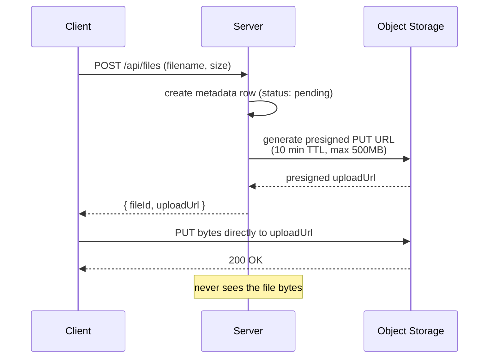
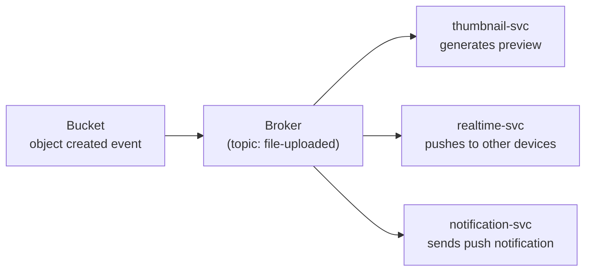

## Overview

A relational database is built to index and query small, structured rows fast — it is not built to hold a 2 GB video file as a blob column, and streaming large uploads through an application server before they land anywhere permanent wastes server memory, connection slots, and time on work that has nothing to do with the server's actual job. **Object storage** (S3, Google Cloud Storage, Azure Blob Storage) is a separate system purpose-built for storing large, immutable-ish files cheaply and serving them back efficiently. The pattern that makes this work end to end is: the file's *bytes* go straight from the client to object storage, and only the file's *metadata* — name, size, owner, storage location — ever touches your database.

## Why Not Upload Through the Server

Routing a large file through the application server on its way to storage has three concrete costs: the server holds a connection and buffers (or streams) the request body for as long as the upload takes, which for a large file over a slow connection can be minutes; the server's own request timeout has to be tuned to tolerate uploads instead of the fast API calls it otherwise handles; and every byte the client sends passes through infrastructure that gains nothing from seeing it, since a video file isn't going to be validated, transformed, or joined against anything at that layer. Doing this at scale means upload traffic directly competes with — and can starve — the compute the server needs for everything else it does, which is exactly the "uploads made our API slow" complaint that motivates this pattern in practice.

## The Presigned URL Flow

Instead, the server's only job is to hand the client a short-lived, pre-authorized URL that points directly at the storage bucket, and then get out of the way:



The presigned URL is a signature, generated with credentials only the server holds, that grants time-limited permission to perform one specific operation (a PUT to one specific object key) without the uploader needing storage credentials of its own. Constraining it tightly — short expiry, a maximum size, sometimes a required content type — bounds how much damage a leaked or reused URL could do, since anyone holding the URL before it expires could use it.

## What Goes in the Database vs. the Bucket

The split is deliberate and consistent with treating each store for what it's good at (see Polyglot Persistence): the database holds the searchable, relational, small facts about a file, and the bucket holds the large, opaque bytes.

```
-- files table (relational DB)
id            UUID PRIMARY KEY
name          TEXT
size_bytes    BIGINT
content_type  TEXT
owner_id      UUID REFERENCES users(id)
storage_key   TEXT       -- e.g. "uploads/2026/08/04/<uuid>.mp4"
status        TEXT       -- 'pending' | 'uploaded' | 'failed'
created_at    TIMESTAMP
```

`storage_key` is the only link between the two systems — the database never holds the file bytes themselves, only a pointer to where they live in the bucket. Serving the file back later follows the same shape in reverse: look up the row to get `storage_key`, ask the bucket for a presigned *GET* URL (or serve it via a CDN sitting in front of the bucket, per Caching Strategies and CDNs), and hand that URL to the client instead of proxying the bytes through the server.

## Reacting to a Completed Upload

The server hands out the presigned URL before the upload happens, so it doesn't know synchronously when the bytes actually land — the client uploads directly to the bucket, bypassing the server entirely for that step. Object storage systems solve this with **event notifications**: the bucket itself emits an event (e.g. "object created") that the rest of the system can react to, which is what triggers work like generating a video thumbnail or notifying other devices that a new file synced in.

The naive approach — the bucket calling each interested service directly — doesn't hold up: if the thumbnail service is briefly down or slow, that upload's thumbnail silently never gets generated, with no retry and no record that anything went wrong. This is the same reliability problem Message Brokers: Queues vs. Log-Based Streaming solves in general — the bucket publishes one event to a broker, the broker guarantees at-least-once delivery with retries and a dead-letter queue for anything that can't be delivered, and any number of independent consumers (thumbnailing, real-time sync, push notifications) subscribe to it without the storage layer needing to know any of them exist:



## Trade-offs

- **Direct upload keeps the application server stateless and fast, at the cost of a more involved client** — the client (or its SDK) has to implement a two-step flow (request a URL, then upload to it) instead of a single POST, and has to handle the upload failing independently of the metadata request succeeding.
- **Presigned URLs avoid distributing storage credentials, but a leaked URL is valid until it expires** — tight scoping (short TTL, one object key, a size ceiling) limits the blast radius but doesn't eliminate it the way a fully server-mediated upload would.
- **Event-driven post-processing decouples storage from every consumer, but means "uploaded" and "fully processed" (e.g. thumbnail exists) are different points in time** — the client and any UI have to account for a file existing before its thumbnail does, typically via the `status` field or a follow-up event.
- **Keeping only metadata in the relational database keeps it fast and small, but means file existence and metadata correctness can drift from what's actually in the bucket** — an upload that never completed but left a `pending` metadata row, or a bucket object deleted out-of-band, both require reconciliation logic somewhere.

## Interview Questions

- Why shouldn't a large file be streamed through the application server on its way to storage, even if the server could technically handle the bandwidth?
- What does a presigned URL actually grant, and what specifically bounds the risk if one leaks before it expires?
- Why does the database only store a `storage_key` rather than the file itself, and what does that have in common with the reasoning behind polyglot persistence?
- Why is calling the thumbnail service directly from the object storage event a worse design than publishing to a broker, and what specific failure does the broker protect against?
- What does it mean for a file to be "uploaded" but not yet "processed," and how would you represent that distinction in the data model?

## References

- [AWS S3 Documentation — Uploading and copying objects using presigned URLs](https://docs.aws.amazon.com/AmazonS3/latest/userguide/PresignedUrlUploadObject.html)
- [Google Cloud Storage Documentation — Signed URLs](https://cloud.google.com/storage/docs/access-control/signed-urls)
- [AWS S3 Documentation — Amazon S3 Event Notifications](https://docs.aws.amazon.com/AmazonS3/latest/userguide/EventNotifications.html)
- Martin Kleppmann, *Designing Data-Intensive Applications*, 2nd Edition (O'Reilly) — Chapter 2, "Data Models and Query Languages" (on matching storage to data shape)
