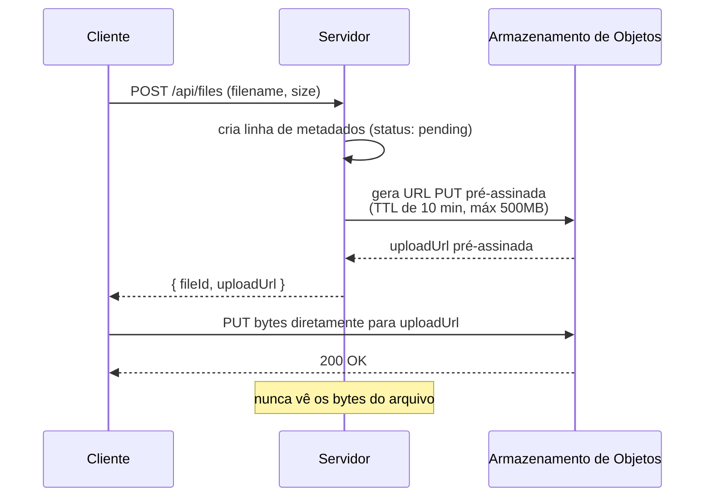
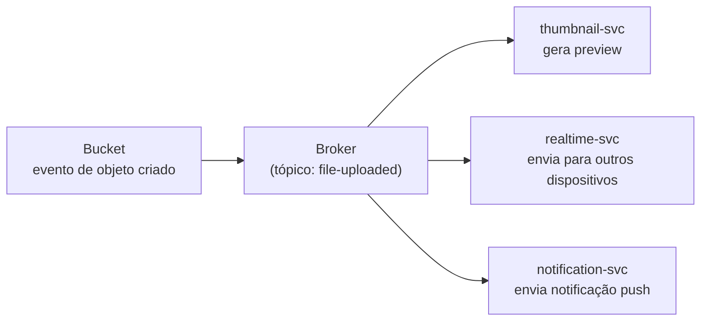

## Visão Geral

Um banco de dados relacional é construído para indexar e consultar linhas pequenas e estruturadas rapidamente — não é construído para manter um arquivo de vídeo de 2 GB como uma coluna blob, e transmitir uploads grandes através de um servidor de aplicação antes de pousarem em algum lugar permanente desperdiça memória do servidor, slots de conexão, e tempo em trabalho que não tem nada a ver com o trabalho real do servidor. **Armazenamento de objetos** (S3, Google Cloud Storage, Azure Blob Storage) é um sistema separado construído com o propósito de armazenar arquivos grandes e quase-imutáveis de forma barata e servi-los de volta eficientemente. O padrão que faz isso funcionar de ponta a ponta é: os *bytes* do arquivo vão diretamente do cliente para o armazenamento de objetos, e apenas os *metadados* do arquivo — nome, tamanho, dono, localização de armazenamento — jamais tocam seu banco de dados.

## Por Que Não Fazer Upload Através do Servidor

Rotear um arquivo grande através do servidor de aplicação a caminho do armazenamento tem três custos concretos: o servidor mantém uma conexão e faz buffer (ou transmite) o corpo da requisição pelo tempo que o upload durar, o que para um arquivo grande em uma conexão lenta pode ser minutos; o timeout de requisição do próprio servidor tem que ser ajustado para tolerar uploads em vez das chamadas de API rápidas que ele normalmente atende; e cada byte que o cliente envia passa por infraestrutura que não ganha nada em vê-lo, já que um arquivo de vídeo não vai ser validado, transformado, ou unido a nada nessa camada. Fazer isso em escala significa que o tráfego de upload compete diretamente com — e pode sufocar — a capacidade computacional que o servidor precisa para tudo mais que ele faz, que é exatamente a reclamação de "uploads deixaram nossa API lenta" que motiva esse padrão na prática.

## O Fluxo de URL Pré-Assinada

Em vez disso, o único trabalho do servidor é entregar ao cliente uma URL de curta duração, pré-autorizada, que aponta diretamente para o bucket de armazenamento, e então sair do caminho:



A URL pré-assinada é uma assinatura, gerada com credenciais que só o servidor possui, que concede permissão de tempo limitado para realizar uma operação específica (um PUT em uma chave de objeto específica) sem que quem faz o upload precise de credenciais de armazenamento próprias. Restringi-la fortemente — expiração curta, um tamanho máximo, às vezes um tipo de conteúdo exigido — limita quanto dano uma URL vazada ou reutilizada poderia causar, já que qualquer pessoa que a possua antes de ela expirar poderia usá-la.

## O Que Vai no Banco de Dados vs. no Bucket

A divisão é deliberada e consistente com tratar cada armazenamento pelo que ele faz bem (ver Polyglot Persistence): o banco de dados mantém os fatos pesquisáveis, relacionais e pequenos sobre um arquivo, e o bucket mantém os bytes grandes e opacos.

```
-- tabela files (BD relacional)
id            UUID PRIMARY KEY
name          TEXT
size_bytes    BIGINT
content_type  TEXT
owner_id      UUID REFERENCES users(id)
storage_key   TEXT       -- ex.: "uploads/2026/08/04/<uuid>.mp4"
status        TEXT       -- 'pending' | 'uploaded' | 'failed'
created_at    TIMESTAMP
```

`storage_key` é o único elo entre os dois sistemas — o banco de dados nunca mantém os bytes do arquivo em si, apenas um ponteiro para onde eles vivem no bucket. Servir o arquivo de volta depois segue o mesmo formato ao contrário: procure a linha para obter `storage_key`, peça ao bucket uma URL pré-assinada de *GET* (ou sirva-o via uma CDN na frente do bucket, conforme Caching Strategies and CDNs), e entregue essa URL ao cliente em vez de fazer proxy dos bytes através do servidor.

## Reagindo a um Upload Concluído

O servidor entrega a URL pré-assinada antes de o upload acontecer, então não sabe sincronamente quando os bytes realmente pousam — o cliente faz upload diretamente para o bucket, contornando o servidor completamente nessa etapa. Sistemas de armazenamento de objetos resolvem isso com **notificações de evento**: o próprio bucket emite um evento (ex.: "objeto criado") ao qual o resto do sistema pode reagir, que é o que dispara trabalho como gerar uma miniatura de vídeo ou notificar outros dispositivos que um novo arquivo foi sincronizado.

A abordagem ingênua — o bucket chamando cada serviço interessado diretamente — não se sustenta: se o serviço de miniatura estiver brevemente fora do ar ou lento, a miniatura desse upload silenciosamente nunca é gerada, sem retry e sem registro de que algo deu errado. Este é o mesmo problema de confiabilidade que Message Brokers: Queues vs. Log-Based Streaming resolve em geral — o bucket publica um evento para um broker, o broker garante entrega pelo menos-uma-vez com retries e uma dead-letter queue para qualquer coisa que não possa ser entregue, e qualquer número de consumidores independentes (miniaturas, sincronização em tempo real, notificações push) se inscrevem nele sem que a camada de armazenamento precise saber que qualquer um deles existe:



## Trade-offs

- **Upload direto mantém o servidor de aplicação sem estado e rápido, ao custo de um cliente mais elaborado** — o cliente (ou seu SDK) tem que implementar um fluxo de duas etapas (solicitar uma URL, depois fazer upload para ela) em vez de um único POST, e tem que lidar com o upload falhando independentemente do sucesso da requisição de metadados.
- **URLs pré-assinadas evitam distribuir credenciais de armazenamento, mas uma URL vazada é válida até expirar** — escopo restrito (TTL curto, uma chave de objeto, um teto de tamanho) limita o raio de explosão mas não o elimina da forma que um upload totalmente mediado pelo servidor faria.
- **Pós-processamento orientado a eventos desacopla o armazenamento de todo consumidor, mas significa que "uploaded" e "totalmente processado" (ex.: miniatura existe) são pontos diferentes no tempo** — o cliente e qualquer UI têm que considerar um arquivo existindo antes de sua miniatura existir, tipicamente via o campo `status` ou um evento subsequente.
- **Manter apenas metadados no banco de dados relacional o mantém rápido e pequeno, mas significa que a existência do arquivo e a correção dos metadados podem divergir do que realmente está no bucket** — um upload que nunca completou mas deixou uma linha de metadados `pending`, ou um objeto do bucket excluído fora de banda, ambos exigem lógica de reconciliação em algum lugar.

## Perguntas de Entrevista

- Por que um arquivo grande não deveria ser transmitido através do servidor de aplicação a caminho do armazenamento, mesmo que o servidor pudesse tecnicamente lidar com a largura de banda?
- O que uma URL pré-assinada realmente concede, e o que especificamente limita o risco se uma vazar antes de expirar?
- Por que o banco de dados armazena apenas uma `storage_key` em vez do próprio arquivo, e o que isso tem em comum com o raciocínio por trás da polyglot persistence?
- Por que chamar o serviço de miniatura diretamente a partir do evento de armazenamento de objetos é um design pior do que publicar em um broker, e contra qual falha específica o broker protege?
- O que significa um arquivo estar "uploaded" mas ainda não "processado", e como você representaria essa distinção no modelo de dados?

## Referências

- [Documentação da AWS S3 — Uploading and copying objects using presigned URLs](https://docs.aws.amazon.com/AmazonS3/latest/userguide/PresignedUrlUploadObject.html)
- [Documentação do Google Cloud Storage — Signed URLs](https://cloud.google.com/storage/docs/access-control/signed-urls)
- [Documentação da AWS S3 — Amazon S3 Event Notifications](https://docs.aws.amazon.com/AmazonS3/latest/userguide/EventNotifications.html)
- Martin Kleppmann, *Designing Data-Intensive Applications*, 2ª Edição (O'Reilly) — Capítulo 2, "Data Models and Query Languages" (sobre combinar armazenamento com o formato dos dados)
