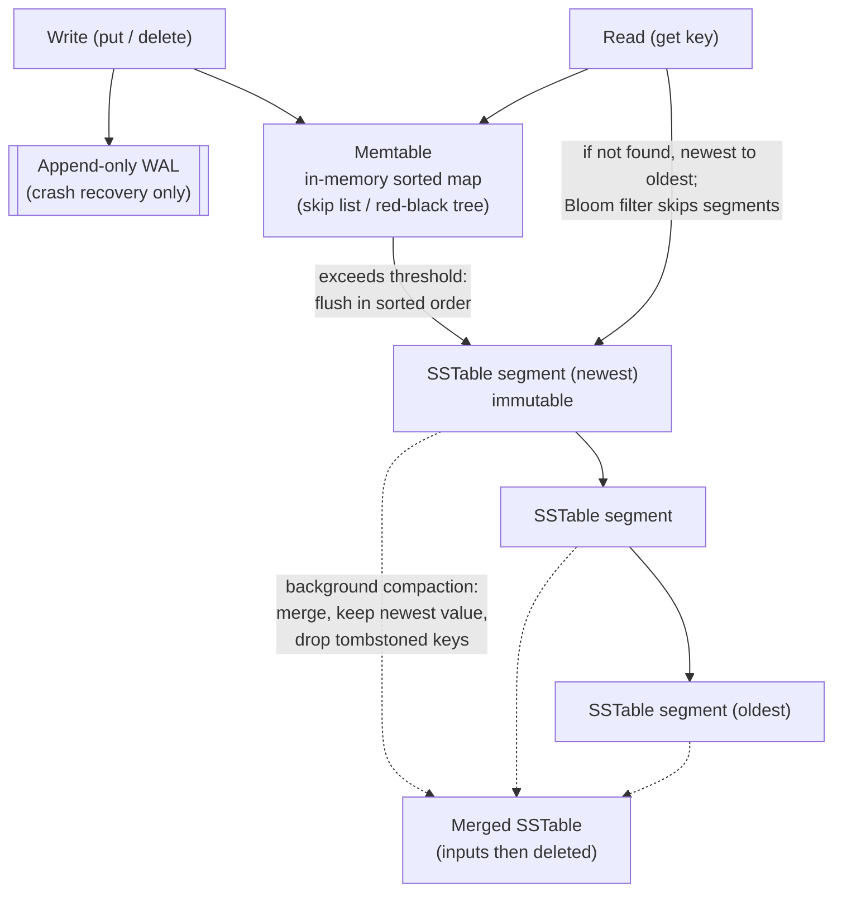

## Overview

Almost every OLTP database — relational or not, embedded or client/server — is built on one of two storage engine families underneath: **log-structured** engines that write immutable files and merge them in the background, and **B-trees** that update fixed-size pages in place. The query language on top can look identical; the engine underneath decides whether your write-heavy workload saturates disk bandwidth, whether your p99 read latency is predictable, and how much disk your data actually occupies. Picking a database without knowing which family it belongs to means inheriting those characteristics by accident.

## The Simplest Possible Storage Engine

Start with a database that is two shell functions: writing appends `key,value` to a file, reading greps the file and takes the last match. Writes are excellent — appending to a file is about the cheapest write a machine can do. Reads are terrible — every lookup scans the whole file, `O(n)`.

That gap is the whole subject. An **index** is an additional structure derived from the primary data, maintained purely to make reads faster. It never changes what the database contains, only how fast you can find it, and it is not free: every index consumes disk space and slows down every write, because the index has to be updated too. This is why databases don't index everything by default — you're expected to choose indexes from your knowledge of the query patterns, buying read speed with write overhead deliberately rather than by accident.

## Log-Structured Storage and LSM-Trees

The first family keeps the append-only write path and fixes reads by keeping data sorted.

An **SSTable** (Sorted String Table) is a file of key-value pairs sorted by key, where each key appears exactly once. Because it's sorted, you don't need every key in memory: group records into blocks of a few KiB, store only the *first key of each block* in a **sparse index**, and a lookup for `handiwork` finds it must lie between the indexed keys `handbag` and `handsome`, seeks to that block, and scans a few kilobytes. Blocks can also be compressed, which saves disk and I/O bandwidth for a little CPU.

But you can't append to a sorted file. The log-structured approach is the hybrid that resolves this:

1. **Write to a memtable.** Incoming writes go into an in-memory ordered structure — a red–black tree, skip list, or trie — which accepts keys in any order and can be read back in sorted order. Every write is *also* appended to an unsorted on-disk log first, purely so the memtable can be reconstructed after a crash.
2. **Flush to an immutable SSTable.** When the memtable exceeds a threshold (typically a few MB), it's written out to disk in sorted order as a new segment. Writing is one sequential pass; once written, the file is never modified. A fresh memtable takes over while the flush happens.
3. **Read newest-to-oldest.** A lookup checks the memtable, then the most recent segment, then the next-older one, until it finds the key or exhausts every segment.
4. **Compact in the background.** A merge process reads segments side by side (mergesort-style, one key at a time, so memory use stays minimal), keeps only the most recent value for each key, and writes a new merged segment. Deletes are recorded as a **tombstone**, a marker that tells the merge to discard all older values for that key.

Because reads may have to consult several segments, LSM engines put a **Bloom filter** in each one — a small bitmap that answers "is this key definitely absent?" A key hashes to a handful of bit positions; if any of those bits is 0, the key is certainly not in that SSTable and the whole file can be skipped without I/O. If they're all 1, the key is *probably* present and you pay for the lookup, occasionally on a false positive. Roughly 10 bits per key gives a 1% false-positive rate, with the rate dropping tenfold for each additional 5 bits per key. This is what keeps point lookups on cold or nonexistent keys from degenerating into a scan of every segment.

**Compaction strategy** is the main operational knob. *Size-tiered* compaction merges smaller SSTables into successively larger ones — few rewrites of any given record, so it absorbs very high write throughput, at the cost of large files and a lot of temporary disk space during merges. *Leveled* compaction keeps SSTable size fixed and organizes them into levels (L0, L1, …) where every level past L0 is partitioned by key range, so a merge moves a bounded amount of data from level *i* to *i+1*. Leveled compaction is more incremental, uses less disk, and is better for reads because fewer SSTables need checking. Rule of thumb: size-tiered for write-dominated workloads, leveled for read-dominated ones.

This design is what runs in RocksDB, LevelDB, Cassandra, ScyllaDB, and HBase — all descendants of Google's Bigtable paper, and all implementations of the 1996 Log-Structured Merge-tree. Because segment files are immutable and written once, they're also a natural fit for object storage rather than local disk, which is how systems like SlateDB and Delta Lake are built.

## B-Trees

The other family is older, and it is what "a database index" means to most people. **B-trees**, introduced in 1970 and already called ubiquitous by 1980, remain the standard index in essentially every relational database — PostgreSQL, MySQL's InnoDB, SQLite by default — and many nonrelational ones.

Like SSTables, B-trees keep keys sorted, which gives efficient point lookups and range queries. Everything else differs. Where log-structured engines use variable-size, multi-megabyte, write-once segments, a B-tree breaks storage into **fixed-size pages** — 4 KiB traditionally, 8 KiB in PostgreSQL, 16 KiB in MySQL — and **overwrites them in place**. Each page has a page number, so one page can reference another the way a pointer does in memory, and those references form the tree.

A lookup starts at the root page, which holds keys and references to child pages, each child owning a contiguous key range. Looking up 251 means following the reference between the boundaries 200 and 300, then descending into a page that subdivides that range further, until you reach a leaf page holding the key with either its value inline or a reference to where the value lives. The number of child references per page is the **branching factor**, typically several hundred, which is why the tree stays shallow: a four-level tree of 4 KiB pages with a branching factor of 500 addresses about 250 TB. Most real databases are three or four levels deep, so a lookup is three or four page reads.

Updating an existing key means overwriting its leaf page. Inserting into a full page means **splitting** it into two half-full pages and updating the parent to reference both — and if the parent is full too, the split cascades upward, potentially creating a new root. This is what keeps the tree balanced at `O(log n)` depth.

Overwriting multiple pages at once is exactly where B-trees get dangerous. A crash midway through a page split leaves a corrupted tree — an orphan page belonging to no parent — and hardware that can't atomically write a full page can leave a **torn page**. The standard defense is a **write-ahead log (WAL)**: every modification is appended to the WAL and flushed with `fsync` *before* being applied to the tree pages, so recovery can replay the log back to a consistent state. The WAL is also what makes it safe to buffer dirty pages in memory instead of writing each one out immediately. (Some engines, notably LMDB, skip the WAL and use copy-on-write instead: write the modified page to a new location and rebuild the parent chain pointing at it — which doubles as a mechanism for snapshot isolation.)

## Comparing the Two

The rule of thumb is that **LSM-trees favor writes and B-trees favor reads**, but the interesting part is *why*, and the differences don't all point the same direction. It's also not a strict either/or: some engines blend the approaches, e.g. maintaining several B-trees and merging them LSM-style.

**Read latency predictability.** A B-tree read touches one page per level — a small, fixed number, so latency is fast *and* predictable. An LSM read may consult the memtable plus several SSTables at different compaction stages; Bloom filters cut most of that I/O away, but the worst case is inherently more variable. Range queries widen the gap: a B-tree walks its sorted structure directly, while an LSM engine must scan every segment in parallel and merge results — and Bloom filters are useless for ranges, since you'd have to hash every possible key in the range.

**Sequential vs. random writes.** A B-tree writing keys scattered across the key space produces scattered page overwrites: **random writes**. An LSM engine writes whole segment files at a time: **sequential writes**. Disks deliver higher sequential than random write throughput — dramatically so on spinning disks, and still noticeably on SSDs, because flash is written a page at a time but erased a block at a time, so random writes leave blocks full of mixed valid and invalid pages and force the controller's garbage collector to relocate data before erasing. That GC steals write bandwidth from your application and wears the drive out faster.

**Write amplification.** Every application write becomes several disk writes. In an LSM-tree: once to the WAL, once when the memtable flushes, and once more for each compaction the record participates in. In a B-tree: at least twice — once to the WAL and once to the page — and sometimes a whole page must be written for a few changed bytes, to guarantee correct recovery. Divide bytes actually written by bytes a bare append-only log would have written and you get the write amplification factor. For typical workloads LSM-trees amplify less, because they never write whole pages for small changes and can compress SSTable blocks. When a write-heavy system is bottlenecked on disk bandwidth, lower write amplification directly means more writes per second — and less SSD wear.

**Disk space.** B-trees fragment: delete a lot of keys and the file is left with unused pages that can be reused by later inserts but can't easily be returned to the OS, which is why PostgreSQL needs a background `VACUUM`. LSM-trees rewrite their files during compaction anyway, so fragmentation doesn't accumulate, and compressed SSTable blocks often produce smaller files than the equivalent B-tree. The counterpoint: overwritten and deleted values keep consuming space until compaction removes them (low overhead under leveled compaction, higher under size-tiered, which also needs significant temporary space mid-merge). That lag has a compliance edge too — a record you deleted may survive in higher levels until its tombstone propagates all the way down, which matters if you must prove data was actually erased.

**Backpressure and snapshots.** Sustained write bursts can fill an LSM memtable faster than compaction drains it; engines like RocksDB respond by throttling or suspending reads and writes until the flush completes — a latency spike that shows up under exactly the load you bought the LSM engine for. On the other side, immutable segments make snapshots nearly free: record which segment files existed at a point in time and don't delete them. Snapshotting a B-tree whose pages are overwritten in place is considerably harder.

**When would you pick which.** Write-heavy ingestion — event streams, time series, metrics, high-volume logging, anything where writes vastly outnumber reads and reads are mostly recent-key lookups — favors an LSM engine, and that's exactly the profile of Cassandra and RocksDB deployments. Mixed OLTP with lots of range scans, joins, and a hard requirement on predictable tail latency, plus mature transactional tooling, favors a B-tree — which is why PostgreSQL and InnoDB remain the default answer. And because benchmarks are extremely sensitive to key size, value size, and overwrite-vs-insert ratio, the honest version of this advice is: test with your workload, and run the test long enough that compaction actually kicks in. Benchmarking an empty LSM-tree measures a database that has no compaction to do yet.

## Multicolumn and Secondary Indexes

Everything above described key-value indexes, which map to primary keys: the unique identifier of a row, document, or vertex that other records use to refer to it.

**Secondary indexes** let you search by something other than the primary key — `CREATE INDEX` on `user_id` so you can find every row belonging to a user. The structural difference is that indexed values need not be unique, so an entry may match many rows. Engines handle this either by making the index value a list of row identifiers (a postings list) or by appending the row identifier to the key to force uniqueness. Both B-trees and log-structured storage can back a secondary index; nothing about the index type dictates the engine.

When a query filters on several columns at once, you need either a **concatenated index** — one index over `(last_name, first_name)`, which serves lookups on `last_name` alone and on both together, but *not* on `first_name` alone, because the sort order is by the leading column first — or several single-column indexes whose results the query planner combines, which costs an intersection step. Column order in a concatenated index is therefore a design decision, not a formality.

## Storing Values Within the Index

An index's keys are what you search by; what's stored *alongside* them is a separate decision with real performance consequences.

- **Clustered index** — the actual row is stored inside the index structure. InnoDB always clusters a table on its primary key; SQL Server allows one clustered index per table. A primary-key lookup returns the row with no second hop.
- **Heap file + reference** — the index stores a pointer to where the row lives, either its primary key (InnoDB's secondary indexes do this) or a direct disk location. Rows live in a heap file in no particular order. PostgreSQL takes this approach. Cost: an index hit is followed by a heap fetch. Subtle cost: updating a row to a *larger* value may not fit in place, forcing a move to a new heap location — and then every index pointing at it must be updated, or a forwarding pointer left behind.
- **Covering index / index with included columns** — the middle ground. Store some extra columns in the index itself so that common queries can be answered from the index alone, without touching the heap or the clustered index. The index is then said to *cover* the query. It's genuinely faster, and it's genuinely duplicated data: more disk, slower writes.

## Keeping Everything in Memory

Every structure so far is an accommodation to disks being awkward. We accept the awkwardness for two reasons: disks are durable, and they cost less per gigabyte than RAM. As RAM gets cheaper the second reason erodes, and plenty of OLTP datasets simply fit in memory — so **in-memory databases** become viable.

Some, like Memcached, are caches and accept that a restart loses everything. Others target durability without giving up in-memory speed, by appending changes to an on-disk log, writing periodic snapshots, replicating state to other machines, or using battery-backed RAM. These still count as in-memory databases: the disk is used only as an append-only durability log, and every read is served from memory. Redis and Couchbase write asynchronously and so offer only weak durability — a crash can lose the last window of writes — while VoltDB, SingleStore, Oracle TimesTen, and RAMCloud go further toward real durability guarantees. Writing to disk has operational benefits beyond crash recovery, too: files can be backed up, inspected, and processed by external tools.

The counterintuitive part is *why* they're fast. It is not that they avoid reading from disk — a disk-based engine with enough RAM rarely reads from disk either, because the OS page cache holds hot blocks anyway. The real win is avoiding the cost of **encoding in-memory data structures into a disk-writable form** on every operation. That also unlocks data models that are painful to implement on disk-based indexes: Redis exposes priority queues, sets, and sorted sets as first-class database types precisely because keeping everything in memory makes those implementations simple.

## Trade-offs

- **LSM-trees trade read predictability for write throughput** — sequential segment writes and lower write amplification let them absorb far more writes per second on the same hardware, but a read may have to consult the memtable plus several SSTables, so tail latency is inherently more variable than a B-tree's fixed three-or-four page reads.
- **B-trees trade write efficiency for in-place simplicity** — overwriting pages means random I/O and writing a full page for a few changed bytes, plus a mandatory WAL write for crash safety, but it gives you one canonical location per key and therefore fast, predictable range scans.
- **Compaction is background work you still pay for in the foreground** — it reclaims space and keeps read amplification bounded, but it competes for the same disk bandwidth as your writes, and if it falls behind, engines like RocksDB apply backpressure and stall reads and writes until the memtable drains.
- **Compaction strategy is a workload bet, not a default** — size-tiered handles heavy writes with fewer rewrites but needs large temporary space and leaves more SSTables for reads to check; leveled uses less disk and reads faster but merges more often, so choosing wrong degrades exactly the axis you cared about.
- **Every index makes reads faster and writes slower** — a covering index can eliminate a heap lookup entirely, a clustered index eliminates the second hop for primary-key reads, but both duplicate data, consume disk, and add work to every single write to the table.
- **In-memory speed comes from skipping serialization, not from skipping disk** — a well-cached disk-based engine rarely touches disk either, so the honest comparison is encoding overhead versus durability guarantees; systems like Redis buy their speed partly by writing to disk asynchronously, which means a crash can lose recent writes.

## Interview Questions

- An LSM engine writes each record to a WAL, again when the memtable flushes, and again in every compaction it participates in. Given all that extra I/O, why does it still generally sustain higher write throughput than a B-tree that writes each record only twice?
- Bloom filters dramatically reduce I/O for point lookups in an LSM engine but do nothing for range queries. Why not, and what does that imply about which workloads suit LSM storage?
- A team migrates a write-heavy service from PostgreSQL to Cassandra and benchmarks a huge write throughput win in a one-hour test. What is most likely wrong with that benchmark?
- PostgreSQL needs a `VACUUM` process while a compacting LSM engine does not. What does that tell you about how each engine reclaims space, and where the equivalent cost shows up in the LSM engine?
- Your query filters on both `status` and `created_at`. When is a single concatenated index over both columns better than two separate single-column indexes, and what does the column ordering in that concatenated index determine?

## References

- [Martin Kleppmann, "Designing Data-Intensive Applications", 2nd Edition (O'Reilly) — Chapter 4, "Storage and Retrieval", section "Storage and Indexing for OLTP"](https://www.oreilly.com/library/view/designing-data-intensive-applications/9781098119058/)
- [RocksDB Wiki — Leveled Compaction and the LSM-tree structure](https://github.com/facebook/rocksdb/wiki/Leveled-Compaction)
- [PostgreSQL Documentation — B-Tree Indexes (internal structure and implementation)](https://www.postgresql.org/docs/current/btree.html)
- [ScyllaDB Engineering — Compaction Series: Size-Tiered Compaction (write, read, and space amplification trade-offs)](https://www.scylladb.com/2018/01/17/compaction-series-space-amplification/)
