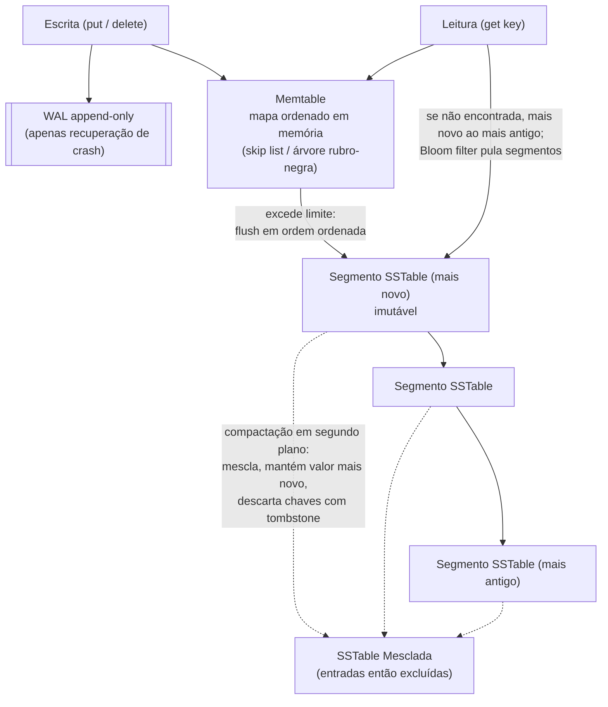

## Visão Geral

Quase todo banco de dados OLTP — relacional ou não, embutido ou cliente/servidor — é construído sobre uma de duas famílias de motor de armazenamento por baixo: motores **log-estruturados** que escrevem arquivos imutáveis e os mesclam em segundo plano, e **B-trees** que atualizam páginas de tamanho fixo no local. A linguagem de consulta por cima pode parecer idêntica; o motor por baixo decide se sua carga de trabalho pesada em escrita satura a largura de banda do disco, se sua latência de leitura p99 é previsível, e quanto disco seus dados realmente ocupam. Escolher um banco de dados sem saber a qual família ele pertence significa herdar essas características por acidente.

## O Motor de Armazenamento Mais Simples Possível

Comece com um banco de dados que são duas funções shell: escrever anexa `chave,valor` a um arquivo, ler faz grep no arquivo e pega a última correspondência. Escritas são excelentes — anexar a um arquivo é a escrita mais barata que uma máquina consegue fazer. Leituras são terríveis — toda busca varre o arquivo inteiro, `O(n)`.

Essa lacuna é o assunto inteiro. Um **índice** é uma estrutura adicional derivada dos dados primários, mantida puramente para tornar leituras mais rápidas. Ela nunca muda o que o banco de dados contém, apenas o quão rápido você consegue encontrá-lo, e não é gratuita: todo índice consome espaço em disco e desacelera cada escrita, porque o índice também precisa ser atualizado. É por isso que bancos de dados não indexam tudo por padrão — espera-se que você escolha índices a partir do seu conhecimento dos padrões de consulta, comprando velocidade de leitura com overhead de escrita deliberadamente em vez de por acidente.

## Armazenamento Log-Estruturado e LSM-Trees

A primeira família mantém o caminho de escrita append-only e corrige leituras mantendo os dados ordenados.

Uma **SSTable** (Sorted String Table) é um arquivo de pares chave-valor ordenados por chave, onde cada chave aparece exatamente uma vez. Porque está ordenado, você não precisa de toda chave em memória: agrupe registros em blocos de alguns KiB, armazene apenas a *primeira chave de cada bloco* em um **índice esparso**, e uma busca por `handiwork` encontra que ela deve estar entre as chaves indexadas `handbag` e `handsome`, busca aquele bloco, e varre alguns kilobytes. Blocos também podem ser comprimidos, o que economiza disco e largura de banda de I/O por um pouco de CPU.

Mas você não pode anexar a um arquivo ordenado. A abordagem log-estruturada é o híbrido que resolve isso:

1. **Escreva em uma memtable.** Escritas de entrada vão para uma estrutura ordenada em memória — uma árvore rubro-negra, skip list, ou trie — que aceita chaves em qualquer ordem e pode ser lida de volta em ordem ordenada. Toda escrita é *também* anexada a um log em disco não ordenado primeiro, puramente para que a memtable possa ser reconstruída após um crash.
2. **Faça flush para uma SSTable imutável.** Quando a memtable excede um limite (tipicamente alguns MB), ela é escrita em disco em ordem ordenada como um novo segmento. Escrever é uma passagem sequencial; uma vez escrito, o arquivo nunca é modificado. Uma memtable nova assume enquanto o flush acontece.
3. **Leia do mais novo ao mais antigo.** Uma busca verifica a memtable, depois o segmento mais recente, depois o próximo mais antigo, até encontrar a chave ou esgotar todo segmento.
4. **Compacte em segundo plano.** Um processo de merge lê segmentos lado a lado (estilo mergesort, uma chave por vez, para que o uso de memória permaneça mínimo), mantém apenas o valor mais recente para cada chave, e escreve um novo segmento mesclado. Exclusões são registradas como uma **tombstone**, um marcador que diz ao merge para descartar todos os valores mais antigos daquela chave.

Porque leituras podem ter que consultar vários segmentos, motores LSM colocam um **Bloom filter** em cada um — um pequeno bitmap que responde "essa chave está definitivamente ausente?" Uma chave é hasheada para um punhado de posições de bit; se qualquer um desses bits for 0, a chave certamente não está naquela SSTable e o arquivo inteiro pode ser pulado sem I/O. Se todos forem 1, a chave está *provavelmente* presente e você paga pela busca, ocasionalmente em um falso positivo. Aproximadamente 10 bits por chave dá uma taxa de falso positivo de 1%, com a taxa caindo dez vezes a cada 5 bits adicionais por chave. Isso é o que impede buscas pontuais em chaves frias ou inexistentes de degenerar em uma varredura de todo segmento.

**Estratégia de compactação** é o principal botão operacional. Compactação *size-tiered* mescla SSTables menores em sucessivamente maiores — poucas reescritas de qualquer registro dado, então absorve throughput de escrita muito alto, ao custo de arquivos grandes e muito espaço temporário em disco durante merges. Compactação *leveled* mantém o tamanho da SSTable fixo e organiza-as em níveis (L0, L1, …) onde todo nível além do L0 é particionado por intervalo de chave, então um merge move uma quantidade limitada de dados do nível *i* para *i+1*. Compactação leveled é mais incremental, usa menos disco, e é melhor para leituras porque menos SSTables precisam ser verificadas. Regra prática: size-tiered para cargas de trabalho dominadas por escrita, leveled para dominadas por leitura.

Esse design é o que roda no RocksDB, LevelDB, Cassandra, ScyllaDB, e HBase — todos descendentes do paper Bigtable do Google, e todas implementações da Log-Structured Merge-tree de 1996. Porque arquivos de segmento são imutáveis e escritos uma vez, eles também são um encaixe natural para armazenamento de objetos em vez de disco local, que é como sistemas como SlateDB e Delta Lake são construídos.

## B-Trees

A outra família é mais antiga, e é o que "um índice de banco de dados" significa para a maioria das pessoas. **B-trees**, introduzidas em 1970 e já chamadas de ubíquas em 1980, permanecem o índice padrão em essencialmente todo banco de dados relacional — PostgreSQL, InnoDB do MySQL, SQLite por padrão — e muitos não relacionais.

Como SSTables, B-trees mantêm chaves ordenadas, o que dá buscas pontuais e consultas de intervalo eficientes. Tudo mais difere. Onde motores log-estruturados usam segmentos de tamanho variável, multi-megabyte, escritos uma vez, uma B-tree divide o armazenamento em **páginas de tamanho fixo** — 4 KiB tradicionalmente, 8 KiB no PostgreSQL, 16 KiB no MySQL — e **as sobrescreve no local**. Cada página tem um número de página, então uma página pode referenciar outra da forma que um ponteiro faz em memória, e essas referências formam a árvore.

Uma busca começa na página raiz, que mantém chaves e referências para páginas filhas, cada filha possuindo um intervalo de chave contíguo. Procurar por 251 significa seguir a referência entre os limites 200 e 300, depois descer em uma página que subdivide esse intervalo ainda mais, até chegar a uma página folha mantendo a chave com seu valor inline ou uma referência para onde o valor vive. O número de referências filhas por página é o **fator de ramificação**, tipicamente várias centenas, razão pela qual a árvore permanece rasa: uma árvore de quatro níveis com páginas de 4 KiB e um fator de ramificação de 500 endereça cerca de 250 TB. A maioria dos bancos de dados reais tem três ou quatro níveis de profundidade, então uma busca é três ou quatro leituras de página.

Atualizar uma chave existente significa sobrescrever sua página folha. Inserir em uma página cheia significa **dividi-la** em duas páginas meio-vazias e atualizar o pai para referenciar ambas — e se o pai também estiver cheio, a divisão se propaga para cima, potencialmente criando uma nova raiz. Isso é o que mantém a árvore balanceada em profundidade `O(log n)`.

Sobrescrever múltiplas páginas de uma vez é exatamente onde B-trees se tornam perigosas. Um crash no meio de uma divisão de página deixa uma árvore corrompida — uma página órfã pertencendo a nenhum pai — e hardware que não consegue escrever atomicamente uma página inteira pode deixar uma **página rasgada**. A defesa padrão é um **write-ahead log (WAL)**: toda modificação é anexada ao WAL e sincronizada com `fsync` *antes* de ser aplicada às páginas da árvore, para que a recuperação possa reproduzir o log de volta a um estado consistente. O WAL também é o que torna seguro armazenar em buffer páginas sujas em memória em vez de escrever cada uma imediatamente. (Alguns motores, notavelmente o LMDB, pulam o WAL e usam copy-on-write em vez disso: escreve a página modificada em uma nova localização e reconstrói a cadeia de pais apontando para ela — o que também serve como um mecanismo para isolamento de snapshot.)

## Comparando os Dois

A regra prática é que **LSM-trees favorecem escritas e B-trees favorecem leituras**, mas a parte interessante é *por quê*, e as diferenças não apontam todas na mesma direção. Também não é um estrito ou-um-ou-outro: alguns motores misturam as abordagens, ex.: mantendo várias B-trees e mesclando-as no estilo LSM.

**Previsibilidade de latência de leitura.** Uma leitura de B-tree toca uma página por nível — um número pequeno e fixo, então a latência é rápida *e* previsível. Uma leitura LSM pode consultar a memtable mais várias SSTables em diferentes estágios de compactação; Bloom filters cortam a maior parte desse I/O, mas o pior caso é inerentemente mais variável. Consultas de intervalo alargam a lacuna: uma B-tree caminha sua estrutura ordenada diretamente, enquanto um motor LSM deve varrer todo segmento em paralelo e mesclar resultados — e Bloom filters são inúteis para intervalos, já que você teria que fazer hash de toda chave possível no intervalo.

**Escritas sequenciais vs. aleatórias.** Uma B-tree escrevendo chaves espalhadas pelo espaço de chaves produz sobrescritas de página espalhadas: **escritas aleatórias**. Um motor LSM escreve arquivos de segmento inteiros de uma vez: **escritas sequenciais**. Discos entregam maior throughput de escrita sequencial do que aleatório — dramaticamente em discos rígidos, e ainda perceptivelmente em SSDs, porque flash é escrito uma página por vez mas apagado um bloco por vez, então escritas aleatórias deixam blocos cheios de páginas válidas e inválidas misturadas e forçam o coletor de lixo do controlador a realocar dados antes de apagar. Essa coleta de lixo rouba largura de banda de escrita da sua aplicação e desgasta o drive mais rápido.

**Amplificação de escrita.** Toda escrita de aplicação se torna várias escritas em disco. Em uma LSM-tree: uma vez no WAL, uma vez quando a memtable faz flush, e mais uma vez para cada compactação da qual o registro participa. Em uma B-tree: pelo menos duas vezes — uma vez no WAL e uma vez na página — e às vezes uma página inteira deve ser escrita para algumas bytes alterados, para garantir recuperação correta. Divida bytes realmente escritos por bytes que um log append-only puro teria escrito e você obtém o fator de amplificação de escrita. Para cargas de trabalho típicas, LSM-trees amplificam menos, porque nunca escrevem páginas inteiras para pequenas mudanças e podem comprimir blocos de SSTable. Quando um sistema pesado em escrita está limitado pela largura de banda do disco, menor amplificação de escrita significa diretamente mais escritas por segundo — e menos desgaste do SSD.

**Espaço em disco.** B-trees fragmentam: exclua muitas chaves e o arquivo fica com páginas não utilizadas que podem ser reutilizadas por inserções posteriores mas não podem facilmente ser devolvidas ao SO, razão pela qual o PostgreSQL precisa de um `VACUUM` em segundo plano. LSM-trees reescrevem seus arquivos durante a compactação de qualquer forma, então a fragmentação não se acumula, e blocos de SSTable comprimidos frequentemente produzem arquivos menores que a B-tree equivalente. O contraponto: valores sobrescritos e excluídos continuam consumindo espaço até que a compactação os remova (overhead baixo sob compactação leveled, maior sob size-tiered, que também precisa de espaço temporário significativo em meio ao merge). Esse atraso tem uma vantagem de conformidade também — um registro que você excluiu pode sobreviver em níveis mais altos até que sua tombstone se propague completamente para baixo, o que importa se você precisa provar que dados foram realmente apagados.

**Contrapressão e snapshots.** Rajadas de escrita sustentadas podem encher uma memtable LSM mais rápido do que a compactação a drena; motores como o RocksDB respondem limitando ou suspendendo leituras e escritas até que o flush complete — um pico de latência que aparece sob exatamente a carga para a qual você comprou o motor LSM. Por outro lado, segmentos imutáveis tornam snapshots quase gratuitos: registre quais arquivos de segmento existiam em um ponto no tempo e não os exclua. Fazer snapshot de uma B-tree cujas páginas são sobrescritas no local é consideravelmente mais difícil.

**Quando escolher qual.** Ingestão pesada em escrita — streams de eventos, séries temporais, métricas, logging de alto volume, qualquer coisa onde escritas superam muito leituras e leituras são majoritariamente buscas de chave recente — favorece um motor LSM, e esse é exatamente o perfil de implantações Cassandra e RocksDB. OLTP misto com muitas varreduras de intervalo, joins, e um requisito rígido de latência de cauda previsível, mais ferramentas transacionais maduras, favorece uma B-tree — razão pela qual PostgreSQL e InnoDB permanecem a resposta padrão. E porque benchmarks são extremamente sensíveis a tamanho de chave, tamanho de valor, e razão sobrescrita-vs-inserção, a versão honesta desse conselho é: teste com sua carga de trabalho, e rode o teste por tempo suficiente para que a compactação realmente entre em ação. Fazer benchmark de uma LSM-tree vazia mede um banco de dados que ainda não tem compactação para fazer.

## Índices Multicoluna e Secundários

Tudo acima descreveu índices chave-valor, que mapeiam para chaves primárias: o identificador único de uma linha, documento, ou vértice que outros registros usam para se referir a ele.

**Índices secundários** permitem que você busque por algo além da chave primária — `CREATE INDEX` em `user_id` para que você possa encontrar toda linha pertencente a um usuário. A diferença estrutural é que valores indexados não precisam ser únicos, então uma entrada pode corresponder a muitas linhas. Motores lidam com isso ou fazendo o valor do índice uma lista de identificadores de linha (uma postings list) ou anexando o identificador de linha à chave para forçar unicidade. Tanto B-trees quanto armazenamento log-estruturado podem sustentar um índice secundário; nada sobre o tipo de índice dita o motor.

Quando uma consulta filtra em várias colunas de uma vez, você precisa de um **índice concatenado** — um índice sobre `(last_name, first_name)`, que serve buscas em `last_name` sozinho e em ambos juntos, mas *não* em `first_name` sozinho, porque a ordem de classificação é pela coluna líder primeiro — ou vários índices de coluna única cujos resultados o planejador de consulta combina, o que custa um passo de interseção. A ordem das colunas em um índice concatenado é, portanto, uma decisão de design, não uma formalidade.

## Armazenando Valores Dentro do Índice

As chaves de um índice são pelo que você busca; o que é armazenado *ao lado* delas é uma decisão separada com consequências reais de performance.

- **Índice clusterizado** — a linha real é armazenada dentro da estrutura do índice. O InnoDB sempre clusteriza uma tabela em sua chave primária; o SQL Server permite um índice clusterizado por tabela. Uma busca por chave primária retorna a linha sem um segundo salto.
- **Arquivo heap + referência** — o índice armazena um ponteiro para onde a linha vive, ou sua chave primária (índices secundários do InnoDB fazem isso) ou uma localização direta em disco. Linhas vivem em um arquivo heap sem ordem particular. O PostgreSQL adota essa abordagem. Custo: um acerto de índice é seguido por uma busca no heap. Custo sutil: atualizar uma linha para um valor *maior* pode não caber no local, forçando uma mudança para uma nova localização no heap — e então todo índice apontando para ela deve ser atualizado, ou um ponteiro de encaminhamento deixado para trás.
- **Índice de cobertura / índice com colunas incluídas** — o meio-termo. Armazene algumas colunas extras no próprio índice para que consultas comuns possam ser respondidas apenas pelo índice, sem tocar o heap ou o índice clusterizado. O índice então "cobre" a consulta. É genuinamente mais rápido, e é genuinamente dado duplicado: mais disco, escritas mais lentas.

## Mantendo Tudo em Memória

Toda estrutura até aqui é uma acomodação ao fato de discos serem incômodos. Aceitamos o incômodo por duas razões: discos são duráveis, e custam menos por gigabyte do que RAM. Conforme a RAM fica mais barata, a segunda razão erode, e muitos conjuntos de dados OLTP simplesmente cabem em memória — então **bancos de dados em memória** se tornam viáveis.

Alguns, como o Memcached, são caches e aceitam que um reinício perde tudo. Outros almejam durabilidade sem abrir mão da velocidade em memória, anexando mudanças a um log em disco, escrevendo snapshots periódicos, replicando estado para outras máquinas, ou usando RAM com bateria. Esses ainda contam como bancos de dados em memória: o disco é usado apenas como um log de durabilidade append-only, e toda leitura é servida da memória. Redis e Couchbase escrevem assincronamente e portanto oferecem apenas durabilidade fraca — um crash pode perder a última janela de escritas — enquanto VoltDB, SingleStore, Oracle TimesTen, e RAMCloud vão mais longe em direção a garantias reais de durabilidade. Escrever em disco tem benefícios operacionais além da recuperação de crash, também: arquivos podem ser copiados como backup, inspecionados, e processados por ferramentas externas.

A parte contraintuitiva é *por que* eles são rápidos. Não é que eles evitem ler do disco — um motor baseado em disco com RAM suficiente raramente lê do disco também, porque o cache de página do SO mantém os blocos quentes de qualquer forma. A verdadeira vitória é evitar o custo de **codificar estruturas de dados em memória em uma forma gravável em disco** a cada operação. Isso também desbloqueia modelos de dados que são dolorosos de implementar em índices baseados em disco: o Redis expõe filas de prioridade, sets, e sorted sets como tipos de banco de dados de primeira classe precisamente porque manter tudo em memória torna essas implementações simples.

## Trade-offs

- **LSM-trees trocam previsibilidade de leitura por throughput de escrita** — escritas sequenciais de segmento e menor amplificação de escrita permitem que absorvam muito mais escritas por segundo no mesmo hardware, mas uma leitura pode ter que consultar a memtable mais várias SSTables, então a latência de cauda é inerentemente mais variável do que as três-ou-quatro leituras de página fixas de uma B-tree.
- **B-trees trocam eficiência de escrita por simplicidade no local** — sobrescrever páginas significa I/O aleatório e escrever uma página inteira para algumas bytes alterados, mais uma escrita obrigatória no WAL para segurança de crash, mas dá a você uma localização canônica por chave e, portanto, varreduras de intervalo rápidas e previsíveis.
- **Compactação é trabalho em segundo plano que você ainda paga em primeiro plano** — ela recupera espaço e mantém a amplificação de leitura limitada, mas compete pela mesma largura de banda de disco que suas escritas, e se ficar para trás, motores como o RocksDB aplicam contrapressão e travam leituras e escritas até que a memtable drene.
- **Estratégia de compactação é uma aposta na carga de trabalho, não um padrão** — size-tiered lida com escritas pesadas com menos reescritas mas precisa de grande espaço temporário e deixa mais SSTables para leituras verificarem; leveled usa menos disco e lê mais rápido mas mescla com mais frequência, então escolher errado degrada exatamente o eixo com que você se importava.
- **Todo índice torna leituras mais rápidas e escritas mais lentas** — um índice de cobertura pode eliminar completamente uma busca no heap, um índice clusterizado elimina o segundo salto para leituras por chave primária, mas ambos duplicam dados, consomem disco, e adicionam trabalho a cada escrita na tabela.
- **Velocidade em memória vem de pular serialização, não de pular disco** — um motor baseado em disco bem cacheado raramente toca o disco também, então a comparação honesta é overhead de codificação versus garantias de durabilidade; sistemas como o Redis compram sua velocidade parcialmente escrevendo em disco assincronamente, o que significa que um crash pode perder escritas recentes.

## Perguntas de Entrevista

- Um motor LSM escreve cada registro no WAL, novamente quando a memtable faz flush, e novamente em cada compactação da qual participa. Dado todo esse I/O extra, por que ele ainda geralmente sustenta maior throughput de escrita do que uma B-tree que escreve cada registro apenas duas vezes?
- Bloom filters reduzem drasticamente o I/O para buscas pontuais em um motor LSM mas não fazem nada para consultas de intervalo. Por que não, e o que isso implica sobre quais cargas de trabalho se encaixam em armazenamento LSM?
- Uma equipe migra um serviço pesado em escrita do PostgreSQL para o Cassandra e faz benchmark de um enorme ganho de throughput de escrita em um teste de uma hora. O que está mais provavelmente errado com esse benchmark?
- O PostgreSQL precisa de um processo `VACUUM` enquanto um motor LSM em compactação não. O que isso te diz sobre como cada motor recupera espaço, e onde o custo equivalente aparece no motor LSM?
- Sua consulta filtra tanto em `status` quanto em `created_at`. Quando um único índice concatenado sobre ambas as colunas é melhor do que dois índices de coluna única separados, e o que a ordenação das colunas nesse índice concatenado determina?

## Referências

- [Martin Kleppmann, "Designing Data-Intensive Applications", 2ª Edição (O'Reilly) — Capítulo 4, "Storage and Retrieval", seção "Storage and Indexing for OLTP"](https://www.oreilly.com/library/view/designing-data-intensive-applications/9781098119058/)
- [RocksDB Wiki — Leveled Compaction and the LSM-tree structure](https://github.com/facebook/rocksdb/wiki/Leveled-Compaction)
- [Documentação do PostgreSQL — B-Tree Indexes (estrutura interna e implementação)](https://www.postgresql.org/docs/current/btree.html)
- [ScyllaDB Engineering — Compaction Series: Size-Tiered Compaction (trade-offs de amplificação de escrita, leitura e espaço)](https://www.scylladb.com/2018/01/17/compaction-series-space-amplification/)
