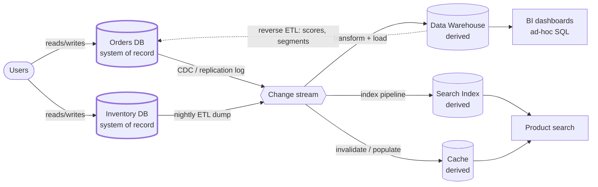

## Overview

Every data system serves two very different audiences: the users clicking through an application, who need a handful of records back in milliseconds, and the analysts asking "what was revenue per store last January," who need an aggregate over every row ever written. These are not two sizes of the same workload — they are opposite access patterns, and the storage layout, indexing strategy, and hardware that make one fast actively make the other slow. **Operational** (OLTP) and **analytical** (OLAP) systems are separated for that reason, and once you separate them, a second question follows: which copy of the data is authoritative, and which is merely derived from it?

## Two Opposite Access Patterns

An operational system handles the reads and writes generated by users acting on the application. The dominant shape is the **point query**: fetch a small number of records by key, insert one, update one, delete one.

```sql
-- OLTP: one order, one index lookup, sub-millisecond, thousands per second
SELECT * FROM orders WHERE id = 'ord_8f21a';
UPDATE inventory SET qty = qty - 1 WHERE sku = 'sku-8821';
```

An analytical system does the opposite. A single query scans millions or billions of rows and returns a handful of aggregated numbers — a count, a sum, a group-by — that no individual user row could answer.

```sql
-- OLAP: scans every sale in a month across every store, seconds to minutes, a few per minute
SELECT store_id, SUM(amount) AS revenue
FROM sales
WHERE sold_at >= '2026-01-01' AND sold_at < '2026-02-01'
GROUP BY store_id;
```

The contrast is worth stating in numbers, because it drives every design decision downstream:

| | Operational (OLTP) | Analytical (OLAP) |
| --- | --- | --- |
| Rows touched per query | 1 to a few hundred | millions to billions |
| Query concurrency | thousands per second | a handful at a time |
| Query shape | fixed, baked into app code | arbitrary, ad-hoc, written by analysts |
| Write pattern | individual inserts/updates/deletes | bulk load or event stream |
| Data represents | latest state, right now | history of what happened over time |
| Dataset size | gigabytes to terabytes | terabytes to petabytes |
| Latency budget | milliseconds | seconds to minutes |

A row-oriented store with B-tree indexes is exactly right for the first column: it lets you find one row without reading the others, and update it in place cheaply. It is exactly wrong for the second, where the query reads two columns out of forty across a billion rows — a row store has to drag all forty columns through memory to get at two of them. Analytical systems answer this with **column-oriented storage** plus heavy compression, which turns "scan two columns of a billion rows" into a sequential read of a small, densely packed block. That layout is in turn terrible at updating a single order, which is why one engine rarely wins at both.

There's a middle case worth naming: **real-time analytics** engines like ClickHouse, Apache Druid, and Apache Pinot run aggregate queries but with a low-latency, user-facing budget — powering the "views in the last hour" counter inside a product rather than an internal quarterly report. They ingest continuously instead of in nightly batches, but structurally they still sit on the analytical side of the line.

## Why Not Just Run Analytics Against Production

The tempting shortcut — point the BI tool at a read replica of the production database — breaks down for four independent reasons, and any one of them is enough.

**Resource contention.** An analytical query is, by construction, expensive: it saturates disk I/O and buffer cache reading rows nobody asked for. Run it on the primary and every checkout request now competes for those pages. Run it on a read replica and you've bought partial relief — the primary is protected, but a long-running scan on the replica holds a snapshot open, inflates replication lag, and one badly written `JOIN` from an analyst still degrades whatever else that replica serves.

**Opposite schema and indexing trade-offs.** OLTP schemas are normalized so each fact lives in exactly one place and updates stay cheap and consistent. Analytical schemas are deliberately denormalized — star and snowflake schemas put a large central fact table (one row per event: a sale, a click) surrounded by smaller dimension tables (product, store, date), so a query joins a few well-known dimensions instead of traversing a dozen normalized entities. Indexing pulls the same way: the OLTP database wants narrow selective indexes for point lookups, which are useless to a query that reads 90% of the table anyway, and every index you add for analytics slows down the writes the operational system exists to serve.

**Data silos.** The interesting questions cross systems. "Which marketing campaign produced customers with the highest lifetime value" needs the CRM, the orders database, and the ad platform's API in one query. In a microservices architecture each service owns its own database on purpose — so there is no single operational database to point the BI tool at in the first place.

**Access and compliance.** Production databases often sit in a network analysts cannot reach, and giving out ad-hoc SQL access to a store holding live PII is a control you generally cannot grant.

## The Data Warehouse

The standard resolution is a separate database — a **data warehouse** — holding a read-only copy of data from all the operational systems, restructured for analytics. Analysts query it as hard as they like, and nothing they do can touch a production request.

Getting data in is **ETL**: *extract* from the source systems, *transform* into an analysis-friendly schema (clean up types, resolve keys, denormalize into facts and dimensions), and *load* into the warehouse. Modern cloud warehouses — Snowflake, BigQuery, Redshift — are cheap enough at compute that the order often flips to **ELT**: load the raw data first, then transform it inside the warehouse with SQL, which keeps the raw copy around so a transformation bug can be fixed by re-running the transform rather than re-extracting from production.

The extract step comes in two flavors. A **periodic dump** is a nightly full or incremental export — simple, but the warehouse is up to a day stale and the export itself is a heavy scan of production. A **continuous stream** via [Change Data Capture (CDC)](change-data-capture) tails the source database's replication log and emits every committed row change as an event, so the warehouse trails production by seconds and the extraction cost is proportional to the change rate rather than the table size. CDC is what makes "the warehouse is fresh" a realistic claim instead of a nightly approximation.

Two variations on the same theme show up constantly. A **data lake** holds raw files (Parquet, Avro, JSON, images, logs) in object storage with no imposed schema, which suits data scientists doing feature engineering in Python or Spark far better than a relational warehouse does, and is cheap enough to keep everything in case it turns out to matter later. And **HTAP** systems attempt both workloads behind one interface — but most of them are internally an OLTP engine coupled to a separate analytical engine, so the distinction hasn't gone away, it's just been hidden behind an API.

## Systems of Record and Derived Data

Underneath all of this is a distinction that clarifies more architecture diagrams than almost anything else:

- A **system of record** (or source of truth) holds the authoritative version of a fact. New data is written here first, each fact is represented exactly once, and if any other system disagrees with it, the other system is wrong by definition.
- A **derived data system** holds the result of transforming data from somewhere else. Caches, search indexes, materialized views, denormalized read models, trained ML models, and the data warehouse itself are all derived. **If you lose derived data, you can recreate it by reprocessing the input.**

That last sentence is the whole payoff. Derived data is technically redundant — it duplicates information that already exists — but it's what makes reads fast, and its reconstructibility changes how you operate it. A corrupted search index isn't a data-loss incident, it's a reindex job. A warehouse table computed by a buggy transform isn't a disaster, it's a re-run over retained input. This is exactly the property that [Batch Processing in Distributed Systems](batch-processing-in-distributed-systems) is built around: immutable input, output regenerated from scratch, so a bad job is fixed by fixing the code and running it again rather than by unpicking partial writes. Fix the transformation, replay the source, and the derived state converges to correct on its own.

Crucially, this is a property of *how you use* a system, not of which product you chose. Postgres is a system of record when your orders are written to it and a derived system when it holds a replica of someone else's data. Elasticsearch is derived when it's indexing rows from Postgres and a system of record when documents are written directly into it and nowhere else. Being explicit about which is which — drawing the arrows of derivation — is what tells you which datastore you must never lose, which ones you can rebuild at 3 a.m. without paging anyone, and where consistency bugs are even possible.



Everything to the right of the change stream is reconstructible from what's on the left. The dashed arrow back into the operational store is **reverse ETL** — pushing analytical output (a churn score, a recommendation set, a customer segment) back into the system that serves users. It's a useful pattern and a genuinely dangerous one, because it's the point where derived data starts flowing into a system of record, and you have to be deliberate that the score is a new derived column rather than an overwrite of an authoritative fact.

## Trade-offs

- **Separating OLTP from OLAP costs you freshness** — the warehouse always trails production by some interval, from seconds with CDC to a full day with nightly dumps, so any decision that must be made on the current state of a record belongs in the operational system, not the analytical one.
- **ELT is more flexible than ETL but moves cost and mess into the warehouse** — loading raw data first means a transformation bug is fixed with a re-run instead of a re-extract, but you pay warehouse storage for raw copies and inherit the discipline problem of a warehouse full of half-modeled tables nobody owns.
- **CDC gives near-real-time freshness at the price of an operational dependency on the source's internals** — you're now coupled to the replication log format, and schema changes in the operational database become breaking changes in a pipeline owned by a different team.
- **Denormalized star schemas make analytical queries fast and make correctness someone's explicit job** — a fact duplicated across dimension tables can't be kept consistent by the database, so it depends on the transform being right; that's tolerable precisely because the data is derived and can be rebuilt.
- **Derived data is cheap to lose and expensive to rebuild quickly** — "we can always recompute it" is true, and a full reindex of a billion documents can still take hours, so reconstructibility protects correctness, not availability; treat rebuild time as an SLO input.
- **HTAP removes the ETL pipeline but not the underlying trade-off** — it fits a single application that needs both large scans and low-latency record access (fraud detection is the canonical case), but it doesn't replace a warehouse whose entire purpose is joining data across hundreds of independently owned operational databases.

## Interview Questions

- Your company runs nightly BI reports against a read replica of the production Postgres. What specifically starts to break as data volume grows, and does adding another replica actually solve it?
- An analytical query reads 2 of 40 columns across a billion rows. Explain why a row-oriented store handles this badly and what a column store changes — and why that same layout would be a poor choice for the checkout path.
- You need the data warehouse fresh within 30 seconds instead of 24 hours. What changes in the pipeline, and what new failure modes and coupling does that introduce?
- A search index and a cache both went missing after an outage. How does classifying them as derived data change your incident response compared to losing the orders table — and what would make that classification false?
- An ML model trained in the warehouse writes a churn score back into the production users table via reverse ETL. Is that table still a system of record? What would you need to be careful about?

## References

- [Martin Kleppmann, "Designing Data-Intensive Applications", 2nd Edition (O'Reilly) — Chapter 1, "Trade-Offs in Data Systems Architecture", section "Operational Versus Analytical Systems"](https://www.oreilly.com/library/view/designing-data-intensive-applications/9781098119058/)
- [Google Cloud — BigQuery storage overview (columnar storage and the Capacitor format)](https://cloud.google.com/bigquery/docs/storage_overview)
- [Snowflake Documentation — Key Concepts & Architecture](https://docs.snowflake.com/en/user-guide/intro-key-concepts)
- [Uber Engineering — Uber's Big Data Platform: 100+ Petabytes with Minute Latency](https://www.uber.com/blog/uber-big-data-platform/)
