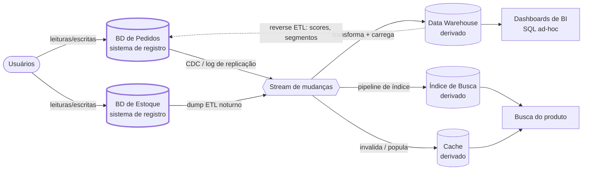

## Visão Geral

Todo sistema de dados serve duas audiências muito diferentes: os usuários navegando por uma aplicação, que precisam de um punhado de registros de volta em milissegundos, e os analistas perguntando "qual foi a receita por loja em janeiro passado," que precisam de um agregado sobre cada linha já escrita. Essas não são dois tamanhos da mesma carga de trabalho — são padrões de acesso opostos, e o layout de armazenamento, a estratégia de indexação, e o hardware que tornam um rápido tornam ativamente o outro lento. Sistemas **operacionais** (OLTP) e **analíticos** (OLAP) são separados por essa razão, e uma vez que você os separa, uma segunda pergunta se segue: qual cópia dos dados é autoritativa, e qual é meramente derivada dela?

## Dois Padrões de Acesso Opostos

Um sistema operacional lida com as leituras e escritas geradas por usuários agindo na aplicação. A forma dominante é a **consulta pontual**: buscar um pequeno número de registros por chave, inserir um, atualizar um, excluir um.

```sql
-- OLTP: um pedido, uma busca de índice, sub-milissegundo, milhares por segundo
SELECT * FROM orders WHERE id = 'ord_8f21a';
UPDATE inventory SET qty = qty - 1 WHERE sku = 'sku-8821';
```

Um sistema analítico faz o oposto. Uma única consulta varre milhões ou bilhões de linhas e retorna um punhado de números agregados — uma contagem, uma soma, um group-by — que nenhuma linha individual de usuário poderia responder.

```sql
-- OLAP: varre toda venda em um mês através de toda loja, segundos a minutos, algumas por minuto
SELECT store_id, SUM(amount) AS revenue
FROM sales
WHERE sold_at >= '2026-01-01' AND sold_at < '2026-02-01'
GROUP BY store_id;
```

O contraste vale a pena declarar em números, porque ele conduz toda decisão de design a jusante:

| | Operacional (OLTP) | Analítico (OLAP) |
| --- | --- | --- |
| Linhas tocadas por consulta | 1 a algumas centenas | milhões a bilhões |
| Concorrência de consulta | milhares por segundo | um punhado por vez |
| Formato de consulta | fixo, embutido no código da app | arbitrário, ad-hoc, escrito por analistas |
| Padrão de escrita | inserções/atualizações/exclusões individuais | carga em lote ou stream de eventos |
| Dado representa | estado mais recente, agora | histórico do que aconteceu ao longo do tempo |
| Tamanho do conjunto de dados | gigabytes a terabytes | terabytes a petabytes |
| Orçamento de latência | milissegundos | segundos a minutos |

Um armazenamento orientado a linhas com índices B-tree é exatamente certo para a primeira coluna: permite encontrar uma linha sem ler as outras, e atualizá-la no local de forma barata. É exatamente errado para a segunda, onde a consulta lê duas colunas de quarenta através de um bilhão de linhas — um armazenamento em linhas tem que arrastar todas as quarenta colunas pela memória para pegar duas delas. Sistemas analíticos respondem a isso com **armazenamento orientado a colunas** mais compressão pesada, que transforma "varrer duas colunas de um bilhão de linhas" em uma leitura sequencial de um bloco pequeno e densamente compactado. Esse layout, por sua vez, é terrível em atualizar um único pedido, razão pela qual um motor raramente vence em ambos.

Há um caso intermediário que vale a pena nomear: motores de **analytics em tempo real** como ClickHouse, Apache Druid, e Apache Pinot rodam consultas agregadas mas com um orçamento de baixa latência, voltado ao usuário — alimentando o contador "visualizações na última hora" dentro de um produto em vez de um relatório trimestral interno. Eles ingerem continuamente em vez de em lotes noturnos, mas estruturalmente ainda ficam do lado analítico da linha.

## Por Que Não Apenas Rodar Analytics Contra Produção

O atalho tentador — apontar a ferramenta de BI para uma réplica de leitura do banco de dados de produção — se quebra por quatro razões independentes, e qualquer uma delas basta.

**Contenção de recursos.** Uma consulta analítica é, por construção, cara: satura I/O de disco e buffer cache lendo linhas que ninguém pediu. Rode na primária e toda requisição de checkout agora compete por essas páginas. Rode em uma réplica de leitura e você comprou alívio parcial — a primária está protegida, mas uma varredura de longa duração na réplica mantém um snapshot aberto, infla o atraso de replicação, e um `JOIN` mal escrito de um analista ainda degrada tudo mais que aquela réplica serve.

**Trade-offs opostos de schema e indexação.** Schemas OLTP são normalizados para que cada fato viva em exatamente um lugar e atualizações permaneçam baratas e consistentes. Schemas analíticos são deliberadamente desnormalizados — schemas star e snowflake colocam uma grande tabela fato central (uma linha por evento: uma venda, um clique) cercada por tabelas dimensão menores (produto, loja, data), então uma consulta une algumas dimensões bem conhecidas em vez de atravessar uma dúzia de entidades normalizadas. Indexação puxa da mesma forma: o banco de dados OLTP quer índices seletivos estreitos para buscas pontuais, que são inúteis para uma consulta que lê 90% da tabela de qualquer forma, e todo índice que você adiciona para analytics desacelera as escritas que o sistema operacional existe para servir.

**Silos de dados.** As perguntas interessantes atravessam sistemas. "Qual campanha de marketing produziu clientes com o maior valor de vida útil" precisa do CRM, do banco de dados de pedidos, e da API da plataforma de anúncios em uma única consulta. Em uma arquitetura de microsserviços, cada serviço possui seu próprio banco de dados propositalmente — então não há um único banco de dados operacional para apontar a ferramenta de BI em primeiro lugar.

**Acesso e conformidade.** Bancos de dados de produção frequentemente ficam em uma rede que analistas não conseguem alcançar, e dar acesso SQL ad-hoc a um armazenamento mantendo PII ao vivo é um controle que geralmente você não pode conceder.

## O Data Warehouse

A resolução padrão é um banco de dados separado — um **data warehouse** — mantendo uma cópia somente-leitura de dados de todos os sistemas operacionais, reestruturada para analytics. Analistas o consultam tão pesadamente quanto quiserem, e nada que fizerem pode tocar uma requisição de produção.

Colocar dados para dentro é **ETL**: *extrair* dos sistemas de origem, *transformar* em um schema amigável à análise (limpar tipos, resolver chaves, desnormalizar em fatos e dimensões), e *carregar* no warehouse. Warehouses de nuvem modernos — Snowflake, BigQuery, Redshift — são baratos o suficiente em compute que a ordem frequentemente se inverte para **ELT**: carregue os dados brutos primeiro, depois transforme-os dentro do warehouse com SQL, o que mantém a cópia bruta por perto para que um bug de transformação possa ser corrigido reexecutando a transformação em vez de reextrair da produção.

A etapa de extração vem em dois sabores. Um **dump periódico** é uma exportação completa ou incremental noturna — simples, mas o warehouse fica até um dia desatualizado e a própria exportação é uma varredura pesada da produção. Um **stream contínuo** via [Change Data Capture (CDC)](change-data-capture) segue o log de replicação do banco de dados de origem e emite toda mudança de linha commitada como um evento, então o warehouse fica atrás da produção por segundos e o custo de extração é proporcional à taxa de mudança em vez do tamanho da tabela. CDC é o que torna "o warehouse está atualizado" uma alegação realista em vez de uma aproximação noturna.

Duas variações do mesmo tema aparecem constantemente. Um **data lake** mantém arquivos brutos (Parquet, Avro, JSON, imagens, logs) em armazenamento de objetos sem schema imposto, o que serve cientistas de dados fazendo feature engineering em Python ou Spark muito melhor do que um warehouse relacional, e é barato o suficiente para manter tudo caso mais tarde se revele importante. E sistemas **HTAP** tentam ambas as cargas de trabalho atrás de uma interface — mas a maioria deles é internamente um motor OLTP acoplado a um motor analítico separado, então a distinção não desapareceu, apenas foi escondida atrás de uma API.

## Sistemas de Registro e Dados Derivados

Por baixo de tudo isso está uma distinção que esclarece mais diagramas de arquitetura do que quase qualquer outra coisa:

- Um **sistema de registro** (ou fonte da verdade) mantém a versão autoritativa de um fato. Novos dados são escritos aqui primeiro, cada fato é representado exatamente uma vez, e se qualquer outro sistema discordar dele, o outro sistema está errado por definição.
- Um **sistema de dados derivados** mantém o resultado de transformar dados de algum outro lugar. Caches, índices de busca, visões materializadas, modelos de leitura desnormalizados, modelos de ML treinados, e o próprio data warehouse são todos derivados. **Se você perder dados derivados, pode recriá-los reprocessando a entrada.**

Essa última frase é o payoff inteiro. Dados derivados são tecnicamente redundantes — duplicam informação que já existe — mas é o que torna leituras rápidas, e sua reconstrutibilidade muda como você o opera. Um índice de busca corrompido não é um incidente de perda de dados, é um job de reindexação. Uma tabela de warehouse computada por uma transformação com bug não é um desastre, é uma reexecução sobre a entrada retida. Isso é exatamente a propriedade em torno da qual [Batch Processing in Distributed Systems](batch-processing-in-distributed-systems) é construído: entrada imutável, saída regenerada do zero, então um job ruim é corrigido corrigindo o código e rodando-o de novo em vez de desfazer escritas parciais. Corrija a transformação, reproduza a origem, e o estado derivado converge para correto por conta própria.

Crucialmente, essa é uma propriedade de *como você usa* um sistema, não de qual produto você escolheu. O Postgres é um sistema de registro quando seus pedidos são escritos nele e um sistema derivado quando mantém uma réplica dos dados de outra pessoa. O Elasticsearch é derivado quando está indexando linhas do Postgres e um sistema de registro quando documentos são escritos diretamente nele e em nenhum outro lugar. Ser explícito sobre qual é qual — desenhando as setas de derivação — é o que te diz qual armazenamento de dados você nunca deve perder, quais você pode reconstruir às 3 da manhã sem acionar ninguém, e onde bugs de consistência são até mesmo possíveis.



Tudo à direita do stream de mudanças é reconstrutível a partir do que está à esquerda. A seta tracejada de volta ao armazenamento operacional é **reverse ETL** — empurrar saída analítica (um score de churn, um conjunto de recomendação, um segmento de cliente) de volta para o sistema que serve usuários. É um padrão útil e genuinamente perigoso, porque é o ponto onde dados derivados começam a fluir para um sistema de registro, e você tem que ser deliberado que o score é uma nova coluna derivada em vez de uma sobrescrita de um fato autoritativo.

## Trade-offs

- **Separar OLTP de OLAP custa frescor** — o warehouse sempre fica atrás da produção por algum intervalo, de segundos com CDC a um dia completo com dumps noturnos, então qualquer decisão que deva ser tomada sobre o estado atual de um registro pertence ao sistema operacional, não ao analítico.
- **ELT é mais flexível que ETL mas move custo e bagunça para dentro do warehouse** — carregar dados brutos primeiro significa que um bug de transformação é corrigido com uma reexecução em vez de uma reextração, mas você paga armazenamento do warehouse por cópias brutas e herda o problema de disciplina de um warehouse cheio de tabelas meio-modeladas que ninguém possui.
- **CDC dá frescor quase em tempo real ao preço de uma dependência operacional dos internals da origem** — você agora está acoplado ao formato do log de replicação, e mudanças de schema no banco de dados operacional se tornam mudanças que quebram um pipeline pertencente a uma equipe diferente.
- **Schemas star desnormalizados tornam consultas analíticas rápidas e tornam correção trabalho explícito de alguém** — um fato duplicado através de tabelas dimensão não pode ser mantido consistente pelo banco de dados, então depende da transformação estar certa; isso é tolerável precisamente porque o dado é derivado e pode ser reconstruído.
- **Dados derivados são baratos de perder e caros de reconstruir rapidamente** — "sempre podemos recomputar" é verdade, e uma reindexação completa de um bilhão de documentos ainda pode levar horas, então reconstrutibilidade protege correção, não disponibilidade; trate o tempo de reconstrução como uma entrada de SLO.
- **HTAP remove o pipeline ETL mas não o trade-off subjacente** — se encaixa em uma única aplicação que precisa tanto de varreduras grandes quanto de acesso a registro de baixa latência (detecção de fraude é o caso canônico), mas não substitui um warehouse cujo propósito inteiro é unir dados através de centenas de bancos de dados operacionais independentemente possuídos.

## Perguntas de Entrevista

- Sua empresa roda relatórios de BI noturnos contra uma réplica de leitura do Postgres de produção. O que especificamente começa a quebrar conforme o volume de dados cresce, e adicionar outra réplica realmente resolve isso?
- Uma consulta analítica lê 2 de 40 colunas através de um bilhão de linhas. Explique por que um armazenamento orientado a linhas lida mal com isso e o que um armazenamento em colunas muda — e por que esse mesmo layout seria uma escolha ruim para o caminho de checkout.
- Você precisa que o data warehouse fique atualizado dentro de 30 segundos em vez de 24 horas. O que muda no pipeline, e quais novos modos de falha e acoplamento isso introduz?
- Um índice de busca e um cache ambos sumiram após uma interrupção. Como classificá-los como dados derivados muda sua resposta a incidentes comparado a perder a tabela de pedidos — e o que tornaria essa classificação falsa?
- Um modelo de ML treinado no warehouse escreve um score de churn de volta na tabela de usuários de produção via reverse ETL. Essa tabela ainda é um sistema de registro? Com o que você precisaria ter cuidado?

## Referências

- [Martin Kleppmann, "Designing Data-Intensive Applications", 2ª Edição (O'Reilly) — Capítulo 1, "Trade-Offs in Data Systems Architecture", seção "Operational Versus Analytical Systems"](https://www.oreilly.com/library/view/designing-data-intensive-applications/9781098119058/)
- [Google Cloud — visão geral de armazenamento do BigQuery (armazenamento colunar e o formato Capacitor)](https://cloud.google.com/bigquery/docs/storage_overview)
- [Documentação do Snowflake — Key Concepts & Architecture](https://docs.snowflake.com/en/user-guide/intro-key-concepts)
- [Uber Engineering — Uber's Big Data Platform: 100+ Petabytes with Minute Latency](https://www.uber.com/blog/uber-big-data-platform/)
