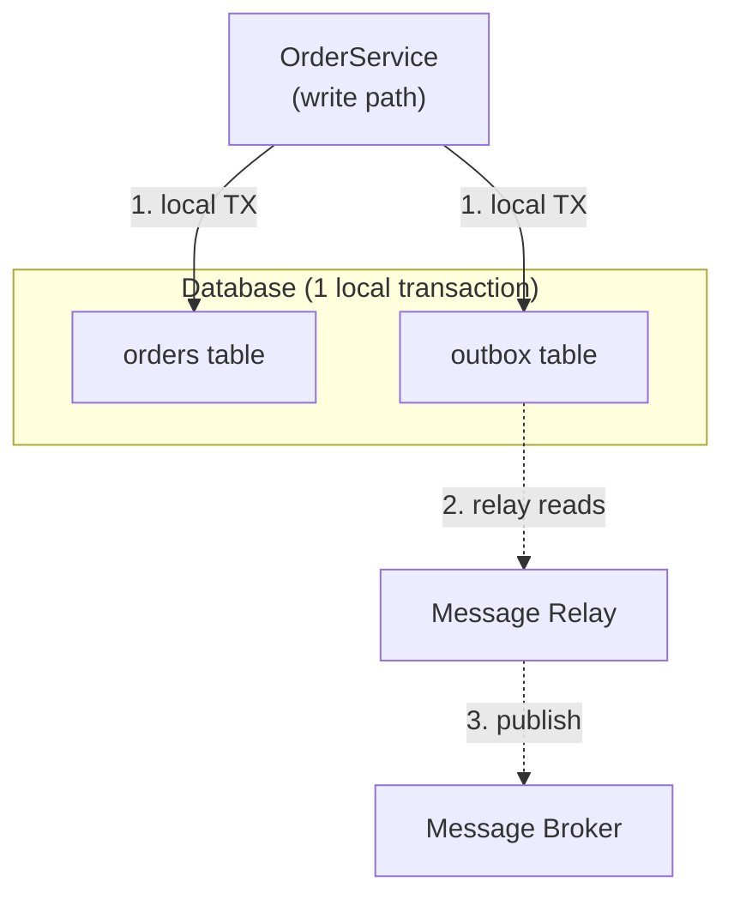

## Overview

A service that owns its own data very often needs to do two things when a business operation happens: update its own database, and tell the rest of the system about it by publishing an event. `OrderService` saves a new `Order` row *and* publishes `OrderCreated` so that `InventoryService`, `NotificationService`, and analytics can react. The transactional outbox pattern makes that pair of actions atomic — either both happen, or neither does — without requiring a distributed transaction across the database and the message broker.

## The Dual Write Problem

The naive implementation writes to the database, then calls the message broker:

```java
@Transactional
public void placeOrder(Order order) {
    orderRepository.save(order);      // 1. commit to Postgres
    kafkaTemplate.send("orders", new OrderCreated(order.getId())); // 2. publish to Kafka
}
```

These are two independent systems with two independent commit points, so there is no atomicity between them. If the process crashes, the pod is killed, or the broker is briefly unreachable *between* steps 1 and 2, the database commit succeeds but the event is silently lost — downstream services never learn the order exists. Flip the order of operations and the failure mode flips too: the event is published but the database transaction later rolls back, so consumers now believe an order exists that never did. There is no ordering of "write to DB" and "publish to broker" that is safe on its own — this is the dual write problem, and it shows up any time a single logical operation must be durably reflected in two different storage systems.

## How the Outbox Pattern Solves It

Instead of writing to two systems, the service writes to one: its own database, in a single local ACID transaction. Alongside the business table, the schema gains an `outbox` table, and the event row is inserted in the *same transaction* as the business row:

```java
@Transactional
public void placeOrder(Order order) {
    orderRepository.save(order);
    outboxRepository.save(new OutboxMessage(
        UUID.randomUUID(),
        "Order",
        order.getId().toString(),
        "OrderCreated",
        toJson(order)
    ));
}
```

Because both inserts are part of one transaction, they are atomic by construction — the database's own commit/rollback guarantees are reused instead of trying to invent a new distributed guarantee. A separate, independent process — the *message relay* — later reads unpublished rows from the outbox table and forwards them to the broker, marking or deleting each row once the broker has acknowledged it.

## Architecture

Two components sit on either side of the outbox table:

1. **The writer** — the application code above, running inside the service's normal request/transaction lifecycle. It only ever talks to the local database.
2. **The message relay** — a separate process (a poller thread, a scheduled job, or a CDC connector) that reads the outbox table and publishes to the broker. It talks to the database and the broker, but never inside the same transaction as business writes.



The outbox table itself is intentionally simple — an id, an aggregate type/id (for partitioning and ordering), an event type, a JSON payload, and a `created_at` for ordering and cleanup:

```sql
CREATE TABLE outbox (
    id UUID PRIMARY KEY,
    aggregate_type VARCHAR(255) NOT NULL,
    aggregate_id VARCHAR(255) NOT NULL,
    event_type VARCHAR(255) NOT NULL,
    payload JSONB NOT NULL,
    created_at TIMESTAMPTZ NOT NULL DEFAULT now()
);
```

## Implementation Approaches: Polling vs. Change Data Capture

There are two common ways to build the relay:

- **Polling publisher** — a scheduled job runs every N milliseconds, `SELECT`s unpublished rows ordered by `created_at`, publishes each to the broker, then deletes it (or flips a `published` flag) in a follow-up transaction. Simple to reason about and requires no extra infrastructure, but it trades off latency (bounded by the poll interval) and adds read load to the database from constant polling.
- **Change Data Capture (CDC)** — a tool such as Debezium tails the database's write-ahead log (WAL in PostgreSQL, binlog in MySQL) and streams row-level changes to the outbox table directly into Kafka, typically via Kafka Connect. This removes polling latency and load entirely — the relay reacts to the WAL, not to a timer — at the cost of operating a CDC pipeline (Debezium connector, Kafka Connect cluster) as new infrastructure.

Debezium ships a purpose-built [Outbox Event Router](https://debezium.io/documentation/reference/stable/transformations/outbox-event-router.html) single message transform (SMT) that understands the outbox table's shape and republishes each row as a properly-keyed, properly-routed Kafka record — so the CDC path doesn't require hand-rolling that logic.

## Guarantees: What the Pattern Actually Promises

The outbox pattern gives **at-least-once delivery** of every event that was committed to the outbox table — never zero, but potentially more than one. A relay can crash after publishing to the broker but before marking the outbox row as processed, and will re-publish that row on restart. It does **not** give exactly-once delivery on its own; that has to be built on top, at the consumer.

Ordering is guaranteed only *within* a single aggregate, and only if the relay preserves it: publishing rows in `created_at` order and using the aggregate id as the message key (so a partitioned broker like Kafka routes all events for the same aggregate to the same partition) keeps per-aggregate ordering intact. There is no ordering guarantee *across* different aggregates, and there generally shouldn't need to be one.

## Failure Scenarios

- **Relay crashes after DB commit, before broker ack** — outbox row is still there, unprocessed; the relay retries it on restart. Safe, this is exactly what at-least-once delivery is designed to survive.
- **Relay crashes after broker ack, before marking the row processed** — the broker already has the message, but the relay will resend it on restart because the row still looks unpublished. Consumers see a duplicate; this is the concrete mechanism behind "at-least-once, not exactly-once."
- **Broker is down for an extended period** — the outbox table simply grows; no data is lost, because the relay hasn't advanced past unpublished rows. This is the core safety property being purchased: back-pressure is absorbed by the database, not by the caller of `placeOrder()`.
- **Poller/relay is scaled to multiple instances** — without locking, two instances can pick up and publish the same row concurrently, doubling the duplicate problem above. Production polling implementations use `SELECT ... FOR UPDATE SKIP LOCKED` (or a dedicated single-leader relay) to avoid this.

## Idempotency and Consumer-Side Deduplication

Because the pattern only guarantees at-least-once delivery, every consumer of outbox-relayed events must be idempotent — processing the same `OrderCreated` event twice must leave the system in the same state as processing it once. The standard technique is for the outbox row's `id` (a UUID generated at write time) to travel with the message as an idempotency key; the consumer keeps a set of already-processed ids (or relies on an upsert keyed by that id) and no-ops on a repeat. This single design decision is what turns "at-least-once" into something that behaves like exactly-once from the business's point of view, without requiring the broker or relay to provide that guarantee themselves.

## Comparison with Alternatives

- **Two-phase commit (2PC)** — a distributed transaction coordinator could, in principle, commit the database write and the broker publish atomically. In practice almost no message broker supports XA/2PC well, and even where it's available, 2PC holds locks across a network round trip to every participant, which is a serious throughput and availability cost most systems can't accept. The outbox pattern sidesteps 2PC entirely by never opening a distributed transaction in the first place.
- **Direct CDC without an outbox table** — a CDC tool could stream changes straight off the business table (e.g. the `orders` table) instead of a dedicated `outbox` table. This removes the extra table but couples the internal schema of `orders` to the public event contract — a later column rename or refactor of `orders` now breaks every downstream consumer. The outbox table exists specifically to decouple "what the event looks like" from "what the internal table looks like."
- **Saga pattern** — sagas coordinate a sequence of local transactions across multiple services, each publishing an event that triggers the next step (or a compensating action on failure). Sagas solve a different problem — multi-step distributed workflows — but each step of a saga typically *uses* the outbox pattern internally to publish its event reliably; the two patterns compose rather than compete.

## Trade-offs

- **Extra table, extra operational surface** — the outbox table needs its own schema migration, its own indexing strategy (on `created_at` / unpublished rows), and its own cleanup or archival policy so it doesn't grow unbounded, since published rows still need deleting or partitioning out.
- **Polling adds latency and DB load; CDC adds infrastructure** — there is no free option: a poller is simple but bounded by its interval and adds periodic query load, while CDC is near-real-time but requires standing up and operating Debezium/Kafka Connect (or an equivalent) as a new piece of infrastructure with its own failure modes.
- **At-least-once shifts the idempotency burden downstream** — the pattern deliberately does not solve exactly-once delivery; every consumer has to be written to tolerate duplicates. Skipping this on the consumer side is the most common way outbox-based systems end up with real bugs (e.g. double-charging, double-incrementing inventory).
- **Only solves the write side** — the outbox pattern is about reliably publishing an event after a local write. It says nothing about how a service should *read* another service's state consistently; that's a different problem (often solved with CQRS-style read models built from the same event stream).

## Real-World Usage

The pattern is standard in Kafka-centric microservice architectures at companies doing high-throughput event-driven integration — it appears under this name (or "transactional outbox") in engineering write-ups from teams building order/payment/inventory pipelines, and it's the primary use case the Debezium project's Outbox Event Router SMT was built for. It's also common in simpler forms inside monoliths that need to reliably emit webhooks or domain events to an internal event bus, even without a full CDC pipeline — a scheduled poller alone is often enough at moderate volume.

## Interview Questions

- Why can't you just call `save()` and then `send()` to Kafka inside the same `@Transactional` method and call it atomic?
- What delivery guarantee does the outbox pattern provide, and what has to happen on the consumer side to make that safe for a business operation like charging a credit card?
- How would you keep two instances of a polling relay from double-publishing the same outbox row?
- What's the difference between using CDC to tail an `outbox` table versus tailing the business table (e.g. `orders`) directly — why does the extra table exist?
- How does the outbox pattern relate to the saga pattern — are they alternatives or do they compose?

## References

- Chris Richardson, *Microservices Patterns* (Manning, 2018) — Chapter 3, "Interprocess communication in a microservice architecture" / transactional messaging.
- [microservices.io — Pattern: Transactional outbox](https://microservices.io/patterns/data/transactional-outbox.html)
- Gunnar Morling, ["Reliable Microservices Data Exchange With the Outbox Pattern"](https://debezium.io/blog/2019/02/19/reliable-microservices-data-exchange-with-the-outbox-pattern/) (Debezium blog, 2019)
- [Debezium Documentation — Outbox Event Router](https://debezium.io/documentation/reference/stable/transformations/outbox-event-router.html)
