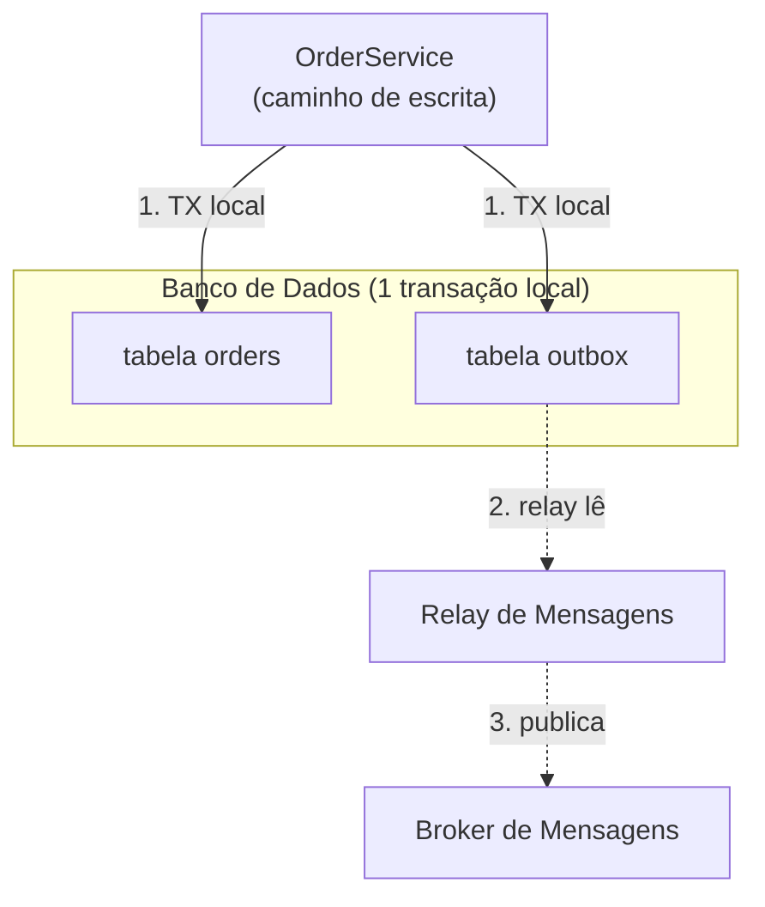

## Visão Geral

Um serviço que possui seus próprios dados muito frequentemente precisa fazer duas coisas quando uma operação de negócio acontece: atualizar seu próprio banco de dados, e contar ao resto do sistema sobre isso publicando um evento. `OrderService` salva uma nova linha `Order` *e* publica `OrderCreated` para que `InventoryService`, `NotificationService` e analytics possam reagir. O padrão outbox transacional torna esse par de ações atômico — ou ambas acontecem, ou nenhuma acontece — sem exigir uma transação distribuída entre o banco de dados e o broker de mensagens.

## O Problema da Escrita Dupla

A implementação ingênua escreve no banco de dados, depois chama o broker de mensagens:

```java
@Transactional
public void placeOrder(Order order) {
    orderRepository.save(order);      // 1. commit no Postgres
    kafkaTemplate.send("orders", new OrderCreated(order.getId())); // 2. publica no Kafka
}
```

Esses são dois sistemas independentes com dois pontos de commit independentes, então não há atomicidade entre eles. Se o processo travar, o pod for morto, ou o broker estiver brevemente inalcançável *entre* os passos 1 e 2, o commit do banco de dados tem sucesso mas o evento se perde silenciosamente — serviços downstream nunca sabem que o pedido existe. Inverta a ordem das operações e o modo de falha também se inverte: o evento é publicado mas a transação do banco de dados mais tarde faz rollback, então consumidores agora acreditam que um pedido existe quando nunca existiu. Não há uma ordem de "escrever no BD" e "publicar no broker" que seja segura por si só — este é o problema da escrita dupla, e aparece sempre que uma única operação lógica precisa ser refletida de forma durável em dois sistemas de armazenamento diferentes.

## Como o Padrão Outbox Resolve Isso

Em vez de escrever em dois sistemas, o serviço escreve em um: seu próprio banco de dados, em uma única transação ACID local. Junto com a tabela de negócio, o esquema ganha uma tabela `outbox`, e a linha de evento é inserida na *mesma transação* que a linha de negócio:

```java
@Transactional
public void placeOrder(Order order) {
    orderRepository.save(order);
    outboxRepository.save(new OutboxMessage(
        UUID.randomUUID(),
        "Order",
        order.getId().toString(),
        "OrderCreated",
        toJson(order)
    ));
}
```

Como ambos os inserts fazem parte de uma transação, são atômicos por construção — as próprias garantias de commit/rollback do banco de dados são reutilizadas em vez de tentar inventar uma nova garantia distribuída. Um processo separado e independente — o *relay de mensagens* — depois lê linhas não publicadas da tabela outbox e as encaminha para o broker, marcando ou excluindo cada linha uma vez que o broker a confirmou.

## Arquitetura

Dois componentes ficam em cada lado da tabela outbox:

1. **O escritor** — o código de aplicação acima, rodando dentro do ciclo de vida normal de requisição/transação do serviço. Só fala com o banco de dados local.
2. **O relay de mensagens** — um processo separado (uma thread de polling, um job agendado, ou um conector CDC) que lê a tabela outbox e publica no broker. Fala com o banco de dados e o broker, mas nunca dentro da mesma transação que as escritas de negócio.



A própria tabela outbox é intencionalmente simples — um id, um tipo/id de agregado (para particionamento e ordenação), um tipo de evento, um payload JSON, e um `created_at` para ordenação e limpeza:

```sql
CREATE TABLE outbox (
    id UUID PRIMARY KEY,
    aggregate_type VARCHAR(255) NOT NULL,
    aggregate_id VARCHAR(255) NOT NULL,
    event_type VARCHAR(255) NOT NULL,
    payload JSONB NOT NULL,
    created_at TIMESTAMPTZ NOT NULL DEFAULT now()
);
```

## Abordagens de Implementação: Polling vs. Change Data Capture

Há duas formas comuns de construir o relay:

- **Publicador por polling** — um job agendado roda a cada N milissegundos, faz `SELECT` de linhas não publicadas ordenadas por `created_at`, publica cada uma no broker, depois a exclui (ou vira uma flag `published`) em uma transação subsequente. Simples de raciocinar e não requer infraestrutura extra, mas troca latência (limitada pelo intervalo de polling) e adiciona carga de leitura ao banco de dados com polling constante.
- **Change Data Capture (CDC)** — uma ferramenta como o Debezium acompanha o write-ahead log do banco de dados (WAL no PostgreSQL, binlog no MySQL) e transmite mudanças em nível de linha da tabela outbox diretamente para o Kafka, tipicamente via Kafka Connect. Isso remove a latência e carga de polling completamente — o relay reage ao WAL, não a um timer — ao custo de operar um pipeline CDC (conector Debezium, cluster Kafka Connect) como nova infraestrutura.

O Debezium fornece uma single message transform (SMT) [Outbox Event Router](https://debezium.io/documentation/reference/stable/transformations/outbox-event-router.html) construída para esse propósito, que entende a forma da tabela outbox e republica cada linha como um registro Kafka corretamente chaveado e roteado — então o caminho CDC não requer implementar essa lógica manualmente.

## Garantias: O Que o Padrão Realmente Promete

O padrão outbox dá **entrega pelo menos uma vez** de todo evento que foi confirmado na tabela outbox — nunca zero, mas potencialmente mais de um. Um relay pode travar depois de publicar no broker mas antes de marcar a linha outbox como processada, e vai republicar essa linha no reinício. Ele **não** dá entrega exatamente uma vez por si só; isso precisa ser construído por cima, no consumidor.

Ordenação só é garantida *dentro* de um único agregado, e apenas se o relay a preservar: publicar linhas na ordem de `created_at` e usar o id do agregado como a chave da mensagem (para que um broker particionado como o Kafka roteie todos os eventos do mesmo agregado para a mesma partição) mantém a ordenação por agregado intacta. Não há garantia de ordenação *entre* agregados diferentes, e geralmente não deveria haver necessidade de uma.

## Cenários de Falha

- **Relay trava depois do commit no BD, antes da confirmação do broker** — a linha outbox ainda está lá, não processada; o relay tenta de novo no reinício. Seguro, isso é exatamente o que a entrega pelo menos-uma-vez foi projetada para sobreviver.
- **Relay trava depois da confirmação do broker, antes de marcar a linha processada** — o broker já tem a mensagem, mas o relay vai reenviá-la no reinício porque a linha ainda parece não publicada. Consumidores veem uma duplicata; este é o mecanismo concreto por trás de "pelo menos-uma-vez, não exatamente-uma-vez".
- **Broker fica fora do ar por um período prolongado** — a tabela outbox simplesmente cresce; nenhum dado é perdido, porque o relay não avançou além das linhas não publicadas. Esta é a propriedade central de segurança sendo comprada: back-pressure é absorvido pelo banco de dados, não por quem chama `placeOrder()`.
- **Poller/relay é escalado para múltiplas instâncias** — sem locking, duas instâncias podem pegar e publicar a mesma linha concorrentemente, dobrando o problema de duplicata acima. Implementações de polling em produção usam `SELECT ... FOR UPDATE SKIP LOCKED` (ou um relay dedicado de líder único) para evitar isso.

## Idempotência e Deduplicação do Lado do Consumidor

Como o padrão só garante entrega pelo menos-uma-vez, todo consumidor de eventos relayados via outbox precisa ser idempotente — processar o mesmo evento `OrderCreated` duas vezes deve deixar o sistema no mesmo estado que processá-lo uma vez. A técnica padrão é o `id` da linha outbox (um UUID gerado no momento da escrita) viajar com a mensagem como uma chave de idempotência; o consumidor mantém um conjunto de ids já processados (ou depende de um upsert chaveado por esse id) e não faz nada em uma repetição. Essa única decisão de design é o que transforma "pelo menos-uma-vez" em algo que se comporta como exatamente-uma-vez do ponto de vista do negócio, sem exigir que o broker ou o relay forneçam essa garantia eles mesmos.

## Comparação com Alternativas

- **Two-phase commit (2PC)** — um coordenador de transação distribuída poderia, em princípio, confirmar a escrita no banco de dados e a publicação no broker atomicamente. Na prática quase nenhum broker de mensagens suporta bem XA/2PC, e mesmo onde está disponível, 2PC mantém locks através de uma ida e volta de rede para cada participante, o que é um custo sério de throughput e disponibilidade que a maioria dos sistemas não pode aceitar. O padrão outbox contorna o 2PC completamente ao nunca abrir uma transação distribuída em primeiro lugar.
- **CDC direto sem uma tabela outbox** — uma ferramenta CDC poderia transmitir mudanças diretamente da tabela de negócio (ex.: a tabela `orders`) em vez de uma tabela `outbox` dedicada. Isso remove a tabela extra mas acopla o esquema interno de `orders` ao contrato público de evento — uma renomeação de coluna posterior ou refatoração de `orders` agora quebra todo consumidor downstream. A tabela outbox existe especificamente para desacoplar "como o evento se parece" de "como a tabela interna se parece".
- **Padrão saga** — sagas coordenam uma sequência de transações locais através de múltiplos serviços, cada uma publicando um evento que dispara o próximo passo (ou uma ação compensatória em caso de falha). Sagas resolvem um problema diferente — workflows distribuídos de múltiplos passos — mas cada passo de uma saga tipicamente *usa* o padrão outbox internamente para publicar seu evento de forma confiável; os dois padrões se compõem em vez de competir.

## Trade-offs

- **Tabela extra, superfície operacional extra** — a tabela outbox precisa de sua própria migração de esquema, sua própria estratégia de indexação (em `created_at` / linhas não publicadas), e sua própria política de limpeza ou arquivamento para que não cresça indefinidamente, já que linhas publicadas ainda precisam ser excluídas ou particionadas para fora.
- **Polling adiciona latência e carga no BD; CDC adiciona infraestrutura** — não há uma opção gratuita: um poller é simples mas limitado por seu intervalo e adiciona carga periódica de consulta, enquanto CDC é quase em tempo real mas requer levantar e operar Debezium/Kafka Connect (ou equivalente) como uma nova peça de infraestrutura com seus próprios modos de falha.
- **Pelo menos-uma-vez desloca o fardo de idempotência para downstream** — o padrão deliberadamente não resolve entrega exatamente-uma-vez; todo consumidor precisa ser escrito para tolerar duplicatas. Pular isso no lado do consumidor é a forma mais comum de sistemas baseados em outbox acabarem com bugs reais (ex.: cobrança dupla, incremento duplo de estoque).
- **Só resolve o lado da escrita** — o padrão outbox é sobre publicar de forma confiável um evento após uma escrita local. Não diz nada sobre como um serviço deveria *ler* o estado de outro serviço de forma consistente; esse é um problema diferente (frequentemente resolvido com modelos de leitura estilo CQRS construídos a partir do mesmo stream de eventos).

## Uso no Mundo Real

O padrão é padrão em arquiteturas de microsserviços centradas em Kafka em empresas fazendo integração orientada a eventos de alto throughput — aparece sob esse nome (ou "outbox transacional") em relatos de engenharia de equipes construindo pipelines de pedido/pagamento/estoque, e é o caso de uso primário para o qual a SMT Outbox Event Router do projeto Debezium foi construída. Também é comum em formas mais simples dentro de monólitos que precisam emitir de forma confiável webhooks ou eventos de domínio para um barramento de eventos interno, mesmo sem um pipeline CDC completo — um poller agendado sozinho é frequentemente suficiente em volume moderado.

## Perguntas de Entrevista

- Por que você não pode simplesmente chamar `save()` e depois `send()` para o Kafka dentro do mesmo método `@Transactional` e chamar isso de atômico?
- Qual garantia de entrega o padrão outbox fornece, e o que precisa acontecer do lado do consumidor para tornar isso seguro para uma operação de negócio como cobrar um cartão de crédito?
- Como você impediria que duas instâncias de um relay de polling publicassem em duplicidade a mesma linha outbox?
- Qual é a diferença entre usar CDC para acompanhar uma tabela `outbox` versus acompanhar diretamente a tabela de negócio (ex.: `orders`) — por que a tabela extra existe?
- Como o padrão outbox se relaciona com o padrão saga — são alternativas ou se compõem?

## Referências

- Chris Richardson, *Microservices Patterns* (Manning, 2018) — Capítulo 3, "Interprocess communication in a microservice architecture" / mensageria transacional.
- [microservices.io — Pattern: Transactional outbox](https://microservices.io/patterns/data/transactional-outbox.html)
- Gunnar Morling, ["Reliable Microservices Data Exchange With the Outbox Pattern"](https://debezium.io/blog/2019/02/19/reliable-microservices-data-exchange-with-the-outbox-pattern/) (Debezium blog, 2019)
- [Debezium Documentation — Outbox Event Router](https://debezium.io/documentation/reference/stable/transformations/outbox-event-router.html)
