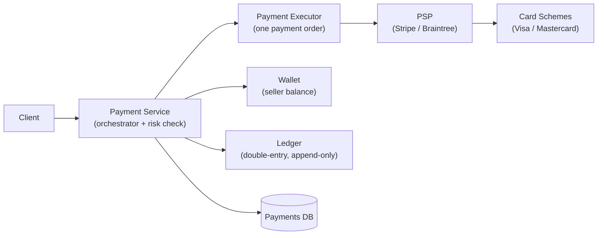
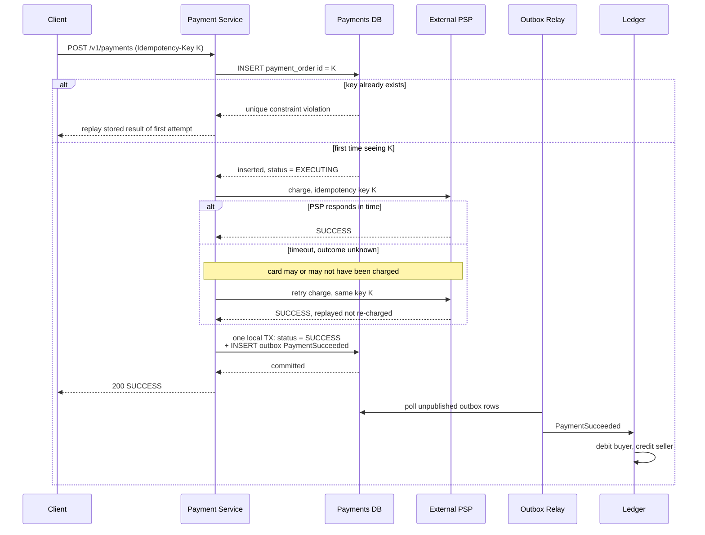

## Overview

A payment system sits between a buyer, a merchant, and an external Payment Service Provider (PSP) like Stripe, Braintree, or PayPal, and its defining constraint is unusual: money must never be lost and never be duplicated, even when a network call to that PSP times out and the outcome is genuinely unknown. "Did the charge go through or not?" is not an edge case in this system — it is the central design question, and every mechanism below (idempotency keys, exactly-once execution, an append-only double-entry ledger, nightly reconciliation) exists to answer it. Almost every other system in this collection trades a little correctness for latency or availability; a payment system does the opposite, and that inversion is what makes it a distinct design problem rather than "CRUD with money in it."

## Functional Requirements

Scope a payment backend for an e-commerce marketplace — the buyer pays, the marketplace holds the money, and the seller is paid later:

- **Pay-in flow** — the system collects money from the buyer *on behalf of* the seller. The money lands in the marketplace's own bank account, not the seller's.
- **Pay-out flow** — once the pay-out condition is met (goods delivered, return window closed), the balance after fees moves from the marketplace's account to the seller's, typically through a third-party accounts-payable provider.
- **Multiple payment orders per checkout** — one cart can contain items from several sellers, so a single checkout event fans out into several independent payment orders, each of which can succeed or fail on its own.
- **Reconciliation** — an asynchronous process that verifies the payment system, the ledger, the wallet, and the PSP all agree about what happened.

Explicitly out of scope: storing raw card numbers (the PSP does that), and the internal balance/ledger mechanics of the seller's wallet, which is a system of its own — see [Designing a Digital Wallet](digital-wallet-design).

## Non-Functional Requirements

The back-of-the-envelope numbers are deliberately unimpressive. One million transactions per day is about 10 TPS — a number any single Postgres instance handles without breaking a sweat. **Throughput is not the problem here**, and a candidate who spends the interview sharding for scale has misread the prompt. What matters instead:

- **Strong consistency is non-negotiable for balances.** A wallet balance or ledger entry read as "eventually correct" is a real financial loss or a real double-spend. This rules out the AP defaults that a chat or feed system reaches for reflexively.
- **Correctness beats latency, and beats availability.** If the system cannot be sure a charge is safe, the right answer is to stall the payment — leave it `EXECUTING`, show the user a pending page, alert an operator — not to guess and move on. Refusing to serve a request is recoverable; charging a card twice is a chargeback, a support ticket, and a credibility problem.
- **Auditability and traceability of every transaction.** Every state change is retained, append-only, and attributable. "What happened to this payment?" must be answerable months later from stored data, not reconstructed from logs.
- **Fault tolerance for failed and stalled payments.** Failures are the normal case at the boundary with an external provider, so retry policy, dead-lettering, and state tracking are first-class parts of the design rather than error handling bolted on afterwards.
- **Storage chosen for boringness.** The selection criteria for the database are proven stability at other financial firms, mature tooling, and a deep hiring market for DBAs — which in practice means a traditional relational database with real ACID transactions, not the newest distributed store.

## High-Level Design: The Pay-In Flow



- **Payment service** — accepts the payment event from the client and orchestrates everything downstream. Its first action is a **risk check**: AML/CFT compliance screening and fraud evaluation, almost always delegated to a specialist third party. Only payments that pass the check proceed.
- **Payment executor** — executes exactly one payment order against the PSP. One payment event (one checkout) may contain several payment orders, and the executor is invoked once per order.
- **PSP** — moves money from account A to account B. In the pay-in flow, that means pulling from the buyer's card into the marketplace's bank account.
- **Card schemes** — Visa, Mastercard, and friends, sitting behind the PSP. Direct integration with card schemes or banks is possible but is reserved for companies large enough to justify the specialized, expensive investment; everyone else integrates a PSP.
- **Ledger** — the append-only financial record of what happened. Post-payment analysis (revenue, forecasting, audit) is read off the ledger, never off the operational payment tables.
- **Wallet** — the seller's current balance. Covered in depth in [Designing a Digital Wallet](digital-wallet-design); here it is just another stateful service the payment service has to keep in agreement with the ledger.

## The API and the Data Model

```
POST /v1/payments
Idempotency-Key: 9a1f2c...        # client-generated, one per logical payment attempt

{
  "checkout_id": "chk_8812",       # globally unique for this checkout
  "buyer_info": { ... },
  "credit_card_info": { ... },     # a PSP token, never a raw PAN
  "payment_orders": [
    { "payment_order_id": "po_001", "seller_account": "acc_77",
      "amount": "45.50", "currency": "USD" }
  ]
}

GET /v1/payments/{payment_order_id}   # execution status of one order
```

Two details in that payload carry more weight than they look like they do.

**`amount` is a string, not a double.** Different languages, protocols, and hardware serialize floating point with different precision, and the rounding errors that introduces are real money. Amounts stay in string (or fixed-point decimal) form in transit and at rest, and are parsed into numbers only at the moment of display or calculation. This is the single cheapest bug class to eliminate in the entire design.

**`payment_order_id` is globally unique and doubles as the deduplication key sent to the PSP.** It is not merely a primary key; it is the token that lets a retry of the same logical payment be recognized as such by a system you do not control.

The persistence model is two tables. `payment_event` holds one row per checkout (`checkout_id` PK, buyer info, `is_payment_done`). `payment_order` holds one row per order (`payment_order_id` PK, `checkout_id` FK, `buyer_account`, `amount`, `currency`, `payment_order_status`, `wallet_updated`, `ledger_updated`).

`payment_order_status` is an enum — `NOT_STARTED` → `EXECUTING` → `SUCCESS` | `FAILED` — and the two boolean flags exist so that the downstream fan-out (update the wallet, then append to the ledger) is resumable: a crash between the two leaves a row that plainly states which side effects already happened. `is_payment_done` on the event flips to true only when every order under that checkout has completed. A scheduled sweeper scans for orders stuck in `EXECUTING` past a threshold and alerts, because an in-flight payment that nobody notices is exactly the failure mode this system exists to prevent.

## Not Storing Card Data: The Hosted Payment Page

Storing card numbers means living under PCI DSS, which is expensive enough that most companies structurally avoid it. The standard integration is a **PSP-hosted payment page** — an iframe or widget on the web, an SDK screen on mobile — that collects card details and posts them directly to the PSP. The sensitive data never traverses your servers, so it is never in your logs, your database, your backups, or your breach radius.

The registration handshake matters because it is where the first idempotency boundary is established:

1. The client posts the payment order to the payment service.
2. The payment service **registers** the payment with the PSP: amount, currency, expiry, redirect URL, plus a **nonce** — a UUID (in practice, the `payment_order_id`) that guarantees the registration happens exactly once.
3. The PSP returns a **token** uniquely identifying that registration. Token maps to nonce, nonce maps to payment order — so the token is a stable handle on this specific payment, forever.
4. The payment service persists the token *before* rendering the hosted page.
5. The client renders the PSP's page using that token; the user pays; the PSP redirects the browser to the redirect URL with the result appended.
6. Separately and asynchronously, the PSP calls a registered **webhook** with the authoritative payment status, and the payment service updates `payment_order_status`.

The redirect URL and the webhook are not the same thing, and conflating them is a design error: the redirect is a browser-side convenience that a user can close, lose, or fabricate, while the webhook is the server-to-server channel that actually determines truth. Never mark a payment successful on the strength of a redirect alone.

## Exactly-Once = At-Least-Once + At-Most-Once

Double-charging a customer is the worst outcome this system can produce, so payment execution must be **exactly-once**. Exactly-once sounds impossible to guarantee over an unreliable network, and as a single primitive it is — but it decomposes cleanly into two properties that are each individually achievable:

- **At-least-once**, achieved by **retrying**.
- **At-most-once**, achieved by an **idempotency check**.

Retry strategy is a real decision, not a default. Immediate retry, fixed interval, incremental interval, exponential backoff, and cancel are all legitimate; exponential backoff is the right default whenever the underlying problem is unlikely to clear in milliseconds, because an aggressive retry loop against a struggling PSP converts a blip into an outage. Where the PSP returns a `Retry-After` header, honor it.

Retrying alone, though, is precisely what creates the double-charge risk. Two concrete scenarios:

- **The user clicks "pay" twice.** Two identical requests arrive at the payment service.
- **The PSP processed the charge, but the response never came back.** The card was debited; your system has no idea. The user, seeing no confirmation, clicks pay again.

The second case is the one that defines the system. From the payment service's point of view, a timeout is indistinguishable from a failure — and the only safe response to "I don't know" is to ask again in a way that cannot cause a second charge.

## Idempotency Keys

An **idempotency key** is a unique value generated by the *client* for one logical payment attempt (a V4 UUID, or the shopping-cart id captured immediately before checkout), sent as an HTTP header, and used by the *server* to recognize retries:

```
POST /v1/payments
Idempotency-Key: 3f7d1b2e-9c04-4a55-b8e1-77a2d0c4e991
```

The server-side implementation needs no special machinery — it leans on a database unique constraint:

1. On receiving a payment, attempt to `INSERT` a row keyed by the idempotency key.
2. A successful insert means this request is new. Process it.
3. A unique-constraint violation means this request has been seen. Do **not** process it; return the stored status of the original attempt.

Storing the *result* of the first attempt (status code and body) alongside the key is what makes the retry genuinely safe: the caller gets the same answer it would have gotten the first time, including if the first time was a failure. If several requests with the same key arrive concurrently, exactly one proceeds and the rest are rejected with `429 Too Many Requests` rather than being queued behind it — a race that resolves to a duplicate charge is not a race worth allowing.

The same mechanism must extend across the boundary to the PSP, and this is what saves scenario two. Because the nonce sent at registration uniquely represents the payment order, the token derived from it does too — so when the user clicks pay again, the *same* token goes to the PSP, the PSP recognizes its own idempotency key, and it returns the status of the previous execution instead of charging the card a second time. Stripe implements exactly this: a repeated `Idempotency-Key` replays the saved status code and body of the original request rather than re-executing it.

One consequence of leaning on unique constraints deserves attention: idempotency records must be read from and written to the **primary**, never a read replica. A replica lagging by even a few hundred milliseconds will happily report that it has never seen a key that the primary committed moments ago, which reintroduces the exact duplicate the mechanism was built to prevent.

## The Payment Flow End to End



Read the `else timeout` branch carefully — it is the whole system in miniature. The payment service does not know whether the charge happened, does not try to find out through some side channel, and does not guess. It reissues the identical request under the identical key and lets the PSP's own deduplication resolve the ambiguity. That is the entire trick, and it only works because the key was decided *before* the first attempt.

## Atomically Updating the Ledger and Emitting the Event

Once the PSP confirms success, the payment service must do two things: record the new status in its own database and tell the rest of the system (ledger, wallet, analytics, notifications) that a payment succeeded. Doing those as a database write followed by a broker publish is the dual-write problem, and it fails in exactly the way this system cannot afford — a crash between the two leaves a charged card with no ledger entry.

The fix is the **transactional outbox**: insert the `PaymentSucceeded` event row into an `outbox` table inside the *same local transaction* that flips `payment_order_status` to `SUCCESS`, and let a separate relay process forward outbox rows to the broker afterwards. One database, one ACID transaction, no distributed transaction, no 2PC across a message broker that probably does not support it well anyway. The mechanics, the polling-versus-CDC choice, and the failure modes are covered in [The Transactional Outbox Pattern](outbox-pattern).

The delivery guarantee that buys you is *at-least-once*, which is why every consumer of these events — the ledger and wallet included — must itself be idempotent, keyed on the outbox row's id or the `payment_order_id`. In a payment system this is not a nice-to-have: an at-least-once `PaymentSucceeded` event consumed twice by a non-idempotent ledger produces a ledger that claims twice the money moved.

Internally, the same reasoning pushes toward asynchronous, multi-receiver messaging. Synchronous HTTP chains through payment service → wallet → ledger mean the slowest link sets the latency, one failure breaks the whole chain, and there is no buffer to absorb a spike. Publishing payment events to a log-based broker lets the ledger, wallet, analytics, and notification services each consume the same event independently, at their own pace, with replay available when one of them falls over.

## Double-Entry Bookkeeping as the Ledger Data Model

The ledger's data model is not a balance column. It is **double-entry bookkeeping**: every transaction is recorded as two entries of equal magnitude in two different accounts — one debit, one credit.

| Account | Debit | Credit |
|---|---|---|
| buyer | $1 | |
| seller | | $1 |

The invariant is that the sum of all entries for a transaction is zero. That single property is what makes the ledger *self-validating*: a cent that disappeared must show up as a cent someone else gained, so any imbalance is a detectable bug rather than a silent loss. Combined with an append-only table — you never update or delete a ledger row; a correction is a new, opposing pair of entries — it gives end-to-end traceability of every cent that moved through the system, which is precisely what an auditor, a regulator, or an engineer debugging a discrepancy at 2 a.m. needs.

Concurrent writes to the same account make the isolation level a real decision, not a default to inherit. Two payments crediting the same seller under Read Committed can each read the pre-existing balance and write back a value computed from it — a textbook lost update, and here that means money that provably existed simply is not there. Serializable isolation, or an explicit `SELECT ... FOR UPDATE` on the account row, or an append-only design where balance is *derived* by summing entries rather than stored and mutated, all avoid it; the derived-balance approach is the most robust because there is no mutable balance to lose an update to. See [Transactions, ACID, and Isolation Levels](transactions-acid-and-isolation-levels) for which anomalies each level actually permits — this is one of the rare systems where "just use serializable" is straightforwardly the right call.

## Reconciliation: The Last Line of Defense

Everything so far reduces the probability of divergence. **Reconciliation** is what catches divergence that happened anyway, and it is the reason a payment system can make strong claims about correctness despite depending on asynchronous messaging and third parties it does not control.

Every night, the PSP or bank produces a **settlement file**: the account balance plus every transaction that touched that account during the day. A reconciliation job parses it and diffs it against your own ledger, line by line. The same process runs *internally* too, diffing the ledger against the wallet and against the payment order table, because internal services drift from each other for exactly the same reasons external ones do.

Mismatches sort into three buckets, and the classification is a design decision about where to spend engineering effort:

1. **Classifiable, automatable** — the cause is known, the fix is known, and a program is worth writing. Automate both detection and adjustment.
2. **Classifiable, not worth automating** — the cause and fix are known but too rare or too varied to justify code. Push the item onto a job queue for the finance team to correct manually.
3. **Unclassifiable** — nobody knows why the two sides disagree. Route to a separate queue for manual investigation; each resolved case is a candidate for promotion into bucket one.

Reconciliation is required *even when the PSP supports idempotent APIs*. Idempotency prevents your retries from double-charging; it does not verify that the PSP's records and yours agree about what happened, and assuming an external system is always right is not a stance a system of record can take.

## Handling Delays and Failed Payments

Most payments settle in seconds. Some do not: a PSP flags a transaction for manual review, or 3D Secure authentication demands extra verification from the cardholder. These take hours or days, so the design must treat a pending payment as a normal state rather than an anomaly. The client shows a pending status and a page where the user can check on it; the PSP tracks the in-flight payment and fires the registered webhook when it resolves. Some PSPs invert this and require you to poll — either way, the payment service cannot hold a request open waiting for an answer, and shipment or fulfillment must be gated on the webhook, not on the checkout response.

For failures, a **retry queue** and a **dead letter queue** do the sorting:

1. Classify the failure. Retryable (transient network error, PSP 5xx, timeout) goes to the retry queue; non-retryable (invalid input, declined card, insufficient funds) is recorded as a terminal failure — retrying a decline just annoys the issuer.
2. The payment system consumes the retry queue and re-executes, under the same idempotency key, with backoff.
3. Past a retry threshold, the message lands in the dead letter queue for inspection. A DLQ that is silently growing is one of the highest-signal alerts a payment system can have.

Underneath all of this sits **payment state persisted in an append-only table**. Having a definitive state for every payment at every stage is what makes it possible to answer, after any failure, whether to retry, refund, or escalate — without that, recovery becomes guesswork against a mutable row that has already overwritten its own history.

## Consistency Across Services

Several stateful services participate in one payment: the payment service (nonce, token, order, status), the ledger (accounting entries), the wallet (seller balance), and the PSP (authoritative execution status). Keeping them in agreement decomposes into three mechanisms already covered plus one:

- **Between internal services** — exactly-once processing: idempotent consumers plus the outbox on every publisher.
- **Between internal and external** — idempotency keys reused across retries, plus reconciliation as the audit.
- **Across database replicas** — replication lag is its own source of inconsistency. Either serve all reads and writes from the primary (simple, wastes replica capacity, caps scalability — perfectly acceptable at 10 TPS), or run a consensus-replicated database such as CockroachDB or YugabyteDB where replicas are kept in sync by Raft/Paxos rather than by asynchronous log shipping. See [Consensus and Coordination Services](consensus-and-coordination-services) for what that machinery actually provides.

## The Pay-Out Flow

Structurally the pay-out flow mirrors pay-in, with the direction of money reversed: rather than a PSP pulling from a buyer's card into the marketplace's bank account, a third-party accounts-payable provider pushes from the marketplace's account to the seller's. The same idempotency, outbox, ledger, and reconciliation mechanisms apply unchanged — the difference is regulatory rather than architectural, since paying money out to parties in many jurisdictions carries tax reporting and compliance obligations that collecting it does not.

## Trade-offs

- **Correctness is prioritized over both latency and availability, which is the opposite of nearly every other system in this collection** — a payment that cannot be confirmed safe should stall in `EXECUTING` and page an operator rather than resolve optimistically. That produces a worse p99 and a worse uptime number, and it is the right call: a slow payment is a support ticket, a double charge is a chargeback plus lost trust.
- **Idempotency keys make retries safe but push real complexity onto the client and onto key lifetime management** — the key must be generated *before* the first attempt and reused across every retry of the same logical payment, keys must be read and written on the primary (never a replica), and they must expire on a policy that outlives any plausible retry window without accumulating forever. A client that regenerates the key on retry has an idempotency mechanism that does nothing.
- **The outbox pattern removes the dual-write problem but only buys at-least-once delivery** — the ledger, wallet, and every other consumer must be independently idempotent. This is not optional here the way it sometimes is elsewhere: a `PaymentSucceeded` event applied twice to a non-idempotent ledger fabricates money.
- **Double-entry bookkeeping doubles the write volume and makes the ledger append-only and unqueryable for "current balance" without aggregation** — the payoff is that the ledger validates itself (entries sum to zero) and every historical state is reconstructible, which is worth far more in a financial system than the storage and query cost it imposes.
- **Reconciliation is indispensable and permanently manual at the edges** — no amount of engineering eliminates bucket three (unclassifiable mismatches), so the design must include a finance team, a job queue, and an adjustment workflow as first-class components. Treating reconciliation as a purely technical problem to be automated away is how mismatches accumulate silently.
- **Delegating card handling to a PSP-hosted page removes PCI scope but hands control of the payment UX and the authoritative payment status to a third party** — you inherit their downtime, their latency, their fraud rules, and an asynchronous webhook as your source of truth, and the migration cost to a different PSP later is substantial.

## Interview Questions

- A charge request to the PSP times out. You have no idea whether the card was charged. What exactly do you do next, and what property of the earlier request makes that action safe?
- Why does the idempotency key have to be generated by the client rather than the server, and what breaks if the client generates a fresh one on each retry?
- Why is reconciliation still required when both you and the PSP implement idempotent APIs correctly?
- Two payments credit the same seller account concurrently. Explain the anomaly that Read Committed permits here, and give two different designs that eliminate it.
- The payment service commits `status = SUCCESS` and then crashes before publishing the event to the ledger. Walk through why the outbox pattern makes this recoverable, and what the ledger must do to survive the recovery.

## References

- [Alex Xu and Sahn Lam, "System Design Interview – An Insider's Guide, Volume 2" (ByteByteGo, 2022) — Chapter 11, "Payment System"](https://bytebytego.com)
- [Stripe API Reference — Idempotent requests](https://docs.stripe.com/api/idempotent_requests)
- [Airbnb Engineering — "Avoiding double payments in a distributed payments system"](https://medium.com/airbnb-engineering/avoiding-double-payments-in-a-distributed-payments-system-2981f6b070bb)
- [Square Engineering — "Books, an immutable double-entry accounting database service"](https://developer.squareup.com/blog/books-an-immutable-double-entry-accounting-database-service/)
