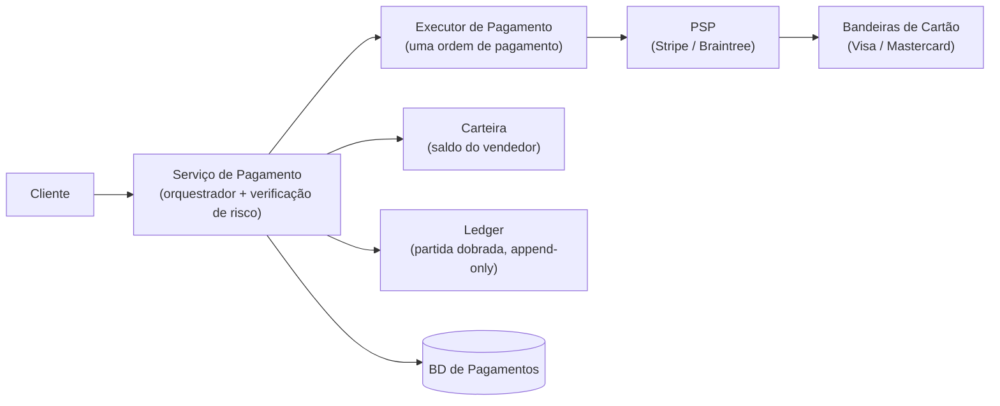
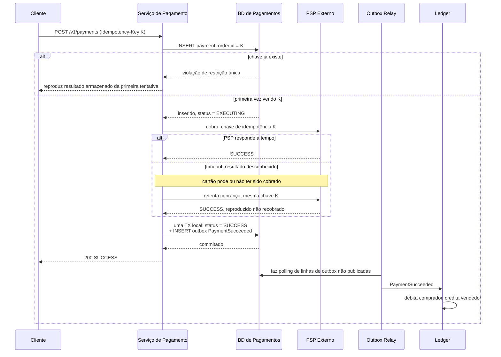

## Visão Geral

Um sistema de pagamentos fica entre um comprador, um vendedor, e um Provedor de Serviço de Pagamento (PSP) externo como Stripe, Braintree, ou PayPal, e sua restrição definidora é incomum: dinheiro nunca deve ser perdido e nunca deve ser duplicado, mesmo quando uma chamada de rede para esse PSP expira e o resultado é genuinamente desconhecido. "A cobrança passou ou não?" não é um caso extremo neste sistema — é a questão de design central, e todo mecanismo abaixo (chaves de idempotência, execução exatamente-uma-vez, um ledger de partida dobrada append-only, reconciliação noturna) existe para responder a isso. Quase todo outro sistema desta coleção troca um pouco de correção por latência ou disponibilidade; um sistema de pagamentos faz o oposto, e essa inversão é o que o torna um problema de design distinto em vez de "CRUD com dinheiro dentro."

## Requisitos Funcionais

Delimite um backend de pagamentos para um marketplace de e-commerce — o comprador paga, o marketplace guarda o dinheiro, e o vendedor é pago depois:

- **Fluxo de pay-in** — o sistema coleta dinheiro do comprador *em nome do* vendedor. O dinheiro pousa na conta bancária do próprio marketplace, não na do vendedor.
- **Fluxo de pay-out** — uma vez que a condição de pay-out é atendida (mercadoria entregue, janela de devolução fechada), o saldo após taxas se move da conta do marketplace para a do vendedor, tipicamente através de um provedor de contas a pagar terceirizado.
- **Múltiplas ordens de pagamento por checkout** — um carrinho pode conter itens de vários vendedores, então um único evento de checkout se ramifica em várias ordens de pagamento independentes, cada uma podendo ter sucesso ou falhar por conta própria.
- **Reconciliação** — um processo assíncrono que verifica se o sistema de pagamentos, o ledger, a carteira, e o PSP concordam todos sobre o que aconteceu.

Explicitamente fora de escopo: armazenar números de cartão brutos (o PSP faz isso), e a mecânica interna de saldo/ledger da carteira do vendedor, que é um sistema em si — ver [Designing a Digital Wallet](digital-wallet-design).

## Requisitos Não Funcionais

Os números de guardanapo são deliberadamente pouco impressionantes. Um milhão de transações por dia é cerca de 10 TPS — um número que qualquer instância única do Postgres lida sem suar. **Throughput não é o problema aqui**, e um candidato que gasta a entrevista fragmentando para escala leu mal o prompt. O que importa em vez disso:

- **Consistência forte é inegociável para saldos.** Um saldo de carteira ou entrada de ledger lida como "eventualmente correta" é uma perda financeira real ou um double-spend real. Isso descarta os padrões AP que um sistema de chat ou feed busca reflexivamente.
- **Correção vence latência, e vence disponibilidade.** Se o sistema não pode ter certeza de que uma cobrança é segura, a resposta certa é travar o pagamento — deixá-lo `EXECUTING`, mostrar ao usuário uma página pendente, alertar um operador — não adivinhar e seguir em frente. Recusar servir uma requisição é recuperável; cobrar um cartão duas vezes é um chargeback, um ticket de suporte, e um problema de credibilidade.
- **Auditabilidade e rastreabilidade de toda transação.** Toda mudança de estado é retida, append-only, e atribuível. "O que aconteceu com esse pagamento?" deve ser respondível meses depois a partir de dados armazenados, não reconstruído a partir de logs.
- **Tolerância a falhas para pagamentos falhos e travados.** Falhas são o caso normal na fronteira com um provedor externo, então a política de retry, dead-lettering, e rastreamento de estado são partes de primeira classe do design em vez de tratamento de erro parafusado depois.
- **Armazenamento escolhido pela previsibilidade.** Os critérios de seleção para o banco de dados são estabilidade comprovada em outras empresas financeiras, ferramental maduro, e um mercado profundo de contratação de DBAs — o que na prática significa um banco de dados relacional tradicional com transações ACID reais, não o armazenamento distribuído mais novo.

## Design de Alto Nível: O Fluxo de Pay-In



- **Serviço de pagamento** — aceita o evento de pagamento do cliente e orquestra tudo a jusante. Sua primeira ação é uma **verificação de risco**: triagem de conformidade AML/CFT e avaliação de fraude, quase sempre delegada a um terceiro especializado. Apenas pagamentos que passam na verificação prosseguem.
- **Executor de pagamento** — executa exatamente uma ordem de pagamento contra o PSP. Um evento de pagamento (um checkout) pode conter várias ordens de pagamento, e o executor é invocado uma vez por ordem.
- **PSP** — move dinheiro da conta A para a conta B. No fluxo de pay-in, isso significa puxar do cartão do comprador para a conta bancária do marketplace.
- **Bandeiras de cartão** — Visa, Mastercard, e afins, sentados atrás do PSP. Integração direta com bandeiras de cartão ou bancos é possível mas é reservada para empresas grandes o suficiente para justificar o investimento especializado e caro; todo mundo mais integra um PSP.
- **Ledger** — o registro financeiro append-only do que aconteceu. Análise pós-pagamento (receita, previsão, auditoria) é lida do ledger, nunca das tabelas de pagamento operacionais.
- **Carteira** — o saldo atual do vendedor. Coberta em profundidade em [Designing a Digital Wallet](digital-wallet-design); aqui é apenas outro serviço com estado que o serviço de pagamento tem que manter em concordância com o ledger.

## A API e o Modelo de Dados

```
POST /v1/payments
Idempotency-Key: 9a1f2c...        # gerado pelo cliente, um por tentativa lógica de pagamento

{
  "checkout_id": "chk_8812",       # globalmente único para este checkout
  "buyer_info": { ... },
  "credit_card_info": { ... },     # um token do PSP, nunca um PAN bruto
  "payment_orders": [
    { "payment_order_id": "po_001", "seller_account": "acc_77",
      "amount": "45.50", "currency": "USD" }
  ]
}

GET /v1/payments/{payment_order_id}   # status de execução de uma ordem
```

Dois detalhes nesse payload carregam mais peso do que parecem.

**`amount` é uma string, não um double.** Diferentes linguagens, protocolos, e hardware serializam ponto flutuante com precisão diferente, e os erros de arredondamento que isso introduz são dinheiro real. Valores permanecem em forma de string (ou decimal de ponto fixo) em trânsito e em repouso, e são convertidos em números apenas no momento da exibição ou cálculo. Essa é a classe de bug mais barata de eliminar em todo o design.

**`payment_order_id` é globalmente único e serve como a chave de deduplicação enviada ao PSP.** Não é meramente uma chave primária; é o token que permite que um retry do mesmo pagamento lógico seja reconhecido como tal por um sistema que você não controla.

O modelo de persistência é duas tabelas. `payment_event` mantém uma linha por checkout (`checkout_id` PK, informações do comprador, `is_payment_done`). `payment_order` mantém uma linha por ordem (`payment_order_id` PK, `checkout_id` FK, `buyer_account`, `amount`, `currency`, `payment_order_status`, `wallet_updated`, `ledger_updated`).

`payment_order_status` é um enum — `NOT_STARTED` → `EXECUTING` → `SUCCESS` | `FAILED` — e as duas flags booleanas existem para que o fan-out a jusante (atualizar a carteira, depois anexar ao ledger) seja resumível: um crash entre os dois deixa uma linha que declara claramente quais efeitos colaterais já aconteceram. `is_payment_done` no evento vira verdadeiro apenas quando toda ordem sob aquele checkout completou. Um sweeper agendado varre ordens presas em `EXECUTING` além de um limiar e alerta, porque um pagamento em trânsito que ninguém percebe é exatamente o modo de falha que este sistema existe para prevenir.

## Não Armazenando Dados de Cartão: A Página de Pagamento Hospedada

Armazenar números de cartão significa viver sob o PCI DSS, o que é caro o suficiente para que a maioria das empresas estruturalmente evite isso. A integração padrão é uma **página de pagamento hospedada pelo PSP** — um iframe ou widget na web, uma tela de SDK no mobile — que coleta detalhes do cartão e os posta diretamente para o PSP. Os dados sensíveis nunca atravessam seus servidores, então nunca estão em seus logs, seu banco de dados, seus backups, ou seu raio de vazamento.

O handshake de registro importa porque é onde a primeira fronteira de idempotência é estabelecida:

1. O cliente posta a ordem de pagamento para o serviço de pagamento.
2. O serviço de pagamento **registra** o pagamento com o PSP: valor, moeda, expiração, URL de redirecionamento, mais um **nonce** — um UUID (na prática, o `payment_order_id`) que garante que o registro aconteça exatamente uma vez.
3. O PSP retorna um **token** identificando unicamente esse registro. Token mapeia para nonce, nonce mapeia para ordem de pagamento — então o token é um handle estável nesse pagamento específico, para sempre.
4. O serviço de pagamento persiste o token *antes* de renderizar a página hospedada.
5. O cliente renderiza a página do PSP usando esse token; o usuário paga; o PSP redireciona o navegador para a URL de redirecionamento com o resultado anexado.
6. Separadamente e assincronamente, o PSP chama um **webhook** registrado com o status autoritativo do pagamento, e o serviço de pagamento atualiza `payment_order_status`.

A URL de redirecionamento e o webhook não são a mesma coisa, e confundi-los é um erro de design: o redirecionamento é uma conveniência do lado do navegador que um usuário pode fechar, perder, ou fabricar, enquanto o webhook é o canal servidor-a-servidor que realmente determina a verdade. Nunca marque um pagamento como bem-sucedido com base apenas em um redirecionamento.

## Exatamente-Uma-Vez = Pelo-Menos-Uma-Vez + No-Máximo-Uma-Vez

Cobrar duplamente um cliente é o pior resultado que este sistema pode produzir, então a execução de pagamento deve ser **exatamente-uma-vez**. Exatamente-uma-vez parece impossível de garantir sobre uma rede não confiável, e como uma primitiva única, é — mas se decompõe limpamente em duas propriedades que são cada uma individualmente alcançáveis:

- **Pelo-menos-uma-vez**, alcançado por **retry**.
- **No-máximo-uma-vez**, alcançado por uma **verificação de idempotência**.

Estratégia de retry é uma decisão real, não um padrão. Retry imediato, intervalo fixo, intervalo incremental, backoff exponencial, e cancelamento são todos legítimos; backoff exponencial é o padrão certo sempre que o problema subjacente é improvável de se resolver em milissegundos, porque um loop de retry agressivo contra um PSP em dificuldade converte um soluço em uma interrupção. Onde o PSP retorna um header `Retry-After`, honre-o.

Retentar sozinho, porém, é precisamente o que cria o risco de cobrança dupla. Dois cenários concretos:

- **O usuário clica em "pagar" duas vezes.** Duas requisições idênticas chegam ao serviço de pagamento.
- **O PSP processou a cobrança, mas a resposta nunca voltou.** O cartão foi debitado; seu sistema não faz ideia. O usuário, não vendo confirmação, clica em pagar de novo.

O segundo caso é o que define o sistema. Do ponto de vista do serviço de pagamento, um timeout é indistinguível de uma falha — e a única resposta segura para "eu não sei" é perguntar de novo de uma forma que não possa causar uma segunda cobrança.

## Chaves de Idempotência

Uma **chave de idempotência** é um valor único gerado pelo *cliente* para uma tentativa lógica de pagamento (um UUID V4, ou o id do carrinho de compras capturado imediatamente antes do checkout), enviada como um header HTTP, e usada pelo *servidor* para reconhecer retries:

```
POST /v1/payments
Idempotency-Key: 3f7d1b2e-9c04-4a55-b8e1-77a2d0c4e991
```

A implementação do lado do servidor não precisa de nenhuma maquinaria especial — ela se apoia em uma restrição de unicidade do banco de dados:

1. Ao receber um pagamento, tente `INSERT` uma linha chaveada pela chave de idempotência.
2. Uma inserção bem-sucedida significa que essa requisição é nova. Processe-a.
3. Uma violação de restrição única significa que essa requisição já foi vista. **Não** a processe; retorne o status armazenado da tentativa original.

Armazenar o *resultado* da primeira tentativa (código de status e corpo) ao lado da chave é o que torna o retry genuinamente seguro: quem chama recebe a mesma resposta que teria recebido na primeira vez, incluindo se a primeira vez foi uma falha. Se várias requisições com a mesma chave chegam concorrentemente, exatamente uma prossegue e o resto é rejeitado com `429 Too Many Requests` em vez de ser enfileirado atrás dela — uma corrida que resolve para uma cobrança duplicada não é uma corrida que vale a pena permitir.

O mesmo mecanismo deve se estender através da fronteira até o PSP, e isso é o que salva o cenário dois. Porque o nonce enviado no registro representa unicamente a ordem de pagamento, o token derivado dele também representa — então quando o usuário clica em pagar de novo, o *mesmo* token vai para o PSP, o PSP reconhece sua própria chave de idempotência, e retorna o status da execução anterior em vez de cobrar o cartão uma segunda vez. O Stripe implementa exatamente isso: um `Idempotency-Key` repetido reproduz o código de status e corpo salvos da requisição original em vez de reexecutá-la.

Uma consequência de se apoiar em restrições únicas merece atenção: registros de idempotência devem ser lidos e escritos na **primária**, nunca em uma réplica de leitura. Uma réplica atrasada mesmo por algumas centenas de milissegundos alegremente reportará que nunca viu uma chave que a primária commitou momentos atrás, o que reintroduz exatamente a duplicata que o mecanismo foi construído para prevenir.

## O Fluxo de Pagamento de Ponta a Ponta



Leia o ramo `else timeout` com cuidado — é o sistema inteiro em miniatura. O serviço de pagamento não sabe se a cobrança aconteceu, não tenta descobrir através de algum canal lateral, e não adivinha. Ele reemite a requisição idêntica sob a chave idêntica e deixa a própria deduplicação do PSP resolver a ambiguidade. Esse é o truque inteiro, e só funciona porque a chave foi decidida *antes* da primeira tentativa.

## Atualizando o Ledger Atomicamente e Emitindo o Evento

Uma vez que o PSP confirma sucesso, o serviço de pagamento deve fazer duas coisas: registrar o novo status em seu próprio banco de dados e dizer ao resto do sistema (ledger, carteira, analytics, notificações) que um pagamento teve sucesso. Fazer isso como uma escrita de banco de dados seguida por uma publicação em broker é o problema de escrita dupla, e falha exatamente da forma que este sistema não pode se dar ao luxo — um crash entre os dois deixa um cartão cobrado sem entrada de ledger.

A correção é o **outbox transacional**: insira a linha de evento `PaymentSucceeded` em uma tabela `outbox` dentro da *mesma transação local* que muda `payment_order_status` para `SUCCESS`, e deixe um processo relay separado encaminhar linhas de outbox para o broker depois. Um banco de dados, uma transação ACID, sem transação distribuída, sem 2PC através de um message broker que provavelmente não suporta isso bem de qualquer forma. A mecânica, a escolha entre polling e CDC, e os modos de falha são cobertos em [The Transactional Outbox Pattern](outbox-pattern).

A garantia de entrega que isso compra é *pelo-menos-uma-vez*, razão pela qual todo consumidor desses eventos — o ledger e a carteira inclusive — deve ser em si idempotente, chaveado no id da linha de outbox ou no `payment_order_id`. Em um sistema de pagamentos isso não é opcional da forma que às vezes é em outros lugares: um evento `PaymentSucceeded` pelo-menos-uma-vez consumido duas vezes por um ledger não idempotente fabrica dinheiro.

Internamente, o mesmo raciocínio empurra em direção a mensageria assíncrona multi-receptor. Cadeias HTTP síncronas através de serviço de pagamento → carteira → ledger significam que o elo mais lento define a latência, uma falha quebra a cadeia inteira, e não há buffer para absorver um pico. Publicar eventos de pagamento em um broker baseado em log permite que o ledger, a carteira, analytics, e serviços de notificação cada um consuma o mesmo evento independentemente, em seu próprio ritmo, com replay disponível quando um deles cai.

## Contabilidade de Partida Dobrada Como o Modelo de Dados do Ledger

O modelo de dados do ledger não é uma coluna de saldo. É **contabilidade de partida dobrada**: toda transação é registrada como duas entradas de magnitude igual em duas contas diferentes — um débito, um crédito.

| Conta | Débito | Crédito |
|---|---|---|
| comprador | $1 | |
| vendedor | | $1 |

O invariante é que a soma de todas as entradas para uma transação é zero. Essa única propriedade é o que torna o ledger *auto-validante*: um centavo que desapareceu deve aparecer como um centavo que outra pessoa ganhou, então qualquer desequilíbrio é um bug detectável em vez de uma perda silenciosa. Combinado com uma tabela append-only — você nunca atualiza ou exclui uma linha de ledger; uma correção é um novo par de entradas opostas — isso dá rastreabilidade de ponta a ponta de cada centavo que se moveu através do sistema, que é precisamente o que um auditor, um regulador, ou um engenheiro depurando uma discrepância às 2 da manhã precisa.

Escritas concorrentes na mesma conta tornam o nível de isolamento uma decisão real, não um padrão a herdar. Dois pagamentos creditando o mesmo vendedor sob Read Committed podem cada um ler o saldo pré-existente e escrever de volta um valor computado a partir dele — um lost update de livro-texto, e aqui isso significa dinheiro que provadamente existia simplesmente não está lá. Isolamento serializável, ou um `SELECT ... FOR UPDATE` explícito na linha da conta, ou um design append-only onde o saldo é *derivado* somando entradas em vez de armazenado e mutado, todos evitam isso; a abordagem de saldo derivado é a mais robusta porque não há saldo mutável para perder uma atualização. Ver [Transactions, ACID, and Isolation Levels](transactions-acid-and-isolation-levels) para quais anomalias cada nível realmente permite — este é um dos raros sistemas onde "apenas use serializável" é diretamente a decisão certa.

## Reconciliação: A Última Linha de Defesa

Tudo até aqui reduz a probabilidade de divergência. **Reconciliação** é o que pega divergência que aconteceu de qualquer forma, e é a razão pela qual um sistema de pagamentos pode fazer alegações fortes sobre correção apesar de depender de mensageria assíncrona e terceiros que não controla.

Toda noite, o PSP ou banco produz um **arquivo de liquidação**: o saldo da conta mais toda transação que tocou aquela conta durante o dia. Um job de reconciliação o analisa e o compara com seu próprio ledger, linha por linha. O mesmo processo roda *internamente* também, comparando o ledger contra a carteira e contra a tabela de ordem de pagamento, porque serviços internos divergem uns dos outros exatamente pelas mesmas razões que os externos divergem.

Discrepâncias se dividem em três categorias, e a classificação é uma decisão de design sobre onde gastar esforço de engenharia:

1. **Classificável, automatizável** — a causa é conhecida, a correção é conhecida, e um programa vale a pena escrever. Automatize tanto detecção quanto ajuste.
2. **Classificável, não vale a pena automatizar** — a causa e a correção são conhecidas mas raras ou variadas demais para justificar código. Empurre o item para uma fila de trabalho para o time financeiro corrigir manualmente.
3. **Não classificável** — ninguém sabe por que os dois lados discordam. Roteie para uma fila separada para investigação manual; cada caso resolvido é um candidato para promoção à categoria um.

Reconciliação é necessária *mesmo quando o PSP suporta APIs idempotentes*. Idempotência previne que seus retries cobrem duas vezes; não verifica que os registros do PSP e os seus concordam sobre o que aconteceu, e assumir que um sistema externo está sempre certo não é uma postura que um sistema de registro pode adotar.

## Lidando com Atrasos e Pagamentos Falhos

A maioria dos pagamentos se resolve em segundos. Alguns não: um PSP sinaliza uma transação para revisão manual, ou autenticação 3D Secure exige verificação extra do portador do cartão. Estes levam horas ou dias, então o design deve tratar um pagamento pendente como um estado normal em vez de uma anomalia. O cliente mostra um status pendente e uma página onde o usuário pode verificar; o PSP rastreia o pagamento em trânsito e dispara o webhook registrado quando se resolve. Alguns PSPs invertem isso e exigem que você faça polling — de qualquer forma, o serviço de pagamento não pode manter uma requisição aberta esperando por uma resposta, e envio ou cumprimento devem ser condicionados no webhook, não na resposta do checkout.

Para falhas, uma **fila de retry** e uma **dead letter queue** fazem a triagem:

1. Classifique a falha. Retentável (erro de rede transiente, 5xx do PSP, timeout) vai para a fila de retry; não retentável (entrada inválida, cartão recusado, fundos insuficientes) é registrada como falha terminal — retentar uma recusa apenas irrita o emissor.
2. O sistema de pagamento consome a fila de retry e reexecuta, sob a mesma chave de idempotência, com backoff.
3. Além de um limiar de retry, a mensagem pousa na dead letter queue para inspeção. Uma DLQ que está crescendo silenciosamente é um dos alertas de maior sinal que um sistema de pagamentos pode ter.

Por baixo de tudo isso está **estado de pagamento persistido em uma tabela append-only**. Ter um estado definitivo para todo pagamento em todo estágio é o que torna possível responder, após qualquer falha, se deve retentar, reembolsar, ou escalar — sem isso, recuperação se torna adivinhação contra uma linha mutável que já sobrescreveu sua própria história.

## Consistência Entre Serviços

Vários serviços com estado participam de um pagamento: o serviço de pagamento (nonce, token, ordem, status), o ledger (entradas contábeis), a carteira (saldo do vendedor), e o PSP (status de execução autoritativo). Mantê-los em concordância se decompõe em três mecanismos já cobertos mais um:

- **Entre serviços internos** — processamento exatamente-uma-vez: consumidores idempotentes mais o outbox em todo publicador.
- **Entre interno e externo** — chaves de idempotência reutilizadas através de retries, mais reconciliação como a auditoria.
- **Entre réplicas de banco de dados** — atraso de replicação é sua própria fonte de inconsistência. Ou sirva todas as leituras e escritas da primária (simples, desperdiça capacidade de réplica, limita escalabilidade — perfeitamente aceitável a 10 TPS), ou rode um banco de dados replicado por consenso como CockroachDB ou YugabyteDB onde réplicas são mantidas em sincronia por Raft/Paxos em vez de envio assíncrono de log. Ver [Consensus and Coordination Services](consensus-and-coordination-services) para o que essa maquinaria realmente fornece.

## O Fluxo de Pay-Out

Estruturalmente, o fluxo de pay-out espelha o pay-in, com a direção do dinheiro invertida: em vez de um PSP puxando do cartão de um comprador para a conta bancária do marketplace, um provedor de contas a pagar terceirizado empurra da conta do marketplace para a do vendedor. Os mesmos mecanismos de idempotência, outbox, ledger, e reconciliação se aplicam inalterados — a diferença é regulatória em vez de arquitetural, já que pagar dinheiro a partes em muitas jurisdições carrega obrigações de relatório fiscal e conformidade que coletá-lo não carrega.

## Trade-offs

- **Correção é priorizada sobre latência e disponibilidade, o que é o oposto de quase todo outro sistema desta coleção** — um pagamento que não pode ser confirmado como seguro deveria travar em `EXECUTING` e acionar um operador em vez de se resolver otimisticamente. Isso produz um p99 pior e um número de uptime pior, e é a decisão certa: um pagamento lento é um ticket de suporte, uma cobrança dupla é um chargeback mais confiança perdida.
- **Chaves de idempotência tornam retries seguros mas empurram complexidade real para o cliente e para o gerenciamento de vida útil da chave** — a chave deve ser gerada *antes* da primeira tentativa e reutilizada em todo retry do mesmo pagamento lógico, chaves devem ser lidas e escritas na primária (nunca uma réplica), e devem expirar em uma política que dure mais que qualquer janela de retry plausível sem se acumular para sempre. Um cliente que regenera a chave no retry tem um mecanismo de idempotência que não faz nada.
- **O padrão outbox remove o problema de escrita dupla mas só compra entrega pelo-menos-uma-vez** — o ledger, a carteira, e todo outro consumidor devem ser independentemente idempotentes. Isso não é opcional aqui da forma que às vezes é em outros lugares: um evento `PaymentSucceeded` aplicado duas vezes a um ledger não idempotente fabrica dinheiro.
- **Contabilidade de partida dobrada dobra o volume de escrita e torna o ledger append-only e não consultável para "saldo atual" sem agregação** — o retorno é que o ledger se auto-valida (entradas somam zero) e todo estado histórico é reconstrutível, o que vale muito mais em um sistema financeiro do que o custo de armazenamento e consulta que impõe.
- **Reconciliação é indispensável e permanentemente manual nas bordas** — nenhuma quantidade de engenharia elimina a categoria três (discrepâncias não classificáveis), então o design deve incluir um time financeiro, uma fila de trabalho, e um fluxo de ajuste como componentes de primeira classe. Tratar reconciliação como um problema puramente técnico a ser automatizado é como discrepâncias se acumulam silenciosamente.
- **Delegar o tratamento de cartão a uma página hospedada pelo PSP remove escopo PCI mas entrega controle da UX de pagamento e do status de pagamento autoritativo a um terceiro** — você herda as interrupções deles, a latência deles, as regras de fraude deles, e um webhook assíncrono como sua fonte da verdade, e o custo de migração para um PSP diferente depois é substancial.

## Perguntas de Entrevista

- Uma requisição de cobrança ao PSP expira. Você não tem ideia se o cartão foi cobrado. O que exatamente você faz a seguir, e qual propriedade da requisição anterior torna essa ação segura?
- Por que a chave de idempotência tem que ser gerada pelo cliente em vez do servidor, e o que quebra se o cliente gera uma nova a cada retry?
- Por que reconciliação ainda é necessária quando tanto você quanto o PSP implementam APIs idempotentes corretamente?
- Dois pagamentos creditam a mesma conta de vendedor concorrentemente. Explique a anomalia que Read Committed permite aqui, e dê dois designs diferentes que a eliminam.
- O serviço de pagamento commita `status = SUCCESS` e então trava antes de publicar o evento para o ledger. Percorra por que o padrão outbox torna isso recuperável, e o que o ledger deve fazer para sobreviver à recuperação.

## Referências

- [Alex Xu e Sahn Lam, "System Design Interview – An Insider's Guide, Volume 2" (ByteByteGo, 2022) — Capítulo 11, "Payment System"](https://bytebytego.com)
- [Referência da API do Stripe — Idempotent requests](https://docs.stripe.com/api/idempotent_requests)
- [Airbnb Engineering — "Avoiding double payments in a distributed payments system"](https://medium.com/airbnb-engineering/avoiding-double-payments-in-a-distributed-payments-system-2981f6b070bb)
- [Square Engineering — "Books, an immutable double-entry accounting database service"](https://developer.squareup.com/blog/books-an-immutable-double-entry-accounting-database-service/)
