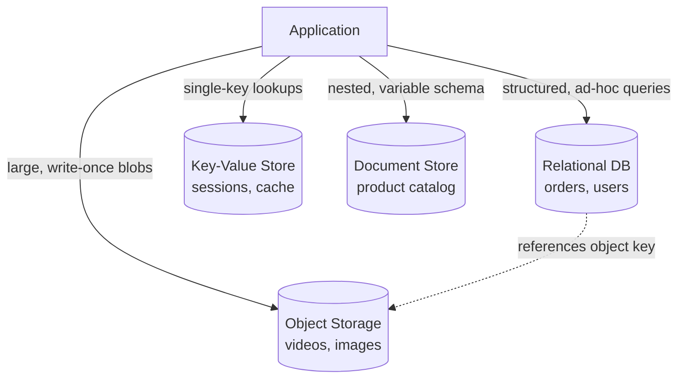

## Overview

"Polyglot persistence" is the practice of using more than one type of database within a single system, each chosen for the access pattern of the data it holds, instead of forcing every kind of data through one general-purpose store. A relational database is excellent at enforcing structure and answering ad-hoc queries across related tables, but it's the wrong tool for a 500 MB video file, and a key-value store is excellent at single-key lookups at massive scale, but it's the wrong tool for "find all orders placed by users in California last month." The question to ask for any given piece of data isn't "which database do we already have," it's "what does this data look like, and how is it actually read and written."

## Relational Databases: Structured, Queryable, Mutable

Relational databases (PostgreSQL, MySQL) fit data that is structured, frequently updated, and needs to be queried in ways that aren't known in advance — joins across entities, filtering on arbitrary columns, aggregations, transactions spanning multiple rows:

```sql
SELECT u.name, COUNT(o.id) AS order_count
FROM users u
JOIN orders o ON o.user_id = u.id
WHERE o.created_at > '2026-07-01'
GROUP BY u.name
HAVING COUNT(o.id) > 3;
```

This is the query pattern a relational database is built for: unpredictable, ad-hoc, joining multiple entities. The cost is that this flexibility doesn't come free — normalization, indexes, and transactional guarantees all add overhead that a purpose-built store for a narrower access pattern doesn't pay.

## Object/Blob Storage: Large, Immutable, Rarely Queried

Object storage (S3, Google Cloud Storage, Azure Blob) fits data that is large, effectively immutable once written, and accessed by a single key rather than queried — audio and video files, images, PDFs, backups, log archives:

```
PUT /bucket/songs/4f9a2c1e-audio.mp3   (5 MB, written once)
GET /bucket/songs/4f9a2c1e-audio.mp3   (streamed on read, never modified)
```

The access pattern is "fetch this exact object by its key," almost always a read, and the object is never partially updated — a changed song is a new object, not a `PATCH` on the old one. This is precisely the pattern a relational database handles badly (storing large binary blobs in row storage bloats tables, slows backups, and wastes an engine built for structured queries on data nobody is querying) and object storage handles well: it scales close to linearly by just adding more capacity, because there's no cross-object consistency or query planning to maintain.

## Key-Value Stores: Single-Key Lookups at Scale

Key-value stores (Redis, DynamoDB, Memcached) fit data accessed almost exclusively by a single known key, where the value itself doesn't need to be queried on its internal structure — session data, feature flags, a cache layer, a counter:

```
SET session:a1b2c3 '{"user_id": 42, "expires": 1785900000}' EX 3600
GET session:a1b2c3
```

The trade is simplicity and speed for query power: a key-value store can answer "give me the value for this key" extremely fast and at extreme scale (this is the workload consistent hashing exists to shard), but it generally can't answer "give me all sessions belonging to user 42" without either a secondary index the store may not support well, or scanning everything.

## Document Stores: Semi-Structured, Nested, Schema-Flexible

Document stores (MongoDB, DynamoDB in document mode, Elasticsearch for search-flavored access) fit data that's naturally nested and doesn't fit a fixed relational schema well, or where the schema varies between records — a product catalog where different product categories have wildly different attributes, user-generated content, event logs:

```json
{
  "product_id": "sku-8821",
  "category": "laptop",
  "attributes": { "cpu": "M4 Pro", "ram_gb": 32, "screen_in": 14.2 }
}
{
  "product_id": "sku-9034",
  "category": "t-shirt",
  "attributes": { "size": "L", "color": "navy", "material": "cotton" }
}
```

Forcing this into a relational schema means either a sparse table with dozens of mostly-null columns, or an EAV (entity-attribute-value) anti-pattern that turns every query into a self-join. A document store stores each record's actual shape and queries within it directly, at the cost of the strong cross-document consistency and join support a relational database provides by default.

## Choosing: Match the Access Pattern, Not the Familiarity

The mistake polyglot persistence corrects is defaulting to whatever database the team already knows for every kind of data, regardless of fit. The questions that actually decide the right store:

- **Is this read almost always by a single known key, or does it need ad-hoc querying across fields?** Single-key → key-value or object storage. Ad-hoc query → relational or document.
- **Is the data mutated in place, or written once and read many times?** Mutated frequently → relational or key-value. Write-once → object storage.
- **Does the record have a fixed, known shape, or does it vary between records?** Fixed → relational. Variable → document store.
- **How large is a single record?** A few KB → any of the above. Megabytes+ → object storage, with a pointer to it (a URL or object key) stored in whichever metadata store holds the rest of the record's fields — this is why a media platform commonly has both a relational/document metadata store *and* an object store, linked by a key, rather than one store holding everything.

This last point is the shape most systems converge on: the actual media/blob lives in object storage, and a relational or document database holds the metadata (title, owner, tags, permissions) plus a reference to the object's key — each store doing the part of the job it's actually good at.



## Trade-offs

- **More database types means more operational surface area** — each store has its own backup strategy, monitoring, failure modes, and on-call runbook; polyglot persistence is a real cost paid in operational complexity, not a free lunch, and isn't worth it for a system small enough that one general-purpose database handles every access pattern adequately.
- **Cross-store consistency has to be built, not inherited** — a relational database gives transactions across its own tables for free; keeping a metadata row in Postgres and a blob in S3 in sync (e.g. deleting both when a user deletes a file) requires explicit application logic or a pattern like the outbox pattern, where a single-store system would just wrap it in one transaction.
- **Query flexibility and write/read performance are usually in tension** — the stores optimized for extreme single-key read/write throughput (key-value, object storage) are the ones that give up ad-hoc query power, and that trade is inherent to how they're built, not a temporary limitation.

## Interview Questions

- Why is storing large binary files directly in a relational database's row storage usually a bad idea, and what would you do instead?
- Given a system with user profiles, uploaded videos, and a live leaderboard, which storage type would you pick for each, and why?
- What does a document store give up relative to a relational database, and when is that an acceptable trade?
- How would you keep a metadata row in a relational database consistent with the object it references in blob storage, given there's no cross-store transaction?

## References

- Martin Kleppmann, [*Designing Data-Intensive Applications*](https://www.oreilly.com/library/view/designing-data-intensive-applications/9781098119058/) (O'Reilly, 2nd Edition) — Chapter 2, "Data Models and Query Languages"
- [AWS — Amazon S3 vs. Amazon RDS: When to Use Which](https://aws.amazon.com/products/storage/)
- [MongoDB — Relational vs. Document Databases](https://www.mongodb.com/resources/compare/relational-vs-non-relational-databases)
- [Martin Fowler — Polyglot Persistence](https://martinfowler.com/bliki/PolyglotPersistence.html)
