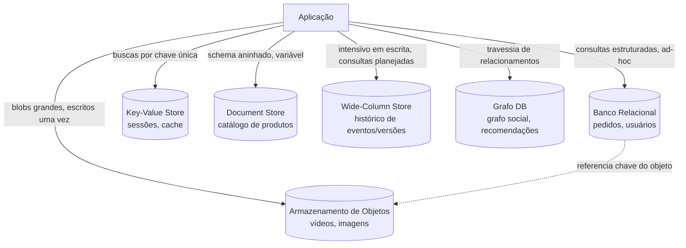

## Visão Geral

"Persistência poliglota" é a prática de usar mais de um tipo de banco de dados dentro de um único sistema, cada um escolhido pelo padrão de acesso dos dados que ele guarda, em vez de forçar todo tipo de dado por um único armazenamento de propósito geral. Um banco de dados relacional é excelente em impor estrutura e responder consultas ad-hoc entre tabelas relacionadas, mas é a ferramenta errada para um arquivo de vídeo de 500 MB, e um key-value store é excelente em buscas por chave única em escala massiva, mas é a ferramenta errada para "encontre todos os pedidos feitos por usuários na Califórnia no mês passado". A pergunta a fazer para qualquer dado específico não é "qual banco de dados já temos", e sim "qual é o formato desse dado, e como ele é de fato lido e escrito". Seis gêneros aparecem repetidamente em sistemas reais — relacional, objeto/blob, key-value, documento, wide-column (colunar) e grafo — cada um construído em torno de uma resposta diferente para essa pergunta.

## Bancos de Dados Relacionais: Estruturados, Consultáveis, Mutáveis

Bancos de dados relacionais (PostgreSQL, MySQL) atendem dados que são estruturados, atualizados com frequência, e precisam ser consultados de formas que não são conhecidas de antemão — joins entre entidades, filtros em colunas arbitrárias, agregações, transações que abrangem múltiplas linhas:

```sql
SELECT u.name, COUNT(o.id) AS order_count
FROM users u
JOIN orders o ON o.user_id = u.id
WHERE o.created_at > '2026-07-01'
GROUP BY u.name
HAVING COUNT(o.id) > 3;
```

Este é o padrão de consulta para o qual um banco de dados relacional foi construído: imprevisível, ad-hoc, unindo múltiplas entidades. O custo é que essa flexibilidade não é de graça — normalização, índices e garantias transacionais adicionam sobrecarga que um armazenamento feito sob medida para um padrão de acesso mais restrito não paga.

## Armazenamento de Objetos/Blobs: Grandes, Imutáveis, Raramente Consultados

O armazenamento de objetos (S3, Google Cloud Storage, Azure Blob) atende dados que são grandes, efetivamente imutáveis uma vez escritos, e acessados por uma única chave em vez de consultados — arquivos de áudio e vídeo, imagens, PDFs, backups, arquivos de log:

```
PUT /bucket/songs/4f9a2c1e-audio.mp3   (5 MB, escrito uma vez)
GET /bucket/songs/4f9a2c1e-audio.mp3   (transmitido na leitura, nunca modificado)
```

O padrão de acesso é "buscar este objeto exato pela sua chave", quase sempre uma leitura, e o objeto nunca é parcialmente atualizado — uma música alterada é um objeto novo, não um `PATCH` no antigo. Este é exatamente o padrão que um banco de dados relacional trata mal (armazenar blobs binários grandes em armazenamento de linhas incha as tabelas, atrasa backups e desperdiça um motor construído para consultas estruturadas em dados que ninguém está consultando) e que o armazenamento de objetos trata bem: ele escala de forma quase linear apenas adicionando mais capacidade, porque não há consistência entre objetos ou planejamento de consulta a manter.

## Key-Value Stores: Buscas por Chave Única em Escala

Key-value stores (Redis, DynamoDB, Memcached) atendem dados acessados quase exclusivamente por uma única chave conhecida, onde o próprio valor não precisa ser consultado por sua estrutura interna — dados de sessão, feature flags, uma camada de cache, um contador:

```
SET session:a1b2c3 '{"user_id": 42, "expires": 1785900000}' EX 3600
GET session:a1b2c3
```

A troca é simplicidade e velocidade por poder de consulta: um key-value store consegue responder "me dê o valor desta chave" extremamente rápido e em escala extrema (esta é a carga de trabalho para a qual o consistent hashing existe para particionar), mas geralmente não consegue responder "me dê todas as sessões pertencentes ao usuário 42" sem um índice secundário que o armazenamento talvez não suporte bem, ou uma varredura completa.

## Document Stores: Semi-Estruturados, Aninhados, Schema Flexível

Document stores (MongoDB, DynamoDB em modo documento, Elasticsearch para acesso com sabor de busca) atendem dados que são naturalmente aninhados e não se encaixam bem em um schema relacional fixo, ou onde o schema varia entre registros — um catálogo de produtos onde categorias diferentes de produtos têm atributos radicalmente diferentes, conteúdo gerado por usuário, logs de eventos:

```json
{
  "product_id": "sku-8821",
  "category": "laptop",
  "attributes": { "cpu": "M4 Pro", "ram_gb": 32, "screen_in": 14.2 }
}
{
  "product_id": "sku-9034",
  "category": "t-shirt",
  "attributes": { "size": "L", "color": "navy", "material": "cotton" }
}
```

Forçar isso em um schema relacional significa ou uma tabela esparsa com dezenas de colunas majoritariamente nulas, ou um anti-padrão EAV (entity-attribute-value) que transforma toda consulta em um self-join. Um document store armazena o formato real de cada registro e consulta diretamente dentro dele, ao custo da forte consistência entre documentos e do suporte a joins que um banco de dados relacional oferece por padrão.

## Columnar (Wide-Column) Stores: Esparsos, Versionados, Schema Moldado pela Consulta

Bancos de dados colunares (Cassandra, HBase) armazenam dados semelhantes por coluna em vez de manter cada registro junto por linha, o que torna colunas baratas de adicionar, versionamento trivial, e valores não populados livres de custo de armazenamento — um layout físico genuinamente diferente do blob JSON por registro de um document store, mesmo que ambos às vezes sejam casualmente chamados de "schema flexível":

```
# Cassandra CQL: uma linha larga onde colunas são adicionadas por linha, não por tabela
CREATE TABLE page_versions (
  url text,
  fetched_at timestamp,
  html_compressed blob,
  PRIMARY KEY (url, fetched_at)
);
```

O encaixe canônico é um conjunto de dados grande, escalado horizontalmente, que é lido e escrito por um padrão de acesso conhecido e se beneficia de compressão e versionamento embutidos — indexar páginas web é o exemplo de livro-texto: altamente textual (comprime bem), de alguma forma inter-relacionado, e muda ao longo do tempo (se beneficia de manter versões antigas de forma barata). A pegadinha é a mesma que o design de tabela única do DynamoDB impõe: "é melhor projetar seu schema com base em como você planeja consultar os dados", então uma carga de trabalho que precisa de relatórios ad-hoc rápidos e não planejados se encaixa mal — você está trocando flexibilidade de consulta por throughput de escrita e eficiência de armazenamento em escala, a mesma troca que a modelagem do DynamoDB centrada em padrões de acesso torna explícita no mundo key-value/documento.

## Bancos de Dados de Grafo: Interconexão Acima de Agregação

Bancos de dados de grafo (Neo4j) invertem a pergunta usual de banco de dados. Em vez de "a qual bucket este registro pertence", a pergunta é "a que este nó está conectado, e por qual tipo de aresta" — nós e os relacionamentos entre eles são ambos de primeira classe, consultados percorrendo arestas em vez de agrupar objetos semelhantes em tabelas ou coleções. Onde um join relacional reconstrói um relacionamento no momento da consulta ao casar chaves estrangeiras entre duas tabelas, um banco de dados de grafo armazena o próprio relacionamento como uma aresta física, então segui-lo é uma navegação por ponteiro, não um join.

```cypher
MATCH (user:Person {name: "Alice"})-[:FOLLOWS]->(friend)-[:FOLLOWS]->(fof)
WHERE NOT (user)-[:FOLLOWS]->(fof)
RETURN fof.name
```

Redes sociais são o encaixe de livro-texto — "se você consegue modelar seus dados em um quadro branco, você consegue modelá-los em um grafo" — e o mesmo formato aparece em motores de recomendação, listas de controle de acesso, e redes de detecção de fraude, em qualquer lugar onde os *relacionamentos* entre registros carregam tanto significado quanto os próprios registros. O trade-off é a imagem espelhada de um wide-column store: a alta interconectividade que torna a travessia barata em uma única máquina torna o particionamento horizontal genuinamente difícil, já que uma consulta que percorre o grafo não pode se dar ao luxo de um salto de rede para um nó diferente a cada aresta que segue — este é um limite arquitetural real, não uma lacuna de maturidade, motivo pelo qual bancos de dados de grafo historicamente escalam para cima (máquina maior) mais facilmente do que escalam para fora (mais máquinas), e por que as soluções de clustering para eles (veja o Causal Clustering do Neo4j) são construídas em torno de escalonamento de leitura e failover em vez de particionamento horizontal de escrita.

## Escolhendo: Case com o Padrão de Acesso, Não com a Familiaridade

O erro que a persistência poliglota corrige é usar por padrão o banco de dados que a equipe já conhece para todo tipo de dado, independentemente do encaixe. As perguntas que realmente decidem o armazenamento certo:

- **Esse dado é lido quase sempre por uma única chave conhecida, ou precisa de consulta ad-hoc entre campos?** Chave única → key-value ou armazenamento de objetos. Consulta ad-hoc → relacional ou documento.
- **O dado é mutado no local, ou escrito uma vez e lido muitas vezes?** Mutado com frequência → relacional ou key-value. Escrito uma vez → armazenamento de objetos.
- **O registro tem um formato fixo e conhecido, ou varia entre registros?** Fixo → relacional. Variável → document store.
- **Qual o tamanho de um único registro?** Alguns KB → qualquer um dos anteriores. Megabytes+ → armazenamento de objetos, com um ponteiro para ele (uma URL ou chave de objeto) armazenado em qualquer que seja o armazenamento de metadados que guarda o resto dos campos do registro — é por isso que uma plataforma de mídia comumente tem tanto um armazenamento de metadados relacional/documento *quanto* um armazenamento de objetos, ligados por uma chave, em vez de um único armazenamento guardando tudo.
- **O valor com que a consulta se importa vive nos relacionamentos, não nos registros?** Se a pergunta interessante é "quem está conectado a quem, e como" em vez de "me dê registros que casem com estes campos", recorra a um banco de dados de grafo — qualquer outra coisa força você a reconstruir o relacionamento no momento da consulta via joins ou código de aplicação.
- **Isso é intensivo em escrita, escalado horizontalmente, e com formato de consulta conhecido de antemão?** Um wide-column store troca flexibilidade de consulta ad-hoc exatamente por essa combinação — crescimento barato de colunas, versionamento barato, e escalonamento de escrita quase linear — a mesma troca que o design de tabela única do DynamoDB faz no mundo key-value, só que com um layout físico diferente por baixo.

Este último ponto é o formato para o qual a maioria dos sistemas converge: a mídia/blob real vive em armazenamento de objetos, e um banco de dados relacional ou documento guarda os metadados (título, dono, tags, permissões) mais uma referência à chave do objeto — cada armazenamento fazendo a parte do trabalho para a qual ele realmente é bom.



## Trade-offs

- **Mais tipos de banco de dados significam mais superfície operacional** — cada armazenamento tem sua própria estratégia de backup, monitoramento, modos de falha e runbook de plantão; persistência poliglota é um custo real pago em complexidade operacional, não um almoço grátis, e não vale a pena para um sistema pequeno o suficiente para que um único banco de dados de propósito geral atenda adequadamente todos os padrões de acesso.
- **A consistência entre armazenamentos precisa ser construída, não herdada** — um banco de dados relacional oferece transações entre suas próprias tabelas de graça; manter uma linha de metadados no Postgres e um blob no S3 sincronizados (por exemplo, excluir ambos quando um usuário exclui um arquivo) exige lógica explícita de aplicação ou um padrão como o outbox pattern, onde um sistema de armazenamento único simplesmente envolveria isso em uma transação.
- **Flexibilidade de consulta e desempenho de escrita/leitura geralmente estão em tensão** — os armazenamentos otimizados para throughput extremo de leitura/escrita por chave única (key-value, armazenamento de objetos) são exatamente os que abrem mão de poder de consulta ad-hoc, e essa troca é inerente a como eles são construídos, não uma limitação temporária.
- **Bancos de dados de grafo escalam para cima mais facilmente do que escalam para fora** — a mesma interconectividade que torna a travessia barata em uma máquina é o que torna o particionamento horizontal genuinamente difícil, já que uma consulta multi-salto não pode se dar ao luxo de uma viagem de rede por aresta; esta é uma propriedade estrutural do modelo, não uma lacuna de implementação que qualquer banco de dados de grafo específico provavelmente vai fechar.

## Perguntas de Entrevista

- Por que armazenar arquivos binários grandes diretamente no armazenamento de linhas de um banco de dados relacional geralmente é uma má ideia, e o que você faria em vez disso?
- Dado um sistema com perfis de usuário, vídeos enviados, e um leaderboard ao vivo, qual tipo de armazenamento você escolheria para cada um, e por quê?
- O que um document store abre mão em relação a um banco de dados relacional, e quando essa é uma troca aceitável?
- Como você manteria uma linha de metadados em um banco de dados relacional consistente com o objeto que ela referencia em armazenamento de blob, dado que não há transação entre armazenamentos?
- Por que bancos de dados de grafo tendem a escalar verticalmente em vez de horizontalmente, e o que isso implica sobre seu encaixe para um sistema enorme, tolerante a partição?
- Uma rede social precisa armazenar perfis de usuário, posts, e um grafo de "quem segue quem". Qual tipo de armazenamento se encaixa em cada um, e por que forçar o grafo de seguidores em um schema relacional se tornaria doloroso em escala?

## Referências

- Martin Kleppmann, [*Designing Data-Intensive Applications*](https://www.oreilly.com/library/view/designing-data-intensive-applications/9781098119058/) (O'Reilly, 2ª Edição) — Capítulo 2, "Data Models and Query Languages"
- Luc Perkins, Eric Redmond, e Jim R. Wilson, [*Seven Databases in Seven Weeks*](https://pragprog.com/titles/rwdata2/seven-databases-in-seven-weeks-second-edition/) (Pragmatic Bookshelf, 2ª Edição, 2018) — Capítulo 9, "Wrapping Up" ("Genres Redux")
- [AWS — Amazon S3 vs. Amazon RDS: When to Use Which](https://aws.amazon.com/products/storage/)
- [MongoDB — Relational vs. Document Databases](https://www.mongodb.com/resources/compare/relational-vs-non-relational-databases)
- [Martin Fowler — Polyglot Persistence](https://martinfowler.com/bliki/PolyglotPersistence.html)
