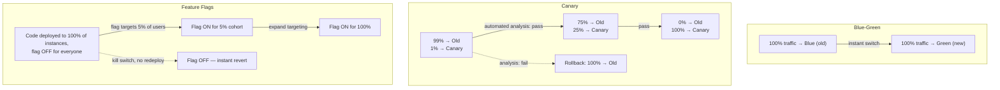

## Overview

Deploying a new version of a service to 100% of production traffic in one step means that if the change is broken, it is discovered by 100% of your users at once — and usually discovered by them, not by you, because a fleet-wide rollout finishes before most monitoring has a chance to react. **Progressive delivery** is the umbrella term for the family of techniques that break that all-or-nothing coupling apart. Each technique separates two things that a naive deploy fuses together: "the new code is running somewhere in production" and "the new code is serving everyone." Once those are separable, a bad change can be caught while it's affecting a small, controlled, and — critically — bounded slice of real traffic, rather than the whole fleet simultaneously.

The three techniques covered here attack the problem from different angles and at different layers of the stack. **Blue-green deployment** operates at the infrastructure/routing layer: two full environments exist, and traffic moves between them as an atomic switch. **Canary releases** operate at the traffic-shifting layer: a small, growing percentage of real requests is routed to the new version while the rest stays on the old one, with a metrics-driven decision gating each increase. **Feature flags** operate at the application layer: the code for a new behavior ships to every instance, but a runtime check decides whether any given request actually exercises it, independent of any deploy at all. None of the three is strictly better than the others — they solve overlapping but distinct problems, and mature delivery pipelines usually compose two or three of them rather than picking just one.

## Blue-Green Deployment: Two Full Environments, One Switch

The term comes from Jez Humble and David Farley's *Continuous Delivery* (Addison-Wesley, 2010), and the mechanics are deliberately simple. You maintain two identical, full-scale production environments, conventionally labeled **blue** and **green**. At any moment, one of them — say blue — is live, serving all real traffic. The other, green, is idle or running the previous release, available to receive the next one. To ship a new version, you deploy it entirely onto green, run whatever smoke tests, synthetic checks, and manual verification you need against it while it receives zero real traffic, and once you're satisfied, you flip a router — a load balancer's target group, a DNS record, a service mesh's routing rule — so that all traffic that used to reach blue now reaches green instead. Blue doesn't disappear; it sits there, unchanged, as the previous known-good state.

This gives blue-green two properties that make it attractive operationally. First, the cut-over is close to instantaneous and, more importantly, **reversible by the same mechanism that performed it**: if green misbehaves after the switch, rollback is not a redeploy — it's flipping the same router back to blue, which is live within seconds and requires no rebuild, no re-provisioning, and no waiting for a new artifact to propagate. Second, because green is validated before it ever receives production traffic, you eliminate an entire class of "half-deployed" states where some fraction of instances are running the old version and some the new one for an extended, uncontrolled period.

The costs are equally structural. Running two full-scale production environments simultaneously — even if one is briefly idle — means provisioning close to double the infrastructure at the moment of a release, which is expensive for anything stateful or large, and genuinely awkward for a database, where "two environments" can't simply mean two independent copies of the data without solving replication or dual-write problems first (this is why blue-green is cleanest for stateless application tiers, with the data layer handled separately via backward-compatible migrations). And the switch is **all-or-nothing by construction**: the moment you flip the router, every request goes to green, including the ones from workloads, browsers, geographic regions, or account tiers you didn't happen to test against. A bug that only manifests for accounts using SSO, or under a specific concurrency pattern that never shows up in a pre-cutover smoke test, will not surface until it's already affecting all production traffic — which is exactly the failure mode blue-green does not protect against, and precisely the gap canary releases are built to close.

## Canary Releases: Gradual Traffic, Automated Judgment

Where blue-green switches all traffic at once, a **canary release** moves it gradually, and lets real production traffic itself be the test. A small percentage of live requests — 1%, 5%, whatever the risk tolerance and traffic volume support — is routed to the new version while the remaining 95–99% continues to hit the known-good version, both running concurrently. The system watches the canary's key metrics — error rate, latency percentiles, business-relevant signals like checkout completion — compared against the baseline the old version is producing on the same traffic mix, and on that basis makes a decision: **proceed**, by increasing the canary's traffic share (5% → 25% → 50% → 100%), or **abort**, by draining traffic back off the canary and rolling it back before it ever reaches full exposure.

The core advantage over blue-green is exactly the gap identified above: because the canary is exposed to a genuine, unfiltered cross-section of real traffic — real user agents, real account types, real geographic distribution, real concurrent load patterns — it can catch the class of bug that only manifests for a subset of workloads, long before that bug would ever reach 100% of users. The cost is that you're running two versions concurrently for the duration of the rollout, which is typically longer than a blue-green cutover (minutes to hours rather than seconds), and — this is the part that's easy to get wrong — the go/no-go decision only protects you if it's rigorous. "Look at the dashboard and see if anything looks red" does not scale, doesn't generalize across services, and is exactly the kind of judgment call that degrades under on-call fatigue or release-day pressure.

## Automated Canary Analysis

The Google SRE Workbook's chapter on canarying releases (Chapter 16, "Canarying Releases") makes this precise: canarying is only a meaningful safety mechanism if the analysis deciding whether the canary is healthy is **automated and statistically grounded**, not an ad hoc glance at a graph. The chapter's reasoning is that a human comparing two dashboards side by side is bad at exactly the judgments that matter here — distinguishing a real regression from ordinary noise, accounting for the fact that the canary's traffic sample is smaller than the baseline's and therefore naturally noisier, and doing all of that consistently across dozens or hundreds of services and rollouts a day. **Automated canary analysis (ACA)** formalizes the comparison: it defines the metrics that matter for a given service ahead of time, computes them for the canary and a comparable baseline cohort over the same window, applies a statistical test (or a simpler threshold with confidence bounds) to decide whether the canary's metrics are meaningfully worse, and produces a score or a binary verdict that a human — or a fully automated pipeline — acts on. Tools like Kayenta (built at Netflix and adopted by Spinnaker) implement this pattern directly: canary and baseline get identical traffic characteristics, a battery of metrics is compared statistically, and a canary score below a configured threshold triggers automatic rollback without anyone needing to be paged first.

This matters because a canary's usefulness scales with how quickly and reliably the abort decision fires. A canary that's evaluated by a human checking in every twenty minutes still exposes a meaningful fraction of users to a bad version for twenty minutes; automated, statistically sound analysis can detect and abort within the first few percent of traffic exposure, which is the entire point of running a canary rather than a blue-green switch in the first place.

## Feature Flags: Decoupling Deploy from Release

Blue-green and canary both still operate at the level of *deploys* — which binary, which container image, which set of instances is serving traffic. **Feature flags** (also called feature toggles — see Pete Hodgson's "Feature Toggles" article on martinfowler.com) attack the problem from a different direction entirely: they decouple **deploying** code from **releasing** it. The new behavior ships inside the same binary that's already running everywhere, gated behind a runtime conditional — `if (flags.isEnabled("new-checkout-flow", user))` — that's evaluated per request against a flag configuration service. The code is in production, on every instance, dark and inert, the moment it's deployed. Nothing about it is visible to any user until the flag is explicitly turned on, and turning it on can be scoped arbitrarily finely: a percentage rollout, a specific list of internal or beta users, a specific region, a specific account tier — entirely independent of any deploy event.

This decoupling is what makes truly instant, code-free rollback possible in a way neither blue-green nor canary quite matches: reverting a bad feature is flipping a boolean in a flag service, which propagates in the time it takes your flag client to poll or receive a push update — typically seconds — with no build, no redeploy, and no router reconfiguration involved at all. It also enables release patterns the other two techniques can't: dark launches (ship the code, enable it for nobody, verify it's not causing load or errors just by existing), targeted rollouts to a single enterprise customer ahead of everyone else, and instant kill switches for functionality that turns out to be misbehaving under load, all without touching the deployment pipeline.

The cost is operational and it compounds over time rather than showing up immediately. Every flag that ships is a piece of **flag debt** unless something forces its removal — a conditional branch that was meant to exist for a two-week rollout is, in practice, extremely easy to leave in the codebase for a year, because removing it requires someone to notice, decide it's safe, and do the (often unglamorous) cleanup work. And flags don't compose linearly: a service with even five independent flags has up to 32 possible on/off combinations that could theoretically be live in production simultaneously, and most teams have no realistic way to test that combinatorial space — they test "everything off" and "everything on" and hope the states in between don't matter, which is often false for flags that touch shared state or overlapping code paths. A codebase with dozens of long-lived flags accumulates real complexity debt: harder-to-read code, harder-to-reason-about test coverage, and a growing risk that some combination of stale flags produces a bug nobody can reproduce because nobody remembers which flags were even involved.

## Composing All Three

These techniques aren't mutually exclusive, and mature delivery pipelines typically layer them. A common composition: deploy the new binary using blue-green or canary infrastructure so the *deploy* itself is safe and reversible at the infrastructure level, while the *risky new behavior* inside that binary sits behind a feature flag so it can be dialed in gradually and killed instantly without touching the deploy at all. That separation means a bad deploy (crash, memory leak, startup failure) is caught and rolled back by the deploy-level safety net, while a bad *feature* (wrong business logic, a UX regression, an unexpected interaction with a specific user segment) is caught and killed by the flag — two independent safety mechanisms addressing two different failure classes, neither of which fully substitutes for the other.

| Dimension | Blue-Green | Canary | Feature Flags |
|---|---|---|---|
| Rollback speed | Seconds — flip the router back | Minutes — drain traffic off the canary | Seconds — flip the flag, no deploy involved |
| Blast radius if broken | 100%, but only after the switch (0% before it) | Bounded to the current canary percentage | Bounded to whatever cohort the flag targets |
| Operational cost | Double the infrastructure at cutover time | Two versions running concurrently, longer window; needs real metrics + analysis | Flag debt and combinatorial complexity accumulate over time |

## Trade-offs

- **Blue-green protects against bad deploys, not bad features** — a syntactically and operationally healthy green environment can still ship the wrong business logic to everyone the instant the switch flips, because health checks don't know what "correct" means for your product.
- **Canary catches what blue-green misses, but only if the analysis is real** — a canary evaluated by eyeballing a dashboard is closer to theater than to a safety mechanism; the Google SRE Workbook's insistence on statistically grounded automated canary analysis exists because human judgment under time pressure is exactly where this breaks down.
- **Feature flags buy the fastest, cheapest rollback of the three, financed by debt that's easy to defer** — the flip itself costs nothing, but every flag that outlives its rollout is a small, compounding tax on code readability and test coverage that someone eventually has to pay down.
- **None of the three substitutes for the others** — blue-green is an infrastructure-level switch, canary is a traffic-shifting policy with a decision procedure, and feature flags are an application-level release gate; composing them addresses more failure modes than any one alone, at the combined operational cost of all three.
- **Stateful systems complicate all three techniques differently** — blue-green needs a data layer story (shared database or backward-compatible dual writes) since you can't trivially duplicate persistent state; canaries need care that the new version's writes are compatible with what the old version will read back; flags touching persisted state need to consider what happens when the flag is later flipped off after data has already been written under the "on" behavior.

## Interview Questions

- Walk through what happens, step by step, when a subtle bug that only affects users in one geographic region is shipped via blue-green deployment versus via a canary release. Which one catches it first, and why?
- Why does the Google SRE Workbook insist that canary analysis be automated and statistically grounded rather than a manual dashboard check? What specifically goes wrong with the manual version?
- A team wants instant, code-free rollback for a risky new feature. Would you recommend blue-green, canary, or a feature flag, and why — and what does that recommendation not protect them from?
- What is "flag debt," and what organizational practice would you put in place to prevent a codebase from accumulating dozens of long-lived, forgotten flags?
- Design a rollout plan for a payments-critical change that composes blue-green, canary, and feature flags together. What does each layer protect against that the others don't?
- Blue-green deployment requires roughly double the infrastructure at cutover time. What would you do differently for a large, stateful database tier where you can't simply duplicate the entire dataset into a second environment?

## References

- [Continuous Delivery: Reliable Software Releases through Build, Test, and Deployment Automation](https://www.pearson.com/en-us/subject-catalog/p/continuous-delivery-reliable-software-releases-through-build-test-and-deployment-automation/P200000009113/9780321670229) — Jez Humble and David Farley, Addison-Wesley, 2010
- [Alec Warner and Štěpán Davidovič with Alex Hidalgo, Betsy Beyer, Kyle Smith, and Matt Duftler — Google SRE Workbook, Chapter 16, "Canarying Releases"](https://sre.google/workbook/canarying-releases/)
- [Blue Green Deployment](https://martinfowler.com/bliki/BlueGreenDeployment.html) — Martin Fowler
- [Feature Toggles (aka Feature Flags)](https://martinfowler.com/articles/feature-toggles.html) — Pete Hodgson, martinfowler.com
