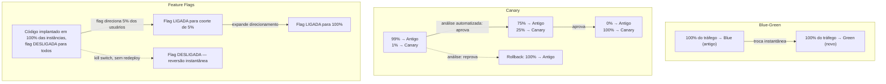

## Visão Geral

Implantar uma nova versão de um serviço para 100% do tráfego de produção em uma única etapa significa que, se a mudança estiver quebrada, isso é descoberto por 100% dos seus usuários de uma vez — e geralmente descoberto por eles, não por você, porque um rollout em toda a frota termina antes que a maior parte do monitoramento tenha chance de reagir. **Entrega progressiva** é o termo guarda-chuva para a família de técnicas que desfazem esse acoplamento tudo-ou-nada. Cada técnica separa duas coisas que um deploy ingênuo funde: "o novo código está rodando em algum lugar em produção" e "o novo código está atendendo a todos". Uma vez que essas coisas são separáveis, uma mudança ruim pode ser detectada enquanto afeta uma fatia pequena, controlada e — criticamente — limitada de tráfego real, em vez de toda a frota simultaneamente.

As três técnicas cobertas aqui atacam o problema de ângulos diferentes e em camadas diferentes da pilha. **Blue-green deployment** opera na camada de infraestrutura/roteamento: dois ambientes completos existem, e o tráfego se move entre eles como uma troca atômica. **Canary releases** operam na camada de deslocamento de tráfego: uma pequena porcentagem, crescente, de requisições reais é roteada para a nova versão enquanto o restante permanece na antiga, com uma decisão orientada por métricas controlando cada aumento. **Feature flags** operam na camada de aplicação: o código para um novo comportamento é implantado em toda instância, mas uma verificação em tempo de execução decide se qualquer requisição dada de fato exercita esse comportamento, independentemente de qualquer deploy. Nenhuma das três é estritamente melhor que as outras — elas resolvem problemas sobrepostos mas distintos, e pipelines de entrega maduros geralmente compõem duas ou três delas em vez de escolher apenas uma.

## Blue-Green Deployment: Dois Ambientes Completos, Uma Troca

O termo vem do livro *Continuous Delivery* de Jez Humble e David Farley (Addison-Wesley, 2010), e a mecânica é deliberadamente simples. Você mantém dois ambientes de produção idênticos e em escala real, convencionalmente rotulados **blue** e **green**. Em qualquer momento, um deles — digamos, blue — está ativo, atendendo todo o tráfego real. O outro, green, está ocioso ou rodando a versão anterior, disponível para receber a próxima. Para lançar uma nova versão, você a implanta inteiramente no green, roda quaisquer smoke tests, verificações sintéticas e verificação manual que precisar contra ele enquanto ele recebe zero tráfego real, e, uma vez satisfeito, você vira um roteador — o target group de um load balancer, um registro DNS, a regra de roteamento de um service mesh — de modo que todo tráfego que costumava chegar ao blue agora chega ao green. O blue não desaparece; ele fica ali, inalterado, como o estado anterior conhecido como bom.

Isso dá ao blue-green duas propriedades que o tornam atraente operacionalmente. Primeiro, a virada é praticamente instantânea e, mais importante, **reversível pelo mesmo mecanismo que a executou**: se o green se comportar mal após a troca, o rollback não é um redeploy — é virar o mesmo roteador de volta para o blue, que fica ativo em segundos e não exige rebuild, reprovisionamento, ou espera pela propagação de um novo artefato. Segundo, como o green é validado antes de receber qualquer tráfego de produção, você elimina uma classe inteira de estados "meio implantados", onde uma fração das instâncias roda a versão antiga e outra a nova por um período estendido e não controlado.

Os custos são igualmente estruturais. Rodar dois ambientes de produção em escala completa simultaneamente — mesmo que um esteja brevemente ocioso — significa provisionar quase o dobro da infraestrutura no momento de um release, o que é caro para qualquer coisa stateful ou grande, e genuinamente incômodo para um banco de dados, onde "dois ambientes" não pode simplesmente significar duas cópias independentes dos dados sem resolver primeiro problemas de replicação ou dual-write (é por isso que blue-green é mais limpo para camadas de aplicação stateless, com a camada de dados tratada separadamente via migrações retrocompatíveis). E a troca é **tudo-ou-nada por construção**: no momento em que você vira o roteador, toda requisição vai para o green, incluindo as vindas de cargas de trabalho, navegadores, regiões geográficas ou níveis de conta que você não testou. Um bug que só se manifesta para contas usando SSO, ou sob um padrão específico de concorrência que nunca aparece em um smoke test pré-virada, não vai surgir até que já esteja afetando todo o tráfego de produção — que é exatamente o modo de falha contra o qual o blue-green não protege, e precisamente a lacuna que os canary releases são construídos para fechar.

## Canary Releases: Tráfego Gradual, Julgamento Automatizado

Onde o blue-green troca todo o tráfego de uma vez, um **canary release** o move gradualmente, e deixa o próprio tráfego de produção real ser o teste. Uma pequena porcentagem de requisições ao vivo — 1%, 5%, o que quer que a tolerância a risco e o volume de tráfego suportem — é roteada para a nova versão enquanto os 95–99% restantes continuam a atingir a versão conhecida como boa, ambas rodando concorrentemente. O sistema observa as métricas-chave do canary — taxa de erro, percentis de latência, sinais relevantes para o negócio como conclusão de checkout — comparadas com a baseline que a versão antiga está produzindo na mesma mistura de tráfego, e com base nisso toma uma decisão: **prosseguir**, aumentando a fatia de tráfego do canary (5% → 25% → 50% → 100%), ou **abortar**, drenando o tráfego de volta do canary e revertendo-o antes que ele alcance exposição total.

A vantagem central sobre o blue-green é exatamente a lacuna identificada acima: como o canary é exposto a uma seção transversal genuína e não filtrada do tráfego real — user agents reais, tipos de conta reais, distribuição geográfica real, padrões reais de carga concorrente — ele consegue detectar a classe de bug que só se manifesta para um subconjunto de cargas de trabalho, muito antes que esse bug chegasse a atingir 100% dos usuários. O custo é que você está rodando duas versões concorrentemente durante toda a duração do rollout, o que tipicamente é mais longo que uma virada blue-green (minutos a horas em vez de segundos), e — esta é a parte fácil de errar — a decisão go/no-go só protege você se for rigorosa. "Olhar o dashboard e ver se algo parece vermelho" não escala, não generaliza entre serviços, e é exatamente o tipo de julgamento que se degrada sob fadiga de plantão ou pressão de dia de release.

## Análise Automatizada de Canary

O capítulo do Google SRE Workbook sobre canarying de releases (Capítulo 16, "Canarying Releases") deixa isso preciso: canarying só é um mecanismo de segurança significativo se a análise que decide se o canary está saudável for **automatizada e estatisticamente fundamentada**, não uma olhada ad hoc em um gráfico. O raciocínio do capítulo é que um humano comparando dois dashboards lado a lado é ruim exatamente nos julgamentos que importam aqui — distinguir uma regressão real de ruído comum, considerando que a amostra de tráfego do canary é menor que a da baseline e, portanto, naturalmente mais ruidosa, e fazer tudo isso de forma consistente entre dezenas ou centenas de serviços e rollouts por dia. A **análise automatizada de canary (ACA)** formaliza a comparação: define de antemão as métricas que importam para um dado serviço, calcula-as para o canary e uma coorte de baseline comparável na mesma janela, aplica um teste estatístico (ou um limiar mais simples com limites de confiança) para decidir se as métricas do canary estão significativamente piores, e produz uma pontuação ou um veredito binário sobre o qual um humano — ou um pipeline totalmente automatizado — age. Ferramentas como o Kayenta (construído na Netflix e adotado pelo Spinnaker) implementam esse padrão diretamente: canary e baseline recebem características de tráfego idênticas, uma bateria de métricas é comparada estatisticamente, e uma pontuação de canary abaixo de um limiar configurado dispara rollback automático sem que ninguém precise ser acionado primeiro.

Isso importa porque a utilidade de um canary escala com quão rápida e confiavelmente a decisão de abortar dispara. Um canary avaliado por um humano checando a cada vinte minutos ainda expõe uma fração significativa de usuários a uma versão ruim por vinte minutos; uma análise automatizada e estatisticamente sólida pode detectar e abortar dentro dos primeiros por cento de exposição ao tráfego, que é todo o objetivo de rodar um canary em vez de uma troca blue-green desde o início.

## Feature Flags: Desacoplando Deploy de Release

Blue-green e canary ainda operam no nível de *deploys* — qual binário, qual imagem de container, qual conjunto de instâncias está atendendo o tráfego. **Feature flags** (também chamadas de feature toggles — veja o artigo "Feature Toggles" de Pete Hodgson no martinfowler.com) atacam o problema de uma direção inteiramente diferente: elas desacoplam **implantar** código de **lançar** esse código. O novo comportamento é enviado dentro do mesmo binário que já está rodando em todo lugar, protegido atrás de um condicional em tempo de execução — `if (flags.isEnabled("new-checkout-flow", user))` — avaliado por requisição contra um serviço de configuração de flags. O código está em produção, em toda instância, escuro e inerte, no momento em que é implantado. Nada dele é visível a qualquer usuário até que a flag seja explicitamente ativada, e ativá-la pode ser escopado com granularidade arbitrária: um rollout percentual, uma lista específica de usuários internos ou beta, uma região específica, um nível de conta específico — inteiramente independente de qualquer evento de deploy.

Esse desacoplamento é o que torna possível um rollback verdadeiramente instantâneo e sem código, de um jeito que nem o blue-green nem o canary conseguem igualar: reverter uma feature ruim é virar um booleano em um serviço de flags, o que se propaga no tempo que seu cliente de flags leva para consultar ou receber uma atualização push — tipicamente segundos — sem build, sem redeploy, e sem reconfiguração de roteador envolvida. Isso também habilita padrões de release que as outras duas técnicas não conseguem: dark launches (envie o código, ative-o para ninguém, verifique que ele não está causando carga ou erros apenas por existir), rollouts direcionados a um único cliente enterprise antes de todo mundo, e kill switches instantâneos para funcionalidades que acabam se comportando mal sob carga, tudo sem tocar no pipeline de deploy.

O custo é operacional e se acumula ao longo do tempo em vez de aparecer imediatamente. Toda flag lançada é um pedaço de **dívida de flags** a menos que algo force sua remoção — um branch condicional pensado para existir por um rollout de duas semanas é, na prática, extremamente fácil de deixar na base de código por um ano, porque removê-lo exige que alguém perceba, decida que é seguro, e faça o trabalho de limpeza (frequentemente sem graça). E flags não compõem linearmente: um serviço com apenas cinco flags independentes tem até 32 combinações possíveis de ligado/desligado que poderiam teoricamente estar ativas em produção simultaneamente, e a maioria das equipes não tem uma forma realista de testar esse espaço combinatório — elas testam "tudo desligado" e "tudo ligado" e torcem para que os estados intermediários não importem, o que muitas vezes é falso para flags que tocam estado compartilhado ou caminhos de código sobrepostos. Uma base de código com dezenas de flags de longa duração acumula dívida real de complexidade: código mais difícil de ler, cobertura de testes mais difícil de raciocinar, e um risco crescente de que alguma combinação de flags obsoletas produza um bug que ninguém consegue reproduzir porque ninguém lembra quais flags estavam envolvidas.

## Compondo as Três

Essas técnicas não são mutuamente exclusivas, e pipelines de entrega maduros tipicamente as sobrepõem em camadas. Uma composição comum: implante o novo binário usando infraestrutura blue-green ou canary para que o próprio *deploy* seja seguro e reversível no nível de infraestrutura, enquanto o *novo comportamento arriscado* dentro desse binário fica atrás de uma feature flag para que possa ser ajustado gradualmente e morto instantaneamente sem tocar no deploy. Essa separação significa que um deploy ruim (crash, vazamento de memória, falha de inicialização) é detectado e revertido pela rede de segurança em nível de deploy, enquanto uma *feature* ruim (lógica de negócio errada, uma regressão de UX, uma interação inesperada com um segmento específico de usuários) é detectada e morta pela flag — dois mecanismos de segurança independentes tratando duas classes de falha diferentes, nenhum dos quais substitui completamente o outro.

| Dimensão | Blue-Green | Canary | Feature Flags |
|---|---|---|---|
| Velocidade de rollback | Segundos — virar o roteador de volta | Minutos — drenar o tráfego do canary | Segundos — virar a flag, sem deploy envolvido |
| Raio de impacto se quebrado | 100%, mas só após a troca (0% antes dela) | Limitado à porcentagem atual do canary | Limitado à coorte que a flag direciona |
| Custo operacional | Dobro da infraestrutura no momento da virada | Duas versões rodando concorrentemente, janela mais longa; precisa de métricas + análise reais | Dívida de flags e complexidade combinatória se acumulam ao longo do tempo |

## Trade-offs

- **Blue-green protege contra deploys ruins, não contra features ruins** — um ambiente green sintática e operacionalmente saudável ainda pode enviar a lógica de negócio errada para todos no instante em que a troca acontece, porque health checks não sabem o que "correto" significa para o seu produto.
- **Canary detecta o que o blue-green perde, mas apenas se a análise for real** — um canary avaliado ao olhar um dashboard está mais para teatro do que para um mecanismo de segurança; a insistência do Google SRE Workbook em análise de canary automatizada e estatisticamente fundamentada existe porque o julgamento humano sob pressão de tempo é exatamente onde isso quebra.
- **Feature flags compram o rollback mais rápido e barato dos três, financiado por dívida fácil de adiar** — a virada em si não custa nada, mas toda flag que sobrevive ao seu rollout é um pequeno imposto acumulativo sobre legibilidade de código e cobertura de testes que alguém eventualmente precisa pagar.
- **Nenhuma das três substitui as outras** — blue-green é uma troca em nível de infraestrutura, canary é uma política de deslocamento de tráfego com um procedimento de decisão, e feature flags são um portão de release em nível de aplicação; compô-las trata mais modos de falha do que qualquer uma sozinha, ao custo operacional combinado das três.
- **Sistemas stateful complicam as três técnicas de formas diferentes** — blue-green precisa de uma estratégia para a camada de dados (banco de dados compartilhado ou dual writes retrocompatíveis) já que você não consegue trivialmente duplicar estado persistente; canaries precisam de cuidado para que as escritas da nova versão sejam compatíveis com o que a versão antiga vai ler de volta; flags que tocam estado persistido precisam considerar o que acontece quando a flag é posteriormente desligada depois que dados já foram escritos sob o comportamento "ligado".

## Perguntas de Entrevista

- Percorra o que acontece, passo a passo, quando um bug sutil que só afeta usuários em uma região geográfica é lançado via blue-green deployment versus via um canary release. Qual detecta primeiro, e por quê?
- Por que o Google SRE Workbook insiste que a análise de canary seja automatizada e estatisticamente fundamentada em vez de uma checagem manual de dashboard? O que especificamente dá errado na versão manual?
- Uma equipe quer rollback instantâneo e sem código para uma nova feature arriscada. Você recomendaria blue-green, canary, ou uma feature flag, e por quê — e do que essa recomendação não os protege?
- O que é "dívida de flags", e qual prática organizacional você colocaria em prática para evitar que uma base de código acumule dezenas de flags de longa duração e esquecidas?
- Projete um plano de rollout para uma mudança crítica para pagamentos que compõe blue-green, canary, e feature flags juntas. Contra o que cada camada protege que as outras não protegem?
- Blue-green deployment exige aproximadamente o dobro da infraestrutura no momento da virada. O que você faria diferente para uma camada de banco de dados grande e stateful onde você não pode simplesmente duplicar todo o dataset em um segundo ambiente?

## Referências

- [Continuous Delivery: Reliable Software Releases through Build, Test, and Deployment Automation](https://www.pearson.com/en-us/subject-catalog/p/continuous-delivery-reliable-software-releases-through-build-test-and-deployment-automation/P200000009113/9780321670229) — Jez Humble e David Farley, Addison-Wesley, 2010
- [Alec Warner e Štěpán Davidovič com Alex Hidalgo, Betsy Beyer, Kyle Smith, e Matt Duftler — Google SRE Workbook, Capítulo 16, "Canarying Releases"](https://sre.google/workbook/canarying-releases/)
- [Blue Green Deployment](https://martinfowler.com/bliki/BlueGreenDeployment.html) — Martin Fowler
- [Feature Toggles (aka Feature Flags)](https://martinfowler.com/articles/feature-toggles.html) — Pete Hodgson, martinfowler.com
