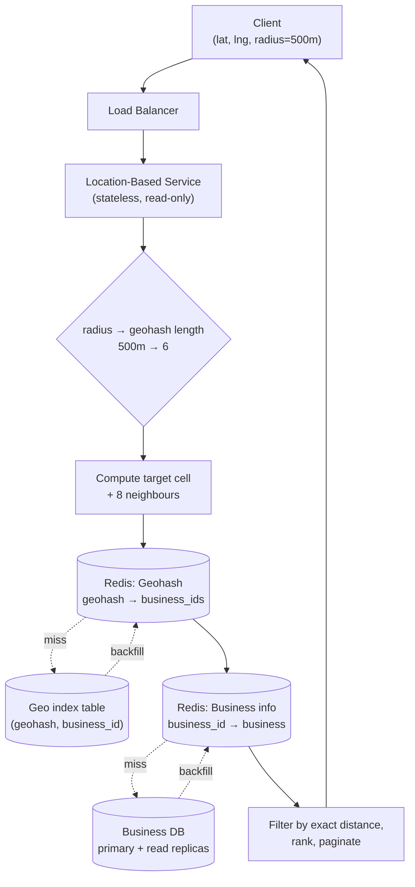

## Overview

"Show me every restaurant within 5 km" is a **spatial range query**, and it is exactly the shape of query a B-tree index is bad at: a B-tree orders rows along one dimension, but a location is two numbers that must be constrained *simultaneously*. The fix is not a better database — it's an encoding that collapses (latitude, longitude) into a single sortable key so proximity in the real world becomes adjacency in an index. This concept covers those encodings (geohash, quadtree, Google's S2) and the service architecture built on top of them; the two sibling concepts, [Nearby Friends](nearby-friends) and [Google Maps](designing-google-maps), assume this indexing layer and build on it rather than re-deriving it.

## Requirements

The canonical framing is a Yelp-style nearby search. Functionally, the system needs to:

- **Return all businesses within a radius** of a given latitude/longitude, where the client picks the radius from a fixed set (0.5 km, 1 km, 2 km, 5 km, 20 km) rather than sending an arbitrary float.
- **Let business owners create, update, and delete businesses** — with an explicit agreement that changes take effect the *next day*, not in real time.
- **Serve a business detail page** by id, with photos, hours, and ratings.

The non-functional shape of the system is what drives every later decision:

- **Read-heavy to the point of being read-only on the hot path.** At 100M daily active users making ~5 searches a day, search alone is ~5,000 QPS, while writes are a trickle of business-owner edits. The search path never writes.
- **Businesses do not move.** A restaurant's coordinates are effectively immutable, which means the geospatial index can be precomputed, cached aggressively, and rebuilt on a nightly job. This is the single biggest difference from [Nearby Friends](nearby-friends), where every entity's location changes every few seconds.
- **Low latency.** The search is interactive; it competes with the user's patience, not with a batch SLA.
- **Location data is regulated.** GDPR and CCPA make user coordinates sensitive data, which pushes toward regional deployments that keep queries (and any logs of them) inside a jurisdiction.

Stated as a system: the location-based service (LBS) that answers radius queries is stateless, read-only, and trivially horizontally scalable; the business service that handles CRUD is a separate, low-QPS write path. Keeping them separate means a burst of dinner-time searches never contends with business-owner writes.

## Why the Naive Query Fails

The intuitive first attempt is a bounding-box scan:

```sql
SELECT business_id, latitude, longitude
FROM business
WHERE latitude  BETWEEN :my_lat  - :radius AND :my_lat  + :radius
  AND longitude BETWEEN :my_long - :radius AND :my_long + :radius;
```

Without indexes this is a full table scan of 200 million rows. With indexes on `latitude` and `longitude` it is *still* slow, and the reason is worth internalizing: **a B-tree index only accelerates one dimension at a time**. The planner can use the latitude index to fetch every business in a horizontal band that wraps the entire planet, or the longitude index to fetch a vertical band pole to pole — each of those sets contains millions of rows — and then it must intersect them. The intersection is small; the two inputs are not. A composite `(latitude, longitude)` index doesn't rescue this either, because the second column is only useful once the first is pinned to an equality, and a range on latitude never pins anything.

So the real question becomes: *can two-dimensional data be mapped to one dimension in a way that preserves locality?* Every geospatial index is an answer to that question. Broadly they split into hash-style schemes (even grid, geohash, cartesian tiers) and tree-style schemes (quadtree, R-tree, S2) — but the underlying move is identical in all of them: **subdivide the map into cells, name each cell with a sortable key, and index on the key.**

The naive version of that move is an **evenly divided grid** — chop the world into fixed squares. It fails for one blunt reason: businesses are not evenly distributed. One cell covers downtown Manhattan and holds tens of thousands of businesses; the neighbouring ocean cell holds zero. What's needed is small cells where data is dense and large cells where it isn't, plus a cheap way to name a cell's neighbours.

## Geohash

**Geohash** interleaves the bits of latitude and longitude into a single string, and it is the most widely deployed of these schemes precisely because the result is just a string that any database can index and prefix-match.

The construction is a repeated binary search over the globe. Split longitude at the prime meridian: west is `0`, east is `1`. Split latitude at the equator: south is `0`, north is `1`. Then split whichever half you landed in, and again, alternating between the longitude bit and the latitude bit each time. Every additional bit halves one dimension, so the cell shrinks geometrically. The resulting bit string is encoded in base32 for a human-readable handle:

```
Google HQ:   1001 10110 01001 10000 11011 11010  →  9q9hvu
Facebook HQ: 1001 10110 01001 10001 10000 10111  →  9q9jhr
```

Two properties fall directly out of that construction:

- **A prefix is an area.** `9q9h` is a cell; `9q9hv` is one of the 32 sub-cells inside it. Truncating a geohash zooms out. That makes "expand the search" a string operation: drop the last character and re-query.
- **Length maps to a known cell size**, so the radius the user picked selects the precision to query at. Length 6 is roughly 1.2 km × 0.6 km, length 5 is ~4.9 km square, length 4 is ~39 km × 20 km. A 0.5 km radius wants length 6; 1–2 km wants length 5; 5–20 km wants length 4. Only lengths 4–6 are interesting for this product — shorter cells are continent-sized, longer ones are smaller than a building.

### The Boundary Problem

Geohash guarantees one direction of the implication only: **a long shared prefix implies the points are close.** The converse is false, and this is where naive implementations break.

Two points can be metres apart and share *nothing*. Any point just west of the prime meridian falls into a different top-level quadrant than a point just east of it, so the very first bit differs and the strings diverge immediately. The textbook example is in France: La Roche-Chalais (`u000`) and Pomerol (`ezzz`) are about 30 km apart with zero common prefix. The same discontinuity exists at the equator and, more insidiously, at *every* subdivision line at every level — a cell edge in the middle of a city separates two businesses across the street from each other into `9q8zna` and `9q8znb`, or worse, into cells that differ several characters earlier.

The consequence is that this query is wrong:

```sql
-- WRONG: silently drops every nearby business on the other side of a cell edge
SELECT * FROM geohash_index WHERE geohash LIKE '9q8zn%';
```

The standard fix is to **query the target cell plus its eight neighbours**. Neighbour geohashes can be computed in constant time from the target hash (increment/decrement the interleaved latitude or longitude bits and re-encode), so the LBS builds a nine-element list and fans out nine parallel lookups. This bounds the error: any point within the radius is guaranteed to be in the target cell or one of its neighbours, as long as the cell size was chosen to be at least as large as the radius.

If the nine cells together still don't yield enough results — a rural query where the whole neighbourhood is empty — the recovery is to **drop the last character of the geohash and repeat**, which multiplies the covered area by 32 each time until enough businesses are found.

## Quadtree

A **quadtree** attacks the density problem head-on. Instead of a fixed grid size, it recursively subdivides a region into four quadrants and *keeps subdividing only where the data warrants it* — the usual stopping rule is "no leaf holds more than N businesses" (N = 100 is a reasonable choice):

```java
void buildQuadtree(TreeNode node) {
    if (countBusinessesInGrid(node) > 100) {
        node.subdivide();
        for (TreeNode child : node.getChildren()) {
            buildQuadtree(child);
        }
    }
}
```

Manhattan ends up deeply subdivided into tiny leaves; the Pacific stays one enormous leaf. Answering a query means descending from the root to the leaf containing the search origin, returning its businesses, and pulling in neighbouring leaves if more results are needed.

The critical operational fact is that **a quadtree is an in-memory data structure, not a database**. It lives in the process memory of each LBS server and is built at startup by streaming the business table. For 200M businesses that's ~2M leaf nodes (832 bytes each: four 8-byte corner coordinates plus 100 8-byte business ids) and ~0.67M internal nodes (64 bytes each: corners plus four child pointers), so roughly **1.7 GB** — comfortably one server's worth of RAM. Build time is O((N/100)·log(N/100)), which is *minutes* for 200M businesses.

That startup cost is the design's real tax, and it dictates deployment mechanics:

- A server cannot serve traffic while its tree is building, so releases must roll out **incrementally**, a small subset of servers at a time, or the cluster browns out.
- Blue/green deployment works but means an entire new cluster hammers the business database simultaneously to hydrate their trees.
- Keeping the tree fresh means periodically rebuilding it server-by-server, which leaves some servers serving slightly stale data — acceptable here precisely because the requirements already conceded that business edits land the next day.
- Mutating the tree in place instead is possible but drags in locking across the reader threads and tree rebalancing when a leaf overflows; both are the kind of complexity that only pays for itself when data actually changes often.

The distinguishing capability is **k-nearest-neighbour queries**. Geohash answers "what's within radius R"; a quadtree naturally answers "give me the nearest 20 gas stations" because the subdivision criterion is already a count, so the traversal can widen until it has k results regardless of how far away they are. That's the query a driver on empty in the desert actually wants.

## Google S2

**S2** is the production-grade evolution of both ideas and what powers Google Maps, Tinder's matching, and a good deal of the industry. Rather than projecting the earth onto a flat grid, S2 projects the sphere onto the six faces of a circumscribed cube, subdivides each face into a quadtree, and then numbers the cells along a **Hilbert curve** — a space-filling curve whose defining property is that points close together on the 1D curve are close together in 2D space. The result is a 64-bit cell id where locality is preserved far more consistently than geohash's bit-interleaving, without geohash's brutal discontinuities at the meridian and equator.

Two S2 capabilities matter beyond raw proximity search. Its **region coverer** takes an arbitrary shape — a circle, a polygon, a delivery zone — and returns a set of cells covering it, choosing cell *levels* adaptively subject to a `min_level` / `max_level` / `max_cells` budget; you get a tight cover made of a few big cells in the interior and many small cells along the boundary, rather than geohash's one-size-fits-all precision. That in turn makes S2 the natural substrate for **geofencing**: define a virtual perimeter (a school zone, a neighbourhood, a surge-pricing area) as a cell set, and testing "is this user inside?" becomes a prefix check on their cell id.

The trade-off is complexity. S2 is a large library with real conceptual surface area; in an interview, geohash or quadtree is the choice you can actually explain end-to-end, with S2 named as what you'd reach for in production.

## Query Path

Putting the pieces together, a search resolves entirely out of cache in the common case:



The LBS maps the requested radius to a geohash length, computes the nine relevant cells, fans out **parallel** lookups for their business ids, hydrates the resulting ids into full business objects, then does the exact haversine distance filter and ranking in application code. That last step matters: the geo index is a coarse *candidate generator*, not the answer. Cells are rectangles and the query is a circle, so the index over-returns and the service trims.

Follow-up filters ("only restaurants", "only open now") ride along here too. Because a cell holds a bounded number of businesses, the candidate set is small enough that filtering on hydrated business attributes after the index lookup is cheap — no need to encode business type into the index itself.

## Scaling the Index

The two tables scale differently, and conflating them is a common mistake.

**The business table** holds detail rows for 200M businesses and won't fit on one server. It shards cleanly on `business_id` — every access is a point lookup by id, the key is high-cardinality, and load spreads evenly. Use [Consistent Hashing](consistent-hashing) for the shard mapping so that adding capacity remaps only a fraction of keys rather than reshuffling the entire dataset.

**The geospatial index table** should be modelled as `(geohash, business_id)` — one row per business per cell, with a compound primary key — rather than one row per geohash holding a JSON array of ids. The array version forces a read-modify-write and a row lock for every insert or delete, plus a scan of the array to check for duplicates; the row-per-business version makes add and remove single-row operations with no locking at all.

Here's the counterintuitive part: **that table should probably not be sharded.** The whole geospatial index is on the order of a couple of gigabytes — it fits in the working set of one modern database server. Sharding it would push routing logic into the application layer and buy nothing, because the pressure is read *throughput*, not data size. The right answer is a fleet of **read replicas**: same data everywhere, load spread across them, no partitioning logic. Reach for sharding when the data doesn't fit; reach for replicas when the reads don't fit.

## Caching Hot Geography

Caching here is worth an explicit justification rather than a reflex — the dataset is small enough to be resident in the database's buffer pool anyway, so the queries aren't I/O bound and replicas already handle throughput. (See [Caching Strategies and CDNs](caching-strategies-and-cdns) for the general framing.) Where a cache does earn its place is in cutting per-query latency and absorbing the dinner-hour spike in dense areas without over-provisioning replicas.

The subtle win is **the cache key**. Raw coordinates are a terrible key: phone GPS is an estimate that jitters by metres between reads even for a stationary user, so every request would miss. The geohash cell *is* the key — every user standing anywhere in that cell produces the same string, so the cell's result set is computed once and served to everyone in it. Geospatial indexing and cache-key design turn out to be the same problem.

Two caches, both fed from the same precomputed data:

| Cache | Key | Value |
|---|---|---|
| Geohash | `geohash` (precomputed at lengths 4, 5, and 6) | list of `business_id` in the cell |
| Business info | `business_id` | the hydrated business object |

Precomputing all three precisions costs roughly 8 bytes × 200M businesses × 3 precisions ≈ **5 GB** — one Redis server's worth, which means the entire index can be replicated to every region rather than partitioned. Since business data changes on a next-day agreement, a nightly job refreshes it; the one hazard is that expiring millions of keys at the same instant stampedes the database, so stagger the TTLs.

Regional deployment closes the loop: run the LBS and its Redis copies in multiple regions and availability zones so users hit nearby infrastructure, dense markets like Japan and Korea get their own capacity, and jurisdictions with data-residency laws can be served by a region that keeps their location queries local.

## Trade-offs

- **Geohash is trivial to implement and update; quadtree adapts to density and answers k-nearest queries** — geohash cells are a fixed size at a fixed precision, so a dense downtown cell returns thousands of candidates while a rural one returns none, whereas a quadtree subdivides exactly where the data is. Pay the tree-building complexity only if you need k-NN or genuinely uneven density handling.
- **Every geohash query must include the eight neighbouring cells, which triples-to-nines the lookups** — this isn't optional tuning, it's a correctness requirement, because two points metres apart can land in cells with no shared prefix at all. The mitigation is that the nine lookups are independent and can be issued in parallel.
- **A quadtree's minutes-long startup cost turns a routine deploy into a capacity event** — servers can't serve while building their tree, so rolling restarts must be incremental and blue/green means a whole new cluster hitting the database at once. Geohash has no equivalent cost because the index lives in the database, not the process.
- **Replicate the geo index, shard the business table** — the geo index is small enough to fit on one server and is bottlenecked on read throughput, so replicas beat shards; the business table is large and accessed by point lookup, so shards beat replicas. Applying the wrong tool to either adds routing complexity or leaves throughput on the table.
- **Caching by geohash cell instead of by coordinates converts a near-100% miss rate into a near-100% hit rate** — but it also means every user in the cell sees results computed from the cell's centre-agnostic candidate set, so the exact-distance filter and ranking must stay in the application layer, per-request, after the cache read.
- **Accepting next-day freshness for business data is what makes the entire caching and index-rebuild strategy viable** — it licenses nightly precomputation, stale-tolerant rolling rebuilds, and long TTLs. Negotiate that requirement explicitly; without it, most of this architecture has to be redesigned around incremental index updates.

## Interview Questions

- Why doesn't adding B-tree indexes on `latitude` and `longitude` fix the bounding-box query, and what specifically is expensive about the plan the database chooses?
- Two businesses are across the street from each other but their geohashes share no prefix. Explain how that happens and what the query layer has to do about it.
- When would you choose a quadtree over geohash, and what operational cost are you accepting in exchange?
- The geo index table is only ~2 GB. Argue for replicating it rather than sharding it, and describe the condition that would flip your answer.
- Why are raw GPS coordinates a bad cache key, and what property of geohash makes it a good one?

## References

- [Alex Xu and Sahn Lam, "System Design Interview – An Insider's Guide, Volume 2" (ByteByteGo, 2022) — Chapter 1, "Proximity Service"](https://bytebytego.com)
- [Google, "S2 Geometry Library" — cell hierarchy, Hilbert curve, and region coverer](https://s2geometry.io/)
- [Movable Type Scripts, "Geohash" — bit interleaving, precision table, and neighbour calculation](https://www.movable-type.co.uk/scripts/geohash.html)
- [Yext Engineering, "Improved Location Caching with Quadtrees"](https://engblog.yext.com/post/geolocation-caching)
