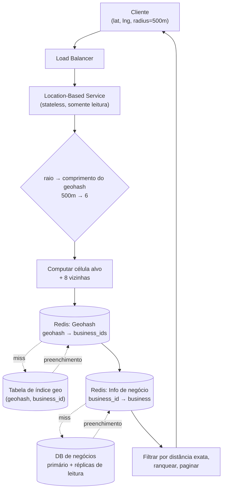

## Visão Geral

"Me mostre todo restaurante a até 5 km" é uma **consulta de intervalo espacial**, e é exatamente o formato de consulta em que um índice B-tree é ruim: uma B-tree ordena linhas ao longo de uma dimensão, mas uma localização são dois números que precisam ser restringidos *simultaneamente*. A correção não é um banco de dados melhor — é uma codificação que colapsa (latitude, longitude) em uma única chave ordenável, de modo que proximidade no mundo real vira adjacência em um índice. Este conceito cobre essas codificações (geohash, quadtree, S2 do Google) e a arquitetura de serviço construída sobre elas; os dois conceitos irmãos, [Nearby Friends](nearby-friends) e [Google Maps](designing-google-maps), assumem essa camada de indexação e constroem sobre ela em vez de derivá-la de novo.

## Requisitos

O enquadramento canônico é uma busca de proximidade estilo Yelp. Funcionalmente, o sistema precisa:

- **Retornar todos os negócios dentro de um raio** de uma latitude/longitude dada, onde o cliente escolhe o raio de um conjunto fixo (0,5 km, 1 km, 2 km, 5 km, 20 km) em vez de enviar um float arbitrário.
- **Deixar donos de negócio criar, atualizar e excluir negócios** — com um acordo explícito de que mudanças entram em vigor no *dia seguinte*, não em tempo real.
- **Servir uma página de detalhes do negócio** por id, com fotos, horários e avaliações.

O formato não funcional do sistema é o que impulsiona toda decisão posterior:

- **Intensivo em leitura a ponto de ser praticamente somente leitura no caminho quente.** Com 100M de usuários ativos diários fazendo ~5 buscas por dia, a busca sozinha é ~5.000 QPS, enquanto escritas são um gotejamento de edições de donos de negócio. O caminho de busca nunca escreve.
- **Negócios não se movem.** As coordenadas de um restaurante são efetivamente imutáveis, o que significa que o índice geoespacial pode ser pré-computado, cacheado agressivamente, e reconstruído em um job noturno. Esta é a maior diferença em relação a [Nearby Friends](nearby-friends), onde a localização de cada entidade muda a cada poucos segundos.
- **Baixa latência.** A busca é interativa; ela compete com a paciência do usuário, não com um SLA de batch.
- **Dados de localização são regulados.** GDPR e CCPA tornam coordenadas de usuário dados sensíveis, o que empurra para implantações regionais que mantêm consultas (e quaisquer logs delas) dentro de uma jurisdição.

Formulado como sistema: o serviço baseado em localização (LBS) que responde consultas de raio é stateless, somente leitura, e trivialmente escalável horizontalmente; o serviço de negócio que trata CRUD é um caminho de escrita separado e de baixo QPS. Mantê-los separados significa que uma explosão de buscas na hora do jantar nunca disputa recursos com escritas de donos de negócio.

## Por Que a Consulta Ingênua Falha

A primeira tentativa intuitiva é uma varredura de bounding box:

```sql
SELECT business_id, latitude, longitude
FROM business
WHERE latitude  BETWEEN :my_lat  - :radius AND :my_lat  + :radius
  AND longitude BETWEEN :my_long - :radius AND :my_long + :radius;
```

Sem índices isso é uma varredura completa de 200 milhões de linhas. Com índices em `latitude` e `longitude` ainda é lento, e o motivo vale a pena internalizar: **um índice B-tree só acelera uma dimensão por vez**. O planejador pode usar o índice de latitude para buscar todo negócio em uma faixa horizontal que envolve o planeta inteiro, ou o índice de longitude para buscar uma faixa vertical de polo a polo — cada um desses conjuntos contém milhões de linhas — e então ele precisa interseccioná-los. A interseção é pequena; as duas entradas não são. Um índice composto `(latitude, longitude)` também não resolve isso, porque a segunda coluna só é útil uma vez que a primeira esteja fixada a uma igualdade, e um intervalo em latitude nunca fixa nada.

Então a pergunta real se torna: *dados bidimensionais podem ser mapeados para uma dimensão de forma que preserve localidade?* Todo índice geoespacial é uma resposta a essa pergunta. De forma ampla, eles se dividem em esquemas estilo hash (grade uniforme, geohash, tiers cartesianos) e esquemas estilo árvore (quadtree, R-tree, S2) — mas o movimento subjacente é idêntico em todos eles: **subdividir o mapa em células, nomear cada célula com uma chave ordenável, e indexar pela chave.**

A versão ingênua desse movimento é uma **grade dividida uniformemente** — cortar o mundo em quadrados fixos. Ela falha por um motivo direto: negócios não estão distribuídos uniformemente. Uma célula cobre o centro de Manhattan e contém dezenas de milhares de negócios; a célula oceânica vizinha contém zero. O que é necessário são células pequenas onde os dados são densos e células grandes onde não são, mais uma forma barata de nomear as vizinhas de uma célula.

## Geohash

**Geohash** intercala os bits de latitude e longitude em uma única string, e é o mais amplamente implantado desses esquemas precisamente porque o resultado é apenas uma string que qualquer banco de dados consegue indexar e casar por prefixo.

A construção é uma busca binária repetida sobre o globo. Divida a longitude no meridiano de Greenwich: oeste é `0`, leste é `1`. Divida a latitude no equador: sul é `0`, norte é `1`. Depois divida qualquer metade em que você caiu, e de novo, alternando entre o bit de longitude e o bit de latitude a cada vez. Cada bit adicional reduz uma dimensão pela metade, então a célula encolhe geometricamente. A string de bits resultante é codificada em base32 para um identificador legível por humanos:

```
Google HQ:   1001 10110 01001 10000 11011 11010  →  9q9hvu
Facebook HQ: 1001 10110 01001 10001 10000 10111  →  9q9jhr
```

Duas propriedades derivam diretamente dessa construção:

- **Um prefixo é uma área.** `9q9h` é uma célula; `9q9hv` é uma das 32 subcélulas dentro dela. Truncar um geohash é dar zoom out. Isso torna "expandir a busca" uma operação de string: remover o último caractere e reconsultar.
- **O comprimento mapeia para um tamanho de célula conhecido**, então o raio que o usuário escolheu seleciona a precisão a consultar. Comprimento 6 é aproximadamente 1,2 km × 0,6 km, comprimento 5 é ~4,9 km quadrados, comprimento 4 é ~39 km × 20 km. Um raio de 0,5 km quer comprimento 6; 1–2 km quer comprimento 5; 5–20 km quer comprimento 4. Apenas os comprimentos 4–6 são interessantes para este produto — células mais curtas têm tamanho de continente, mais longas são menores que um prédio.

### O Problema de Fronteira

Geohash garante apenas uma direção da implicação: **um prefixo longo compartilhado implica que os pontos estão próximos.** O inverso é falso, e é aí que implementações ingênuas quebram.

Dois pontos podem estar a metros de distância e não compartilhar *nada*. Qualquer ponto logo a oeste do meridiano de Greenwich cai em um quadrante superior diferente de um ponto logo a leste dele, então o primeiríssimo bit difere e as strings divergem imediatamente. O exemplo de livro-texto está na França: La Roche-Chalais (`u000`) e Pomerol (`ezzz`) estão a cerca de 30 km de distância com zero prefixo comum. A mesma descontinuidade existe no equador e, de forma mais insidiosa, em *toda* linha de subdivisão em todo nível — uma borda de célula no meio de uma cidade separa dois negócios do outro lado da rua um do outro em `9q8zna` e `9q8znb`, ou pior, em células que diferem vários caracteres antes.

A consequência é que esta consulta está errada:

```sql
-- ERRADO: descarta silenciosamente todo negócio próximo do outro lado de uma borda de célula
SELECT * FROM geohash_index WHERE geohash LIKE '9q8zn%';
```

A correção padrão é **consultar a célula alvo mais suas oito vizinhas**. Geohashes vizinhos podem ser computados em tempo constante a partir do hash alvo (incrementar/decrementar os bits intercalados de latitude ou longitude e recodificar), então o LBS constrói uma lista de nove elementos e dispara nove buscas paralelas. Isso limita o erro: qualquer ponto dentro do raio tem garantia de estar na célula alvo ou em uma de suas vizinhas, desde que o tamanho da célula tenha sido escolhido para ser ao menos tão grande quanto o raio.

Se as nove células juntas ainda não produzirem resultados suficientes — uma consulta rural onde toda a vizinhança está vazia — a recuperação é **remover o último caractere do geohash e repetir**, o que multiplica a área coberta por 32 a cada vez até que negócios suficientes sejam encontrados.

## Quadtree

Uma **quadtree** ataca o problema de densidade de frente. Em vez de um tamanho de grade fixo, ela subdivide recursivamente uma região em quatro quadrantes e *continua subdividindo apenas onde os dados justificam* — a regra de parada usual é "nenhuma folha contém mais de N negócios" (N = 100 é uma escolha razoável):

```java
void buildQuadtree(TreeNode node) {
    if (countBusinessesInGrid(node) > 100) {
        node.subdivide();
        for (TreeNode child : node.getChildren()) {
            buildQuadtree(child);
        }
    }
}
```

Manhattan acaba profundamente subdividida em folhas minúsculas; o Pacífico permanece uma folha enorme. Responder uma consulta significa descer da raiz até a folha contendo a origem da busca, retornando seus negócios, e trazendo folhas vizinhas se mais resultados forem necessários.

O fato operacional crítico é que **uma quadtree é uma estrutura de dados em memória, não um banco de dados**. Ela vive na memória de processo de cada servidor LBS e é construída na inicialização ao transmitir a tabela de negócios. Para 200M de negócios isso são ~2M nós folha (832 bytes cada: quatro coordenadas de canto de 8 bytes mais 100 ids de negócio de 8 bytes) e ~0,67M nós internos (64 bytes cada: cantos mais quatro ponteiros de filho), então aproximadamente **1,7 GB** — confortavelmente o suficiente de RAM para um servidor. O tempo de construção é O((N/100)·log(N/100)), que são *minutos* para 200M de negócios.

Esse custo de inicialização é o verdadeiro imposto do design, e ele dita a mecânica de implantação:

- Um servidor não pode atender tráfego enquanto sua árvore está sendo construída, então releases precisam ser implantados de forma **incremental**, um pequeno subconjunto de servidores por vez, ou o cluster fica intermitente.
- Blue/green deployment funciona, mas significa que um cluster inteiramente novo sobrecarrega o banco de dados de negócios simultaneamente para hidratar suas árvores.
- Manter a árvore atualizada significa reconstruí-la periodicamente servidor a servidor, o que deixa alguns servidores atendendo dados ligeiramente obsoletos — aceitável aqui precisamente porque os requisitos já concederam que edições de negócio entram em vigor no dia seguinte.
- Mutar a árvore no local em vez disso é possível, mas arrasta locking entre as threads leitoras e rebalanceamento de árvore quando uma folha transborda; ambos são o tipo de complexidade que só se paga quando os dados de fato mudam com frequência.

A capacidade distintiva são as **consultas de k-vizinhos-mais-próximos**. Geohash responde "o que está dentro do raio R"; uma quadtree naturalmente responde "me dê os 20 postos de gasolina mais próximos" porque o critério de subdivisão já é uma contagem, então a travessia pode se expandir até ter k resultados independentemente de quão longe eles estejam. Essa é a consulta que um motorista com o tanque vazio no deserto realmente quer.

## Google S2

**S2** é a evolução de nível de produção de ambas as ideias e o que move o Google Maps, o matching do Tinder, e boa parte da indústria. Em vez de projetar a terra em uma grade plana, o S2 projeta a esfera nas seis faces de um cubo circunscrito, subdivide cada face em uma quadtree, e então numera as células ao longo de uma **curva de Hilbert** — uma curva que preenche espaço cuja propriedade definidora é que pontos próximos na curva 1D estão próximos no espaço 2D. O resultado é um id de célula de 64 bits onde a localidade é preservada de forma muito mais consistente do que o intercalamento de bits do geohash, sem as descontinuidades brutais do geohash no meridiano e no equador.

Duas capacidades do S2 importam além da busca de proximidade bruta. Seu **region coverer** pega uma forma arbitrária — um círculo, um polígono, uma zona de entrega — e retorna um conjunto de células cobrindo-a, escolhendo *níveis* de célula adaptativamente sujeito a um orçamento de `min_level` / `max_level` / `max_cells`; você obtém uma cobertura justa feita de algumas células grandes no interior e muitas células pequenas ao longo da fronteira, em vez da precisão tamanho-único do geohash. Isso por sua vez torna o S2 o substrato natural para **geofencing**: definir um perímetro virtual (uma zona escolar, um bairro, uma área de precificação dinâmica) como um conjunto de células, e testar "esse usuário está dentro?" se torna uma checagem de prefixo no id de célula dele.

O trade-off é a complexidade. S2 é uma biblioteca grande com superfície conceitual real; em uma entrevista, geohash ou quadtree é a escolha que você consegue explicar de ponta a ponta, com S2 citado como o que você usaria em produção.

## Caminho da Consulta

Juntando as peças, uma busca se resolve inteiramente a partir do cache no caso comum:



O LBS mapeia o raio solicitado para um comprimento de geohash, computa as nove células relevantes, dispara buscas **paralelas** pelos ids de negócio delas, hidrata os ids resultantes em objetos de negócio completos, e então faz o filtro de distância haversine exata e o ranking em código de aplicação. Esse último passo importa: o índice geo é um *gerador de candidatos* grosseiro, não a resposta. Células são retângulos e a consulta é um círculo, então o índice retorna em excesso e o serviço apara.

Filtros subsequentes ("só restaurantes", "só aberto agora") também entram aqui. Como uma célula contém um número limitado de negócios, o conjunto de candidatos é pequeno o suficiente para que filtrar por atributos de negócio hidratados após a busca no índice seja barato — sem necessidade de codificar o tipo de negócio no próprio índice.

## Escalando o Índice

As duas tabelas escalam de forma diferente, e confundi-las é um erro comum.

**A tabela de negócios** contém linhas de detalhe para 200M de negócios e não caberia em um servidor. Ela particiona limpamente por `business_id` — todo acesso é uma busca pontual por id, a chave tem alta cardinalidade, e a carga se espalha uniformemente. Use [Consistent Hashing](consistent-hashing) para o mapeamento de shard para que adicionar capacidade remapeie apenas uma fração das chaves em vez de reembaralhar o dataset inteiro.

**A tabela de índice geoespacial** deveria ser modelada como `(geohash, business_id)` — uma linha por negócio por célula, com uma chave primária composta — em vez de uma linha por geohash contendo um array JSON de ids. A versão em array força um read-modify-write e um lock de linha para toda inserção ou exclusão, mais uma varredura do array para checar duplicatas; a versão linha-por-negócio torna adicionar e remover operações de linha única sem nenhum locking.

Aqui está a parte contraintuitiva: **essa tabela provavelmente não deveria ser particionada.** Todo o índice geoespacial é da ordem de alguns gigabytes — ele cabe no conjunto de trabalho de um servidor de banco de dados moderno. Particioná-lo empurraria a lógica de roteamento para a camada de aplicação e não compraria nada, porque a pressão é sobre throughput de *leitura*, não tamanho de dados. A resposta certa é uma frota de **réplicas de leitura**: os mesmos dados em todo lugar, carga espalhada entre elas, sem lógica de particionamento. Recorra a sharding quando os dados não couberem; recorra a réplicas quando as leituras não couberem.

## Cacheando Geografia Quente

Cachear aqui vale uma justificativa explícita em vez de um reflexo — o dataset é pequeno o suficiente para residir no buffer pool do banco de dados de qualquer forma, então as consultas não são limitadas por I/O e réplicas já lidam com throughput. (Veja [Caching Strategies and CDNs](caching-strategies-and-cdns) para o enquadramento geral.) Onde um cache de fato ganha seu espaço é em cortar latência por consulta e absorver o pico da hora do jantar em áreas densas sem superprovisionar réplicas.

A vitória sutil é **a chave do cache**. Coordenadas brutas são uma chave terrível: o GPS do telefone é uma estimativa que oscila metros entre leituras mesmo para um usuário parado, então toda requisição daria miss. A célula do geohash *é* a chave — todo usuário parado em qualquer lugar dessa célula produz a mesma string, então o conjunto de resultados da célula é computado uma vez e servido a todos nela. Indexação geoespacial e design de chave de cache acabam sendo o mesmo problema.

Dois caches, ambos alimentados pelos mesmos dados pré-computados:

| Cache | Chave | Valor |
|---|---|---|
| Geohash | `geohash` (pré-computado nos comprimentos 4, 5 e 6) | lista de `business_id` na célula |
| Info de negócio | `business_id` | o objeto de negócio hidratado |

Pré-computar as três precisões custa aproximadamente 8 bytes × 200M de negócios × 3 precisões ≈ **5 GB** — o suficiente para um servidor Redis, o que significa que o índice inteiro pode ser replicado para toda região em vez de particionado. Como os dados de negócio mudam sob um acordo de dia seguinte, um job noturno os atualiza; o único risco é que expirar milhões de chaves no mesmo instante causa um stampede no banco de dados, então escalone os TTLs.

Implantação regional fecha o ciclo: rode o LBS e suas cópias Redis em múltiplas regiões e zonas de disponibilidade para que usuários acessem infraestrutura próxima, mercados densos como Japão e Coreia ganhem sua própria capacidade, e jurisdições com leis de residência de dados possam ser atendidas por uma região que mantém suas consultas de localização locais.

## Trade-offs

- **Geohash é trivial de implementar e atualizar; quadtree se adapta à densidade e responde consultas k-mais-próximos** — células de geohash têm tamanho fixo em uma precisão fixa, então uma célula densa no centro retorna milhares de candidatos enquanto uma rural retorna nenhum, enquanto uma quadtree subdivide exatamente onde os dados estão. Pague a complexidade de construir a árvore apenas se precisar de k-NN ou tratamento genuíno de densidade desigual.
- **Toda consulta de geohash precisa incluir as oito células vizinhas, o que triplica-para-nove as buscas** — isso não é um ajuste opcional, é um requisito de corretude, porque dois pontos a metros de distância podem cair em células sem prefixo compartilhado algum. A mitigação é que as nove buscas são independentes e podem ser disparadas em paralelo.
- **O custo de inicialização de minutos de uma quadtree transforma um deploy rotineiro em um evento de capacidade** — servidores não podem atender enquanto constroem sua árvore, então rolling restarts precisam ser incrementais e blue/green significa que um cluster inteiramente novo atinge o banco de dados de uma vez. Geohash não tem custo equivalente porque o índice vive no banco de dados, não no processo.
- **Replique o índice geo, particione a tabela de negócios** — o índice geo é pequeno o suficiente para caber em um servidor e é limitado por throughput de leitura, então réplicas vencem shards; a tabela de negócios é grande e acessada por busca pontual, então shards vencem réplicas. Aplicar a ferramenta errada a qualquer um deles adiciona complexidade de roteamento ou deixa throughput na mesa.
- **Cachear por célula de geohash em vez de por coordenadas converte uma taxa de miss de quase 100% em uma taxa de hit de quase 100%** — mas também significa que todo usuário na célula vê resultados computados a partir do conjunto de candidatos agnóstico ao centro da célula, então o filtro de distância exata e o ranking precisam permanecer na camada de aplicação, por requisição, após a leitura do cache.
- **Aceitar frescor de dia seguinte para dados de negócio é o que torna toda a estratégia de cache e reconstrução de índice viável** — isso licencia pré-computação noturna, reconstruções rolantes tolerantes a obsolescência, e TTLs longos. Negocie esse requisito explicitamente; sem ele, a maior parte dessa arquitetura precisa ser redesenhada em torno de atualizações incrementais de índice.

## Perguntas de Entrevista

- Por que adicionar índices B-tree em `latitude` e `longitude` não corrige a consulta de bounding box, e o que especificamente é caro no plano que o banco de dados escolhe?
- Dois negócios estão do outro lado da rua um do outro, mas seus geohashes não compartilham prefixo. Explique como isso acontece e o que a camada de consulta precisa fazer a respeito.
- Quando você escolheria uma quadtree em vez de geohash, e qual custo operacional você está aceitando em troca?
- A tabela de índice geo tem apenas ~2 GB. Argumente a favor de replicá-la em vez de particioná-la, e descreva a condição que inverteria sua resposta.
- Por que coordenadas GPS brutas são uma chave de cache ruim, e qual propriedade do geohash faz dele uma boa?

## Referências

- [Alex Xu e Sahn Lam, "System Design Interview – An Insider's Guide, Volume 2" (ByteByteGo, 2022) — Capítulo 1, "Proximity Service"](https://bytebytego.com)
- [Google, "S2 Geometry Library" — hierarquia de células, curva de Hilbert, e region coverer](https://s2geometry.io/)
- [Movable Type Scripts, "Geohash" — intercalamento de bits, tabela de precisão, e cálculo de vizinhos](https://www.movable-type.co.uk/scripts/geohash.html)
- [Yext Engineering, "Improved Location Caching with Quadtrees"](https://engblog.yext.com/post/geolocation-caching)
