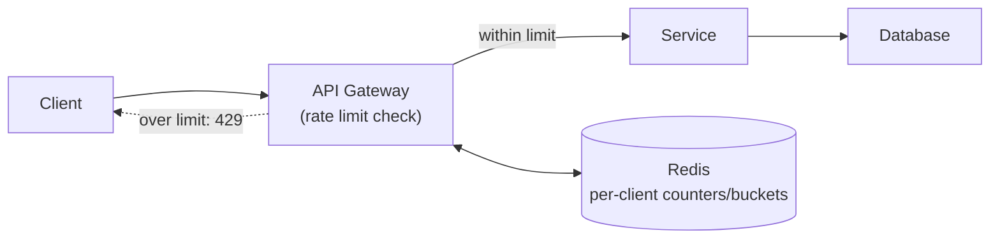

## Overview

Every backend resource — CPU, database connections, bandwidth — is finite, and nothing about HTTP stops a client from sending requests faster than a system can absorb them, whether out of a bug (a retry loop with no backoff), a traffic spike, or deliberate abuse. **Rate limiting** caps how many requests a given client can make in a given time window, returning a `429 Too Many Requests` once they exceed it, so that one client's excess demand doesn't degrade the experience of every other client sharing the same infrastructure.

## Fixed Window Counter

The simplest approach counts requests in discrete, non-overlapping time windows — e.g. "at most 100 requests per user per minute":

```
key = f"ratelimit:{user_id}:{current_minute}"
count = cache.incr(key)
cache.expire(key, 60)  # only set on first increment
if count > 100:
    return 429
```

This is cheap (one counter per user per window, naturally expiring) but has a boundary problem: a client can send 100 requests in the last second of one window and another 100 in the first second of the next, bursting 200 requests in roughly two seconds while technically staying within the stated limit for each window.

## Sliding Window

A sliding window avoids the boundary burst by counting requests over a continuously moving interval rather than resetting at fixed boundaries. One common implementation keeps a timestamped log of recent requests and counts how many fall within the last N seconds:

```
key = f"ratelimit:{user_id}"
now = current_timestamp()
cache.zadd(key, {now: now})               # log this request
cache.zremrangebyscore(key, 0, now - 60)   # drop entries older than the window
count = cache.zcard(key)
if count > 100:
    return 429
```

This is more accurate than a fixed window but costs more to maintain — it's storing and pruning a log per client instead of a single counter, which matters at very high request volumes. A cheaper approximation (the *sliding window counter*) blends the current and previous fixed-window counts, weighted by how far into the current window the request falls, trading a small amount of precision for close to fixed-window's cost.

## Token Bucket

**Token bucket** allows short bursts while still enforcing a long-run average rate. Each client has a bucket that refills with tokens at a fixed rate up to some capacity; every request consumes one token, and a request with no tokens available is rejected:

```
bucket.capacity = 20        # max burst size
bucket.refill_rate = 10     # tokens added per second

on request:
    refill_tokens_since_last_check(bucket)
    if bucket.tokens >= 1:
        bucket.tokens -= 1
        allow()
    else:
        return 429
```

This is the algorithm behind most "burst-friendly" API limits (and, structurally, the same idea behind LLM API usage limits sold as a token budget per period): a client that's been idle can spend a burst of accumulated tokens all at once, but can't sustain a rate above the refill rate indefinitely. It's a better fit than fixed or sliding windows for workloads where occasional bursts are legitimate (a user opening an app and firing several requests at once) but sustained high rates are not.

## Where the Limiter Lives

A rate limiter needs a fast, shared place to keep counters that every server instance can read and write — which is exactly what an in-memory key-value cache like Redis is built for. The check itself typically happens at or near the edge, before a request does any real work:



Enforcing the limit at the gateway (rather than inside each downstream service) means a client that's over their limit gets rejected before consuming any database connections, CPU, or downstream capacity at all — the whole point of rate limiting is to protect resources *behind* the check, so the check has to happen before those resources are touched. Some cloud providers and CDNs also offer rate limiting at the edge, ahead of the gateway entirely, which stops abusive traffic even further out.

## Identifying the Client

A limiter is only as good as its ability to tell clients apart. Keying on IP address is the simplest option but breaks down behind NAT or a shared corporate proxy, where many legitimate users share one IP; keying on an authenticated user id or API key is more precise but only works for authenticated traffic, so unauthenticated endpoints (like the login endpoint itself) usually still need an IP-based fallback limit to prevent credential-stuffing attacks against the one endpoint that can't require a token to identify the caller.

## Trade-offs

- **Fixed window is the cheapest to implement but allows a 2x burst at window boundaries** — acceptable for coarse, generous limits; not acceptable when the limit itself is the primary defense against abuse.
- **Sliding window (log-based) is accurate but costs more storage and compute per check** — a log per client that must be pruned on every request doesn't scale as cheaply as a single counter, so it's typically reserved for limits worth the extra precision.
- **Token bucket tolerates legitimate bursts, but choosing capacity and refill rate is a product decision, not just a technical one** — too generous a burst allowance defeats the purpose of the limit; too strict rejects normal usage patterns like a user opening the app and firing off several requests at once.
- **Enforcing at the gateway protects downstream resources but centralizes a single point that must stay fast** — a rate limiter that itself becomes slow (e.g. because its shared cache is overloaded) turns a protective mechanism into the bottleneck it was meant to prevent.

## Interview Questions

- What specific failure mode does a fixed-window counter have at window boundaries, and how does sliding window fix it?
- Why is token bucket a better fit than a strict per-second cap for a workload with legitimate bursts?
- Why does rate limiting need a shared store like Redis instead of an in-memory counter local to each server instance?
- Why should the rate limit check happen at the gateway rather than inside the service actually doing the work?
- Why can't a login endpoint rely solely on a per-user rate limit, and what's the usual fallback?

## References

- [Cloudflare Learning Center — What is Rate Limiting?](https://www.cloudflare.com/learning/bots/what-is-rate-limiting/)
- [Stripe Engineering — Scaling your API with rate limiters](https://stripe.com/blog/rate-limiters)
- [Redis Documentation — Rate limiting patterns](https://redis.io/glossary/rate-limiting/)
- [AWS — Throttling a tiered, multi-tenant REST API](https://aws.amazon.com/blogs/compute/throttling-a-tiered-multi-tenant-rest-api-at-scale-using-api-gateway/)
