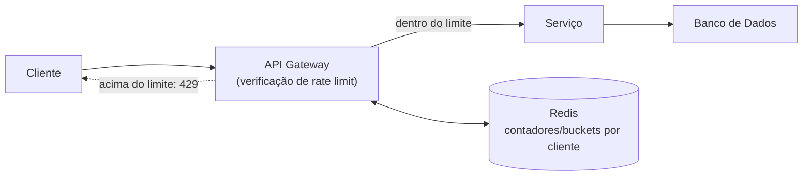

## Visão Geral

Todo recurso de backend — CPU, conexões de banco de dados, banda — é finito, e nada no HTTP impede um cliente de enviar requisições mais rápido do que um sistema consegue absorver, seja por um bug (um loop de retry sem backoff), um pico de tráfego, ou abuso deliberado. **Rate limiting** limita quantas requisições um determinado cliente pode fazer em uma janela de tempo determinada, retornando um `429 Too Many Requests` quando ele a excede, para que a demanda excessiva de um cliente não degrade a experiência de todos os outros clientes compartilhando a mesma infraestrutura.

## Contador de Janela Fixa

A abordagem mais simples conta requisições em janelas de tempo discretas e não sobrepostas — ex.: "no máximo 100 requisições por usuário por minuto":

```
key = f"ratelimit:{user_id}:{current_minute}"
count = cache.incr(key)
cache.expire(key, 60)  # definido apenas no primeiro incremento
if count > 100:
    return 429
```

Isso é barato (um contador por usuário por janela, expirando naturalmente) mas tem um problema de borda: um cliente pode enviar 100 requisições no último segundo de uma janela e outras 100 no primeiro segundo da próxima, disparando 200 requisições em aproximadamente dois segundos enquanto tecnicamente permanece dentro do limite declarado para cada janela.

## Janela Deslizante

Uma janela deslizante evita o pico de borda contando requisições em um intervalo continuamente móvel em vez de resetar em limites fixos. Uma implementação comum mantém um log com timestamp das requisições recentes e conta quantas caem dentro dos últimos N segundos:

```
key = f"ratelimit:{user_id}"
now = current_timestamp()
cache.zadd(key, {now: now})               # registra esta requisição
cache.zremrangebyscore(key, 0, now - 60)   # remove entradas mais antigas que a janela
count = cache.zcard(key)
if count > 100:
    return 429
```

Isso é mais preciso que uma janela fixa mas custa mais para manter — está armazenando e podando um log por cliente em vez de um único contador, o que importa em volumes muito altos de requisição. Uma aproximação mais barata (o *contador de janela deslizante*) combina as contagens da janela fixa atual e anterior, ponderadas por quão longe na janela atual a requisição cai, trocando um pouco de precisão pelo custo próximo ao de janela fixa.

## Token Bucket

**Token bucket** permite rajadas curtas enquanto ainda impõe uma taxa média de longo prazo. Cada cliente tem um bucket que se reabastece com tokens a uma taxa fixa até alguma capacidade; toda requisição consome um token, e uma requisição sem tokens disponíveis é rejeitada:

```
bucket.capacity = 20        # tamanho máximo de rajada
bucket.refill_rate = 10     # tokens adicionados por segundo

on request:
    refill_tokens_since_last_check(bucket)
    if bucket.tokens >= 1:
        bucket.tokens -= 1
        allow()
    else:
        return 429
```

Este é o algoritmo por trás da maioria dos limites de API "tolerantes a rajadas" (e, estruturalmente, a mesma ideia por trás dos limites de uso de APIs de LLM vendidos como um orçamento de tokens por período): um cliente que esteve ocioso pode gastar uma rajada de tokens acumulados de uma vez, mas não pode sustentar uma taxa acima da taxa de reabastecimento indefinidamente. É um encaixe melhor que janelas fixas ou deslizantes para cargas de trabalho onde rajadas ocasionais são legítimas (um usuário abrindo um app e disparando várias requisições de uma vez) mas taxas altas sustentadas não são.

## Onde o Limitador Vive

Um rate limiter precisa de um lugar rápido e compartilhado para manter contadores que toda instância de servidor consegue ler e escrever — que é exatamente para o que um cache chave-valor em memória como o Redis foi construído. A verificação em si tipicamente acontece na borda ou perto dela, antes de uma requisição fazer qualquer trabalho real:



Aplicar o limite no gateway (em vez de dentro de cada serviço downstream) significa que um cliente acima do seu limite é rejeitado antes de consumir qualquer conexão de banco de dados, CPU, ou capacidade downstream — todo o propósito do rate limiting é proteger recursos *atrás* da verificação, então a verificação precisa acontecer antes desses recursos serem tocados. Alguns provedores de nuvem e CDNs também oferecem rate limiting na borda, antes do gateway completamente, o que barra tráfego abusivo ainda mais cedo.

## Identificando o Cliente

Um limitador só é tão bom quanto sua capacidade de distinguir clientes entre si. Chavear por endereço IP é a opção mais simples mas falha atrás de NAT ou de um proxy corporativo compartilhado, onde muitos usuários legítimos compartilham um IP; chavear por um id de usuário autenticado ou chave de API é mais preciso mas só funciona para tráfego autenticado, então endpoints não autenticados (como o próprio endpoint de login) geralmente ainda precisam de um limite de fallback baseado em IP para prevenir ataques de credential-stuffing contra o único endpoint que não pode exigir um token para identificar o chamador.

## Trade-offs

- **Janela fixa é a mais barata de implementar mas permite uma rajada de 2x nos limites de janela** — aceitável para limites grosseiros e generosos; não aceitável quando o próprio limite é a defesa primária contra abuso.
- **Janela deslizante (baseada em log) é precisa mas custa mais armazenamento e computação por verificação** — um log por cliente que deve ser podado a cada requisição não escala tão barato quanto um único contador, então tipicamente é reservada para limites que valem a precisão extra.
- **Token bucket tolera rajadas legítimas, mas escolher capacidade e taxa de reabastecimento é uma decisão de produto, não apenas técnica** — uma tolerância de rajada muito generosa derrota o propósito do limite; muito estrita rejeita padrões de uso normais como um usuário abrindo o app e disparando várias requisições.
- **Aplicar no gateway protege recursos downstream mas centraliza um ponto único que precisa se manter rápido** — um rate limiter que ele mesmo se torna lento (ex.: porque seu cache compartilhado está sobrecarregado) transforma um mecanismo protetor no gargalo que deveria prevenir.

## Perguntas de Entrevista

- Qual modo de falha específico um contador de janela fixa tem nos limites de janela, e como a janela deslizante o corrige?
- Por que token bucket é um encaixe melhor que um teto estrito por segundo para uma carga de trabalho com rajadas legítimas?
- Por que rate limiting precisa de um store compartilhado como o Redis em vez de um contador em memória local a cada instância de servidor?
- Por que a verificação de rate limit deveria acontecer no gateway em vez de dentro do serviço que realmente faz o trabalho?
- Por que um endpoint de login não pode depender apenas de um rate limit por usuário, e qual é o fallback usual?

## Referências

- [Cloudflare Learning Center — What is Rate Limiting?](https://www.cloudflare.com/learning/bots/what-is-rate-limiting/)
- [Stripe Engineering — Scaling your API with rate limiters](https://stripe.com/blog/rate-limiters)
- [Redis Documentation — Rate limiting patterns](https://redis.io/glossary/rate-limiting/)
- [AWS — Throttling a tiered, multi-tenant REST API](https://aws.amazon.com/blogs/compute/throttling-a-tiered-multi-tenant-rest-api-at-scale-using-api-gateway/)
