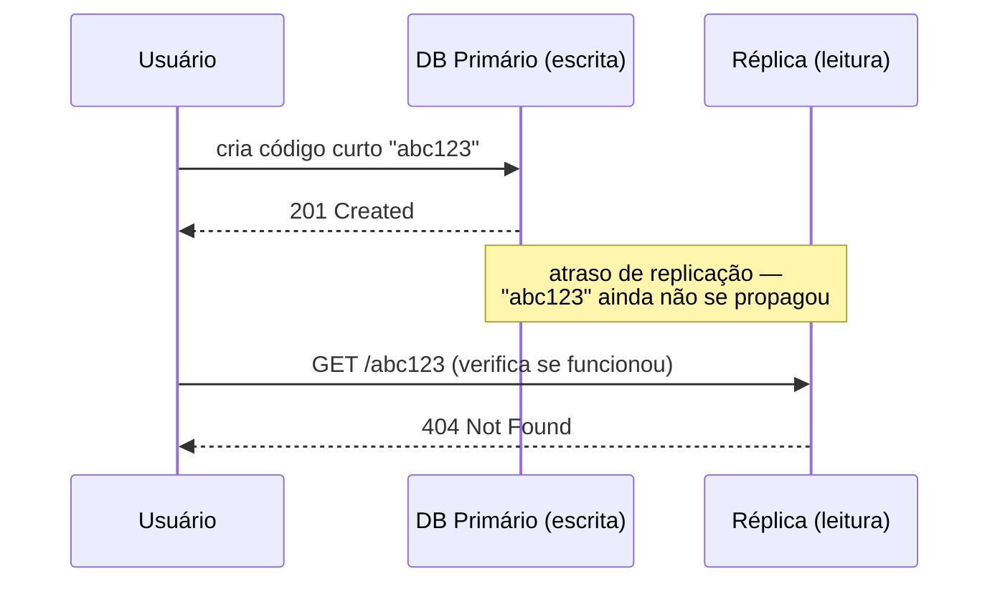

## Visão Geral

Um sistema intensivo em leitura — digamos, um encurtador de URL com uma proporção de leitura para escrita de 10:1 — tem uma otimização aparentemente óbvia disponível: apontar escritas para um banco de dados e leituras para outro, de modo que cada um possa ser escalado e ajustado independentemente. Esta é uma técnica real e bem estabelecida (réplicas de leitura e, na sua ponta mais estruturada, CQRS), mas também é uma das ideias mais fáceis de recorrer *antes* de estabelecer se o problema específico realmente precisa disso — e um design que particiona o armazenamento sem conseguir dizer por quê, concretamente, tende a atrair exatamente a mesma resistência de um entrevistador humano que atrairia de uma ferramenta automatizada de revisão de design: parece arquitetura, mas na verdade são duas fontes de verdade que agora precisam concordar entre si.

## A Jogada Ingênua: Um Banco de Dados Por Padrão de Acesso

Dado um encurtador de URL com tráfego pesado de leitura, um primeiro esboço atraente é: escritas (criar códigos curtos) vão para um banco SQL por suas garantias de integridade na restrição de unicidade do `code`, e leituras (resolver um código curto para sua URL alvo) vão para um armazenamento NoSQL separado por seu throughput de I/O em buscas simples por chave:

```
Cliente -> Servidor de App -> escritas -> SQL DB (fonte de verdade para códigos)
                            -> leituras  -> NoSQL DB (cópia replicada, otimizada para buscas)
```

O problema não é que isso seja *impossível* — é que introduz um segundo armazenamento cujo trabalho inteiro é permanecer sincronizado com o primeiro, e o design agora deve responder perguntas que não tinha antes: como os dados vão do SQL para o NoSQL (um pipeline de CDC? Um dual write da aplicação? Veja o conceito **Transactional Outbox Pattern** para entender por que um dual write ingênuo é inseguro), quão atrasada a cópia NoSQL pode legalmente estar, e o que acontece em uma requisição de redirecionamento para um código que acabou de ser criado e ainda não se propagou.

## Por Que um Entrevistador Real (ou um Juiz Automatizado) Resiste

Para uma simples busca chave→URL, um único banco de dados relacional mais um cache na frente dele (veja **Caching Strategies and CDNs**) resolve o mesmo problema de escalonamento de leitura com uma fonte de verdade em vez de duas, e nenhum protocolo de consistência entre bancos de dados para projetar, testar e operar. A crítica não é "nunca particione armazenamento de leitura e escrita" — é que a partição precisa ser justificada por um *padrão* de leitura que o banco de dados do lado de escrita genuinamente não consegue servir bem (busca full-text, travessia de grafo, agregação complexa), não adotada por padrão porque "leituras e escritas são operações diferentes". Um redirecionamento de URL é uma busca por chave única; esse é precisamente o caso que um cache na frente do banco de dados primário já trata, tornando um segundo banco de dados, replicado independentemente, um aumento injustificado da superfície de falha do sistema sem benefício correspondente.

## Atraso de Réplica e o Que Ele Quebra

Qualquer réplica de leitura — replicação por streaming de SQL para SQL ou um pipeline entre armazenamentos — tem um atraso de propagação real, e o problema de read-your-own-writes é o modo de falha concreto que esse atraso causa:



Este não é um caso extremo hipotético em um cenário de entrevista — é a próxima ação literal ("meu write funcionou?") que a maioria dos usuários toma depois de escrever algo. Mitigações comuns: rotear as próprias leituras de um usuário para o primário por uma janela curta após a escrita (afinidade de sessão com o primário), fazer o cliente devolver um log sequence number / timestamp de commit e fazer a réplica esperar até ter alcançado esse ponto antes de responder (consistência "read-your-writes"), ou aceitar a obsolescência e projetar a UI em torno dela (por exemplo, mostrar o código curto recém-criado de forma otimista sem buscá-lo de volta pelo caminho de leitura).

## CQRS-Lite: Separando Modelos, Não Necessariamente Bancos de Dados

Command Query Responsibility Segregation, em sua forma completa (formulação original de Greg Young), separa o *modelo de escrita* (valida comandos, impõe invariantes) do *modelo de leitura* (desnormalizado, moldado exatamente para as consultas que a UI precisa) — e, criticamente, essa separação não exige duas *tecnologias* de banco de dados diferentes, ou mesmo duas instâncias de banco de dados diferentes. Uma abordagem "CQRS-lite" que a maioria dos sistemas realmente precisa:

- Mesmo banco de dados, **schemas** diferentes: tabelas normalizadas para escritas, views materializadas/desnormalizadas para leituras, atualizadas em um cronograma ou via triggers.
- Mesma tecnologia de banco de dados, **instâncias** separadas: um primário para escritas, réplicas de leitura por streaming (ainda SQL, ainda o mesmo motor) para leituras — o padrão de trabalho por trás da maioria dos "read/write splitting" em produção, e um compromisso muito menor do que um pipeline de sincronização entre tecnologias diferentes.
- **Armazenamentos** genuinamente diferentes (primário SQL + índice de leitura Elasticsearch, ou primário SQL + um banco de dados de grafo para consultas de relacionamento) — justificados especificamente quando o padrão de leitura é algo que o motor do lado de escrita é estruturalmente ruim em fazer, ex.: busca full-text ou travessia de grafo multi-salto, não "leituras acontecem com mais frequência que escritas".

O caso do encurtador de URL se encaixa no máximo nos primeiros dois níveis; recorrer ao terceiro nível para uma simples busca por chave é o over-engineering sobre o qual a crítica anterior trata.

## Quando Particionar o Armazenamento Realmente É Justificado

- A consulta "quem esse usuário segue, ranqueado por atividade recente" de um feed social precisa de um formato de fan-out/agregação que um schema OLTP normalizado trata mal em escala — um armazenamento de leitura separado e feito sob medida (ou um cache de feed pré-computado) está ganhando seu espaço aqui.
- Um catálogo de produtos com busca facetada (filtrar por faixa de preço, marca, avaliação, em estoque) é um padrão de acesso genuinamente diferente de "inserir este novo produto" — Elasticsearch ou similar ao lado do banco de dados SQL que é o sistema de registro é padrão, não over-engineering.
- Um dashboard de analytics consultando agregados sobre milhões de linhas não deveria rodar essas consultas contra o mesmo banco de dados que atende o tráfego de usuário ao vivo, independentemente da proporção leitura/escrita — um armazenamento OLAP separado ou uma réplica de leitura dedicada à carga analítica protege o caminho transacional de consultas de varredura de longa duração, independentemente da questão de CQRS.

Em cada um desses casos, a justificativa é um *formato de consulta específico que o armazenamento primário não consegue servir bem* — o mesmo teste que uma simples busca key-value (o redirecionamento do encurtador de URL) reprova.

## Trade-offs

- **Toda réplica ou modelo de leitura é uma janela de obsolescência que agora você precisa projetar em torno, não apenas aceitar** — "eventualmente consistente" não é uma ressalva que você pode deixar não declarada; o limite (milissegundos? segundos?) determina se problemas de read-your-writes são cosméticos ou de fato quebram fluxos voltados ao usuário.
- **Um segundo armazenamento dobra sua superfície operacional por um benefício que precisa ser medido, não presumido** — migrações de schema, backups, monitoramento, e modos de falha (veja **PostgreSQL Split-Brain Prevention** e **PostgreSQL Quorum Voting and Connection Indirection** para o que "outro nó pode divergir do primário" realmente significa operacionalmente) agora existem em dobro.
- **CQRS-lite (mesmo motor, réplicas de leitura separadas) captura a maior parte do benefício de escalonamento que a maioria dos sistemas pede, a uma fração do custo de uma partição entre tecnologias diferentes** — recorrer diretamente a "SQL para escritas, NoSQL para leituras" sem primeiro perguntar se uma réplica do mesmo motor mais um cache já resolve o problema declarado é o padrão específico do qual desconfiar, tanto nos seus próprios designs quanto em revisão.

## Perguntas de Entrevista

- Para um encurtador de URL, qual consulta de leitura específica justificaria um motor de armazenamento diferente no lado de leitura, versus o que um cache na frente do primário já trata?
- O que é o problema de read-your-writes, e nomeie duas formas de mitigá-lo sem abrir mão da replicação inteiramente.
- Qual é a diferença entre "CQRS" como Greg Young o definiu e "read/write splitting" como a maioria dos sistemas o implementa?
- Dê um exemplo de um padrão de leitura onde um armazenamento de leitura separado e feito sob medida é genuinamente justificado, e explique o que o torna diferente de uma simples busca por chave.
- Se solicitado a adicionar um segundo armazenamento de dados a um design, qual é a primeira pergunta que você deveria conseguir responder antes de propô-lo?

## Referências

- Martin Fowler, ["CQRS"](https://martinfowler.com/bliki/CQRS.html) (bliki)
- microservices.io — [Pattern: CQRS](https://microservices.io/patterns/data/cqrs.html)
- [PostgreSQL Documentation — High Availability, Load Balancing, and Replication](https://www.postgresql.org/docs/current/warm-standby.html)
- Martin Kleppmann, [*Designing Data-Intensive Applications*](https://www.oreilly.com/library/view/designing-data-intensive-applications/9781491903063/) (O'Reilly, 2017) — Capítulo 5, "Replication"
