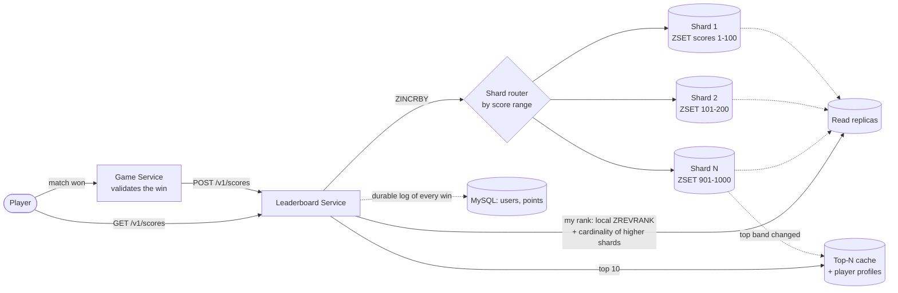

## Overview

A mobile game leaderboard looks trivial until you write down the two queries it has to serve: *"who are the top 10?"* and *"where am I?"* — both against a dataset of millions of scores that is being mutated thousands of times per second. The first query is cheap if you keep the data sorted; the second one is the trap, because a rank is not a stored value, it's a **count of everyone ahead of you**, and computing it in a relational database means either a full scan or an index whose maintenance cost you pay on every single score change. This is a data structure problem wearing a system design costume, and the interview signal is whether you recognize that before you start drawing boxes.

## Functional Requirements

Scope the problem to three operations, in priority order:

- **Update a player's score** when they win a match — server-authoritative. The client must never set its own score; the game server validates the win and calls the leaderboard service, otherwise a proxy in the middle turns the leaderboard into a fiction.
- **Fetch the top 10** for the current tournament.
- **Fetch one player's exact rank**, and (a natural extension) the four players immediately above and below them — the "you're 361st, here's your neighborhood" view that makes a leaderboard feel personal rather than hopeless.

Leaderboards are usually time-segmented: a new tournament each month means a new leaderboard, and last month's becomes cold historical data. That segmentation is a gift — it bounds the size of the hot dataset and gives you a natural key (`leaderboard_2026_08`) instead of one ever-growing structure.

## Non-Functional Requirements and Scale

- **Real-time score updates.** A win must be reflected in the ranking within a second or so. A nightly batch job that recomputes ranks is a different (and much easier) system, and it is not this one.
- **Eventual consistency on exact rank is acceptable.** During a burst of concurrent scoring, thousands of players are passing each other every second. A rank that is a few hundred milliseconds stale is indistinguishable from a fresh one, because by the time it renders it's stale anyway. Say this out loud in an interview — it unlocks caching and replication that a strict-consistency framing would forbid.
- **Availability over strict correctness.** Serving a slightly old top 10 beats serving an error page.

Run the numbers before choosing anything. At 5 million DAU with an even spread you get ~50 players active per second; assume peaks are 5× average and you're planning for ~250. If each player finishes 10 matches a day, score-update QPS is ~500 average and **~2,500 at peak**. Top-10 fetches, loaded once when a player opens the app, are only ~50 QPS. Storage is equally modest: a 24-character user id plus a 2-byte score is 26 bytes, so 25 million monthly actives is roughly 650 MB — double it for structural overhead and it still fits comfortably in one modern Redis node. **The initial scale does not require sharding.** Knowing that, and saying it, is more impressive than reflexively sharding everything.

## Why the Naive SQL Leaderboard Breaks Down

Start with the obvious design so you can dismantle it deliberately. A `leaderboard(user_id, score)` table handles the write beautifully:

```sql
UPDATE leaderboard SET score = score + 1 WHERE user_id = 'mary1934';
```

Top 10 is also fine — `ORDER BY score DESC LIMIT 10` against an index on `score` reads ten rows. The problem is the third query. To find one player's rank you have to count everyone ahead of them:

```sql
SELECT *,
       (SELECT COUNT(*) FROM leaderboard lb2 WHERE lb2.score >= lb1.score) AS rank
FROM leaderboard lb1
WHERE lb1.user_id = :user_id;
```

That correlated subquery is a range count over potentially millions of rows for *every* rank request. Even with an index on `score`, counting the index entries above a value is proportional to how many there are — a player sitting at rank 4,000,000 forces the database to account for four million entries. On a static dataset you'd cache the answer, but the dataset is not static: at 2,500 writes per second, every cached rank is invalidated almost immediately, and each of those writes moves a row within the `score` index, so you're also paying continuous index-maintenance cost on the write path. A relational database is an excellent system of record here and a poor ranking engine — the general shape of "sorted, constantly mutating, ranked reads" is simply not what a B-tree-backed table is optimized for.

## Redis Sorted Sets: The Right Data Structure

A **sorted set** (`ZSET`) is a collection of unique members each associated with a score, kept permanently in score order. Every leaderboard operation maps onto one command:

```
ZINCRBY  leaderboard_2026_08 1 'mary1934'      # win a match: O(log N)
ZREVRANGE leaderboard_2026_08 0 9 WITHSCORES   # top 10:      O(log N + M)
ZREVRANK  leaderboard_2026_08 'mary1934'       # my rank:     O(log N)
ZREVRANGE leaderboard_2026_08 357 365          # 4 above/below rank 361
```

The critical one is `ZREVRANK`. Rank comes back in **logarithmic** time rather than linear, and that single complexity difference is the entire reason this design works — it is what turns a query that degrades with leaderboard size into one that barely notices the difference between a hundred thousand players and a hundred million.

### Why rank is O(log N): the skip list

Internally a sorted set is two structures kept in sync: a **hash table** mapping member to score (so "what is mary1934's score?" is O(1)), and a **skip list** ordering members by score (so range and rank queries are fast).

A skip list starts as a sorted linked list, where finding anything is O(n) because you must walk node by node. On top of that base list it builds express lanes: a level-1 index linking every other node, a level-2 index linking every other level-1 node, and so on, roughly halving the node count at each level. A search starts at the top lane and drops down a level whenever the next node would overshoot the target — the same divide-and-conquer as binary search, but on a linked structure that supports cheap insertion. The payoff grows with size: on a list where the base traversal would visit 62 nodes, a five-level skip list visits about 11.

Ranking works because each express-lane pointer also stores the **span** — how many base-level nodes it skips. Walking down to a member and summing the spans you crossed yields its exact position without ever visiting the elements you passed. That's the trick: the count of players ahead of you is accumulated from a handful of pointer hops instead of counted one row at a time. Insertions and deletions rebuild only the levels a node participates in (chosen probabilistically), so the structure keeps itself balanced under a constant write stream without the global rebalancing a tree would need.

## Sharding the Leaderboard

One Redis node handles 5 million DAU. Now imagine 500 million: ~65 GB and ~250,000 QPS. That needs sharding, and sharding is where the two queries diverge sharply.

**Hash partitioning** — the default instinct, and what Redis Cluster does natively by mapping each key to one of 16,384 hash slots via `CRC16(key) % 16384` (a fixed-slot scheme rather than [consistent hashing](consistent-hashing), though it solves the same problem: adding or removing a node moves slots, not every key). Writes stay trivial — the player's key routes to exactly one shard. Reads get ugly: the top 10 requires a **scatter-gather** — query the top 10 from every shard in parallel, merge in the application, and wait for the slowest shard. And global rank becomes genuinely hard, because a player's local rank on their shard tells you nothing about how many higher scores live on the others.

**Fixed (range) partitioning** — shard by score range instead: scores 1–100 on shard 1, 101–200 on shard 2, and so on. Now the top 10 is a single query against the highest-range shard, and global rank is computable: take the player's local `ZREVRANK` and add the total cardinality of every higher-scored shard, each of which is an O(1) lookup. The cost is that shards must be rebalanced if the score distribution is skewed, and a player who crosses a range boundary has to be **removed from one shard and inserted into another** — a two-step, non-atomic migration, plus a secondary lookup (user id → current score) so the write path knows which shard to target without hitting the database.

The choice is a straight trade: hash partitioning gives you even load and simple writes but sacrifices global rank; range partitioning preserves both queries at the cost of rebalancing and cross-shard moves. If you can't preserve exact rank, degrade gracefully — a cron job that samples the score distribution per shard lets you answer "top 5%," which is arguably better product behavior than telling someone they're 1,200,001st.

## Caching the Top-N and Serving Reads from Replicas

The two queries also have completely different volatility, and that asymmetry is exploitable. Individual ranks in the long tail churn constantly — thousands of players swap positions every second. The **top 10 barely moves**: displacing a leader requires beating a score that took weeks to accumulate. So cache the top-N as a materialized list with a short TTL (a few seconds) or refresh it on write-through when a score actually enters the top band, and serve the ~50 QPS of leaderboard opens from that cached blob without touching the sorted set at all. It's the classic hot-key case for a [caching layer](caching-strategies-and-cdns): a tiny, extremely hot, slow-changing result sitting in front of a large, fast-changing structure. The same cache should hold the display data (names, avatars) for those top players, which otherwise means a relational lookup on every leaderboard render.

Rank lookups are the read-heavy half of the traffic and they tolerate staleness by definition, which makes them a textbook candidate for [read/write splitting](read-write-splitting-and-cqrs-lite): point `ZREVRANK` and neighborhood queries at read replicas, keep `ZINCRBY` on the primary. Replicas serve a snapshot that's milliseconds behind — invisible to a player, and it takes the read load off the node that has to absorb 250k writes per second. Replication earns its keep twice over here, since a Redis primary reloading a large dataset from disk after a crash is slow; promoting an already-warm replica is fast.



Note the relational database is still in the picture — not as the ranking engine, but as the system of record. Every win is appended with a timestamp, which gives you play history, tie-breaking (equal scores ranked by who got there first), and the ability to **rebuild the entire leaderboard** by replaying `ZINCRBY` per row if the cache tier is lost.

## Trade-offs

- **A sorted set buys O(log N) rank at the cost of keeping the working set in memory** — 650 MB for 25 million players is trivial, but the leaderboard is now a cache-shaped component that needs replication and a rebuild path, whereas the SQL table was durable by construction.
- **Range (fixed) partitioning preserves global rank; hash partitioning preserves even load** — you can have simple writes and balanced shards, or a cheap top-N and a computable global rank, but not both without extra machinery.
- **Scatter-gather is fine for top 10 and bad for top 10,000** — merging a small K from each shard is cheap, but the result size and the tail-latency penalty of waiting on the slowest shard both grow with K.
- **Caching the top-N is nearly free because it changes slowly; caching individual ranks is nearly useless because they don't** — the same TTL that makes the leaderboard blob a win would produce a cache with a near-zero hit rate on tail ranks.
- **Read replicas cut load on the primary but make "my rank" definitionally stale** — acceptable when thousands of positions shift per second anyway, unacceptable the moment real prize money is settled off that number.
- **Server-authoritative scoring is non-negotiable and costs you a round trip** — letting the client report its own score removes a hop and hands the leaderboard to anyone willing to run a proxy.

## Interview Questions

- Why does adding an index on `score` fix the top-10 query but not the "what's my rank?" query?
- What property of the skip list makes rank retrieval logarithmic rather than linear, given that a plain sorted linked list contains exactly the same ordering?
- You've sharded by hash across 16 Redis nodes. What breaks, and what would you have to build to answer "what's my global rank?"
- Why is caching the top 10 effective while caching an arbitrary player's rank generally isn't?
- Two players finish the month with identical scores. What would you store, and when, to break the tie deterministically without a second pass over the data?

## References

- [Alex Xu and Sahn Lam, "System Design Interview – An Insider's Guide, Volume 2" (ByteByteGo, 2022) — Chapter 10, "Real-Time Gaming Leaderboard"](https://bytebytego.com)
- [Redis Documentation — Sorted sets](https://redis.io/docs/latest/develop/data-types/sorted-sets/)
- [Redis Documentation — Scaling with Redis Cluster](https://redis.io/docs/latest/operate/oss_and_stack/management/scaling/)
- [AWS Database Blog — Building a real-time gaming leaderboard with Amazon ElastiCache for Redis](https://aws.amazon.com/blogs/database/building-a-real-time-gaming-leaderboard-with-amazon-elasticache-for-redis/)
