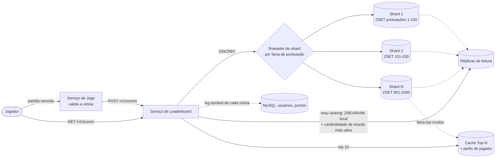

## Visão Geral

Um leaderboard de jogo mobile parece trivial até você escrever as duas consultas que ele precisa servir: *"quem são os top 10?"* e *"onde eu estou?"* — ambas contra um dataset de milhões de pontuações que está sendo mutado milhares de vezes por segundo. A primeira consulta é barata se você mantiver os dados ordenados; a segunda é a armadilha, porque um ranking não é um valor armazenado, é uma **contagem de todos que estão à sua frente**, e computar isso em um banco de dados relacional significa ou uma varredura completa ou um índice cujo custo de manutenção você paga a cada única mudança de pontuação. Este é um problema de estrutura de dados vestido de fantasia de system design, e o sinal de entrevista é se você reconhece isso antes de começar a desenhar caixas.

## Requisitos Funcionais

Delimite o problema em três operações, em ordem de prioridade:

- **Atualizar a pontuação de um jogador** quando ele vence uma partida — autoritativo pelo servidor. O cliente nunca deve poder definir sua própria pontuação; o servidor do jogo valida a vitória e chama o serviço de leaderboard, caso contrário um proxy no meio transforma o leaderboard em uma ficção.
- **Buscar o top 10** para o torneio atual.
- **Buscar o ranking exato de um jogador**, e (uma extensão natural) os quatro jogadores imediatamente acima e abaixo dele — a visão de "você está em 361º, aqui está sua vizinhança" que faz um leaderboard parecer pessoal em vez de desanimador.

Leaderboards geralmente são segmentados por tempo: um novo torneio a cada mês significa um novo leaderboard, e o do mês passado se torna dado histórico frio. Essa segmentação é um presente — ela limita o tamanho do dataset quente e dá a você uma chave natural (`leaderboard_2026_08`) em vez de uma estrutura sempre crescente.

## Requisitos Não Funcionais e Escala

- **Atualizações de pontuação em tempo real.** Uma vitória precisa ser refletida no ranking em cerca de um segundo. Um job de batch noturno que recalcula rankings é um sistema diferente (e muito mais fácil), e não é este.
- **Consistência eventual no ranking exato é aceitável.** Durante uma explosão de pontuações concorrentes, milhares de jogadores estão se ultrapassando a cada segundo. Um ranking que está algumas centenas de milissegundos desatualizado é indistinguível de um atualizado, porque no momento em que ele renderiza já está desatualizado de qualquer forma. Diga isso em voz alta em uma entrevista — isso libera caching e replicação que um enquadramento de consistência estrita proibiria.
- **Disponibilidade acima de correção estrita.** Servir um top 10 um pouco antigo é melhor que servir uma página de erro.

Faça as contas antes de escolher qualquer coisa. Com 5 milhões de DAU e uma distribuição uniforme você obtém ~50 jogadores ativos por segundo; assuma que picos são 5× a média e você está planejando para ~250. Se cada jogador termina 10 partidas por dia, o QPS de atualização de pontuação é ~500 em média e **~2.500 no pico**. Buscas de top-10, carregadas uma vez quando um jogador abre o app, são apenas ~50 QPS. O armazenamento é igualmente modesto: um id de usuário de 24 caracteres mais uma pontuação de 2 bytes são 26 bytes, então 25 milhões de usuários ativos mensais são aproximadamente 650 MB — dobre isso para overhead estrutural e ainda cabe confortavelmente em um único nó Redis moderno. **A escala inicial não exige sharding.** Saber disso, e dizer isso, é mais impressionante do que particionar tudo por reflexo.

## Por Que o Leaderboard SQL Ingênuo Falha

Comece com o design óbvio para poder desmontá-lo deliberadamente. Uma tabela `leaderboard(user_id, score)` trata a escrita lindamente:

```sql
UPDATE leaderboard SET score = score + 1 WHERE user_id = 'mary1934';
```

O top 10 também é tranquilo — `ORDER BY score DESC LIMIT 10` contra um índice em `score` lê dez linhas. O problema é a terceira consulta. Para encontrar o ranking de um jogador você precisa contar todos que estão à frente dele:

```sql
SELECT *,
       (SELECT COUNT(*) FROM leaderboard lb2 WHERE lb2.score >= lb1.score) AS rank
FROM leaderboard lb1
WHERE lb1.user_id = :user_id;
```

Aquela subconsulta correlacionada é uma contagem de intervalo sobre potencialmente milhões de linhas para *cada* requisição de ranking. Mesmo com um índice em `score`, contar as entradas do índice acima de um valor é proporcional a quantas existem — um jogador na posição 4.000.000 força o banco de dados a contabilizar quatro milhões de entradas. Em um dataset estático você cachearia a resposta, mas o dataset não é estático: a 2.500 escritas por segundo, todo ranking cacheado é invalidado quase imediatamente, e cada uma dessas escritas move uma linha dentro do índice de `score`, então você também está pagando custo contínuo de manutenção de índice no caminho de escrita. Um banco de dados relacional é um excelente sistema de registro aqui e um motor de ranking pobre — o formato geral de "ordenado, constantemente mutando, leituras ranqueadas" simplesmente não é para o que uma tabela apoiada em B-tree é otimizada.

## Redis Sorted Sets: A Estrutura de Dados Certa

Um **sorted set** (`ZSET`) é uma coleção de membros únicos, cada um associado a uma pontuação, mantida permanentemente em ordem de pontuação. Toda operação de leaderboard mapeia para um comando:

```
ZINCRBY  leaderboard_2026_08 1 'mary1934'      # vence uma partida: O(log N)
ZREVRANGE leaderboard_2026_08 0 9 WITHSCORES   # top 10:      O(log N + M)
ZREVRANK  leaderboard_2026_08 'mary1934'       # meu ranking:     O(log N)
ZREVRANGE leaderboard_2026_08 357 365          # 4 acima/abaixo do ranking 361
```

O crítico é `ZREVRANK`. O ranking retorna em tempo **logarítmico** em vez de linear, e essa única diferença de complexidade é a razão inteira pela qual esse design funciona — é o que transforma uma consulta que degrada com o tamanho do leaderboard em uma que mal nota a diferença entre cem mil jogadores e cem milhões.

### Por Que o Ranking É O(log N): a Skip List

Internamente, um sorted set são duas estruturas mantidas sincronizadas: uma **hash table** mapeando membro para pontuação (então "qual é a pontuação de mary1934?" é O(1)), e uma **skip list** ordenando membros por pontuação (então consultas de intervalo e ranking são rápidas).

Uma skip list começa como uma lista encadeada ordenada, onde encontrar qualquer coisa é O(n) porque você precisa percorrer nó por nó. Em cima dessa lista base, ela constrói faixas expressas: um índice de nível 1 ligando a cada dois nós, um índice de nível 2 ligando a cada dois nós de nível 1, e assim por diante, aproximadamente dividindo a contagem de nós pela metade a cada nível. Uma busca começa na faixa mais alta e desce um nível sempre que o próximo nó ultrapassaria o alvo — a mesma divisão-e-conquista da busca binária, mas em uma estrutura encadeada que suporta inserção barata. O ganho cresce com o tamanho: em uma lista onde a travessia base visitaria 62 nós, uma skip list de cinco níveis visita cerca de 11.

O ranking funciona porque cada ponteiro de faixa expressa também armazena o **span** — quantos nós de nível base ele pula. Descer até um membro e somar os spans que você cruzou produz sua posição exata sem nunca visitar os elementos que você passou. Esse é o truque: a contagem de jogadores à sua frente é acumulada a partir de alguns saltos de ponteiro em vez de contada uma linha por vez. Inserções e exclusões reconstroem apenas os níveis dos quais um nó participa (escolhidos probabilisticamente), então a estrutura se mantém balanceada sob um fluxo constante de escritas sem o rebalanceamento global que uma árvore precisaria.

## Particionando o Leaderboard

Um nó Redis atende 5 milhões de DAU. Agora imagine 500 milhões: ~65 GB e ~250.000 QPS. Isso precisa de sharding, e sharding é onde as duas consultas divergem drasticamente.

**Particionamento por hash** — o instinto padrão, e o que o Redis Cluster faz nativamente ao mapear cada chave para um dos 16.384 hash slots via `CRC16(key) % 16384` (um esquema de slot fixo em vez de [consistent hashing](consistent-hashing), embora resolva o mesmo problema: adicionar ou remover um nó move slots, não toda chave). Escritas permanecem triviais — a chave do jogador roteia para exatamente um shard. Leituras ficam feias: o top 10 exige um **scatter-gather** — consultar o top 10 de cada shard em paralelo, mesclar na aplicação, e esperar pelo shard mais lento. E o ranking global se torna genuinamente difícil, porque o ranking local de um jogador no seu shard não diz nada sobre quantas pontuações mais altas vivem nos outros.

**Particionamento fixo (por faixa)** — particione por faixa de pontuação em vez disso: pontuações 1–100 no shard 1, 101–200 no shard 2, e assim por diante. Agora o top 10 é uma única consulta contra o shard de faixa mais alta, e o ranking global é computável: pegue o `ZREVRANK` local do jogador e some a cardinalidade total de cada shard com pontuação mais alta, cada um dos quais é uma busca O(1). O custo é que shards precisam ser rebalanceados se a distribuição de pontuações for enviesada, e um jogador que cruza uma fronteira de faixa precisa ser **removido de um shard e inserido em outro** — uma migração de dois passos, não atômica, mais uma busca secundária (id de usuário → pontuação atual) para que o caminho de escrita saiba a qual shard direcionar sem atingir o banco de dados.

A escolha é uma troca direta: particionamento por hash dá carga uniforme e escritas simples mas sacrifica o ranking global; particionamento por faixa preserva ambas as consultas ao custo de rebalanceamento e movimentações entre shards. Se você não conseguir preservar o ranking exato, degrade graciosamente — um cron job que amostra a distribuição de pontuações por shard permite que você responda "top 5%", o que é sem dúvida melhor comportamento de produto do que dizer a alguém que ele está em 1.200.001º.

## Cacheando o Top-N e Servindo Leituras de Réplicas

As duas consultas também têm volatilidade completamente diferente, e essa assimetria é explorável. Rankings individuais na cauda longa se agitam constantemente — milhares de jogadores trocam de posição a cada segundo. **O top 10 quase não se move**: deslocar um líder exige superar uma pontuação que levou semanas para acumular. Então cacheie o top-N como uma lista materializada com um TTL curto (alguns segundos) ou atualize-o via write-through quando uma pontuação realmente entra na faixa top, e sirva os ~50 QPS de aberturas de leaderboard a partir desse blob cacheado sem tocar no sorted set de jeito nenhum. É o caso clássico de chave quente para uma [camada de cache](caching-strategies-and-cdns): um resultado minúsculo, extremamente quente, de mudança lenta, sentado na frente de uma estrutura grande e de mudança rápida. O mesmo cache deveria guardar os dados de exibição (nomes, avatares) desses jogadores do topo, o que de outra forma significaria uma busca relacional em toda renderização de leaderboard.

Buscas de ranking são a metade intensiva em leitura do tráfego e toleram obsolescência por definição, o que as torna uma candidata de livro-texto para [read/write splitting](read-write-splitting-and-cqrs-lite): aponte `ZREVRANK` e consultas de vizinhança para réplicas de leitura, mantenha `ZINCRBY` no primário. Réplicas servem uma foto instantânea que está milissegundos atrás — invisível para um jogador, e isso tira a carga de leitura do nó que precisa absorver 250 mil escritas por segundo. A replicação ganha seu espaço duas vezes aqui, já que um primário Redis recarregando um grande dataset do disco depois de um crash é lento; promover uma réplica já aquecida é rápido.



Note que o banco de dados relacional ainda está no quadro — não como o motor de ranking, mas como o sistema de registro. Toda vitória é anexada com um timestamp, o que dá a você histórico de partidas, desempate (pontuações iguais ranqueadas por quem chegou lá primeiro), e a capacidade de **reconstruir o leaderboard inteiro** ao repetir `ZINCRBY` por linha se a camada de cache for perdida.

## Trade-offs

- **Um sorted set compra O(log N) de ranking ao custo de manter o conjunto de trabalho em memória** — 650 MB para 25 milhões de jogadores é trivial, mas o leaderboard agora é um componente com formato de cache que precisa de replicação e um caminho de reconstrução, enquanto a tabela SQL era durável por construção.
- **Particionamento por faixa (fixo) preserva o ranking global; particionamento por hash preserva carga uniforme** — você pode ter escritas simples e shards balanceados, ou um top-N barato e um ranking global computável, mas não ambos sem maquinaria extra.
- **Scatter-gather é bom para o top 10 e ruim para o top 10.000** — mesclar um pequeno K de cada shard é barato, mas o tamanho do resultado e a penalidade de latência de cauda de esperar pelo shard mais lento crescem com K.
- **Cachear o top-N é quase de graça porque muda devagar; cachear rankings individuais é quase inútil porque eles não mudam devagar** — o mesmo TTL que faz do blob de leaderboard uma vitória produziria um cache com taxa de acerto quase zero em rankings de cauda.
- **Réplicas de leitura cortam carga no primário mas tornam "meu ranking" definicionalmente obsoleto** — aceitável quando milhares de posições mudam por segundo de qualquer forma, inaceitável no momento em que dinheiro de prêmio real é liquidado sobre esse número.
- **Pontuação autoritativa pelo servidor não é negociável e custa uma viagem de rede a mais** — deixar o cliente reportar sua própria pontuação remove um salto e entrega o leaderboard a qualquer um disposto a rodar um proxy.

## Perguntas de Entrevista

- Por que adicionar um índice em `score` corrige a consulta de top-10 mas não a consulta "qual é meu ranking?"
- Qual propriedade da skip list torna a busca de ranking logarítmica em vez de linear, dado que uma lista encadeada ordenada simples contém exatamente a mesma ordenação?
- Você particionou por hash entre 16 nós Redis. O que quebra, e o que você teria que construir para responder "qual é meu ranking global?"
- Por que cachear o top 10 é eficaz enquanto cachear o ranking de um jogador arbitrário geralmente não é?
- Dois jogadores terminam o mês com pontuações idênticas. O que você armazenaria, e quando, para desempatar deterministicamente sem uma segunda passada pelos dados?

## Referências

- [Alex Xu e Sahn Lam, "System Design Interview – An Insider's Guide, Volume 2" (ByteByteGo, 2022) — Capítulo 10, "Real-Time Gaming Leaderboard"](https://bytebytego.com)
- [Redis Documentation — Sorted sets](https://redis.io/docs/latest/develop/data-types/sorted-sets/)
- [Redis Documentation — Scaling with Redis Cluster](https://redis.io/docs/latest/operate/oss_and_stack/management/scaling/)
- [AWS Database Blog — Building a real-time gaming leaderboard with Amazon ElastiCache for Redis](https://aws.amazon.com/blogs/database/building-a-real-time-gaming-leaderboard-with-amazon-elasticache-for-redis/)
