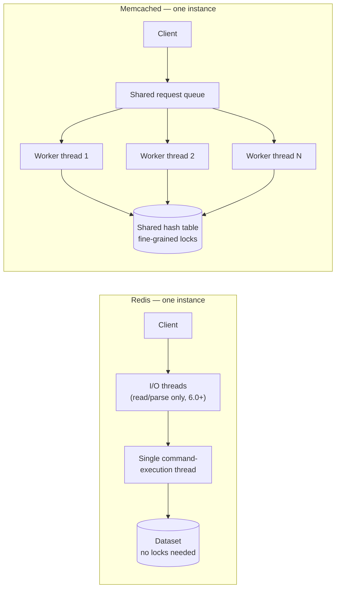
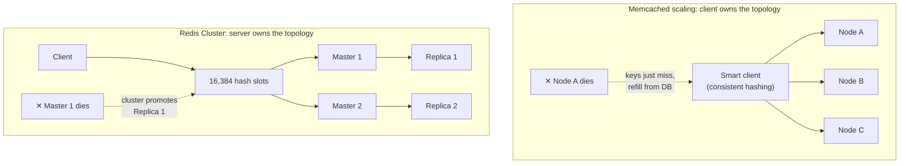

## Overview

Redis and Memcached solve the same base problem — an in-memory key-value store that answers a read faster than the database behind it — and "just use Redis" has become the reflexive answer, since Redis does everything Memcached does and more. That's true, but it skips the part worth actually understanding: the two differ in threading model, data model, and persistence in ways that produce real, opposite trade-offs, not just a feature checklist where one box has more checks. Picking between them (or knowing why a system already picked one) means understanding *why* those differences exist, not just that they do.

## Threading Model: One Core vs. Many

Redis executes commands on a **single thread**. A command runs to completion before the next one starts — no interleaving, no locks around shared data structures, because nothing ever runs concurrently against them. This is a deliberate simplicity trade: `INCR`, a hash field update, a sorted-set insert are all atomic by construction, with zero synchronization code and none of the subtle races that come with fine-grained locking. (Redis 6.0 added optional I/O threading — multiple threads read and parse incoming requests off the network — but command *execution* against the dataset is still single-threaded; the bottleneck it relieves is socket I/O, not CPU-bound command work.)

Memcached is **multi-threaded** from the start: a configurable pool of worker threads pulls requests off a shared queue and executes them against a shared hash table protected by fine-grained locks. A single Memcached process can use several CPU cores at once.



The consequence: one Redis *instance* is capped by a single CPU core's worth of command throughput, no matter how many cores the box has — scaling Redis past that means running more instances (Redis Cluster, or simple client-side sharding) rather than giving one instance more cores. One Memcached *instance* can already use multiple cores, so a single node goes further before you need to shard at all. Neither is strictly faster: Redis's single-threaded design is what makes every one of its richer operations atomic for free; Memcached's multi-threaded design is what lets a lone node absorb more raw `get`/`set` traffic.

## Data Model: Rich Structures vs. Pure Key-Value

Memcached stores exactly one thing: an opaque byte blob under a string key. Anything structured — a user profile, a leaderboard, a counter map — has to be serialized to bytes by the client, and *any* partial update means fetching the whole blob, modifying it client-side, and writing the whole blob back (typically with `cas`, Memcached's compare-and-swap token, to avoid clobbering a concurrent writer):

```
# Memcached: incrementing one field inside a JSON blob
value, cas_token = memcached.gets("user:42")          # fetch + CAS token
user = json.loads(value)
user["login_count"] += 1
memcached.cas("user:42", json.dumps(user), cas_token)  # fails if value changed since gets()
```

Redis stores several native data structures directly — strings, lists, hashes, sets, sorted sets, bitmaps, HyperLogLog, geospatial indexes, streams — so the same update is one atomic command against a single field, with no read-modify-write round trip and no serialization format to agree on:

```
# Redis: incrementing one field inside a hash, atomically, in one round trip
HINCRBY user:42 login_count 1
```

This isn't a random feature gap — it follows directly from being purely in-memory. A disk-based store pays a real cost to encode a data structure into a disk-writable form on every write; an in-memory store never pays that cost, so implementing a sorted set or a hash as a first-class type is comparatively cheap for Redis. Memcached could theoretically do the same, but its whole design center is "the simplest possible fast cache," and that simplicity is exactly what buys its multi-threaded implementation its lower per-operation overhead.

## Persistence: Optional Durability vs. None by Design

Memcached has no persistence, full stop — it is not a feature that's off by default, it's not implemented at all. A restart, a crash, or an evicted node loses everything that node held, unconditionally. That isn't a shortcoming so much as the whole point: no WAL, no fsync, no crash-recovery logic, no snapshot format — every byte of implementation complexity a durability story would require is simply absent, which is part of why Memcached stays small and fast.

Redis persistence is optional and tunable, trading durability for latency along a spectrum:

- **RDB** — periodic point-in-time snapshots of the whole dataset to disk. Cheap and compact, but a crash between snapshots loses every write since the last one.
- **AOF (Append-Only File)** — every write command is appended to a log, replayed on restart to rebuild state. `fsync` policy is a direct latency/durability dial: `always` (fsync every write — safest, slowest), `everysec` (fsync once a second — the common default, loses at most ~1s of writes on a crash), or `no` (let the OS decide — fastest, weakest).
- **Both together** — AOF for recovery accuracy, RDB for fast full-dataset restarts and backups.

Even at its strongest setting, Redis's durability is still weaker than a WAL-backed disk database's: writes are acknowledged before the fsync it depends on necessarily completes in the common `everysec` configuration, so a crash can still lose a small window of recent writes. That's a deliberate, disclosed trade for staying fast — not a bug — but it means neither Redis nor Memcached is a substitute for a system that treats the data itself, not just the cache in front of it, as the source of truth.

## Scaling Out: Dumb, Independent Nodes vs. a Coordinated Cluster

Memcached nodes don't know about each other. Scaling out means adding more independent nodes and using **client-side (or proxy-side, e.g. mcrouter, Twemproxy) consistent hashing** to decide which node owns which key. A node going away just means the keys it owned start missing and get repopulated from the database on the next read — there's no replication, no rebalancing, no cluster state to keep consistent, because there's no cluster, only a set of nodes a smart client happens to hash consistently against.

Redis Cluster instead makes sharding a **server-side, coordinated** concern: the keyspace is divided into 16,384 fixed hash slots, each owned by one master node, and each master can have replicas for automatic failover. Losing a master triggers a cluster-level failover to a replica — the cluster reroutes around it instead of simply losing that shard's data until the app repopulates it.



Neither topology is strictly better: Memcached's "dumb nodes, smart client" model is simpler to reason about and to run, precisely because there's no cluster state that can itself get out of sync — but it also means a node failure is a cache miss storm, not a graceful failover. Redis Cluster buys continuity through a failure at the cost of running and understanding an actual distributed system, complete with its own consensus and split-brain considerations.

## Beyond Caching: Pub/Sub, Queues, and Streams

Redis's additional data structures turn it into more than a cache in practice: sorted sets make a cheap leaderboard or priority queue, `INCR` with a TTL is the standard building block for a fixed-window rate limiter (see [Rate Limiting](/system-design-concepts/rate-limiting)), and `SET key value NX` is a common (if imperfect — see Trade-offs) distributed lock primitive.

Redis also ships two messaging primitives that are easy to reach for as a lightweight alternative to a dedicated broker, with a real gap underneath the similarity:

- **Pub/Sub** is fire-and-forget: a message published while no one is subscribed is simply gone, with no buffering and no replay.
- **Streams** (Redis 5.0+) add an append-only log with consumer groups, acknowledgment, and replay from a given position — architecturally much closer to Kafka than Pub/Sub is.

Neither replaces a purpose-built broker under real durability or throughput requirements — see [Message Brokers: Queues vs. Log-Based Streaming](/system-design-concepts/message-brokers-queues-vs-logs) for what a dedicated system buys you that Redis Streams, running inside the same single-threaded instance as your cache traffic, does not.

## Trade-offs

- **Redis's single-threaded execution buys free atomicity, at the cost of a hard per-instance CPU ceiling.** Every command is race-free by construction, but one Redis instance can never use more than one core's worth of command throughput — scaling past that means more instances, not more cores on the box you already have.
- **Memcached's simplicity is a durability trade, not a missing feature.** Zero persistence means zero recovery logic and a smaller, faster codebase, but it also means Memcached can never be anything but a cache — there is no configuration that makes a Memcached node survive its own restart.
- **Redis's data structures remove read-modify-write races Memcached forces onto the client.** `HINCRBY` is one atomic round trip; the equivalent Memcached update is a `gets`/modify/`cas` cycle that must retry on a CAS failure — real client-side complexity Redis simply doesn't have.
  ```
  # Memcached: this needs a retry loop around gets/cas under concurrent writers
  # Redis:     this is the whole operation
  HINCRBY user:42 login_count 1
  ```
- **`everysec` AOF durability, Redis's common default, can still lose about a second of writes on a crash** — a real gap from "durable" that's easy to forget because Redis otherwise behaves like a database. If losing that window is unacceptable, that's a signal the data belongs in a WAL-backed store, with Redis only in front of it as a cache.
- **Redis's `SET key value NX` distributed lock (and the multi-node Redlock algorithm built on it) has known correctness gaps under process pauses and clock drift** — a lock holder that GC-pauses past its lease can resume believing it still holds the lock after another node has already acquired it. Fine for reducing duplicate work; not a substitute for a consensus-backed lock (e.g. via ZooKeeper or etcd) when correctness under a stalled process actually matters.
- **Memcached's "dumb nodes" scale-out is operationally simpler but degrades harder** — losing a node with client-side consistent hashing just means a burst of cache misses hitting the database, with no automatic failover; Redis Cluster avoids that burst but requires understanding and operating an actual distributed system underneath your cache.

## Interview Questions

- A service does `INCR` on a Redis counter from many concurrent request handlers. Why is this safe without any application-level locking, and would the equivalent be safe on Memcached with a plain `get` + `set`?
- Why does Redis's single-threaded design put a ceiling on one instance's throughput that a single Memcached instance doesn't have — and what's the standard way to scale past that ceiling on each system?
- A team wants to cache full JSON user profiles but frequently needs to update just one field (e.g. a login counter). Compare the Redis and Memcached approaches to this update, and name the concurrency hazard the Memcached approach has to handle explicitly.
- Redis is configured with AOF and `appendfsync everysec`. What's the worst-case data loss on a crash, and why would a team choose that setting over `always` anyway?
- A Memcached node crashes and restarts empty. A Redis node configured with RDB+AOF crashes and restarts. Contrast what each system guarantees about its state afterward, and what has to be true of the application for the Memcached case to be acceptable.

## References

- [Redis Documentation — Redis data types](https://redis.io/docs/latest/develop/data-types/)
- [Redis Documentation — Persistence (RDB and AOF)](https://redis.io/docs/latest/operate/oss_and_stack/management/persistence/)
- [Redis Documentation — Redis Cluster specification](https://redis.io/docs/latest/operate/oss_and_stack/reference/cluster-spec/)
- [Rajesh Nishtala et al. — "Scaling Memcache at Facebook" (NSDI 2013)](https://www.usenix.org/conference/nsdi13/technical-sessions/presentation/nishtala)
- [Martin Kleppmann — "How to do distributed locking" (on Redlock's correctness gaps)](https://martin.kleppmann.com/2016/02/08/how-to-do-distributed-locking.html)
