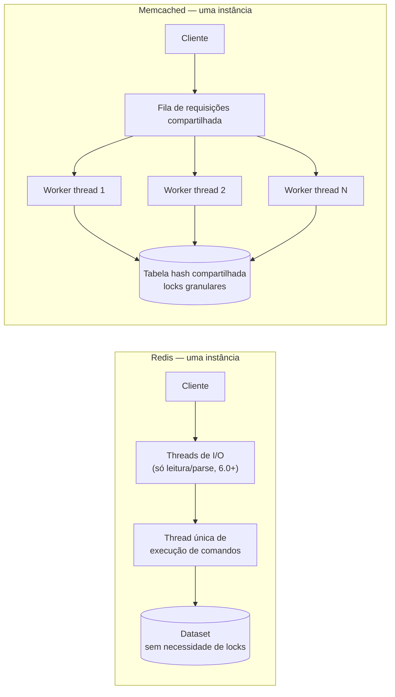
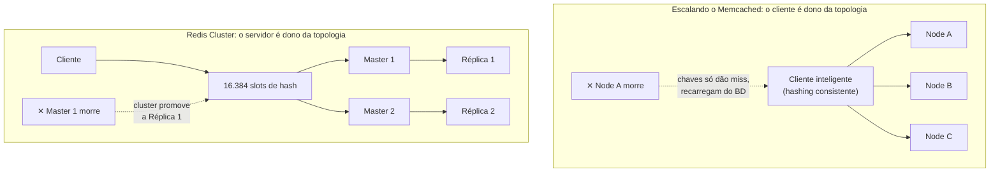

## Overview

Redis e Memcached resolvem o mesmo problema de base — um armazenamento chave-valor em memória que responde uma leitura mais rápido que o banco de dados por trás dele — e "só use Redis" virou a resposta automática, já que o Redis faz tudo que o Memcached faz e mais. Isso é verdade, mas pula a parte que vale a pena de fato entender: os dois diferem em modelo de threading, modelo de dados e persistência de formas que produzem trade-offs reais e opostos, não apenas uma lista de features onde uma caixa tem mais marcações. Escolher entre eles (ou entender por que um sistema já escolheu um) significa entender *por que* essas diferenças existem, não só que elas existem.

## Modelo de Threading: Um Núcleo vs. Vários

O Redis executa comandos em uma **única thread**. Um comando roda até o fim antes do próximo começar — sem intercalação, sem locks em torno de estruturas de dados compartilhadas, porque nada roda concorrentemente contra elas. É uma troca de simplicidade deliberada: `INCR`, uma atualização de campo de hash, uma inserção em sorted set são todos atômicos por construção, com zero código de sincronização e nenhuma das race conditions sutis que vêm com locking granular. (O Redis 6.0 adicionou threading de I/O opcional — múltiplas threads leem e fazem parse das requisições vindas da rede — mas a *execução* dos comandos contra o dataset continua single-threaded; o gargalo que isso alivia é I/O de socket, não trabalho de comando limitado por CPU.)

O Memcached é **multi-threaded** desde o início: um pool configurável de worker threads retira requisições de uma fila compartilhada e as executa contra uma tabela hash compartilhada protegida por locks granulares. Um único processo Memcached pode usar vários núcleos de CPU ao mesmo tempo.



A consequência: uma *instância* Redis é limitada ao throughput de comandos de um único núcleo de CPU, não importa quantos núcleos a máquina tenha — escalar o Redis além disso significa rodar mais instâncias (Redis Cluster, ou sharding simples no lado do cliente) em vez de dar mais núcleos a uma instância. Uma *instância* Memcached já consegue usar vários núcleos, então um único node vai mais longe antes de você precisar fazer sharding. Nenhum dos dois é estritamente mais rápido: o design single-threaded do Redis é o que torna cada uma de suas operações mais ricas atômica de graça; o design multi-threaded do Memcached é o que permite que um único node absorva mais tráfego bruto de `get`/`set`.

## Modelo de Dados: Estruturas Ricas vs. Chave-Valor Puro

O Memcached armazena exatamente uma coisa: um blob de bytes opaco sob uma chave string. Qualquer coisa estruturada — um perfil de usuário, um mapa de leaderboard, um contador — precisa ser serializada em bytes pelo cliente, e *qualquer* atualização parcial significa buscar o blob inteiro, modificá-lo no lado do cliente, e escrever o blob inteiro de volta (tipicamente com `cas`, o token de compare-and-swap do Memcached, para evitar sobrescrever um escritor concorrente):

```
# Memcached: incrementando um campo dentro de um blob JSON
value, cas_token = memcached.gets("user:42")          # busca + token CAS
user = json.loads(value)
user["login_count"] += 1
memcached.cas("user:42", json.dumps(user), cas_token)  # falha se o valor mudou desde o gets()
```

O Redis armazena várias estruturas de dados nativas diretamente — strings, listas, hashes, sets, sorted sets, bitmaps, HyperLogLog, índices geoespaciais, streams — então a mesma atualização é um comando atômico contra um único campo, sem ida-e-volta de leitura-modificação-escrita e sem formato de serialização para combinar:

```
# Redis: incrementando um campo dentro de um hash, atomicamente, em uma ida
HINCRBY user:42 login_count 1
```

Isso não é uma lacuna de feature aleatória — decorre diretamente de ser puramente em memória. Um armazenamento baseado em disco paga um custo real para codificar uma estrutura de dados em uma forma gravável em disco a cada escrita; um armazenamento em memória nunca paga esse custo, então implementar um sorted set ou um hash como um tipo de primeira classe é comparativamente barato para o Redis. O Memcached poderia teoricamente fazer o mesmo, mas todo o seu centro de design é "o cache rápido mais simples possível", e é exatamente essa simplicidade que compra sua implementação multi-threaded com overhead menor por operação.

## Persistência: Durabilidade Opcional vs. Nenhuma por Design

O Memcached não tem persistência, ponto final — não é uma feature que vem desligada por padrão, ela simplesmente não é implementada. Um restart, um crash ou um node removido perde tudo que aquele node continha, incondicionalmente. Isso não é tanto uma falha quanto o ponto inteiro: sem WAL, sem fsync, sem lógica de recuperação de crash, sem formato de snapshot — toda a complexidade de implementação que uma história de durabilidade exigiria simplesmente não existe, e é parte do motivo pelo qual o Memcached continua pequeno e rápido.

A persistência do Redis é opcional e ajustável, trocando durabilidade por latência ao longo de um espectro:

- **RDB** — snapshots periódicos do dataset inteiro em um ponto no tempo, gravados em disco. Barato e compacto, mas um crash entre snapshots perde toda escrita desde o último.
- **AOF (Append-Only File)** — todo comando de escrita é anexado a um log, reproduzido na inicialização para reconstruir o estado. A política de `fsync` é um dial direto de latência/durabilidade: `always` (fsync a cada escrita — mais seguro, mais lento), `everysec` (fsync uma vez por segundo — o padrão mais comum, perde no máximo ~1s de escritas em um crash), ou `no` (deixa o SO decidir — mais rápido, mais fraco).
- **Ambos juntos** — AOF para precisão de recuperação, RDB para restarts completos rápidos e backups.

Mesmo na sua configuração mais forte, a durabilidade do Redis ainda é mais fraca que a de um banco de dados em disco com WAL: escritas são confirmadas antes do fsync do qual dependem necessariamente completar, na configuração comum `everysec`, então um crash ainda pode perder uma pequena janela de escritas recentes. Essa é uma troca deliberada e declarada por continuar rápido — não um bug — mas significa que nem Redis nem Memcached substituem um sistema que trata os próprios dados, não só o cache na frente deles, como a fonte da verdade.

## Escalando Horizontalmente: Nodes Independentes e "Burros" vs. um Cluster Coordenado

Nodes Memcached não sabem uns dos outros. Escalar horizontalmente significa adicionar mais nodes independentes e usar **hashing consistente no lado do cliente (ou do proxy, ex: mcrouter, Twemproxy)** para decidir qual node é dono de qual chave. Um node saindo do ar só significa que as chaves que ele possuía começam a dar miss e são repopuladas a partir do banco de dados na próxima leitura — não há replicação, não há rebalanceamento, não há estado de cluster para manter consistente, porque não há cluster, só um conjunto de nodes contra os quais um cliente inteligente faz hash de forma consistente.

O Redis Cluster, em vez disso, torna o sharding uma preocupação **coordenada no lado do servidor**: o keyspace é dividido em 16.384 slots de hash fixos, cada um pertencente a um node master, e cada master pode ter réplicas para failover automático. Perder um master dispara um failover em nível de cluster para uma réplica — o cluster contorna o problema em vez de simplesmente perder os dados daquele shard até a aplicação repopulá-los.



Nenhuma das topologias é estritamente melhor: o modelo "nodes burros, cliente inteligente" do Memcached é mais simples de raciocinar e de operar, precisamente porque não há estado de cluster que possa ficar dessincronizado — mas também significa que a falha de um node é uma tempestade de cache misses, não um failover suave. O Redis Cluster compra continuidade através de uma falha ao custo de operar e entender um sistema distribuído de verdade, completo com suas próprias considerações de consenso e split-brain.

## Além do Cache: Pub/Sub, Filas e Streams

As estruturas de dados adicionais do Redis o transformam em mais que um cache na prática: sorted sets fazem um leaderboard ou fila de prioridade barato, `INCR` com TTL é o bloco de construção padrão para um rate limiter de janela fixa (veja [Rate Limiting](/system-design-concepts/rate-limiting)), e `SET key value NX` é um primitivo comum (embora imperfeito — veja Trade-offs) de lock distribuído.

O Redis também vem com dois primitivos de mensageria fáceis de usar como alternativa leve a um broker dedicado, com uma lacuna real por baixo da semelhança:

- **Pub/Sub** é fire-and-forget: uma mensagem publicada enquanto ninguém está inscrito simplesmente some, sem buffer e sem replay.
- **Streams** (Redis 5.0+) adicionam um log somente-anexação com consumer groups, confirmação (acknowledgment) e replay a partir de uma posição dada — arquiteturalmente muito mais próximo do Kafka do que o Pub/Sub.

Nenhum dos dois substitui um broker construído para o propósito sob requisitos reais de durabilidade ou throughput — veja [Message Brokers: Queues vs. Log-Based Streaming](/system-design-concepts/message-brokers-queues-vs-logs) para entender o que um sistema dedicado te dá que o Redis Streams, rodando dentro da mesma instância single-threaded que seu tráfego de cache, não dá.

## Trade-offs

- **A execução single-threaded do Redis compra atomicidade de graça, ao custo de um teto rígido de CPU por instância.** Todo comando é livre de race condition por construção, mas uma instância Redis nunca consegue usar mais que o throughput de um núcleo — escalar além disso significa mais instâncias, não mais núcleos na mesma máquina.
- **A simplicidade do Memcached é uma troca de durabilidade, não uma feature faltando.** Zero persistência significa zero lógica de recuperação e um código menor e mais rápido, mas também significa que o Memcached nunca pode ser nada além de um cache — não existe configuração que faça um node Memcached sobreviver ao próprio restart.
- **As estruturas de dados do Redis eliminam as race conditions de leitura-modificação-escrita que o Memcached empurra para o cliente.** `HINCRBY` é uma única ida-e-volta atômica; a atualização equivalente no Memcached é um ciclo `gets`/modifica/`cas` que precisa repetir em caso de falha do CAS — complexidade real no lado do cliente que o Redis simplesmente não tem.
  ```
  # Memcached: isso precisa de um loop de retry em torno de gets/cas sob escritores concorrentes
  # Redis:     isso é a operação inteira
  HINCRBY user:42 login_count 1
  ```
- **A durabilidade `everysec` do AOF, o padrão mais comum do Redis, ainda pode perder cerca de um segundo de escritas em um crash** — uma lacuna real em relação a "durável" que é fácil de esquecer porque o Redis, fora isso, se comporta como um banco de dados. Se perder essa janela é inaceitável, isso é um sinal de que os dados pertencem a um armazenamento com WAL, com o Redis apenas na frente dele como cache.
- **O lock distribuído `SET key value NX` do Redis (e o algoritmo Redlock multi-node construído sobre ele) tem lacunas de corretude conhecidas sob pausas de processo e desvio de relógio** — um detentor do lock que sofre uma pausa de GC além do seu lease pode retomar acreditando que ainda o possui, depois que outro node já o adquiriu. Ótimo para reduzir trabalho duplicado; não é substituto para um lock baseado em consenso (ex: via ZooKeeper ou etcd) quando corretude sob um processo travado de fato importa.
- **O scale-out de "nodes burros" do Memcached é operacionalmente mais simples mas degrada de forma mais brusca** — perder um node com hashing consistente no lado do cliente só significa uma explosão de cache misses atingindo o banco de dados, sem failover automático; o Redis Cluster evita essa explosão mas exige entender e operar um sistema distribuído de verdade por baixo do seu cache.

## Interview Questions

- Um serviço faz `INCR` em um contador Redis a partir de muitos handlers de requisição concorrentes. Por que isso é seguro sem nenhum locking no nível da aplicação, e o equivalente seria seguro no Memcached com um simples `get` + `set`?
- Por que o design single-threaded do Redis impõe um teto no throughput de uma instância que uma única instância Memcached não tem — e qual é a forma padrão de escalar além desse teto em cada sistema?
- Um time quer cachear perfis de usuário JSON completos mas frequentemente precisa atualizar só um campo (ex: um contador de login). Compare as abordagens do Redis e do Memcached para essa atualização, e nomeie o risco de concorrência que a abordagem do Memcached precisa tratar explicitamente.
- O Redis está configurado com AOF e `appendfsync everysec`. Qual é a pior perda de dados possível em um crash, e por que um time escolheria essa configuração em vez de `always` mesmo assim?
- Um node Memcached crasha e reinicia vazio. Um node Redis configurado com RDB+AOF crasha e reinicia. Contraste o que cada sistema garante sobre seu estado depois, e o que precisa ser verdade sobre a aplicação para que o caso do Memcached seja aceitável.

## References

- [Redis Documentation — Redis data types](https://redis.io/docs/latest/develop/data-types/)
- [Redis Documentation — Persistence (RDB and AOF)](https://redis.io/docs/latest/operate/oss_and_stack/management/persistence/)
- [Redis Documentation — Redis Cluster specification](https://redis.io/docs/latest/operate/oss_and_stack/reference/cluster-spec/)
- [Rajesh Nishtala et al. — "Scaling Memcache at Facebook" (NSDI 2013)](https://www.usenix.org/conference/nsdi13/technical-sessions/presentation/nishtala)
- [Martin Kleppmann — "How to do distributed locking" (on Redlock's correctness gaps)](https://martin.kleppmann.com/2016/02/08/how-to-do-distributed-locking.html)
