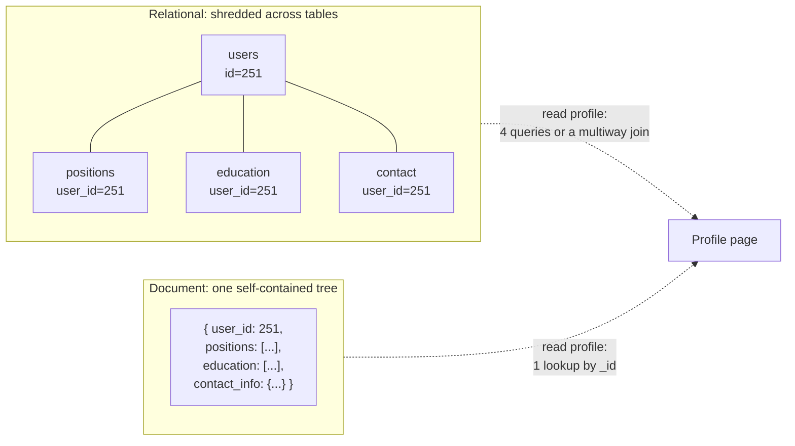
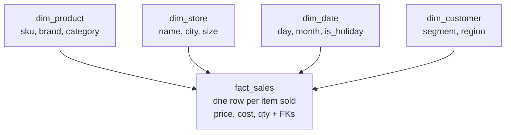

## Overview

The relational model organizes data as tables of rows that reference each other by key; the document model stores each entity as one self-contained JSON-like document with its related data nested inside. The usual framing — SQL is the legacy option, NoSQL is the modern one — is wrong, and it obscures the actual question, which is how closely your storage layout should mirror the object graph your application code works with. **The honest version of the trade-off is about the shape of your relationships**: documents are excellent at trees and bad at graphs, relational tables are indifferent to both. Everything else — schema flexibility, locality, join support — follows from that.

## The Object-Relational Mismatch

Application code manipulates objects: a `Resume` holding a list of `Position` objects, a list of `Education` entries, and a `ContactInfo`. Relational databases store flat tuples. Bridging the two requires a translation layer, and the friction of that translation is what people mean by the **impedance mismatch** (a term borrowed from electronics, where mismatched input and output impedances waste power at the connection).

In a relational schema, a résumé is shredded across four tables, because a person has an unbounded number of jobs and degrees:

```sql
CREATE TABLE users     (id int PRIMARY KEY, first_name text, last_name text, region_id text);
CREATE TABLE positions (id int PRIMARY KEY, user_id int REFERENCES users, job_title text, org text);
CREATE TABLE education (id int PRIMARY KEY, user_id int REFERENCES users, school text, start_yr int);
CREATE TABLE contact   (id int PRIMARY KEY, user_id int REFERENCES users, kind text, url text);
```

Rendering one profile page now means either four queries keyed on `user_id`, or one multiway join that fans out into a cross product you have to de-duplicate in application code. The same data as a single document:

```json
{
  "user_id": 251,
  "first_name": "Barack",
  "last_name": "Obama",
  "region_id": "us:91",
  "positions": [
    {"job_title": "President",         "organization": "United States of America"},
    {"job_title": "US Senator (D-IL)", "organization": "United States Senate"}
  ],
  "education": [
    {"school_name": "Harvard University",  "start": 1988, "end": 1991},
    {"school_name": "Columbia University", "start": 1981, "end": 1983}
  ],
  "contact_info": {"website": "https://barackobama.com"}
}
```

One key lookup, one contiguous read, one object that deserializes straight into the shape the application already wanted. That is **locality**: the whole profile lives in one place on disk, so fetching it costs one seek instead of several index traversals.



Object-relational mappers (Hibernate, ActiveRecord) exist to shrink this translation layer, and they do reduce boilerplate for the simple, repetitive cases. They do not remove the mismatch: you still have to reason about both representations, generated schemas are often awkward for anyone querying the tables directly, and the **N+1 query problem** — fetching N comments, then issuing one query per comment to look up its author instead of joining once — is the classic way an ORM turns a single join into a hundred round trips.

Two caveats before declaring documents the winner. First, one-to-many here really means *one-to-few*: a résumé has a handful of jobs. Comments on a celebrity's post number in the tens of thousands, and embedding those in one document is unworkable — you're back to a separate collection with a foreign key. Second, documents have to be read and rewritten whole, so a large document with frequent small updates is the worst case for the model. Keep documents small.

## Normalization, Denormalization, and Joins

Notice that the document above stores `region_id: "us:91"` rather than the string `"Washington, DC, United States"`. That is a **normalization** decision: the human-meaningful text lives in exactly one place, and everything else points at it with an ID that has no meaning outside the database and therefore never has to change.

The payoff is not just disk space. A standardized region list gives you consistent spelling, disambiguation (Washington the city vs. the state), one-line renames when a city changes name, localization for translated UIs, and searchability that a bare string can't provide — "people on the US East Coast" is answerable only if the region entity knows where the East Coast is.

The cost is that every display of that record now needs a lookup to resolve the ID, which in a relational database is a join:

```sql
SELECT users.*, regions.region_name
FROM users JOIN regions ON users.region_id = regions.id
WHERE users.id = 251;
```

Document databases can store normalized data perfectly well, but they're associated with denormalization for two reasons: JSON makes it trivially easy to paste an extra copy of a field into a document, and join support is historically weak. Some document stores can't join at all, which pushes the join into application code — fetch document, read ID, fetch second document. MongoDB does offer `$lookup` in an aggregation pipeline:

```javascript
db.users.aggregate([
  { $match: { _id: 251 } },
  { $lookup: { from: "regions", localField: "region_id", foreignField: "_id", as: "region" } }
])
```

The general principle: **normalized data is faster to write and slower to read; denormalized data is faster to read and more expensive to write.** Denormalization is a form of derived data — the duplicated copies are a cache of a join, and something has to keep them in sync. Do it and you inherit two obligations: a process to update every copy, and a story for what happens if that process crashes halfway. Databases with multi-object atomic transactions make this manageable; not every document database offers atomicity across documents.

Neither choice is virtuous. The instructive real-world case is a social network's precomputed home timelines: the join between `posts` and `follows` was too expensive to run per read, so it's materialized on write. But each materialized entry stores only the post ID and sender ID — not the post text, like count, or the sender's avatar — because those change constantly and would have to be updated across millions of timelines. Reading a timeline still performs two joins in application code to *hydrate* those IDs, and that hydration parallelizes fine. The scalable design denormalized the slow-changing structure and left the fast-changing content normalized. "Joins don't scale" is not a rule; it's a claim you evaluate per field, weighing change frequency against read cost.

## Many-to-One and Many-to-Many Relationships

This is where the document model actually breaks down, and it has nothing to do with schemas or performance.

The relationships in the résumé come in three kinds:

- **One-to-many** (one-to-few): a user has several positions, and each position belongs to exactly one user. This is a *tree*. Documents nail it.
- **Many-to-one**: many users live in the same region. The region is shared, so it wants to be its own entity referenced by ID.
- **Many-to-many**: a person worked at several organizations, and an organization employed many people. In relational terms this is an associative (join) table where each row pairs one `user_id` with one `org_id`.

Once you want organizations and schools to be real entities — with a logo, a description, a news feed — the document stops being self-contained:

```json
{
  "user_id": 251,
  "positions": [
    {"start": 2009, "end": 2017, "job_title": "President",         "org_id": 513},
    {"start": 2005, "end": 2008, "job_title": "US Senator (D-IL)", "org_id": 514}
  ]
}
```

Those `org_id`s are foreign keys wearing a different hat, and the database won't help you follow them. Worse, many-to-many relationships usually need traversal **in both directions**: all organizations a person worked for, *and* all people who worked at an organization. A document store can answer the second question only if you either (a) duplicate the relationship on both sides — the résumé lists org IDs and the org lists résumé IDs, which is denormalized and can drift out of sync — or (b) keep it in one place and rely on a secondary index over `positions.org_id` inside the array. Most document databases and JSON-capable relational databases can build that index, so this is solvable; it's just no longer the model's strong suit, and you've re-derived the join table by hand.

The deeper point: as relationships multiply, your data stops being a tree and starts being a graph. Documents model trees. Relational tables model arbitrary references adequately, since any row can be addressed directly by ID — something you can't do for a nested item inside a document, where the best you can say is "the second element of the positions array of user 251." And when nearly *everything* is many-to-many — social graphs, road networks, recommendation traversals — even relational joins become awkward, and a purpose-built model wins instead. That's the subject of [Graph Data Models](graph-data-models-and-query-languages).

## Stars and Snowflakes: The Relational Model for Analytics

Analytics reuses relational tables for an entirely different purpose, so the normalization calculus flips. A **star schema** puts a large **fact table** at the center — one row per event (a sale, a click, a page view), often hundreds of columns wide and running to petabytes — surrounded by **dimension tables** describing the who, what, where, when, and why of each event, referenced by foreign key. Even dates get a dimension table, so a query can distinguish holidays from ordinary Tuesdays.



A **snowflake schema** normalizes further, splitting dimensions into subdimensions (a separate `brands` table referenced by `dim_product`). It's tidier and analysts generally prefer the flatter star anyway. Push the other way and you get **one big table (OBT)**: fold the dimensions into the fact table entirely, precomputing every join at the cost of storage.

The reason this denormalization is safe here — and dangerous in an operational system — is that warehouse data is an immutable historical log. Nothing gets updated, so there are no update anomalies to worry about, and the write overhead that makes denormalization painful in OLTP doesn't apply to a bulk load. See [Operational vs. Analytical Systems](operational-vs-analytical-systems) for why these workloads get separate systems in the first place.

## When to Use Which Model

The book's own framing: documents argue schema flexibility, locality, and closeness to the application object model; relational counters with joins and proper support for many-to-one and many-to-many relationships. Concretely:

**Reach for documents when:**

- The data is a tree of one-to-many relationships and you typically load the whole tree at once. Shredding it into tables produces cumbersome schemas and complicated code for no benefit.
- Records are genuinely heterogeneous — many object types that can't each get a table, or a structure dictated by an external system that changes without warning. Enforcing a schema here hurts more than it helps.
- You need user-defined ordering. A drag-to-reorder task list is a JSON array; in SQL it's an integer sort column requiring renumbering, a linked list of IDs, or fractional indexing.
- Schema changes need to be instant. `schema-on-read` lets you start writing new fields immediately and handle old shapes in application code — the trade being that every reader now copes with every historical format, forever.

**Reach for relational when:**

- Relationships are many-to-one or many-to-many, or you need to reference a nested item directly by ID.
- Data is shared across records and changes — organizations, products, users — so normalization saves you from hunting down duplicates.
- Records are homogeneous and you want the schema enforced and documented at the database rather than in a code comment. `schema-on-write` is the static type checker; `schema-on-read` is the dynamic one, with the same debate and the same lack of a clean winner.
- Analysts or other teams query the data directly. They'll want SQL and a legible schema, not your application's serialization format.

In practice the two have converged, and that's the real answer for most new systems. PostgreSQL and MySQL have JSON/JSONB columns with operators and indexes on values inside documents; MongoDB and Couchbase added joins, secondary indexes, and declarative query languages. A relational schema with a JSONB column for the genuinely variable part is a perfectly ordinary and often optimal design. Codd's original 1970 paper even allowed *nonsimple domains* — nested relations as column values — which is JSON support arriving thirty years early and then being forgotten. Locality isn't exclusive to documents either: Spanner interleaves child rows within a parent table, Oracle has multi-table index clusters, and wide-column stores use column families for the same purpose.

## Trade-offs

- **Document locality speeds up whole-object reads and penalizes partial ones** — one contiguous read beats four index lookups when you need the entire profile, but the database generally loads and rewrites the whole document, so a large document read for one field, or updated frequently in small increments, is the pathological case.
- **Schema-on-read buys instant schema changes by deferring the cost to every reader, forever** — no migration, no table rewrite, but application code now carries branches for every historical document shape, and nothing prevents a producer from writing a field nobody expects.
- **Normalization trades read cost for write correctness** — one authoritative copy means renames and updates are single writes and can't leave the data inconsistent, at the price of a join (or an application-side hydration) on every read.
- **Denormalization is derived data, so it needs an owner and a repair story** — the duplicated fields are a cached join result; you need a process to update every copy and an answer for what happens when that process crashes mid-update, which is much easier if the database offers multi-object atomic transactions.
- **Documents handle trees; many-to-many forces you to rebuild joins by hand** — you either duplicate the relationship on both sides and accept it can drift, or store it once and lean on secondary indexes into arrays, which is exactly the join table you were trying to avoid.
- **"Relational vs. document" is increasingly a false binary** — JSONB columns in Postgres and joins in MongoDB mean the practical decision is usually which parts of one schema are rigid and which are flexible, not which product to buy.

## Interview Questions

- A colleague argues you should move a service from Postgres to MongoDB because "the schema keeps changing and migrations are painful." What would you need to know about the data's relationships before agreeing, and what would change your mind?
- You're modeling comments on posts. Why is embedding comments in the post document reasonable for a blog and unworkable for a social network with celebrity accounts — and what specifically breaks first?
- A timeline service stores only post IDs and sender IDs in each materialized timeline, then joins at read time to fetch content and avatars. Why is that more scalable than denormalizing the post text into every timeline?
- You store a company's logo URL directly on every employee's profile document. The company rebrands. Walk through what has to happen, what can go wrong midway, and what the normalized alternative costs you on every read.
- Star schemas in a data warehouse are deliberately denormalized, yet denormalizing an OLTP schema the same way is usually a bad idea. What property of warehouse data makes the difference?

## References

- [Martin Kleppmann, "Designing Data-Intensive Applications", 2nd Edition (O'Reilly) — Chapter 3, "Data Models and Query Languages", section "Relational Versus Document Models"](https://www.oreilly.com/library/view/designing-data-intensive-applications/9781098119058/)
- [MongoDB Manual — Data Modeling: embedded data models vs. references](https://www.mongodb.com/docs/manual/data-modeling/concepts/embedding-vs-references/)
- [PostgreSQL Documentation — JSON Types (json, jsonb, and indexing values inside documents)](https://www.postgresql.org/docs/current/datatype-json.html)
- [E. F. Codd, "A Relational Model of Data for Large Shared Data Banks" (CACM, 1970)](https://dl.acm.org/doi/10.1145/362384.362685)
