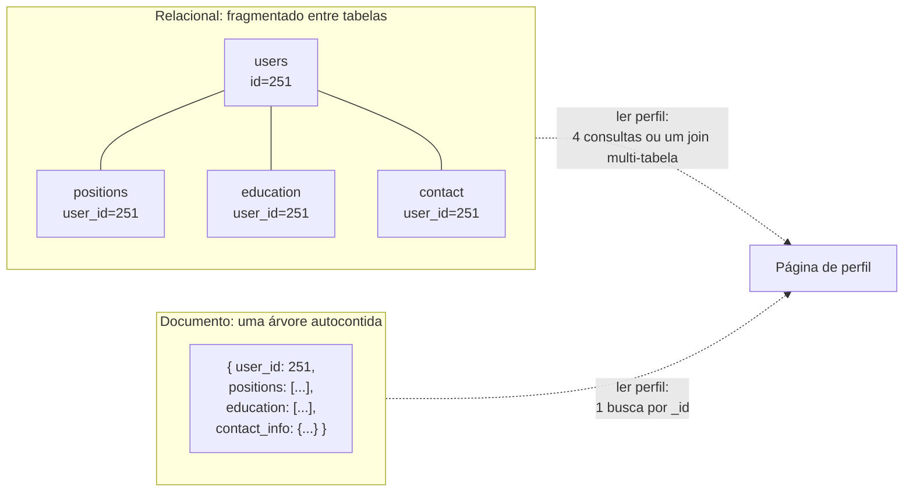
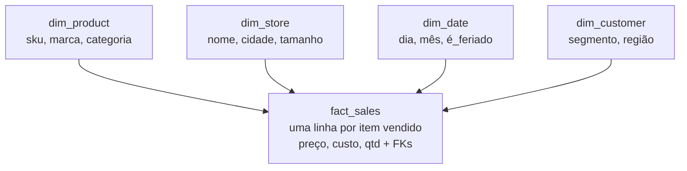

## Visão Geral

O modelo relacional organiza dados como tabelas de linhas que se referenciam mutuamente por chave; o modelo de documento armazena cada entidade como um único documento autocontido no estilo JSON com seus dados relacionados aninhados dentro. O enquadramento usual — SQL é a opção legada, NoSQL é a moderna — está errado, e ele obscurece a pergunta real, que é o quão próximo seu layout de armazenamento deveria espelhar o grafo de objetos com que seu código de aplicação trabalha. **A versão honesta do trade-off é sobre o formato dos seus relacionamentos**: documentos são excelentes em árvores e ruins em grafos, tabelas relacionais são indiferentes a ambos. Todo o resto — flexibilidade de schema, localidade, suporte a join — decorre disso.

## O Descompasso Objeto-Relacional

O código de aplicação manipula objetos: um `Resume` contendo uma lista de objetos `Position`, uma lista de entradas `Education`, e um `ContactInfo`. Bancos de dados relacionais armazenam tuplas planas. Fazer a ponte entre os dois exige uma camada de tradução, e o atrito dessa tradução é o que as pessoas chamam de **descompasso de impedância** (um termo emprestado da eletrônica, onde impedâncias de entrada e saída descasadas desperdiçam energia na conexão).

Em um schema relacional, um currículo é fragmentado em quatro tabelas, porque uma pessoa tem um número ilimitado de empregos e diplomas:

```sql
CREATE TABLE users     (id int PRIMARY KEY, first_name text, last_name text, region_id text);
CREATE TABLE positions (id int PRIMARY KEY, user_id int REFERENCES users, job_title text, org text);
CREATE TABLE education (id int PRIMARY KEY, user_id int REFERENCES users, school text, start_yr int);
CREATE TABLE contact   (id int PRIMARY KEY, user_id int REFERENCES users, kind text, url text);
```

Renderizar uma página de perfil agora significa ou quatro consultas com chave em `user_id`, ou um join multi-tabela que se expande em um produto cartesiano que você precisa deduplicar no código de aplicação. Os mesmos dados como um único documento:

```json
{
  "user_id": 251,
  "first_name": "Barack",
  "last_name": "Obama",
  "region_id": "us:91",
  "positions": [
    {"job_title": "President",         "organization": "United States of America"},
    {"job_title": "US Senator (D-IL)", "organization": "United States Senate"}
  ],
  "education": [
    {"school_name": "Harvard University",  "start": 1988, "end": 1991},
    {"school_name": "Columbia University", "start": 1981, "end": 1983}
  ],
  "contact_info": {"website": "https://barackobama.com"}
}
```

Uma busca por chave, uma leitura contígua, um objeto que se deserializa direto no formato que a aplicação já queria. Isso é **localidade**: o perfil inteiro mora em um lugar no disco, então buscá-lo custa uma busca em vez de várias travessias de índice.



Mapeadores objeto-relacionais (Hibernate, ActiveRecord) existem para encolher essa camada de tradução, e eles de fato reduzem boilerplate para os casos simples e repetitivos. Eles não removem o descompasso: você ainda precisa raciocinar sobre ambas as representações, os schemas gerados costumam ser incômodos para quem consulta as tabelas diretamente, e o **problema N+1** — buscar N comentários, depois emitir uma consulta por comentário para buscar seu autor em vez de fazer um join uma vez — é a forma clássica de um ORM transformar um único join em cem viagens de ida e volta.

Duas ressalvas antes de declarar documentos o vencedor. Primeiro, um-para-muitos aqui na verdade significa *um-para-poucos*: um currículo tem alguns poucos empregos. Comentários em um post de uma celebridade chegam às dezenas de milhares, e embutir esses em um documento é inviável — você volta a ter uma coleção separada com uma chave estrangeira. Segundo, documentos precisam ser lidos e reescritos por inteiro, então um documento grande com atualizações pequenas e frequentes é o pior caso para o modelo. Mantenha documentos pequenos.

## Normalização, Desnormalização, e Joins

Note que o documento acima armazena `region_id: "us:91"` em vez da string `"Washington, DC, United States"`. Essa é uma decisão de **normalização**: o texto com significado humano mora em exatamente um lugar, e tudo o mais aponta para ele com um ID que não tem significado fora do banco de dados e, portanto, nunca precisa mudar.

O ganho não é apenas espaço em disco. Uma lista padronizada de regiões dá a você grafia consistente, desambiguação (Washington a cidade vs. o estado), renomeações de uma linha quando uma cidade muda de nome, localização para UIs traduzidas, e capacidade de busca que uma string nua não consegue oferecer — "pessoas na Costa Leste dos EUA" só é respondível se a entidade de região souber onde fica a Costa Leste.

O custo é que toda exibição desse registro agora precisa de uma busca para resolver o ID, o que em um banco de dados relacional é um join:

```sql
SELECT users.*, regions.region_name
FROM users JOIN regions ON users.region_id = regions.id
WHERE users.id = 251;
```

Bancos de dados de documento conseguem armazenar dados normalizados perfeitamente bem, mas são associados à desnormalização por dois motivos: JSON torna trivialmente fácil colar uma cópia extra de um campo em um documento, e o suporte a joins é historicamente fraco. Alguns document stores não conseguem fazer join de jeito nenhum, o que empurra o join para o código de aplicação — buscar documento, ler ID, buscar segundo documento. O MongoDB oferece `$lookup` em um pipeline de agregação:

```javascript
db.users.aggregate([
  { $match: { _id: 251 } },
  { $lookup: { from: "regions", localField: "region_id", foreignField: "_id", as: "region" } }
])
```

O princípio geral: **dados normalizados são mais rápidos de escrever e mais lentos de ler; dados desnormalizados são mais rápidos de ler e mais caros de escrever.** Desnormalização é uma forma de dado derivado — as cópias duplicadas são um cache de um join, e algo precisa mantê-las sincronizadas. Faça isso e você herda duas obrigações: um processo para atualizar toda cópia, e uma história para o que acontece se esse processo travar no meio do caminho. Bancos de dados com transações atômicas multi-objeto tornam isso administrável; nem todo banco de dados de documento oferece atomicidade entre documentos.

Nenhuma escolha é virtuosa. O caso instrutivo do mundo real são as timelines domésticas pré-computadas de uma rede social: o join entre `posts` e `follows` era caro demais para rodar por leitura, então ele é materializado na escrita. Mas cada entrada materializada armazena apenas o ID do post e o ID do remetente — não o texto do post, contagem de curtidas, ou o avatar do remetente — porque esses mudam constantemente e teriam que ser atualizados em milhões de timelines. Ler uma timeline ainda executa dois joins em código de aplicação para *hidratar* esses IDs, e essa hidratação paraleliza bem. O design escalável desnormalizou a estrutura de mudança lenta e deixou o conteúdo de mudança rápida normalizado. "Joins não escalam" não é uma regra; é uma afirmação que você avalia por campo, pesando frequência de mudança contra custo de leitura.

## Relacionamentos Muitos-para-Um e Muitos-para-Muitos

É aqui que o modelo de documento realmente quebra, e não tem nada a ver com schemas ou desempenho.

Os relacionamentos no currículo vêm em três tipos:

- **Um-para-muitos** (um-para-poucos): um usuário tem várias posições, e cada posição pertence a exatamente um usuário. Isso é uma *árvore*. Documentos acertam isso em cheio.
- **Muitos-para-um**: muitos usuários vivem na mesma região. A região é compartilhada, então ela quer ser sua própria entidade referenciada por ID.
- **Muitos-para-muitos**: uma pessoa trabalhou em várias organizações, e uma organização empregou muitas pessoas. Em termos relacionais isso é uma tabela associativa (de junção) onde cada linha pareia um `user_id` com um `org_id`.

Uma vez que você queira que organizações e escolas sejam entidades reais — com um logo, uma descrição, um feed de notícias — o documento deixa de ser autocontido:

```json
{
  "user_id": 251,
  "positions": [
    {"start": 2009, "end": 2017, "job_title": "President",         "org_id": 513},
    {"start": 2005, "end": 2008, "job_title": "US Senator (D-IL)", "org_id": 514}
  ]
}
```

Aqueles `org_id`s são chaves estrangeiras usando um disfarce diferente, e o banco de dados não vai ajudar você a segui-las. Pior, relacionamentos muitos-para-muitos geralmente precisam de travessia **em ambas as direções**: todas as organizações em que uma pessoa trabalhou, *e* todas as pessoas que trabalharam em uma organização. Um document store consegue responder a segunda pergunta apenas se você (a) duplicar o relacionamento em ambos os lados — o currículo lista IDs de org e a org lista IDs de currículo, o que é desnormalizado e pode ficar dessincronizado — ou (b) mantê-lo em um só lugar e confiar em um índice secundário sobre `positions.org_id` dentro do array. A maioria dos bancos de dados de documento e bancos de dados relacionais com suporte a JSON consegue construir esse índice, então isso é solucionável; simplesmente não é mais o forte do modelo, e você recriou a tabela de junção manualmente.

O ponto mais profundo: à medida que relacionamentos se multiplicam, seus dados deixam de ser uma árvore e passam a ser um grafo. Documentos modelam árvores. Tabelas relacionais modelam referências arbitrárias adequadamente, já que qualquer linha pode ser endereçada diretamente por ID — algo que você não consegue fazer para um item aninhado dentro de um documento, onde o melhor que você consegue dizer é "o segundo elemento do array de positions do usuário 251". E quando quase *tudo* é muitos-para-muitos — grafos sociais, redes rodoviárias, travessias de recomendação — até joins relacionais ficam incômodos, e um modelo feito sob medida vence em vez disso. Esse é o assunto de [Graph Data Models](graph-data-models-and-query-languages).

## Estrelas e Flocos de Neve: O Modelo Relacional para Analytics

Analytics reaproveita tabelas relacionais para um propósito inteiramente diferente, então o cálculo de normalização se inverte. Um **star schema** coloca uma grande **tabela de fatos** no centro — uma linha por evento (uma venda, um clique, uma visualização de página), frequentemente com centenas de colunas de largura e chegando a petabytes — cercada por **tabelas de dimensão** descrevendo o quem, o quê, onde, quando, e por quê de cada evento, referenciadas por chave estrangeira. Até datas ganham uma tabela de dimensão, para que uma consulta possa distinguir feriados de terças-feiras comuns.



Um **snowflake schema** normaliza mais, dividindo dimensões em subdimensões (uma tabela `brands` separada referenciada por `dim_product`). É mais organizado e analistas geralmente preferem o star mais achatado de qualquer forma. Empurre na outra direção e você obtém **one big table (OBT)**: dobre as dimensões dentro da própria tabela de fatos, pré-computando todo join ao custo de armazenamento.

O motivo pelo qual essa desnormalização é segura aqui — e perigosa em um sistema operacional — é que os dados de data warehouse são um log histórico imutável. Nada é atualizado, então não há anomalias de atualização com que se preocupar, e a sobrecarga de escrita que torna a desnormalização dolorosa em OLTP não se aplica a uma carga em massa. Veja [Operational vs. Analytical Systems](operational-vs-analytical-systems) para entender por que essas cargas de trabalho recebem sistemas separados desde o início.

## Quando Usar Qual Modelo

O enquadramento do próprio livro: documentos argumentam flexibilidade de schema, localidade, e proximidade com o modelo de objeto da aplicação; relacional contra-argumenta com joins e suporte adequado para relacionamentos muitos-para-um e muitos-para-muitos. Concretamente:

**Recorra a documentos quando:**

- Os dados são uma árvore de relacionamentos um-para-muitos e você tipicamente carrega a árvore inteira de uma vez. Fragmentá-la em tabelas produz schemas incômodos e código complicado sem benefício.
- Os registros são genuinamente heterogêneos — muitos tipos de objeto que não podem ter cada um sua própria tabela, ou uma estrutura ditada por um sistema externo que muda sem aviso. Impor um schema aqui atrapalha mais do que ajuda.
- Você precisa de ordenação definida pelo usuário. Uma lista de tarefas com arrastar-para-reordenar é um array JSON; em SQL é uma coluna de ordenação inteira exigindo renumeração, uma lista encadeada de IDs, ou indexação fracionária.
- Mudanças de schema precisam ser instantâneas. `schema-on-read` permite que você comece a escrever novos campos imediatamente e trate formatos antigos em código de aplicação — sendo a troca que todo leitor agora precisa lidar com todo formato histórico, para sempre.

**Recorra a relacional quando:**

- Relacionamentos são muitos-para-um ou muitos-para-muitos, ou você precisa referenciar um item aninhado diretamente por ID.
- Dados são compartilhados entre registros e mudam — organizações, produtos, usuários — então normalização economiza você de caçar duplicatas.
- Registros são homogêneos e você quer o schema imposto e documentado no banco de dados em vez de em um comentário de código. `schema-on-write` é o verificador de tipos estático; `schema-on-read` é o dinâmico, com o mesmo debate e a mesma falta de um vencedor claro.
- Analistas ou outras equipes consultam os dados diretamente. Eles vão querer SQL e um schema legível, não o formato de serialização da sua aplicação.

Na prática os dois convergiram, e essa é a resposta real para a maioria dos sistemas novos. PostgreSQL e MySQL têm colunas JSON/JSONB com operadores e índices em valores dentro de documentos; MongoDB e Couchbase adicionaram joins, índices secundários, e linguagens de consulta declarativas. Um schema relacional com uma coluna JSONB para a parte genuinamente variável é um design perfeitamente comum e frequentemente ótimo. O artigo original de Codd de 1970 até permitia *domínios não simples* — relações aninhadas como valores de coluna — o que é suporte a JSON chegando trinta anos adiantado e depois sendo esquecido. Localidade também não é exclusiva de documentos: o Spanner intercala linhas filhas dentro de uma tabela pai, o Oracle tem clusters de índice multi-tabela, e wide-column stores usam column families para o mesmo propósito.

## Trade-offs

- **A localidade de documentos acelera leituras de objeto inteiro e penaliza leituras parciais** — uma leitura contígua vence quatro buscas de índice quando você precisa do perfil inteiro, mas o banco de dados geralmente carrega e reescreve o documento inteiro, então um documento grande lido para um único campo, ou atualizado frequentemente em pequenos incrementos, é o caso patológico.
- **Schema-on-read compra mudanças instantâneas de schema ao adiar o custo para todo leitor, para sempre** — sem migração, sem reescrita de tabela, mas o código de aplicação agora carrega branches para todo formato histórico de documento, e nada impede um produtor de escrever um campo que ninguém espera.
- **Normalização troca custo de leitura por corretude de escrita** — uma cópia autoritativa significa que renomeações e atualizações são escritas únicas e não podem deixar os dados inconsistentes, ao preço de um join (ou uma hidratação do lado da aplicação) em toda leitura.
- **Desnormalização é dado derivado, então precisa de um dono e uma história de reparo** — os campos duplicados são um resultado de join cacheado; você precisa de um processo para atualizar toda cópia e uma resposta para o que acontece quando esse processo trava no meio de uma atualização, o que é muito mais fácil se o banco de dados oferecer transações atômicas multi-objeto.
- **Documentos tratam árvores; muitos-para-muitos força você a reconstruir joins manualmente** — você ou duplica o relacionamento em ambos os lados e aceita que pode ficar dessincronizado, ou o armazena uma vez e se apoia em índices secundários em arrays, que é exatamente a tabela de junção que você estava tentando evitar.
- **"Relacional vs. documento" é cada vez mais um falso binário** — colunas JSONB no Postgres e joins no MongoDB significam que a decisão prática geralmente é quais partes de um schema são rígidas e quais são flexíveis, não qual produto comprar.

## Perguntas de Entrevista

- Um colega argumenta que você deveria mover um serviço de Postgres para MongoDB porque "o schema fica mudando e migrações são dolorosas." O que você precisaria saber sobre os relacionamentos dos dados antes de concordar, e o que mudaria sua opinião?
- Você está modelando comentários em posts. Por que embutir comentários no documento do post é razoável para um blog e inviável para uma rede social com contas de celebridade — e o que especificamente quebra primeiro?
- Um serviço de timeline armazena apenas IDs de post e IDs de remetente em cada timeline materializada, depois faz join em tempo de leitura para buscar conteúdo e avatares. Por que isso é mais escalável do que desnormalizar o texto do post em cada timeline?
- Você armazena a URL do logo de uma empresa diretamente no documento de perfil de cada funcionário. A empresa faz um rebranding. Percorra o que precisa acontecer, o que pode dar errado no meio do caminho, e quanto a alternativa normalizada custa a você em toda leitura.
- Star schemas em um data warehouse são deliberadamente desnormalizados, mas desnormalizar um schema OLTP da mesma forma geralmente é uma má ideia. Qual propriedade dos dados de warehouse faz a diferença?

## Referências

- [Martin Kleppmann, "Designing Data-Intensive Applications", 2ª Edição (O'Reilly) — Capítulo 3, "Data Models and Query Languages", seção "Relational Versus Document Models"](https://www.oreilly.com/library/view/designing-data-intensive-applications/9781098119058/)
- [MongoDB Manual — Data Modeling: embedded data models vs. references](https://www.mongodb.com/docs/manual/data-modeling/concepts/embedding-vs-references/)
- [PostgreSQL Documentation — JSON Types (json, jsonb, and indexing values inside documents)](https://www.postgresql.org/docs/current/datatype-json.html)
- [E. F. Codd, "A Relational Model of Data for Large Shared Data Banks" (CACM, 1970)](https://dl.acm.org/doi/10.1145/362384.362685)
